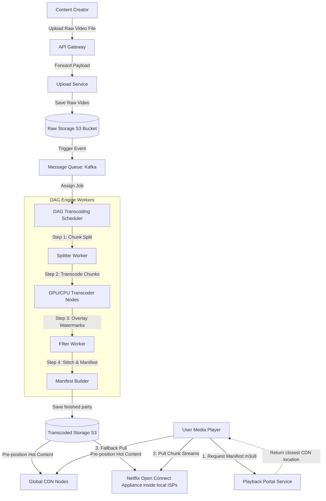

# HLD: Design Netflix / YouTube (Video Streaming)

## 1. System Scale & Core Theory

A video streaming platform must deliver high-resolution video streams (up to 4K) to hundreds of millions of users globally while minimizing latency and buffering under varying network conditions.

### Mathematical Sizing & Network Sizing Estimations

Consider a global streaming platform with the following metrics:
*   **Daily Active Users (DAU):** $50\text{ Million}$.
*   **Average Watch Time:** $2\text{ hours/user/day}$.
*   **Active Video Catalog:** $100,000$ titles (average duration: 2 hours).

#### 1. Peak Network Bandwidth Sizing
*   **Stream Resolution Bitrate Requirements:**
    *   $480\text{p (SD):} \approx 1\text{ Mbps}$
    *   $1080\text{p (Full HD):} \approx 5\text{ Mbps}$
    *   $4\text{K (Ultra HD):} \approx 25\text{ Mbps}$
*   **Average Stream Bitrate:** Let's assume an average stream bitrate of $5\text{ Mbps}$ per user (assuming a mix of 720p, 1080p, and 4K streams).
*   **Peak Concurrent Viewers:** Assume that at peak hours, $10\%$ of DAU are streaming videos simultaneously.
    $$\text{Concurrent Viewers} = 50\text{ Million} \times 0.10 = 5\text{ Million concurrent viewers}$$
*   **Total Outbound Bandwidth at Peak:**
    $$\text{Peak Bandwidth} = 5\text{ Million} \times 5\text{ Mbps} = 25\text{ Terabits/Second (Tbps)}$$
    To handle this egress load without overloading cloud provider networks, the system must distribute traffic using a network of Content Delivery Networks (CDNs) and Edge caches.

#### 2. Video Encoding & Storage Sizing
*   **Raw Upload Size:** 1 hour of uncompressed 4K video at 60 FPS is $\approx 100\text{ GB}$.
*   **Transcoding Expansion:** Each uploaded video is split into $4\text{-second}$ segments. Each segment is transcoded into multiple:
    *   **Resolutions:** 360p, 480p, 720p, 1080p, 1440p, 4K.
    *   **Bitrates:** Dynamic range (low, medium, high bitrates per resolution).
    *   **Codecs:** AVC/H.264 (for legacy devices), VP9/HEVC (for modern mobile devices), AV1 (for efficient compression).
    *   **Formats:** HLS (HTTP Live Streaming), MPEG-DASH.
*   **Total Transcoded Storage per Video Hour:** The combined size of all transcoded resolutions, codecs, and chunks for a single hour of video is $\approx 15\text{ GB}$.
*   **Total Catalog Storage Size:**
    $$\text{Catalog Storage} = 100,000\text{ titles} \times 2\text{ hours} \times 15\text{ GB/hour} \approx 3\text{ PB (Petabytes)}$$
    Adding a $3\times$ replication factor across storage zones brings the total storage to $\approx 9\text{ PB}$.

### Streaming Protocol Matrix

| Attribute / Metric | HTTP Live Streaming (HLS - Apple) | Dynamic Adaptive Streaming over HTTP (MPEG-DASH) |
| :--- | :--- | :--- |
| **Container Formats** | MP4 (Fragmentation), MPEG-2 TS (Transport Stream) | MP4 (Fragmentation), 3GP |
| **Codec Compatibility** | H.264, H.265/HEVC, AAC, MP3 | Codec-agnostic (supports any video/audio codec) |
| **Manifest Format** | `.m3u8` (text files containing segment URLs) | `.mpd` (XML format describing representations) |
| **Browser Support** | Native in Safari/iOS; requires library support (hls.js) for other browsers | Native via Media Source Extensions (MSE) in modern browsers |
| **Primary Advantage** | Standardized across iOS and macOS ecosystems | More efficient and open-standard; supports custom codecs |

---

## 2. Visual Architecture Diagram

This diagram outlines the media pipeline, from ingestion and DAG-based transcoding to distribution across edge nodes and ISP networks.



---

## 3. Data Models & API Signatures

### Relational Database Schema (Video Metadata & Streaming Points)

```sql
-- PostgreSQL Schema
CREATE TABLE videos (
    video_id UUID PRIMARY KEY,
    title VARCHAR(255) NOT NULL,
    description TEXT,
    duration_seconds INT NOT NULL,
    maturity_rating VARCHAR(10) NOT NULL,
    raw_s3_url VARCHAR(512) NOT NULL,
    status VARCHAR(50) NOT NULL, -- PENDING, TRANSCODING, READY, FAILED
    created_at TIMESTAMP WITH TIME ZONE DEFAULT CURRENT_TIMESTAMP
);

CREATE TABLE video_resolutions (
    resolution_id UUID PRIMARY KEY,
    video_id UUID NOT NULL REFERENCES videos(video_id) ON DELETE CASCADE,
    resolution_name VARCHAR(10) NOT NULL, -- 360p, 720p, 1080p, 4k
    codec VARCHAR(50) NOT NULL,           -- H.264, VP9, AV1
    manifest_url VARCHAR(512) NOT NULL,
    file_size_bytes BIGINT NOT NULL
);

-- Optimization Index for Playback Lookups
CREATE INDEX idx_resolutions_video_id ON video_resolutions(video_id);
```

### Cassandra Database Schema (User Playback State)
At scale, users pause and resume videos frequently, generating high write volumes. Cassandra handles these writes efficiently using a partition key based on the user ID.

```sql
CREATE KEYSPACE video_telemetry WITH replication = {'class': 'NetworkTopologyStrategy', 'us-east': 3};

CREATE TABLE video_telemetry.playback_state (
    user_id uuid,
    video_id uuid,
    last_watched_timestamp timestamp,
    playback_offset_seconds int,
    completed boolean,
    PRIMARY KEY (user_id, video_id)
);
```

### API Signatures

#### 1. Retrieve Video Playback Manifest
*   **Protocol:** HTTPS GET
*   **Path:** `/api/v1/playback/videos/{video_id}`
*   **Headers:** `Authorization: Bearer <JWT_TOKEN>`
*   **Response Payload (200 OK):**
```json
{
  "video_id": "bfd60920-5c6d-4ee8-a92c-0e782beee930",
  "duration_seconds": 7200,
  "default_manifest": "https://cdn.example.com/videos/bfd60920/master.m3u8",
  "streams": [
    {
      "resolution": "1080p",
      "codec": "AV1",
      "bitrate_bps": 4500000,
      "manifest_url": "https://cdn.example.com/videos/bfd60920/1080p_av1.m3u8"
    },
    {
      "resolution": "4K",
      "codec": "AV1",
      "bitrate_bps": 18000000,
      "manifest_url": "https://cdn.example.com/videos/bfd60920/4k_av1.m3u8"
    }
  ]
}
```

#### 2. Update Playback Progress Heartbeat
*   **Protocol:** HTTPS POST
*   **Path:** `/api/v1/playback/progress`
*   **Request Payload:**
```json
{
  "video_id": "bfd60920-5c6d-4ee8-a92c-0e782beee930",
  "playback_offset_seconds": 1245,
  "device_id": "dev_c88e7f75-3515"
}
```
*   **Response Payload (200 OK):**
```json
{
  "status": "SAVED"
}
```

---

## 4. Operational Flows

### Video Upload and Transcoding Flow (Write Path)
1.  **Raw File Ingest:** The content creator uploads a video. The Upload Service streams the file directly to the Raw S3 bucket and registers a database record with a status of `PENDING`.
2.  **Job Queuing:** S3 emits an `ObjectCreated` event to a Kafka topic. The Transcoding Coordinator consumes this event and builds an execution plan.
3.  **DAG Execution:** The Coordinator schedules the transcoding tasks as a Directed Acyclic Graph (DAG) to run on worker nodes:
    *   *Task A (Splitting):* Split the raw video file into $4\text{-second}$ segments.
    *   *Task B (Parallel Encoding):* Workers encode each segment into target resolutions (4K, 1080p, 720p) and formats (H.264, AV1) in parallel.
    *   *Task C (Watermarking/Filters):* Apply visual filters and watermarks to the segments.
    *   *Task D (Packaging):* Compile the segments and generate the `.m3u8` index manifest files.
4.  **Publish to Storage:** The workers upload the transcoded segments and manifests to the Transcoded S3 bucket. The Coordinator updates the video database status to `READY`.

### Dynamic Adaptive Playback Flow (Read Path)

```
Client Player                     Master Manifest               Adaptive Loop                  Edge CDN (OCA)
      │                                  │                            │                            │
      │─── 1. Query master.m3u8 ────────>│                            │                            │
      │<── 2. Return stream index ───────│                            │                            │
      │                                                               │                            │
      │─── 3. Monitor bandwidth (Speed Check) ───────────────────────>│                            │
      │                                                               │                            │
      │─── 4. Request 1st Chunk (1080p - 4s) ─────────────────────────┼───────────────────────────>│
      │<── 5. Play Chunk 1 ───────────────────────────────────────────┼────────────────────────────│
      │                                                               │                            │
      │─── 6. Network Drop Detected (Bandwidth degrades) ─────────────│                            │
      │                                                               │                            │
      │─── 7. Request 2nd Chunk (720p - 4s) ──────────────────────────┼───────────────────────────>│
      │<── 8. Play Chunk 2 (Seamless fallback) ───────────────────────│                            │
```

1.  **Manifest Fetch:** The user clicks play. The media player requests the master manifest file (`master.m3u8`).
2.  **Select Stream:** The player parses the master manifest, checks its initial network connection speed, and selects the corresponding stream (e.g., 1080p at 5 Mbps).
3.  **Fetch Index:** The player requests the index file for the selected stream, which contains the list of $4\text{-second}$ segments.
4.  **Adaptive Streaming Loop:**
    *   The player requests the first segment (e.g., `segment_001.ts`) from the closest edge CDN or Open Connect Appliance.
    *   While playing the current segment, the player monitors network performance (download latency and buffer queue depth).
    *   *Bandwidth Drop:* If network speed degrades (e.g., drops below 3 Mbps), the player requests the next segment from a lower-bitrate stream (e.g., 720p).
    *   *Bandwidth Recovery:* If network speed improves, the player requests the next segment from a higher-bitrate stream (e.g., 1080p or 4K). This adjustment occurs seamlessly without interrupting playback.

---

## 5. High Availability, Failovers & Bottlenecks

### CDN Pre-positioning & Content Tiering
To manage distribution costs and edge storage limits, the system uses a tiered caching strategy:

```
[ Central S3 Bucket (Cold Storage) ] ── Contains 100% of Catalog
             │
             ├── (Pre-position Top 10% Popular Content) ──> [ Edge ISP OCA Boxes ]
             │
             └── (On-Demand Cache Pull for Mid-Tail)    ──> [ Global CDN Cache ]
```

*   **Hot Content:** The top $10\%$ most popular movies and episodes generate $90\%$ of watch traffic. The system pre-positions this content during off-peak hours by pushing it directly to Edge CDN nodes and local ISP Open Connect Appliances (OCAs).
*   **Long-Tail Content:** Less popular titles are stored in the central S3 bucket. If a user requests a long-tail title, the edge cache pulls it from S3 on-demand and caches it locally.
*   **Cache Eviction:** Edge nodes evict long-tail files using a Least Recently Used (LRU) policy when disk space is required for newer content.

### Mitigating Telemetry & Playback Heartbeat Spikes
Every client player reports playback progress to the backend every 10 seconds. With $5\text{ Million}$ concurrent streams, this generates:
$$\text{Telemetry Load} = \frac{5,000,000}{10} = 500,000\text{ Writes/Second (WPS)}$$
*   *Mitigation:* 
    1.  **Write Buffering:** Application servers buffer telemetry writes in memory and flush them to Cassandra in batches.
    2.  **Client-Side Throttling:** The client player updates its local progress state in browser storage (like LocalStorage). It sends network updates to the backend only when the video is paused, stopped, or at natural checkpoints (such as commercial breaks).

---

## 6. Comprehensive Interview Q&A

### Q1: How does Netflix's Open Connect CDN architecture function? How do they pre-position content to Open Connect Appliances (OCAs) globally?
**Answer:**
Netflix's Open Connect is a custom CDN architecture built using physical storage boxes called **Open Connect Appliances (OCAs)**.

*   **Deployment:** Netflix installs OCA hardware directly inside local Internet Service Provider (ISP) data centers globally. This places content close to the end user, bypassing standard internet transit routes and reducing latency and buffering.
*   **Pre-positioning Strategy:**
    1.  **Predictive Analytics:** The system runs nightly batch jobs (using Spark or Hadoop) to analyze user watch history and prediction models for each region.
    2.  **Nightly Push:** During off-peak hours, the system pushes predicted popular titles from central storage to local ISP OCAs.
    3.  **Local Delivery:** When a user streams a video, the request routes to the OCA within their local ISP's network. This keeps the streaming traffic local, reducing bandwidth costs for both Netflix and the ISP.

---

### Q2: Explain the mechanism behind Adaptive Bitrate Streaming (ABR). How do video players dynamically adapt to network fluctuations?
**Answer:**
Adaptive Bitrate Streaming (ABR) is a technique that adjusts video quality in real-time based on the user's network speed and device performance.

*   **Segmented Encoding:** Videos are split into small, independent segments (typically 2 to 10 seconds long). Each segment is encoded at multiple resolutions and bitrates.
*   **Manifest Files:** A master manifest file index maps resolutions and bitrates to their corresponding segment lists.
*   **Client Decision Logic:**
    1.  **Throughput Estimation:** The player measures the time it takes to download each segment.
    2.  **Buffer Monitoring:** The player maintains a buffer of downloaded segments (e.g., 30 seconds of video). If the buffer depth drops below a safe threshold (e.g., 10 seconds), the player switches to a lower bitrate stream to prevent buffering.
    3.  **Heuristic Algorithms:** The player combines throughput estimates and buffer depth metrics to select the optimal resolution for the next segment.

---

### Q3: Why is a Directed Acyclic Graph (DAG) engine used for video transcoding pipelines? How does the system handle worker node failures mid-job?
**Answer:**
A video transcoding pipeline consists of multiple interdependent tasks (such as validation, segmenting, audio track isolation, watermarking, multiple resolution encodings, and manifest compilation). A Directed Acyclic Graph (DAG) defines the execution order and dependencies of these tasks.

```
                  ┌──> [ Transcode 1080p ] ──> [ Watermark ] ──┐
[ Upload Raw ] ───┼──> [ Transcode 720p ]  ──> [ Watermark ] ──┼──> [ Stitch & Manifest ]
                  └──> [ Extract Audio ]   ────────────────────┘
```

*   **Why DAG is Used:**
    *   **Parallelization:** Independent tasks (like encoding 1080p and 720p versions) can run in parallel on different workers once the segmenting task is complete.
    *   **Resource Optimization:** Tasks can be assigned to specialized hardware. For example, encoding tasks run on GPU-enabled instances, while manifest generation runs on memory-optimized instances.
*   **Handling Worker Failures:**
    1.  **State Management:** The DAG Coordinator tracks task status in a database (like PostgreSQL or ZooKeeper).
    2.  **Task Retries:** If a worker node crashes, the Coordinator detects the lost heartbeat and re-queues the failed task.
    3.  **Idempotency:** Task outputs are saved using unique paths (e.g., `s3://bucket/jobs/{job_id}/chunks/{chunk_index}`). This allows replacement workers to resume processing without duplicating work or corrupting existing files.

---

### Q4: How do you design a system to track user video progress (Resume Watching) to handle high concurrency while preventing database write bottlenecks?
**Answer:**
To handle progress tracking telemetry at scale without overloading database systems:

1.  **Decouple Playback Logging:** Do not write telemetry directly to the database. Instead, have client players send progress events to a message queue like Apache Kafka:
    `POST /api/v1/playback/progress -> API Gateway -> Kafka (topic: playback-telemetry)`
2.  **Stream Processing & Aggregation:** Use a stream processing framework (like Apache Flink) to aggregate progress events. Flink consolidates updates for the same user-video pair over a sliding window (e.g., 30 seconds) and outputs only the final progress state.
3.  **Write Buffering in Cassandra:** A consumer worker reads the aggregated updates from Flink and writes them to a Cassandra database. Cassandra's write-optimized LSM-tree storage engine handles this write volume efficiently.
4.  **Read Path Cache:** When a user views their dashboard, query the user's progress from a Redis cache. The cache is updated by the consumer workers alongside the database write, bypassing database reads for the dashboard view.
