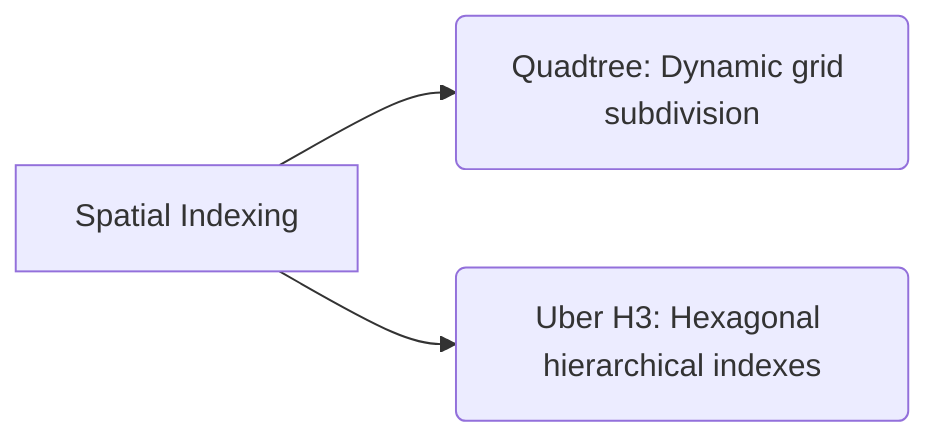
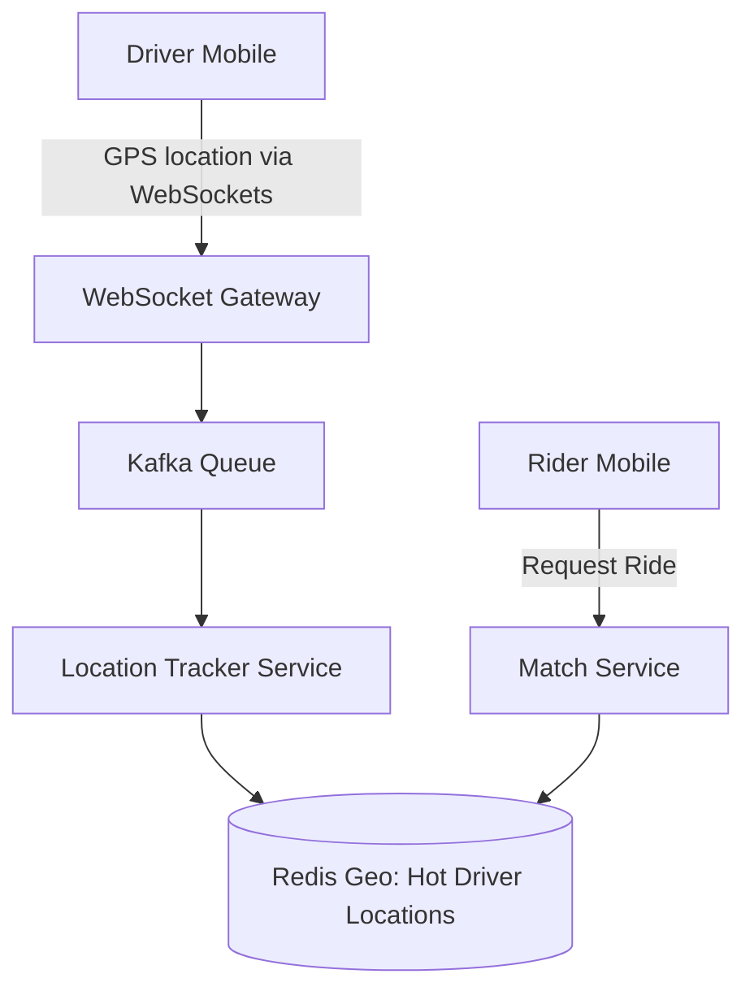

# HLD: Design Uber / Lyft (Ride Sharing System)

This design addresses real-time driver location tracking, geospatial indexing, matching algorithms, and routing.

---

## 1. Requirements & Scale
* **Scale:** 100 Million users, 5 Million drivers.
* **QPS:** Drivers send GPS coordinates every 4 seconds. For 5 million drivers, that is $\approx 1.25\text{ Million}$ location updates per second.
* **Core Challenge:** Finding active drivers within a 2-mile radius of a rider quickly.

---

## 2. Spatial Indexing Choices

* **Quadtree:** A tree structure where each node has exactly four children. If a grid contains too many drivers, it subdivides recursively into four sub-grids.
  * *Cons:* In-memory structure. Hard to scale updates across distributed servers.
* **Google S2 / Uber H3 (Hexagonal Grid):** Divides the earth's surface into flat hexagons (H3 index IDs). Coordinates map to a 64-bit integer index instantly.
  * *Pros:* Math-based index calculation. No in-memory tree traversal needed. Easy database partitioning.

---

## 3. Real-Time Tracking Architecture

---

## Interview Q&A Corner

> [!IMPORTANT]
> **Q: How would you design the storage for driver locations in Redis?**
> A: Use Redis **Geospatial Indexes (GEO commands)**. Under the hood, Redis GEO uses **GeoHash** to encode lat/long into a sorted set member score. We can update coordinates in $O(\log N)$ using `GEOADD` and query drivers in a 3km radius using `GEORADIUS` in $O(N + \log M)$ time.
