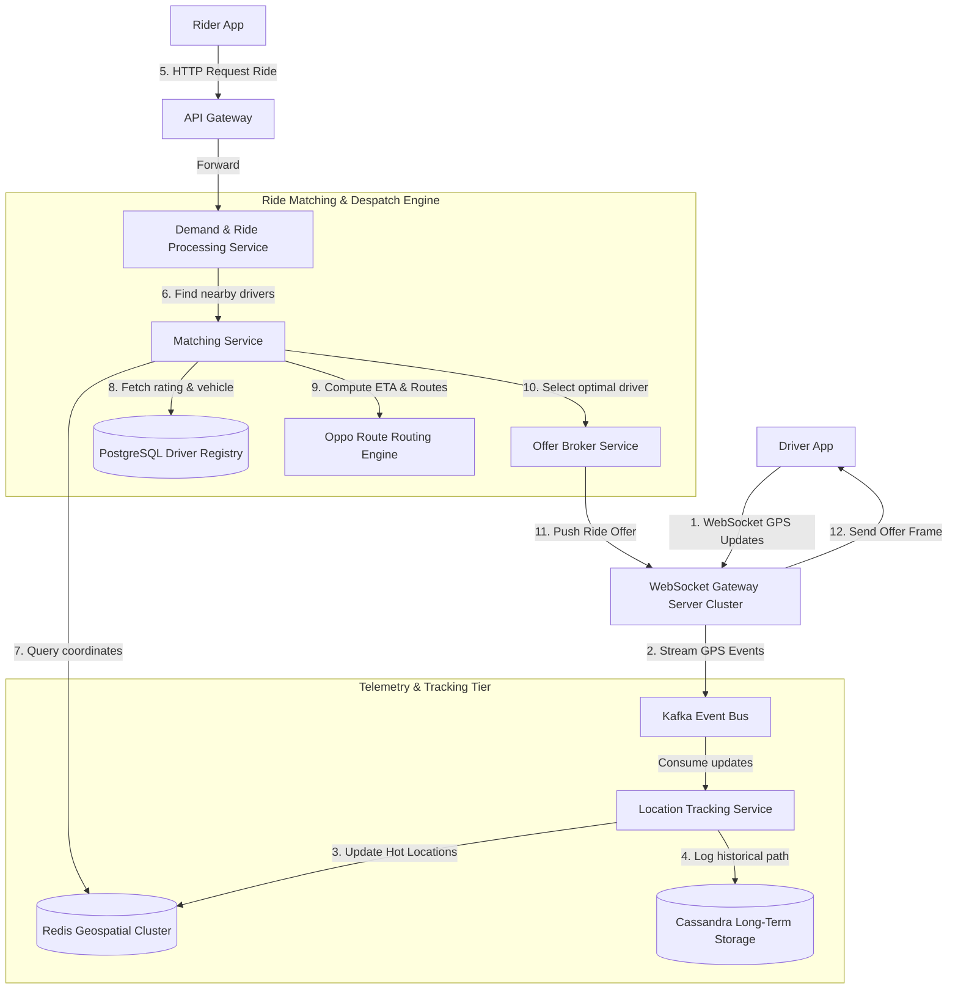

# HLD: Design Uber / Lyft (Ride-Sharing System)

## 1. System Scale & Core Theory

A ride-sharing system requires real-time geospatial location tracking, matching algorithms to connect riders and drivers with minimal latency, and dynamic surge pricing calculations.

### Mathematical Sizing & Location Sizing Estimations

Consider a global ride-sharing system with the following metrics:
*   **Active Riders:** $100\text{ Million}$.
*   **Active Drivers:** $5\text{ Million}$ total, with $1\text{ Million}$ active concurrently at peak hours.
*   **Driver GPS Update Interval:** Once every $4\text{ seconds}$.

#### 1. Ingestion QPS & WebSocket Connections
*   **Write QPS (GPS Updates):**
    $$\text{Average Write QPS} = \frac{1,000,000\text{ active drivers}}{4\text{ seconds}} = 250,000\text{ requests/sec (RPS)}$$
*   **WebSocket Connections:** $1\text{ Million}$ concurrent connections must remain open between the driver applications and the WebSocket Gateway.
*   **Server Sizing:** A single optimized WebSocket server (using frameworks like Netty or Go Netpoll) can maintain $\approx 50,000$ active concurrent TCP connections.
    $$\text{WebSocket Gateway Instances Needed} = \frac{1,000,000}{50,000} = 20\text{ instances}$$

#### 2. Network Bandwidth Sizing
*   **Location Update Payload Size:**
    *   `driver_id` (UUID): $16\text{ bytes}$
    *   `latitude` (Double): $8\text{ bytes}$
    *   `longitude` (Double): $8\text{ bytes}$
    *   `bearing` (Float - direction): $4\text{ bytes}$
    *   `status` (Enum - active, on_trip): $4\text{ bytes}$
    *   **Total raw payload size:** $\approx 40\text{ bytes}$ (JSON/Protobuf over WebSocket frame adds $\approx 10\text{ bytes}$ overhead = $50\text{ bytes}$).
*   **Total Inbound Telemetry Bandwidth at Peak:**
    $$\text{Inbound Bandwidth} = 250,000\text{ updates/sec} \times 50\text{ bytes} = 12.5\text{ MB/s} = 100\text{ Mbps}$$

#### 3. Storage Sizing (Hot vs. Cold)
*   **Hot Driver Location Storage (Redis):** Redis stores the current location of all 1 Million active drivers using Geospatial indexes.
    *   Each entry: Driver ID + GeoHash coordinate inside a sorted set $\approx 100\text{ bytes}$.
    *   **Total RAM Required:** $1,000,000 \times 100\text{ bytes} \approx 100\text{ MB}$.
    This is extremely small and fits easily into a single Redis master node. For high availability, shard the data across 3 nodes.
*   **Cold Historical Location Logs (Cassandra):**
    *   $500\text{ Million location coordinates/day}$ (from 5M total drivers).
    *   **Daily Storage:** $500\text{ Million} \times 100\text{ bytes} \approx 50\text{ GB/day}$.
    *   **Annual Storage (3x replication):** $50\text{ GB} \times 365 \times 3 \approx 54.7\text{ TB/year}$.

### Spatial Indexing Matrix

| Feature | Quadtree | Google S2 (Hilbert Curve) | Uber H3 (Hexagonal Grid) |
| :--- | :--- | :--- | :--- |
| **Grid Geometry** | Square subdivisions | Square projection on 3D cube (Hilbert Curve) | Hexagonal hierarchical bins |
| **Implementation** | In-memory dynamic tree | Mathematical coordinate transformation | Mathematical index indexing (hierarchical) |
| **Lookup Time** | $O(\log \text{Depth})$ to traverse tree nodes | $O(1)$ coordinate-to-cell key conversion | $O(1)$ coordinate-to-hexagon key conversion |
| **Neighbor Querying** | Slow (requires traversing parent-child nodes) | Fast (uses Hilbert curve adjacency) | Very Fast (all adjacent cells share equal distances) |
| **Best Use Case** | Local games, spatial memory caches | Map projection, area indexing | Demands modeling, surge pricing, routing |

---

## 2. Visual Architecture Diagram

This diagram shows the real-time telemetry write path from drivers, and the transactional ride matching path triggered by riders.



---

## 3. Data Models & API Signatures

### PostgreSQL Database Schema (User, Drivers, and Transactions)

```sql
-- Driver Metadata Registry
CREATE TABLE drivers (
    driver_id UUID PRIMARY KEY,
    first_name VARCHAR(100) NOT NULL,
    last_name VARCHAR(100) NOT NULL,
    phone_number VARCHAR(20) UNIQUE NOT NULL,
    vehicle_plate VARCHAR(20) UNIQUE NOT NULL,
    vehicle_model VARCHAR(50) NOT NULL,
    rating NUMERIC(3, 2) DEFAULT 5.00,
    is_active BOOLEAN DEFAULT TRUE,
    created_at TIMESTAMP WITH TIME ZONE DEFAULT CURRENT_TIMESTAMP
);

-- Trip Transaction Log
CREATE TABLE trips (
    trip_id UUID PRIMARY KEY,
    rider_id UUID NOT NULL,
    driver_id UUID REFERENCES drivers(driver_id),
    status VARCHAR(50) NOT NULL, -- REQUESTED, OFFERED, ACCEPTED, EN_ROUTE, ARRIVED, COMPLETED, CANCELLED
    pickup_lat NUMERIC(10, 8) NOT NULL,
    pickup_lon NUMERIC(11, 8) NOT NULL,
    destination_lat NUMERIC(10, 8) NOT NULL,
    destination_lon NUMERIC(11, 8) NOT NULL,
    fare_amount NUMERIC(10, 2) NOT NULL,
    created_at TIMESTAMP WITH TIME ZONE DEFAULT CURRENT_TIMESTAMP,
    updated_at TIMESTAMP WITH TIME ZONE DEFAULT CURRENT_TIMESTAMP
);

-- Optimization Indexing
CREATE INDEX idx_trips_driver_id ON trips(driver_id) WHERE status = 'EN_ROUTE';
```

### Redis Geospatial Data Model
*   **Command (Update Driver Location):**
    `GEOADD active_drivers -122.4194 37.7749 "driver_usr_44521"`
    *This command converts coordinates into a 52-bit Geohash, storing it as the score of a sorted set member.*
*   **Command (Query Drivers in 2km Radius):**
    `GEORADIUS active_drivers -122.4194 37.7749 2 km WITHDIST WITHCOORD ASC LIMIT 10`

### API Signatures

#### 1. Request a Ride (HTTP REST)
*   **Protocol:** HTTPS POST
*   **Path:** `/api/v1/rides/request`
*   **Request Payload:**
```json
{
  "rider_id": "893fd2bc-9d3f-422d-a2f1-5f21e51b1f89",
  "pickup_latitude": 37.774929,
  "pickup_longitude": -122.419416,
  "destination_latitude": 37.789172,
  "destination_longitude": -122.401447,
  "ride_type": "UberX"
}
```
*   **Response Payload (202 Accepted):**
```json
{
  "trip_id": "bfd60920-5c6d-4ee8-a92c-0e782beee930",
  "status": "REQUESTED",
  "estimated_fare": 24.50,
  "created_at": "2026-06-03T02:26:30Z"
}
```

#### 2. WebSocket Location Update Frame (Driver App to Gateway)
*   **Protocol:** WebSocket Binary / Text frame
*   **Payload (JSON):**
```json
{
  "event": "location_update",
  "driver_id": "drv_77821389-9b7e-4029-a1b4",
  "latitude": 37.774929,
  "longitude": -122.419416,
  "bearing": 180.5,
  "speed_mps": 12.4
}
```

---

## 4. Operational Flows

### Location Ingestion Flow (Write Path)
1.  **Emit Update:** The driver app sends a location update containing coordinates and bearing over an open WebSocket connection.
2.  **Route Event:** The WebSocket Gateway receives the message and publishes it to a `driver-locations` Kafka topic.
3.  **Process Coordinates:** The Location Tracking Service consumes the event and:
    *   Writes the current location to the `active_drivers` Redis Geospatial index.
    *   Appends a historical record to the Cassandra log.
4.  **Broadcast Location:** The service publishes the driver's location to a local Redis Pub/Sub channel. Active riders in the area subscribe to this channel to see nearby drivers update on their maps in real-time.

### Ride Matching Flow (Dynamic Request-to-Accept Path)

```
Rider              API Gateway            Matching Service           Redis Geo             Driver (via WS)
  │                     │                        │                       │                        │
  │── 1. Request Ride ─>│                        │                       │                        │
  │                     │── 2. Route Match ─────>│                       │                        │
  │                     │                        │── 3. Find Drivers ───>│                        │
  │                     │                        │<─ 4. Return list ─────│                        │
  │                     │                        │                                                │
  │                     │                        │── 5. Calculate ETAs (Routing Svc)             │
  │                     │                        │                                                │
  │                     │                        │── 6. Select Best Driver & Reserve ID ──────────│
  │                     │                        │                                                │
  │                     │                        │── 7. Send Ride Offer ─────────────────────────>│
  │                     │                        │                                                │
  │                     │                        │<─ 8. Accept Ride (within 10s timer) ───────────│
  │<─ 9. Match Confirmed ────────────────────────│                                                │
```

1.  **Initiate Request:** The Rider sends a ride request to the API Gateway.
2.  **Scan Area:** The Matching Service queries Redis for drivers within a $2\text{-mile}$ radius of the pickup location.
3.  **Rank Matches:** The service filters candidates by availability (status = `active`) and rating. It queries the Routing Engine to calculate travel time (ETA) based on local road traffic.
4.  **Send Offer:** The service selects the driver with the lowest ETA, locks their status to `offered` in Redis to prevent double-matching, and sends the ride offer to their app via the WebSocket Gateway.
5.  **Acknowledge & Confirm:** The driver has 10 seconds to accept the offer.
    *   *Driver Accepts:* The Matching Service updates the trip status to `ACCEPTED` in the PostgreSQL database and notifies the rider.
    *   *Driver Declines/Timeouts:* The service releases the driver's lock and retries the process with the next best candidate.

---

## 5. High Availability, Failovers & Bottlenecks

### Preventing Double-Matching Race Conditions
If two riders request rides near the same driver simultaneously, both requests might select that driver.

```
Request Rider A ──> [ Query Redis ] ──> Driver 42 Available ──> [ Acquire Lock driver_42 ] ──> Success (Offer Sent)
Request Rider B ──> [ Query Redis ] ──> Driver 42 Available ──> [ Acquire Lock driver_42 ] ──> Fail (Try next candidate)
```

*   **Mitigation (Distributed Locking):**
    *   Use a Redis-based distributed lock (e.g., Redlock or a transaction using `SETNX` (Set if Not Exists) with an expiration key: `lock:driver_usr_44521`).
    *   When the matching engine selects a driver, it must acquire this lock before sending the offer. If the lock attempt fails, the engine immediately moves to the next closest driver.

### Spatial Sharding with H3 Hexagons
A single Redis database can handle 100 MB of driver locations, but read query volume during peak hours can create network bottlenecks.
*   **Mitigation (Spatial Partitioning):**
    *   Divide the global map into cells using Uber's **H3 Hexagonal Indexing system** at resolution 6 (hexagons with an average area of $\approx 36\text{ km}^2$).
    *   Map coordinates to their H3 index. Use the H3 index as the partition key to shard driver location tables across different Redis nodes.
    *   *Query Routing:* When searching for nearby drivers, calculate the rider's local H3 index, determine the adjacent cells, and route queries only to the Redis shards hosting those indexes.

---

## 6. Comprehensive Interview Q&A

### Q1: Why did Uber design H3 using Hexagonal grids rather than square grids (like Google's S2)?
**Answer:**
Uber chose hexagonal grids because hexagons provide equal distances between a cell center and all of its neighbors.

```
Square Grid Neighbors:                  Hexagon Grid Neighbors:
┌─────────┬─────────┬─────────┐                / \     / \
│ Diagonal│ Orthog. │ Diagonal│               /   \___/   \
│  (1.41) │  (1.00) │  (1.41) │              \   /     \   /
├─────────┼─────────┼─────────┤               \ /   X   \ /
│ Orthog. │    X    │ Orthog. │                | (1.00)  |
│  (1.00) │         │  (1.00) │               / \       / \
├─────────┼─────────┼─────────┤              /   \_____/   \
│ Diagonal│ Orthog. │ Diagonal│              \   /     \   /
│  (1.41) │  (1.00) │  (1.41) │               \ /       \ /
└─────────┴─────────┴─────────┘
```

*   **Equal Distance Adjacency:** In a square grid, neighbors share either an edge or a vertex. The distance from the center of a square to its orthogonal neighbors is 1 unit, while the distance to its diagonal neighbors is $\sqrt{2} \approx 1.41$ units. This variation complicates proximity routing calculations.
*   **Hexagon Uniformity:** A hexagon has 6 neighbors, and each neighbor shares an edge of equal length. The distance from the center of a hexagon to the center of all 6 neighbors is identical. This uniformity simplifies spatial algorithms like radial searches, demand modeling, and routing estimations.

---

### Q2: How does the WebSocket gateway handle 1 Million concurrent connections? How do you prevent system failure during mass client reconnects (thundering herd)?
**Answer:**
Managing 1 Million concurrent WebSocket connections requires optimization at the operating system and application layers:

1.  **OS Configuration (File Descriptors):** Every TCP connection requires a file descriptor. The default OS limit is often low (e.g., 1024). Update the limits (`/etc/security/limits.conf`) to allow up to 1 Million open files:
    `* soft nofile 1048576`
    `* hard nofile 1048576`
2.  **Epoll/Kqueue Asynchronous I/O:** Use non-blocking I/O libraries (like Netty in Java or Go's network poller) to manage multiple sockets with a small number of thread pools. This avoids allocating a dedicated thread to each connection, reducing memory overhead.
3.  **Preventing Reconnection Storms (Thundering Herd):**
    *   If a WebSocket server crashes, thousands of clients will attempt to reconnect simultaneously. This can overload the remaining servers.
    *   *Mitigation:* Configure client applications to use **Exponential Backoff with Jitter** for reconnections. This introduces a random delay to spread out reconnection requests over time:
        $$\text{Retry Delay} = 2^{\text{attempt}} \times 1\text{ second} + \text{random\_jitter}$$

---

### Q3: How is dynamic Surge Pricing calculated in real-time? How do you scale these calculations across cities?
**Answer:**
Surge pricing balances rider demand with driver supply within localized areas.

1.  **Geohash Aggregation:** Group real-time events from Kafka into spatial cells using H3 indexes (e.g., resolution 8, area $\approx 0.7\text{ km}^2$).
2.  **Demand & Supply Counting:**
    *   *Demand:* Track the number of riders opening the app or requesting rides within each H3 cell over a sliding window (e.g., 5-minute intervals).
    *   *Supply:* Track the number of active, unbooked drivers inside the same cell.
3.  **Surge Calculation:** Use a stream processing engine (like Apache Flink) to calculate the supply-demand ratio for each cell. If demand exceeds supply, apply a multiplier to the base fare:
    $$\text{Surge Multiplier} = f\left(\frac{\text{Demand}}{\text{Supply}}\right)$$
4.  **Smoothing:** Apply a spatial smoothing filter (e.g., averaging the multiplier with neighboring cells) to prevent pricing anomalies across adjacent streets. Write the multipliers to a Redis cache, where the Fare Calculation service retrieves them to estimate ride costs.

---

### Q4: Explain the difference between Redis GEO operations and Cassandra for managing geospatial data. Why not use PostgreSQL with PostGIS?
**Answer:**
These databases serve different purposes within a geospatial tracking architecture:

*   **Redis GEO (In-Memory Hot Index):**
    *   Stores active driver coordinates in memory.
    *   Supports fast coordinate updates ($O(\log N)$) and proximity queries (e.g., finding drivers within 2km).
    *   *Use Case:* Use Redis GEO for real-time tracking and ride matching where low latency is critical.
*   **Cassandra (Long-Term Storage):**
    *   An append-only, write-optimized database.
    *   *Use Case:* Use Cassandra to store historical GPS trails for route planning and auditing.
*   **PostgreSQL with PostGIS:**
    *   A relational database with geospatial extensions.
    *   Supports complex spatial operations (like polygon intersections and route boundaries).
    *   *Comparison:* PostGIS is slower than Redis for high-frequency coordinate updates (e.g., 250,000 writes/sec) due to disk I/O and index maintenance overhead.
    *   *Use Case:* Use PostgreSQL with PostGIS for static metadata management, such as storing city service boundaries and airport pickup zones.
