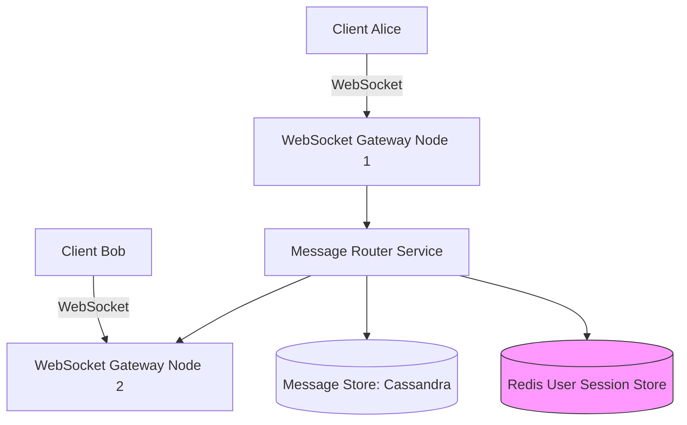

# HLD: Design WhatsApp (Instant Messaging)

This design addresses persistent connection maintenance, offline message queues, delivery states, and group message routing.

---

## 1. Scale & Core Requirements
* **Scale:** 1 Billion DAU.
* **Volume:** 50 Billion messages/day.
* **States:** Sent (one tick), Delivered (double ticks), Read (blue double ticks).

---

## 2. System Architecture

---

## 3. Message Lifecycle
1. **Alice sends message** to Bob.
2. **WebSocket Gateway Node 1** receives the payload.
3. **Router queries Session DB (Redis)** to find where Bob is connected.
   - **Scenario A (Bob Online):** Redis returns Node 2. Router forwards message to Node 2, which pushes via Bob's socket. Bob acknowledges. Status updates to `DELIVERED`.
   - **Scenario B (Bob Offline):** Redis returns null. Message is saved to the **Message Store (Cassandra)**. When Bob connects, his gateway queries Cassandra, pushes pending messages, updates status to `DELIVERED`, and deletes them from the offline database cache.

---

## Interview Q&A Corner

> [!WARNING]
> **Q: Why is Cassandra preferred over traditional relational databases for storing chat history?**
> A: Cassandra is a Wide-Column store optimized for **sequential writes**. Because chat apps are write-heavy, Cassandra writes incoming messages to an in-memory buffer (Memtable) and appends to a log file (CommitLog) on disk. These are sequential operations requiring no disk-head seeks, enabling Cassandra to handle millions of writes/sec easily.
