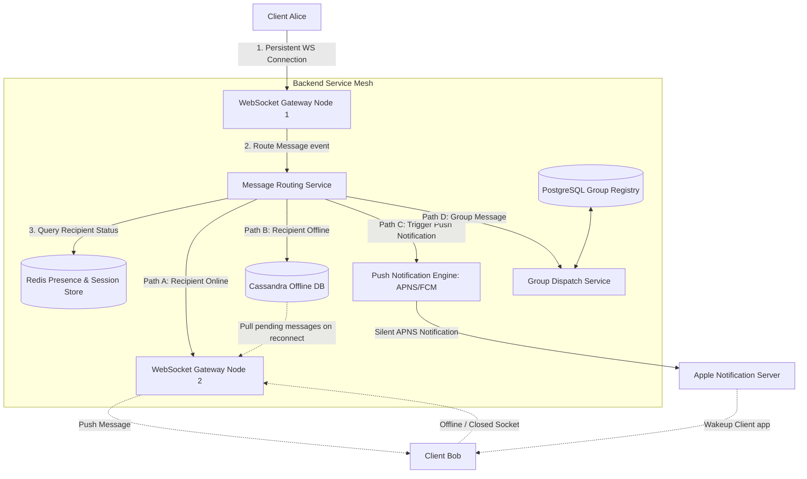

# HLD: Design WhatsApp (Instant Messaging)

## 1. System Scale & Core Theory

An instant messaging system must support low-latency message delivery, real-time presence indicators, and delivery status tracking (sent, delivered, read ticks) while securing communications with End-to-End Encryption (E2EE).

### Mathematical Sizing & Gateway Memory Estimations

Consider a global messaging platform with the following metrics:
*   **Daily Active Users (DAU):** $1\text{ Billion}$.
*   **Messages Sent per Day:** $50\text{ Billion}$.
*   **Average Peak Concurrent Connections:** $10\%$ of DAU are connected at any moment ($100\text{ Million}$ concurrent connections).

#### 1. Ingestion Throughput & Connection Sizing
*   **Average Message rate:**
    $$\text{Average Message Rate} = \frac{50,000,000,000\text{ messages}}{86,400\text{ seconds}} \approx 578,700\text{ messages/second}$$
*   **Peak Message Rate (3x Average):** $1.73\text{ Million messages/second}$.
*   **Gateway Instances Sizing:**
    *   Maintaining $100\text{ Million}$ concurrent connections requires a distributed Gateway cluster.
    *   A single optimized Linux instance can maintain $\approx 100,000$ active concurrent TCP connections (WebSockets or custom socket connections) before resource exhaustion.
    $$\text{Gateway Servers Needed} = \frac{100,000,000\text{ connections}}{100,000\text{ connections/server}} = 1,000\text{ Gateway instances}$$
*   **RAM Sizing per Gateway Node:**
    *   Each open TCP socket consumes memory for kernel buffers and application session contexts ($\approx 10\text{ KB}$ per socket).
    *   **RAM Overhead per Server:** $100,000 \times 10\text{ KB} \approx 1\text{ GB RAM}$.
    Since the memory footprint is small, the primary system limits are network port capacity and CPU interrupts.

#### 2. Storage Sizing (Transient Database)
*   **End-to-End Encryption Storage Policy:** E2EE systems do not store messages on backend servers after delivery. Delivered messages are deleted from the server.
*   **Offline Message Queue Sizing:** Assume $10\%$ of messages are sent to users who are offline. These messages are queued in database storage until the recipient connects.
    *   **Offline Message Rate:** $10\%$ of $50\text{ Billion} = 5\text{ Billion messages/day}$.
    *   **Average Offline Message Retention:** 1 day.
    *   **Message Record Size:** `msg_id` (UUID - $16\text{ bytes}$) + `sender_id` ($16\text{ bytes}$) + `recipient_id` ($16\text{ bytes}$) + `payload` (encrypted text/keys - $200\text{ bytes}$) + `timestamp` ($8\text{ bytes}$) $\approx 256\text{ bytes}$.
    *   **Total Offline Storage capacity:**
        $$\text{Storage Needed} = 5\text{ Billion} \times 256\text{ bytes} \approx 1.28\text{ TB}$$
        This temporary storage can be managed using sharded Cassandra instances, with data deleted as messages are delivered.

### Socket Protocol Comparison

| Feature / Metric | HTTP Long Polling | Server-Sent Events (SSE) | WebSockets | gRPC Streaming (HTTP/2) |
| :--- | :--- | :--- | :--- | :--- |
| **Communication Direction** | Unidirectional (Client pulls) | Unidirectional (Server pushes) | Bidirectional (Duplex) | Bidirectional (Duplex) |
| **Protocol Overhead** | High (sends HTTP headers with every poll) | Low (uses persistent text stream) | Very Low (2-14 byte frame header after handshake) | Very Low (binary framing, header compression) |
| **Connection Persistence** | Periodic reconnection required | Persistent | Persistent | Persistent |
| **Mobile Resource Impact** | High (frequent radio wakeups drain battery) | Low (passive listening) | Low (optimized keep-alives) | Low |
| **Best Use Case** | Legacy system fallbacks | Real-time dashboards, news feeds | Instant messaging, online gaming | Microservices integration, mobile app channels |

---

## 2. Visual Architecture Diagram

This diagram shows WhatsApp's architecture, including WebSocket gateways, the Redis presence indicator store, and the offline message queue.



---

## 3. Data Models & API Signatures

### Presence & Connection Cache Model (Redis)
Redis tracks user online status and Gateway routing endpoints using key-value structures.
*   **Connection Route Key:** `route:usr_<user_id>` -> Value: `gateway_ip_address` (e.g., `10.0.4.88`).
*   **Presence Status Key:** `presence:usr_<user_id>` -> Value: `{"status": "online", "last_active": 1780400000}`.
*   *Command:* `SET route:usr_alice "10.0.4.88" EX 60` (updates route with a 60-second TTL; refreshed by client keep-alive heartbeats).

### Offline Message Queue Model (Cassandra)
Cassandra stores queued messages for offline users. It partitions data by the recipient's user ID, enabling fast sequential reads when a client reconnects.

```sql
CREATE KEYSPACE whatsapp_offline WITH replication = {'class': 'NetworkTopologyStrategy', 'us-east': 3};

CREATE TABLE whatsapp_offline.pending_messages (
    recipient_id uuid,
    message_id timeuuid,
    sender_id uuid,
    encrypted_payload blob,
    signature blob,
    created_at timestamp,
    PRIMARY KEY (recipient_id, message_id)
) WITH CLUSTERING ORDER BY (message_id ASC);
```

### API Signatures

#### 1. WebSocket Message Frame (Client to Gateway)
*   **Protocol:** WebSocket binary frame (Protobuf encoded).
*   **Message Schema (Conceptual JSON):**
```json
{
  "message_id": "msg_78040182-7492-8107",
  "sender_id": "usr_893fd2bc-9d3f-422d-a2f1",
  "recipient_id": "usr_332cb2bc-9d3f-422d-a2f1",
  "payload_type": "TEXT",
  "encrypted_body": "dGVzdF9lbmNyeXB0ZWRfcGF5bG9hZF9kYXRh",
  "client_timestamp": 1780400005
}
```

#### 2. Get Group Members (REST Service Internal)
*   **Protocol:** HTTPS GET
*   **Path:** `/api/v1/groups/{group_id}/members`
*   **Response Payload (200 OK):**
```json
{
  "group_id": "grp_bfd60920-5c6d-4ee8-a92c",
  "members": [
    { "user_id": "usr_893fd2bc-9d3f-422d-a2f1", "role": "ADMIN" },
    { "user_id": "usr_332cb2bc-9d3f-422d-a2f1", "role": "MEMBER" }
  ]
}
```

---

## 4. Operational Flows

### End-to-End Message Delivery Flow

```
Alice App (WS)              Gateway 1            Message Router           Redis Route          Gateway 2             Bob App
    │                           │                      │                       │                   │                    │
    │── 1. Send Message ───────>│                      │                       │                   │                    │
    │                           │── 2. Route Msg ─────>│                       │                   │                    │
    │                           │                      │── 3. Lookup Bob ─────>│                   │                    │
    │                           │                      │<─ 4. Return Gateway2 ─│                   │                    │
    │                           │                      │                                           │                    │
    │                           │                      │── 5. Forward Message ────────────────────>│                    │
    │                           │                      │                                           │── 6. Push Msg ────>│
    │                           │                      │                                           │<─ 7. Client ACK ───│
    │                           │                      │<─ 8. Confirm Delivery ────────────────────│                    │
    │<── 9. Double Tick Check ──│                      │                                           │                    │
```

1.  **Ingestion:** Alice sends a message containing Bob's recipient ID over her active WebSocket connection to Gateway 1.
2.  **Route Lookup:** Gateway 1 forwards the message to the Message Router. The Router queries Redis using the key `route:usr_bob`.
3.  **Delivery Decision:**
    *   *If Online:* Redis returns Gateway 2's IP. The Router forwards the message to Gateway 2, which pushes it to Bob's device. Bob's app sends an acknowledgment back through the pipeline, triggering a "Delivered" double-tick notification for Alice.
    *   *If Offline:* Redis returns a cache miss. The Router writes the message to the Cassandra offline store and calls the Push Notification Service. The service sends a silent notification (via APNS or FCM) to wake up Bob's device and prompt it to establish a WebSocket connection.

### Group Message Delivery Flow
1.  **Ingestion:** A user posts a message to a group containing 500 members.
2.  **Fetch Membership:** The Message Router sends the request to the Group Dispatch Service, which retrieves the member list from database indexes.
3.  **Write Amplification Resolution:** Instead of looping through all 500 members synchronously, the Group Service creates sub-tasks and publishes them to a Kafka queue.
4.  **Parallel Delivery:** A cluster of workers consumes these sub-tasks, checks the presence status of each member, and routes the message to online members via their respective Gateway nodes. For offline members, it writes a single reference to the Cassandra database to avoid duplicate data storage.

---

## 5. High Availability, Failovers & Bottlenecks

### Handling WebSocket Disconnections & Heartbeats
Mobile devices frequently drop TCP connections due to network transitions (e.g., switching from Wi-Fi to cellular data).
*   **Ping-Pong Protocol:** The Gateway and client exchange ping-pong packets every 30 seconds to monitor connection health. If the client fails to respond within a threshold, the Gateway closes the socket and updates the Redis route cache.
*   **Handling Reconnection Storms:**
    *   When connections drop, clients attempt to reconnect simultaneously, creating a spike in database reads as they request offline messages.
    *   *Mitigation:* Store recent message histories locally on the device (using SQLite or Room). When reconnecting, the client sends the timestamp of the last received message:
        `GET /offline-messages?since_timestamp=1780400000`
        This limits the query size on the Cassandra database.

### Presence Cache Optimization
Frequent presence updates (e.g., users opening and closing the app) can create high write volume on the Redis cluster.
*   *Mitigation:* Do not publish presence changes globally in real-time. Instead, have client apps query presence status only for users currently visible in active chat windows.

---

## 6. Comprehensive Interview Q&A

### Q1: How does WhatsApp implement End-to-End Encryption? Explain the Signal Protocol (Double Ratchet Algorithm) in system design.
**Answer:**
WhatsApp uses the Signal Protocol to secure communications. This protocol ensures that messages are encrypted on the sender's device and decrypted only on the recipient's device. The server acts as a relay and cannot decrypt the messages.

*   **Key Exchange (X3DH - Extended Triple Diffie-Hellman):**
    1.  When a user registers, their app generates cryptographic identity keys and a pool of temporary prekeys. These public keys are uploaded to the identity server.
    2.  To message Bob, Alice's app requests his public keys from the server.
    3.  Alice's app performs a series of Diffie-Hellman calculations to establish a shared master secret key.
*   **The Double Ratchet Algorithm:**
    *   To secure ongoing communication, the protocol derives new keys for every message.
    *   **KDF Ratchet (Symmetric):** The sending and receiving apps run key derivation functions. Every message uses a unique key derived from the previous key. This provides **Forward Secrecy**: if an attacker compromises a message key, they cannot decrypt future messages.
    *   **DH Ratchet (Asymmetric):** When the users exchange messages, they attach new Diffie-Hellman public keys. This updates the shared secret key, providing **Post-Quantum Break Recovery**: if an attacker compromises the current master secret, they lose access as soon as the keys are updated.

---

### Q2: Group chats with thousands of users can cause write amplification. How do you design group message delivery at scale?
**Answer:**
In large group chats, a single message can trigger thousands of deliveries. This is a **Write Amplification** challenge.

*   **Mitigation Strategies:**
    1.  **Decouple the Distribution Pipeline:** Do not process group delivery within the client's write thread. The client sends one message to the group ID. The API Gateway writes the message to the database once and publishes a delivery event to Kafka.
    2.  **Worker Partitioning:** A cluster of workers reads the delivery event, retrieves the group member list, and divides the routing tasks into batches.
    3.  **Optimize Offline Storage:** If 90% of the group members are offline, do not write 900 individual copies of the message to the database. Write the message payload to a single table once, and insert lightweight pointer records (containing user ID and message ID references) into the user offline queue tables.
    4.  **Use Multicast routing on Gateways:** Group routing tasks by Gateway IP. If 50 group members are connected to Gateway Node 8, send a single request containing the message payload and the list of 50 recipient IDs to that node. This reduces network traffic between internal backend services.

---

### Q3: How do you implement reliable delivery status ticks (Sent, Delivered, Read) across distributed servers?
**Answer:**
Delivery status tracking requires a state synchronization flow:

```
[ Alice App ] ─── 1. Send Message ───> [ Gateway 1 ] ─── 2. Write Sent Tick (DB)
                                            │
                                            ▼
[ Bob App ]   <─── 4. Receive Msg ──── [ Gateway 2 ] <─── 3. Route Delivery
     │
     └─── 5. Return Delivery ACK ───> [ Gateway 2 ] ─── 6. Update status (DB)
                                            │
                                            ▼
[ Alice App ] <── 8. Show Double Tick ── [ Gateway 1 ] <── 7. Push ACK Event
```

1.  **Sent Status:** When Gateway 1 receives Alice's message, it writes the message metadata to the database and returns a confirmation to Alice. The Alice app displays a single gray checkmark (Sent).
2.  **Delivered Status:** When Gateway 2 pushes the message to Bob's active connection, Bob's app sends an acknowledgment (`ACK`) back to Gateway 2.
3.  **Acknowledge Update:** Gateway 2 publishes a `delivered` event containing the message ID to a Kafka topic. A worker consumes the event, updates the message status to `delivered` in the database, and routes a notification to Alice's active gateway (Gateway 1) to update the checkmarks to a double gray check.
4.  **Read Status:** When Bob opens the chat window, the Bob app sends a `read` event. This event follows the same path, updating the database status and notifying Alice's device to display blue checks.

---

### Q4: Explain the difference between XMPP and a custom WebSocket protocol for instant messaging. Which would you select for a mobile-first app?
**Answer:**
*   **XMPP (Extensible Messaging and Presence Protocol):**
    *   An open standard XML-based protocol.
    *   *Pros:* Rich features, extensible, and supports standardized extensions (XEPs) for features like group chats and delivery receipts.
    *   *Cons:* High XML parsing overhead. It transfers verbose text frames, which increases data usage and battery consumption on mobile devices.
*   **Custom Binary WebSocket Protocol (Recommended):**
    *   A custom protocol built on WebSockets using binary serialization formats like **Protocol Buffers** or **FlatBuffers**.
    *   *Pros:* Minimal packet overhead. Protobuf serializes data into small binary payloads, reducing network bandwidth usage. Parsing binary data consumes less CPU and memory, which helps extend mobile battery life.
    *   *Cons:* Requires custom implementation of connection handshakes, routing logic, and error handling.
*   *Selection:* Choose a custom binary WebSocket protocol for mobile-first apps to optimize network usage and device performance.
