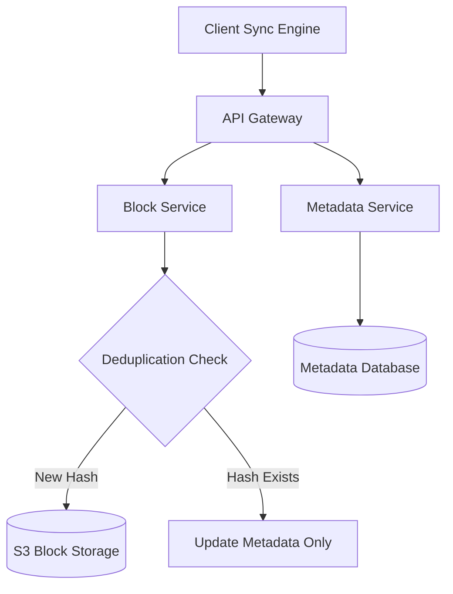

# HLD: Design Google Drive / Dropbox

This design covers scalable file storage, block-level chunking, deduplication, and metadata synchronization.

---

## 1. Scale & Requirements
* **Goal:** Store large files, support multi-device syncing, and resume interrupted uploads.
* **Core Optimization:** **Chunking**. Instead of uploading a 1GB file as a single block, split it into 4MB chunks. 
  * If the upload fails at 900MB, the client only re-uploads the failing 4MB chunks.
  * Only modified chunks are uploaded when a file is edited (saving bandwidth).

---

## 2. Sync & Storage Architecture

---

## 3. Deduplication (Content-Addressable Storage)
* When a chunk is split, the client hashes the chunk content (e.g. SHA-256).
* The block server queries the Database: "Does this hash already exist in S3?"
  - **Yes (Duplicate):** Do not upload the physical file. Simply add a metadata reference in the Database pointing the user's file to the existing S3 block (massive space savings for viral files).
  - **No:** Upload the chunk to S3.

---

## Interview Q&A Corner

> [!IMPORTANT]
> **Q: How does the system resolve sync conflicts when two devices edit the same file offline?**
> A: Use **Optimistic Concurrency Control** via file versions. Each file has a version number in the metadata database. When Device A uploads, it updates version 1 to 2. If Device B attempts to upload version 1, the database rejects the write, and the client application prompts the user to resolve the conflict (merge or keep both versions).
