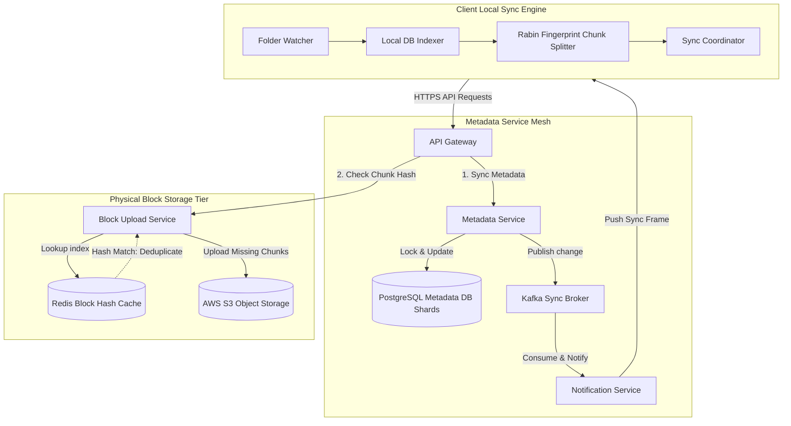

# HLD: Design Google Drive / Dropbox

## 1. System Scale & Core Theory

A cloud storage and file synchronization system requires secure, durable file storage, efficient network bandwidth utilization (via delta syncs), and fast metadata synchronization across multiple devices.

### Mathematical Sizing & Storage Estimations

Consider a cloud storage system with the following metrics:
*   **Total Registered Users:** $500\text{ Million}$.
*   **Daily Active Users (DAU):** $10\text{ Million}$.
*   **Average Files Stored per User:** $100$ files.
*   **Average File Size:** $2\text{ MB}$.

#### 1. Total Storage Sizing
*   **Total Files Count:** $500\text{ Million users} \times 100\text{ files} = 50\text{ Billion files}$.
*   **Raw Storage Size:**
    $$\text{Raw Storage} = 50\text{ Billion files} \times 2\text{ MB} = 100\text{ PB (Petabytes)}$$
*   **Deduplication Savings:** On cloud storage platforms, static asset deduplication (identifying duplicate files/chunks across different users) typically yields a $20\%$ storage reduction:
    $$\text{Post-Deduplication Storage} = 100\text{ PB} \times 0.80 = 80\text{ PB}$$
*   **Replication (3x for durability):** Total physical storage required in S3/Object Storage is $\approx 240\text{ PB}$.

#### 2. Network & Upload Sizing
*   **Daily Uploads/Edits:** Assume $10\%$ of DAU upload or modify $5$ files per day:
    $$\text{Daily Upload Volume} = 10\text{ Million DAU} \times 0.10 \times 5 = 5\text{ Million uploads/day}$$
*   **Average Upload QPS:**
    $$\text{Average Upload QPS} = \frac{5,000,000\text{ uploads}}{86,400\text{ seconds}} \approx 58\text{ uploads/sec}$$
    $$\text{Peak Upload QPS (5x average)} \approx 290\text{ uploads/sec}$$
*   **Bandwidth Savings from Chunking:**
    *   If a user modifies a $10\text{ MB}$ file by editing $10\text{ KB}$ of text, standard uploads require sending the entire $10\text{ MB}$.
    *   Using **Chunking** (splitting files into $4\text{ MB}$ chunks), the client uploads only the modified $4\text{ MB}$ chunk. This reduces bandwidth consumption by $60\%$ for file updates.

### Chunking Strategy Comparison

| Feature | Fixed-Size Chunking | Variable-Size Chunking (Rabin Fingerprints) |
| :--- | :--- | :--- |
| **Mechanism** | Splits files at static boundaries (e.g., every $4\text{ MB}$) | Computes a rolling hash window; splits when hash matches a pattern |
| **Shift Sensitivity** | High (adding a byte at the start changes all downstream boundaries and hashes) | Low (shifts only affect the local boundary; subsequent boundaries remain aligned) |
| **Deduplication Rate** | Low for modified documents | High (detects identical blocks within modified files) |
| **Computational Cost** | Very Low | Moderate (requires scanning every byte with a sliding hash window) |
| **Best Use Case** | Large media files, database backups | Text documents, code files, collaborative editing |

---

## 2. Visual Architecture Diagram

This diagram outlines the cloud storage architecture, showing the separation between metadata update paths and physical block upload paths.



---

## 3. Data Models & API Signatures

### Metadata Database Schema (SQL Database)
To support scale, metadata is sharded by the file's `owner_id`. This groups all directory structures for a user on a single database shard.

```sql
-- PostgreSQL Schema
CREATE TABLE user_files (
    file_id UUID PRIMARY KEY,
    owner_id UUID NOT NULL,
    parent_folder_id UUID, -- References user_files(file_id) for directories
    name VARCHAR(255) NOT NULL,
    is_directory BOOLEAN NOT NULL DEFAULT FALSE,
    file_size BIGINT NOT NULL DEFAULT 0,
    version INT NOT NULL DEFAULT 1,
    checksum VARCHAR(64), -- SHA-256 hash of the entire file
    created_at TIMESTAMP WITH TIME ZONE DEFAULT CURRENT_TIMESTAMP,
    updated_at TIMESTAMP WITH TIME ZONE DEFAULT CURRENT_TIMESTAMP
);

CREATE TABLE file_chunks (
    chunk_id VARCHAR(64) PRIMARY KEY, -- SHA-256 hash of the chunk contents
    file_id UUID NOT NULL REFERENCES user_files(file_id) ON DELETE CASCADE,
    chunk_index INT NOT NULL,         -- Sequence order (0, 1, 2...)
    chunk_size INT NOT NULL,
    storage_path VARCHAR(512) NOT NULL -- S3 Object URI
);

-- Optimization Indexes
CREATE INDEX idx_files_owner_parent ON user_files(owner_id, parent_folder_id);
CREATE INDEX idx_chunks_file_id ON file_chunks(file_id);
```

### API Signatures

#### 1. Initiate File Upload
*   **Protocol:** HTTPS POST
*   **Path:** `/api/v1/files/upload/initiate`
*   **Request Payload:**
```json
{
  "owner_id": "usr_893fd2bc-9d3f-422d-a2f1",
  "name": "project_report.pdf",
  "parent_folder_id": "folder_bfd60920-5c6d-4ee8",
  "file_size": 12582912,
  "checksum": "sha256_e3b0c44298fc1c149afbf4c8996fb92427ae41e4649b934ca495991b7852b855",
  "chunk_hashes": [
    "hash_09d73f1a-b32c-473d",
    "hash_a34fd2bc-9d3f-422d",
    "hash_c88e7f75-3515-4428"
  ]
}
```
*   **Response Payload (200 OK):**
```json
{
  "file_id": "file_cfd60920-5c6d-4ee8-a92c",
  "version": 1,
  "upload_status": "PARTIAL_UPLOAD",
  "required_chunks": [
    { "chunk_hash": "hash_a34fd2bc-9d3f-422d", "upload_url": "https://s3.amazonaws.com/upload-temp/a34fd..." }
  ]
}
```
*This response tells the client that chunks 1 and 3 are already stored on the server (deduplicated). The client needs to upload only chunk 2.*

#### 2. Commit File Upload (Finish Sync)
*   **Protocol:** HTTPS POST
*   **Path:** `/api/v1/files/upload/commit`
*   **Request Payload:**
```json
{
  "file_id": "file_cfd60920-5c6d-4ee8-a92c",
  "version": 1
}
```
*   **Response Payload (200 OK):**
```json
{
  "status": "COMMITTED",
  "updated_at": "2026-06-03T02:26:35Z"
}
```

---

## 4. Operational Flows

### File Upload & Deduplication Flow (Write Path)
1.  **Analyze File:** The client-side Sync Engine scans a modified file, splits it into chunks using Rabin fingerprinting, and calculates a SHA-256 hash for each chunk.
2.  **Initialize Upload:** The client sends an `/initiate` request to the Metadata Service containing the list of chunk hashes.
3.  **Deduplicate:** The Metadata Service queries Redis to check if any of the chunk hashes are already registered.
    *   *If present:* The service records a reference link to the existing chunk in the database.
    *   *If missing:* The service generates pre-signed S3 upload URLs for the missing chunks and returns them to the client.
4.  **Upload Chunks:** The client uploads the missing chunks directly to S3.
5.  **Commit Metadata:** Once the S3 uploads are complete, the client sends a `/commit` request to the Metadata Service. The service updates the file version to active and publishes a synchronization event to Kafka.

### Device Sync & Conflict Resolution Flow (Read Path)

```
Device A (Editing)            Metadata Service             Database             Kafka Broker           Device B (Standby)
     │                               │                        │                      │                       │
     │── 1. Commit Edit (v1->v2) ───>│                        │                      │                       │
     │                               │── 2. Update Metadata ─>│                      │                       │
     │                               │<─ 3. Confirm Write ────│                      │                       │
     │<── 4. Upload OK ──────────────│                                               │                       │
     │                               │── 5. Emit Sync Event ────────────────────────>│                       │
     │                                                                               │── 6. Push Update ────>│
     │                                                                               │    (New Version event)│
     │                                                                               │                       │
     │<── 7. Concurrent edit (v1) ───────────────────────────────────────────────────┼───────────────────────│
     │    (Device B tries to push version 2, but DB expects version 3)               │                       │
     │                                                                               │                       │
     │── 8. Reject Write (Conflict) ────────────────────────────────────────────────>│                       │
     │<─ 9. Handle Conflict (Prompt User / Branch File) ─────────────────────────────│                       │
```

1.  **Detect Changes:** Device A commits a file change, updating its version from 1 to 2 in the database.
2.  **Emit Notification:** The Metadata Service publishes the version update event to Kafka. The Notification Service consumes the event and sends a synchronization signal to all other devices registered to the owner (including Device B) over an open WebSocket connection.
3.  **Process Update:** Device B receives the notification, identifies that its local metadata version (version 1) lags the server version (version 2), and requests the file difference (delta).
4.  **Delta Pull:** Device B downloads only the modified chunks from S3 and updates its local folder structure.
5.  **Conflict Resolution (Optimistic Concurrency Control):**
    *   If Device B modifies the same file offline and attempts to upload changes without syncing first, it sends a write request with version 1.
    *   The database rejects the write because the server version has already progressed to version 2:
        `UPDATE user_files SET version = 3 WHERE file_id = ? AND version = 1;`
    *   The upload fails (0 rows updated). The server returns a `409 Conflict` error. The client app prompts the user to resolve the conflict by either keeping both versions (renaming one file) or merging the changes.

---

## 5. High Availability, Failovers & Bottlenecks

### Managing Partial Uploads & Dead Storage Cleanup
If a client disconnects mid-upload, the successfully uploaded S3 chunks remain in storage. Since no file metadata links to them, they become orphaned blocks, wasting storage capacity.
*   *Mitigation:* Store uncommitted chunks in a staging directory. Run daily garbage collection workers to clean up staging chunks that are older than 24 hours and lack corresponding metadata records.

### Scaling real-time Notification Services
Maintaining persistent WebSocket connections for millions of standby devices consumes server resources.
*   **Optimization:** The Notification Service should be stateless. It should not track client sync states.
*   **Subscription Architecture:**
    *   When a client establishes a connection, it subscribes to a Redis Pub/Sub channel based on its `user_id`.
    *   When the Metadata Service writes a change, it publishes a message to that user's channel:
        `PUBLISH user_usr_893fd2bc "file_changed"`
    *   The gateway instance hosting the client's WebSocket connection receives the Redis event and forwards a lightweight synchronization signal to the client. The client then pulls the metadata updates over standard HTTPS, keeping the WebSocket connection payload small.

---

## 6. Comprehensive Interview Q&A

### Q1: Explain Rabin Fingerprinting (Rolling Hash) and how it enables variable-size chunking. Why is this superior to fixed-size chunking?
**Answer:**
Rabin Fingerprinting is a method for splitting files into variable-size chunks based on their content rather than static offset boundaries.

*   **How it Works:**
    *   The algorithm slides a small window (e.g., 48 bytes) across the file byte by byte and computes a rolling hash.
    *   If the hash value modulo a prime number $P$ matches a target value $T$ (e.g., $Hash(window) \pmod P == T$), a chunk boundary is declared at that position.
    *   The prime $P$ determines the average chunk size. For example, to target an average chunk size of $4\text{ MB}$ ($2^{22}$ bytes), set $P = 2^{22}-1$.
*   **Why it is Superior to Fixed-Size Chunking:**

```
Fixed-Size Chunking (File shifts after insert):
Original: [ Chunk 1 (4MB) ] [ Chunk 2 (4MB) ] [ Chunk 3 (4MB) ]
Modified: [ Ch 1 (with 10 bytes added) ] [ New Chunk 2 (shifted) ] [ New Chunk 3 (shifted) ]
* All downstream chunk hashes change, breaking deduplication.

Variable-Size Chunking (Rabin Fingerprint):
Original: [ Chunk 1 (Boundary A) ] [ Chunk 2 (Boundary B) ] [ Chunk 3 ]
Modified: [ Ch 1 (with 10 bytes added - Boundary A shifts) ] [ Chunk 2 (Boundary B) ] [ Chunk 3 ]
* Only the hash of Chunk 1 changes. Downstream chunks remain identical, preserving deduplication.
```

If a user inserts 10 bytes at the beginning of a file:
*   *Fixed-Size:* Shifts the boundaries of all subsequent chunks. The system treats the entire file as modified, requiring all chunks to be re-uploaded.
*   *Variable-Size:* The rolling window identifies the same boundary markers downstream once it passes the insertion point. This isolates the change to the first chunk, leaving the subsequent chunk hashes unchanged. The system uploads only the modified first chunk and uses existing deduplicated blocks for the rest.

---

### Q2: How does a Delta Sync Engine function? How does the client reconstruct files from chunks?
**Answer:**
A delta sync engine minimizes bandwidth consumption by transferring only the modified segments of a file.

1.  **Generation of Chunk Manifest:** When a file is uploaded, the metadata database stores an ordered list of its chunk hashes:
    `File A (v1) -> [Hash_X, Hash_Y, Hash_Z]`
2.  **File Modification:** The client edits the file locally. The client-side sync engine calculates the new chunk list:
    `File A (v2) -> [Hash_X, Hash_W, Hash_Z]`
3.  **Difference Query:** The client sends the new hash list to the server. The server compares it to the active version and identifies that `Hash_W` is missing from storage, while `Hash_X` and `Hash_Z` are already present.
4.  **Delta Upload:** The client uploads only the chunk corresponding to `Hash_W`.
5.  **Reconstruction:** Files are not compiled on the server. They remain stored as individual chunks in S3. When a device downloads a file, the client app requests the chunk manifest, downloads the chunks (`Hash_X`, `Hash_W`, `Hash_Z`) in parallel, and stitches them together locally in sequence to reconstruct the file.

---

### Q3: How do you design the metadata database to support millions of queries per second? Compare SQL sharding with NoSQL document databases for this design.
**Answer:**
The metadata database tracks file structures, versions, and chunk references. Selecting a database architecture involves trade-offs:

1.  **Sharded Relational Database (Recommended):**
    *   *Implementation:* Use databases like PostgreSQL or MySQL sharded by `owner_id`.
    *   *Pros:* Supports transactional integrity (ACID) for file movements and updates. For example, moving a folder requires updating paths inside a transaction to prevent data corruption.
    *   *Cons:* Schema modifications across sharded nodes require careful orchestration.
2.  **NoSQL Document Store (e.g., MongoDB):**
    *   *Implementation:* Store the file hierarchy as JSON documents.
    *   *Pros:* Flexible schema schema support. Allows storing file attributes as dynamic key-value pairs.
    *   *Cons:* Lacks support for complex transactions across multiple documents. For example, renaming a root directory requires updating the path attribute across thousands of child documents. Doing this without transaction support can lead to inconsistent states.
3.  **Selection:** A sharded SQL database is preferred because namespace management requires strong consistency and transaction support.

---

### Q4: How do you secure data stored in a cloud storage platform like Google Drive?
**Answer:**
Securing a cloud storage platform requires implementing encryption and access control across all layers:

1.  **Encryption in Transit:** Encrypt all API traffic and data transfers using TLS 1.3 to prevent eavesdropping and interception.
2.  **Encryption at Rest (Envelope Encryption):**
    *   Encrypt chunks stored in S3 using AES-256 with keys managed by a Key Management Service (KMS).
    *   Use envelope encryption: encrypt each file or chunk with a unique Data Encryption Key (DEK). Encrypt the DEKs using a master Key Encryption Key (KEK) stored securely in the KMS.
3.  **Zero-Knowledge Encryption (Optional):**
    *   For high privacy, encrypt data on the client device using keys derived from the user's password before upload.
    *   Under this model, the server stores only encrypted blocks and cannot access the plain text contents because it does not possess the decryption keys.
4.  **Access Control:** Use role-based access control (RBAC) to manage file permissions and sharing. Authenticate and authorize every chunk request using signed URLs with short expiration windows.
