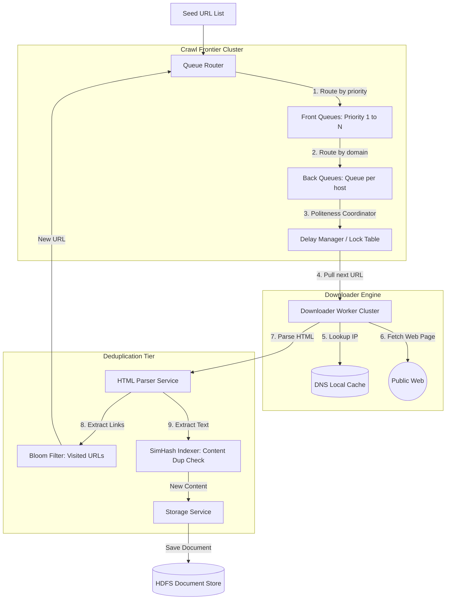

# HLD: Design a Web Crawler

## 1. System Scale & Core Theory

A web crawler discovers, fetches, and parses web pages to index the web. The system must operate at scale while complying with politeness policies (avoiding server overload) and filtering out duplicate content.

### Mathematical Sizing & Storage Estimations

Consider a search engine crawler with the following target:
*   **Goal:** Crawl $15\text{ Billion pages}$ every $30\text{ days}$.
*   **Average Page Size:** $100\text{ KB}$ (HTML and metadata).

#### 1. Ingestion Throughput Calculations
*   **Pages Per Second (QPS):**
    $$\text{Average Crawl QPS} = \frac{15,000,000,000\text{ pages}}{30\text{ days} \times 86,400\text{ seconds}} \approx 5,787\text{ pages/sec}$$
    $$\text{Peak Crawl QPS (2x average)} \approx 11,500\text{ pages/sec}$$
*   **Network Inbound Bandwidth Sizing:**
    $$\text{Average Throughput} = 5,787\text{ pages/sec} \times 100\text{ KB} \approx 578.7\text{ MB/s} = 4.63\text{ Gbps}$$
    The crawler requires high-capacity network interfaces and distributed nodes to manage this incoming bandwidth.

#### 2. Storage & Memory Sizing
*   **Raw HTML Storage:**
    $$\text{Raw HTML Storage (30 days)} = 15\text{ Billion} \times 100\text{ KB} = 1.5\text{ PB (Petabytes)}$$
    This data is compressed and written to distributed filesystems (like HDFS or GFS).
*   **Visited URL Set (Bloom Filter Memory Sizing):**
    To avoid recrawling pages, the crawler tracks visited URLs. Storing $15\text{ Billion}$ URL strings in memory is expensive. A **Bloom Filter** provides space-efficient membership checks.
    *   **Formula (Bit Array Size $m$ for $n$ elements and false positive probability $p$):**
        $$m = -\frac{n \ln(p)}{(\ln 2)^2}$$
    *   For $n = 15\text{ Billion}$ URLs and $p = 0.001$ ($0.1\%$ false positive rate):
        $$m = -\frac{15 \times 10^9 \times \ln(0.001)}{0.4804} \approx 215.7\text{ Billion bits} \approx 27\text{ GB RAM}$$
        A $27\text{ GB}$ Bloom filter fits easily in the memory of a single host or can be distributed across a Redis cluster.

### Crawl Ordering Strategy Comparison

| Feature | Breadth-First Search (BFS) | Depth-First Search (DFS) | PageRank-Prioritized Crawling |
| :--- | :--- | :--- | :--- |
| **Search Traversal** | Scans links layer-by-layer | Follows link chains deep before backtracking | Prioritizes URLs based on incoming link quality |
| **Crawler Politeness** | Hard to manage (may hit a single domain repeatedly) | High risk of hitting a single domain repeatedly | Managed via host queues |
| **System Overhead** | High memory usage for queue management | Moderate memory usage | High memory usage (requires tracking page importance metrics) |
| **Discovery Quality** | High for general directories | Poor (can get stuck in single site directories) | Optimal (crawls high-authority sites first) |

---

## 2. Visual Architecture Diagram

This diagram shows the crawler pipeline, tracing URLs from the prioritization queues through DNS caching and download workers to parsing and deduplication stages.



---

## 3. Data Models & API Signatures

### Host Politeness Registry (Redis Data Model)
The crawler maintains politeness metadata in Redis to ensure it does not query a domain too frequently.
*   **Host Lock Key:** `lock:host_<domain_hash>` -> Value: `worker_id` (indicates a worker is currently querying this host).
*   **Host Next Allowed Request Timestamp Key:** `next_time:host_<domain_hash>` -> Value: Unix epoch timestamp in milliseconds (e.g., `1780400000000`).
*   *Command:* `SET next_time:host_wikipedia 1780400001000 PX 1000` (sets a 1-second delay lock for `wikipedia.org`).

### Metadata Schema for Crawled Documents (SQL Database)
HDFS stores raw page content, while a metadata database indexes crawled URLs and their status.

```sql
-- PostgreSQL Schema
CREATE TABLE crawled_pages (
    url_hash VARCHAR(64) PRIMARY KEY, -- SHA-256 hash of the URL
    url TEXT NOT NULL,
    status_code INT,                  -- 200, 404, 301...
    simhash VARCHAR(64),              -- Locality-sensitive hash of page content
    content_length INT,
    last_crawled_at TIMESTAMP WITH TIME ZONE DEFAULT CURRENT_TIMESTAMP
);

CREATE TABLE domain_metadata (
    domain_hash VARCHAR(64) PRIMARY KEY,
    domain_name VARCHAR(255) NOT NULL,
    robots_txt_rules TEXT,
    crawl_delay_seconds INT DEFAULT 1,
    last_fetched_at TIMESTAMP WITH TIME ZONE
);

-- Optimization Index
CREATE INDEX idx_pages_simhash ON crawled_pages(simhash);
```

### API Signatures

#### 1. Register Visited URL (Internal Check)
*   **Protocol:** gRPC / Protocol Buffers
*   **Interface:** `CrawlFrontierService`
```protobuf
message VisitedCheckRequest {
  string url = 1;
}

message VisitedCheckResponse {
  bool is_visited = 1;
  string url_hash = 2;
}
```

#### 2. Query Robots.txt Rules (Internal Service Call)
*   **Protocol:** gRPC
```protobuf
message RobotsRuleRequest {
  string domain_name = 1;
}

message RobotsRuleResponse {
  repeated string disallowed_paths = 1;
  int32 crawl_delay_seconds = 2;
}
```

---

## 4. Operational Flows

### Crawl Frontier Processing Flow

The Crawl Frontier manages politeness and priority concurrently by using a two-tier queue structure:

```
[ Incoming URL ] ──> [ Front Queues (Priority-Based) ]
                            │
                      (Queue Router)
                            │
                            ▼
                     [ Back Queues (Host-Based) ]
                            │
               (Politeness Delay Manager Check)
                            │
                            ├── (Allowed)   ──> [ Downloader Worker ]
                            └── (Postponed) ──> [ Re-queue URL ]
```

1.  **Ingestion:** The system routes new URLs to a priority queue (Front Queue) based on calculated PageRank or domain authority scores.
2.  **Domain Routing:** A routing worker pops a URL from the Front Queue and places it into the host queue (Back Queue) designated for its domain. This ensures that URLs from the same domain are grouped together.
3.  **Politeness Verification:** When a downloader worker requests a task, the Crawl Frontier checks the host lock table:
    *   *If unlocked:* The worker acquires the host lock, pops the next URL from the host queue, and starts the download.
    *   *If locked:* The worker skips the host queue and checks other queues.
4.  **Lock Release:** Once the download completes, the worker releases the host lock and updates the host's `next_allowed_request` timestamp in Redis to enforce a delay (e.g., 1 second) before the domain is queried again.

### Page Download & Ingestion Pipeline
1.  **Fetch Page:** The worker downloads a page's HTML contents and checks its HTTP status code.
2.  **Extract Content:** The Parser extracts text content and identifies outbound links (`<a href="...">`).
3.  **Filter Visited links:** The system runs the extracted URLs through the Bloom Filter. New URLs are routed to the Crawl Frontier. Visited URLs are discarded.
4.  **Deduplicate Content:** The system computes the SimHash of the page's text and compares it to existing entries in the database.
    *   *If duplicate:* The page content is discarded to save storage space.
    *   *If new:* The page content is compressed and saved to HDFS, and the metadata database is updated.

---

## 5. High Availability, Failovers & Bottlenecks

### Mitigating DNS Resolution Bottlenecks
A web crawler translates thousands of domains to IP addresses every second. Querying public DNS servers for every request can create a network bottleneck.
*   *Mitigation:*
    1.  **Local DNS Caching:** Deploy local DNS caching servers (like Unbound or Dnsmasq) on each crawler node.
    2.  **Prefetching:** Configure the Crawl Frontier to pre-resolve domains in the background before they are popped from host queues.
    3.  **Long TTLs:** Cache resolved IP mappings locally for up to 24 hours, ignoring short DNS TTLs to minimize external queries.

### Mitigating Spider Traps
Spider traps are website configurations that create an infinite loop of unique URLs, which can exhaust crawler resources. Examples include dynamically generated calendars (`/calendar?date=2026-06-03`, `/calendar?date=2026-06-04...`) or nested directories (`/folder1/folder2/folder1/...`).
*   *Mitigation:*
    1.  **URL Length Restraints:** Discard URLs that exceed a length threshold (e.g., 512 characters).
    2.  **Query Parameter Filtering:** Detect and strip dynamic URL query parameters.
    3.  **Loop Detection:** Monitor path segments for repeating patterns: `/etc/dir1/dir1/dir1`.
    4.  **Resource Limits:** Limit the number of pages crawled from a single domain.

---

## 6. Comprehensive Interview Q&A

### Q1: Detail the two-tier queue structure inside the Crawl Frontier. How does it balance priority with politeness?
**Answer:**
A web crawler must balance priority (downloading high-quality pages first) with politeness (avoiding server overload). The Crawl Frontier achieves this by separating priority and politeness into two separate sets of queues:

```
                  [ Front Queues (Priority-Based) ]
                  ┌─────────┬─────────┬─────────┐
                  │ High (1)│ Med (2) │ Low (3) │
                  └────┬────┴────┬────┴────┬────┘
                       │         │         │
                       ▼         ▼         ▼
                 [ Queue Router / Map Registry ]
                       │         │         │
                       ▼         ▼         ▼
                  ┌────┴────┬────┴────┬────┴────┐
                  │ wikipedia│ github  │  reddit │
                  └─────────┴─────────┴─────────┘
                  [ Back Queues (Host-Based - Politeness) ]
```

1.  **Front Queues (Priority-Based):**
    *   The system maintains multiple FIFO queues, one for each priority level (e.g., Priority 1 to 10).
    *   The priority of a URL is calculated using metrics like PageRank or change frequency.
    *   A scheduler pops URLs from the highest-priority queues first using a weighted round-robin distribution.
2.  **Queue Router:**
    *   The scheduler resolves the domain name of the popped URL and maps it to a corresponding Back Queue.
3.  **Back Queues (Host-Based Politeness):**
    *   The system maintains one Back Queue per domain (e.g., `wikipedia.org`, `reddit.com`).
    *   Downloader workers pull from these host queues. If a host queue is currently locked or waiting for its politeness delay, workers skip it and check other queues.
    *   This design ensures that high-priority URLs are scheduled first, while preventing workers from hitting any single domain with concurrent requests.

---

### Q2: Explain the SimHash algorithm for detecting near-duplicate documents. How do you query SimHash values at scale?
**Answer:**
Cryptographic hashes (like SHA-256) are sensitive to small changes; modifying a single character yields a completely different hash. This makes them unsuitable for identifying near-duplicate documents (such as identical pages containing different timestamps). SimHash is a **Locality-Sensitive Hashing (LSH)** algorithm. It generates fingerprints where similar documents yield similar hashes.

*   **SimHash Generation Process:**
    1.  **Tokenization:** Extract words from a document and assign weight values to them (e.g., using TF-IDF weights).
    2.  **Hashing:** Generate a standard 64-bit hash for each word.
    3.  **Aggregation:** Initialize a 64-element vector $V$ with values set to 0. For each word hash, iterate through its bits (0 to 63):
        *   If bit $i$ is 1, add the word's weight to $V[i]$.
        *   If bit $i$ is 0, subtract the word's weight from $V[i]$.
    4.  **Dimensionality Reduction:** Convert the aggregated vector $V$ into a 64-bit integer fingerprint:
        *   If $V[i] > 0$, set bit $i$ of the fingerprint to 1.
        *   If $V[i] \le 0$, set bit $i$ of the fingerprint to 0.
*   **Near-Duplicate Detection:**
    *   Two documents are duplicates if the **Hamming Distance** (the number of differing bits) between their SimHash fingerprints is below a threshold (typically $\le 3$).
*   **Scaling Queries (Pigeonhole Principle):**
    *   Searching a dataset of billions of records for a Hamming distance of $\le 3$ is computationally expensive.
    *   *Mitigation:* Split the 64-bit SimHash into 4 blocks of 16 bits each. If two hashes differ by at most 3 bits, at least one of the 4 blocks must match exactly.
    *   Index the fingerprint tables in database shards using these 4 blocks as lookup keys. This limits search queries to records that share at least one identical 16-bit block, reducing query times.

---

### Q3: How do you crawl pages that render content dynamically using client-side JavaScript (SPAs)? How do you scale this?
**Answer:**
Standard HTTP requests retrieve raw HTML files. If a website is a Single Page Application (SPA) that renders content dynamically using JavaScript (like React or Angular), the raw HTML may be mostly empty, containing only script tags.

*   **Handling JavaScript Rendering:**
    *   The crawler must run the page's JavaScript inside a headless browser (such as Headless Chrome controlled via Puppeteer or Playwright).
    *   The headless browser loads the page, executes the scripts, waits for the DOM to render, and returns the rendered HTML to the parser.
*   **Scaling Headless Rendering:**
    *   Headless browsers consume significant CPU and memory (often requiring $\approx 100\text{ MB}$ to $200\text{ MB}$ of RAM per tab). Running a headless browser for every query is not viable at scale.
    *   *Optimization:*
        1.  **Selective Rendering:** Check the initial HTML response. If it contains data indicators or if the domain is flagged as static, bypass rendering. Use headless browsers only for domains known to require JavaScript.
        2.  **Pool Headless Nodes:** Deploy rendering workers on a dedicated cluster. Scale these workers independently of the standard downloader workers.
        3.  **Render Caching:** Cache rendered page outputs. If multiple URLs route to the same SPA template, reuse the template layout to reduce rendering overhead.

---

### Q4: How do you handle crawler updates and state recovery during system maintenance or crashes?
**Answer:**
A crawl cycle can run for weeks. If a master node crashes, the system must recover its state without restarting the crawl from the beginning.

*   **Checkpointing:**
    *   Save the state of the Crawl Frontier (priority queues and host queues) to disk periodically (e.g., hourly).
    *   Write log updates to metadata databases using transactions to ensure database entries match the state of the queues.
*   **Distributed Queue Coordination:**
    *   Use coordination systems like **Apache ZooKeeper** to manage active worker configurations and track which queues are assigned to which nodes.
    *   If a worker node crashes:
        1.  ZooKeeper detects the lost heartbeat and reassigns the worker's queue partitions to healthy nodes.
        2.  The replacement worker reads the last queue checkpoint and resumes the crawl without duplicating work.
