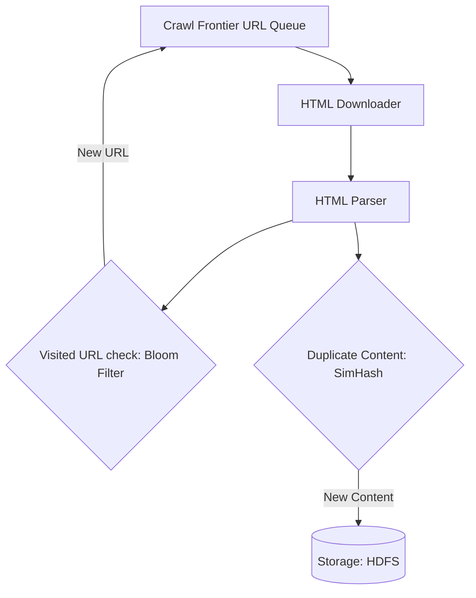

# HLD: Design a Web Crawler

A web crawler discovers, fetches, and parses web pages to feed search engine indices.

---

## 1. Scale & Requirements
* **Scale:** Crawl 15 Billion pages in 30 days ($\approx 5,800$ pages per second).
* **Constraints:** 
  * **Politeness:** Do not overload a host with requests (comply with `robots.txt`).
  * **Deduplication:** Avoid downloading duplicate links or identical page contents.

---

## 2. Crawler Architecture

---

## 3. Politeness & Crawl Frontier Design
To prevent DDOSing a domain, the Crawl Frontier splits URLs into:
1. **FIFO Queue Per Host:** A dedicated queue for each domain (e.g. `wikipedia.org`).
2. **Politeness Delay Workers:** A worker pulls from a queue, downloads, and waits a delay interval (e.g., 1 second) before querying the same queue again.
3. **Priority Queues:** Rank domains based on page rank scores.

---

## Interview Q&A Corner

> [!IMPORTANT]
> **Q: How does a web crawler detect near-duplicate pages (e.g., same content but with different timestamps or headers)?**
> A: Comparing full HTML strings is too slow. Use **SimHash** (Locality-Sensitive Hashing). SimHash generates a fingerprint (e.g. 64-bit integer) of the text content. Unlike cryptographic hashes (SHA-256) which change completely for 1-character differences, SimHash maps similar text to similar integers. Two pages are duplicates if their Hamming Distance (number of differing bits) is very small ($\le 3$).
