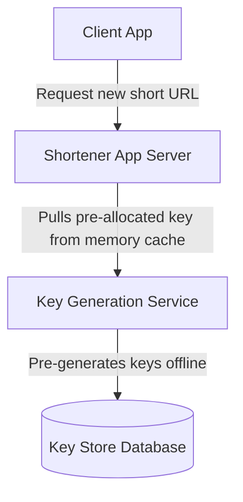

# HLD: Design a URL Shortener (TinyURL)

This system generates short aliases for long URLs and handles high QPS redirections.

---

## 1. Scale & Requirements
* **Scale:** 100 Million URLs created/day. 10 Billion reads/day.
* **Redirection Latency:** $<10\text{ ms}$ (99% cache hits).

---

## 2. Key Generation: Base62 vs MD5 Hash
To make a short URL like `tinyurl.com/a8G7kd`, we need a unique 6-8 character key.

### Option A: MD5 Hash Truncation
* Calculate `MD5(long_url) -> 32 characters`. Truncate first 7 characters.
* *Cons:* Causes hash collisions. Resolving collisions requires querying the database on every write, slowing performance.

### Option B: Base62 Encoding of an ID (Recommended)
* Map a unique auto-incrementing 64-bit integer ID to a base62 character set:
  $$\text{Base62} = [\text{a-z, A-Z, 0-9}] \quad (62\text{ possible characters})$$
* A 7-character key yields $62^7 \approx 3.5\text{ Trillion}$ unique combinations.

---

## 3. Key Generation Service (KGS) Architecture
To avoid using database sequential IDs (which creates a write bottleneck), use a **Key Generation Service (KGS)**.

* KGS pre-generates random 7-character strings offline and stores them in a database.
* When a write request arrives, the application pulls a pre-allocated key from the KGS memory pool instantly, eliminating database key checks or sequence locks.

---

## Interview Q&A Corner

> [!TIP]
> **Q: How should URL redirection be cached to optimize reads?**
> A: Configure the HTTP response with status **301 Permanent Redirect** (which browsers cache locally, saving subsequent hits to the server) or **302 Temporary Redirect** (forces browser to hit our server every time, useful for tracking click analytics). Cache mappings in Redis (LRU eviction).
