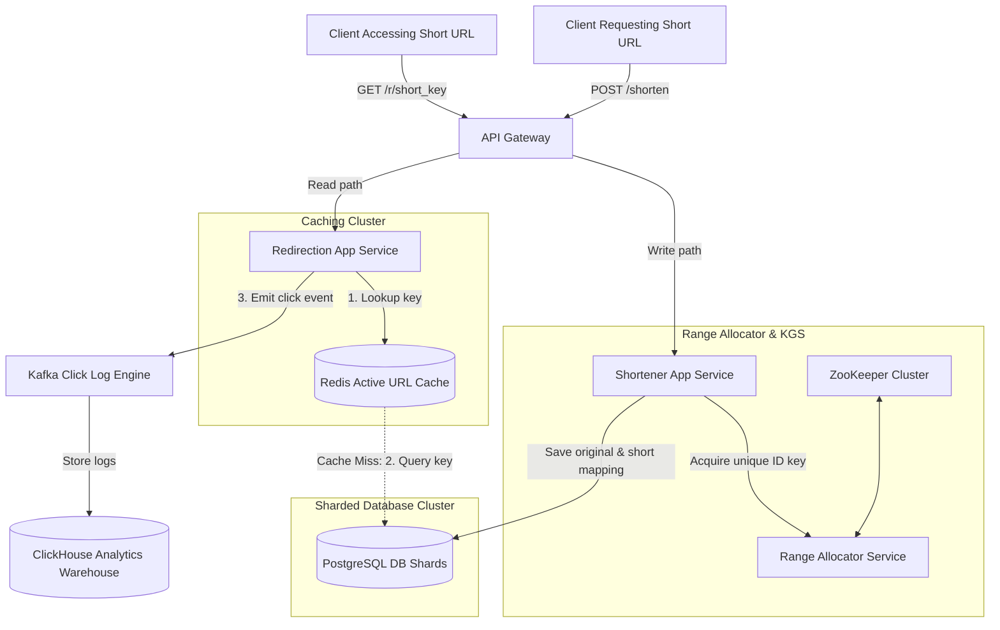

# HLD: Design a URL Shortener (TinyURL)

## 1. System Scale & Core Theory

A URL shortener generates short aliases for long URLs and redirects users to the original destination. The system must support high-volume reads and write unique, collision-free short codes without introducing bottlenecks.

### Mathematical Sizing & Storage Estimations

Consider a global URL shortener with the following scale:
*   **Write Volume:** $100\text{ Million URLs created/day}$.
*   **Read Volume:** $10\text{ Billion redirections/day}$ (Read-to-Write ratio of $100:1$).

#### 1. Read & Write QPS Calculations
*   **Write QPS:**
    $$\text{Average Write QPS} = \frac{100,000,000\text{ writes}}{86,400\text{ seconds}} \approx 1,157\text{ writes/second}$$
    $$\text{Peak Write QPS (2.5x average)} \approx 2,900\text{ writes/second}$$
*   **Read QPS (Redirections):**
    $$\text{Average Read QPS} = \frac{10,000,000,000\text{ reads}}{86,400\text{ seconds}} \approx 115,740\text{ reads/second}$$
    $$\text{Peak Read QPS (2x average)} \approx 230,000\text{ reads/second}$$
    The system is highly read-heavy, making caching critical.

#### 2. Storage & Memory Sizing
*   **URL Record size:**
    *   `short_key` (7 chars Base62): $7\text{ bytes}$
    *   `original_url` (Varchar): Average $150\text{ bytes}$
    *   `user_id` (UUID): $16\text{ bytes}$
    *   `created_at` (Timestamp): $8\text{ bytes}$
    *   `expires_at` (Timestamp): $8\text{ bytes}$
    *   **Total size per record:** $\approx 189\text{ bytes}$ (allow $250\text{ bytes}$ with database overhead).
*   **Annual Database Storage:**
    $$\text{Annual Records Count} = 100\text{ Million/day} \times 365\text{ days} = 36.5\text{ Billion records/year}$$
    $$\text{Annual Storage} = 36.5\text{ Billion} \times 250\text{ bytes} \approx 9.12\text{ TB/year}$$
    Over 5 years, the database stores $\approx 45.6\text{ TB}$.
*   **Cache Memory Sizing:**
    To support sub-10ms response times, cache the most active URLs. Applying the 80-20 rule, cache $20\%$ of daily read queries:
    $$\text{Cached URL Count} = 10\text{ Billion reads/day} \times 0.20 = 2\text{ Billion URLs}$$
    $$\text{Total Cache RAM Required} = 2\text{ Billion} \times 250\text{ bytes} \approx 500\text{ GB RAM}$$
    This can be distributed across a Redis cluster using sharded nodes.

### Base62 Key Combinatorics Math
Using a Base62 character set `[a-zA-Z0-9]`:
*   A 6-character key yields: $62^6 \approx 56.8\text{ Billion}$ unique combinations.
*   A 7-character key yields: $62^7 \approx 3.52\text{ Trillion}$ unique combinations.
*   A 7-character key provides sufficient capacity to cover 5 years of writes ($182.5\text{ Billion}$ records) while utilizing less than $6\%$ of the total key space.

### Short Key Generation Strategy Matrix

| Feature | Hash Truncation (MD5/SHA-256) | Distributed ID Generation (Snowflake) + Base62 | Range Allocator Service (ZooKeeper) |
| :--- | :--- | :--- | :--- |
| **Collision Risk** | High (truncating a 32-char MD5 to 7 characters causes collisions) | Zero | Zero |
| **Write Latency** | High (requires database lookups to verify collisions) | Low (generates IDs in memory) | Low (allocates ranges in memory) |
| **Coordination Overhead** | Zero | Low (independent node IDs) | Moderate (requires ZooKeeper coordination) |
| **Key Predictability** | High (predictable hash patterns) | High (monotonically increasing IDs) | Low (can shuffle keys within allocated ranges) |

---

## 2. Visual Architecture Diagram

This diagram shows a range-based Key Generation Service (KGS) write path and a cached redirection read path.



---

## 3. Data Models & API Signatures

### SQL Metadata Database Schema (Sharded PostgreSQL)
Because the `short_key` is unique and randomly distributed, shard the database using a hash partition key based on the `short_key`.

```sql
-- PostgreSQL Schema
CREATE TABLE url_mappings (
    short_key VARCHAR(10) PRIMARY KEY,
    original_url VARCHAR(2048) NOT NULL,
    user_id UUID,
    created_at TIMESTAMP WITH TIME ZONE DEFAULT CURRENT_TIMESTAMP,
    expires_at TIMESTAMP WITH TIME ZONE
);

-- Optimization Index
CREATE INDEX idx_url_expiry ON url_mappings(expires_at) WHERE expires_at IS NOT NULL;
```

### NoSQL Alternative Schema (DynamoDB Model)
A key-value document store scales reads and writes horizontally.
*   **Partition Key (PK):** `short_key` (String)
*   **Attributes:**
    *   `original_url`: "https://example.com/long-path-name"
    *   `user_id`: "usr_893fd2bc-9d3f-422d"
    *   `ttl`: 1780400000 (Epoch timestamp for automatic database deletion)

### API Signatures

#### 1. Create Short URL
*   **Protocol:** HTTPS POST
*   **Path:** `/api/v1/shorten`
*   **Request Payload:**
```json
{
  "long_url": "https://example.com/projects/system-design/advanced-concepts-2026?ref=newsletter",
  "expires_in_days": 365,
  "custom_alias": null
}
```
*   **Response Payload (201 Created):**
```json
{
  "short_url": "https://tiny.url/a8G7kdY",
  "long_url": "https://example.com/projects/system-design/advanced-concepts-2026?ref=newsletter",
  "expires_at": "2027-06-03T02:26:40Z"
}
```

#### 2. Resolve Short URL (Redirection)
*   **Protocol:** HTTPS GET
*   **Path:** `/r/{short_key}`
*   **Response Headers (302 Found):**
```http
HTTP/1.1 302 Found
Location: https://example.com/projects/system-design/advanced-concepts-2026?ref=newsletter
Cache-Control: private, max-age=86400
```

---

## 4. Operational Flows

### Write Path Flow (Short URL Creation)
1.  **Request Ingestion:** The client posts a long URL to the Shortener Service.
2.  **Acquire Unique ID:** The service requests a unique ID from the Key Range Allocator.
3.  **Base62 Encoding:** The service encodes the integer ID (e.g., $10,182,301,429$) to a Base62 string (e.g., `a8G7kdY`).
4.  **Save Mapping:** The service writes the mapping (`short_key`, `original_url`, `expires_at`) to the PostgreSQL database.
5.  **Cache Warmup:** The service writes the mapping to Redis with a TTL of 24 hours. It then returns the short URL to the client.

### Read Path Flow (Redirection & Analytics)

```
Client App                   API Gateway             Redis Cache              Database             Kafka Logger
    │                             │                       │                      │                       │
    │── 1. GET /r/a8G7kdY ───────>│                       │                      │                       │
    │                             │── 2. Query Cache ────>│                      │                       │
    │                             │<─ 3. Return Match ────│                      │                       │
    │                             │    (Cache Hit)        │                      │                       │
    │                             │                                              │                       │
    │                             │── 4. (Cache Miss) ──────────────────────────>│                       │
    │                             │<─ 5. Return Original URL ────────────────────│                       │
    │                             │── 6. Write Cache (Redis) ────────────────────│                       │
    │                             │                                                                      │
    │                             │── 7. Emit click event ──────────────────────────────────────────────>│
    │<── 8. Return HTTP 302 ──────│                                                                      │
```

1.  **Request Resolution:** The user clicks a short link, and the browser sends a GET request to the Redirection Service.
2.  **Check Cache:** The service checks Redis using the key `url:a8G7kdY`.
    *   *Cache Hit:* The service retrieves the original URL.
    *   *Cache Miss:* The service queries the PostgreSQL database. It writes the retrieved URL back to Redis to serve subsequent queries.
3.  **HTTP Redirect:** The service returns an HTTP `302 Found` response with the `Location` header set to the original URL.
4.  **Process Analytics:** The service publishes a click event containing metadata (timestamp, user IP, geographic region, referrer) to a Kafka topic. Workers consume this stream to update reporting databases in the background.

---

## 5. High Availability, Failovers & Bottlenecks

### Range Allocator Coordination with ZooKeeper
Using database sequence generators can create a single point of failure and restrict horizontal scaling.
*   **The Range Allocation Mechanism:**
    *   ZooKeeper manages key ranges by maintaining an active range counter (e.g., `/range_counter = 1,000,000`).
    *   When a Key Range Allocator server starts, it requests a range from ZooKeeper.
    *   ZooKeeper increments the counter by a block size (e.g., $100,000$ values) and assigns the range `1,000,000` to `1,099,999` to the server.
    *   The server allocates keys sequentially from this range in memory.
*   **Worker Failure:**
    *   If a Range Allocator server crashes, the remaining keys in its assigned range are discarded. This wastes a small fraction of the 3.5 Trillion key space but prevents key collisions.
    *   A replacement server requests a new range from ZooKeeper and continues allocation.

### Mitigating Cache Stampedes on Viral URLs
If a viral short link (e.g., a breaking news tweet) expires from the cache, thousands of concurrent requests may try to query the database simultaneously, creating a cache stampede.
*   *Mitigation:* Use **Probabilistic Early Expiration (XFetch)** or Mutex Locks. If the cache is close to expiring, one worker acquires a lock, queries the database, and updates the cache in the background while other requests continue to read the old cache value.

---

## 6. Comprehensive Interview Q&A

### Q1: Detail the Range Allocator Service mechanism using ZooKeeper. How does it guarantee that distributed servers generate unique IDs without collisions?
**Answer:**
A Key Range Allocator uses ZooKeeper to distribute ranges of integer IDs to application nodes. This design avoids the performance bottlenecks of using centralized database sequences.

```
                    [ ZooKeeper Registry ]
                   (Tracks /range_counter = 2,000,000)
                     /                    \
     (Allocates Range A)                (Allocates Range B)
     [2,000,000 - 2,099,999]            [2,100,000 - 2,199,999]
           /                                        \
     ▼                                        ▼
[ KGS Server 1 ]                         [ KGS Server 2 ]
• Generates unique keys locally          • Generates unique keys locally
• Base62 encodes locally                 • Base62 encodes locally
```

1.  **ZooKeeper Coordination:** ZooKeeper stores a global counter value.
2.  **Range Request:** When an application server starts, it queries ZooKeeper to request a range.
3.  **Atomic Allocation:** ZooKeeper updates the counter atomically:
    $$\text{New Counter} = \text{Old Counter} + 100,000$$
    It assigns the range `[Old Counter, New Counter - 1]` to the requesting server.
4.  **Local Generation:** The server stores this range in memory. When write requests arrive, it increments the local ID counter and encodes the value to Base62. No network calls are required for key generation.
5.  **Next Range Request:** When the server consumes $80\%$ of its allocated range, it requests the next range from ZooKeeper in the background to prevent allocation pauses.
6.  **Collision Prevention:** Because ZooKeeper assigns non-overlapping ranges, the distributed servers generate unique IDs without communication or collision risks.

---

### Q2: Compare HTTP 301 (Permanent) and 302 (Temporary) redirects. Under what conditions would you use each?
**Answer:**
These redirection codes determine how browsers cache short URL mappings:

1.  **HTTP 301 (Moved Permanently):**
    *   *Behavior:* The browser caches the redirect mapping locally. When the user clicks the link again, the browser routes directly to the destination URL without contacting the shortener service.
    *   *Pros:* Reduces server load and network latency for subsequent clicks.
    *   *Cons:* Prevents the system from tracking click analytics (such as referrers or location data) after the initial redirection.
2.  **HTTP 302 (Found / Temporary Redirect):**
    *   *Behavior:* The browser does not cache the redirect mapping. Every click routes a request to the shortener service to resolve the destination.
    *   *Pros:* Allows the system to capture analytics for every click.
    *   *Cons:* Increases server load and introduces network latency for each redirection.
3.  *Selection:* Use HTTP 302 for marketing and analytics campaigns where complete tracking data is required. Use HTTP 301 for system utilities where minimizing latency is the priority.

---

### Q3: How do you handle custom alias inputs from users? How does this affect the range allocation architecture?
**Answer:**
Custom aliases (e.g., `tiny.url/promo-2026`) bypass the Range Allocator because they are defined by the user rather than generated sequentially.

*   **Handling Custom Aliases:**
    1.  **Input Validation:** Sanitize the custom alias input to prevent SQL injection or cross-site scripting (XSS). Verify the input length is within limits (e.g., $< 30$ characters).
    2.  **Uniqueness Verification:** The service cannot use range math to verify uniqueness. It must query the database:
        `SELECT 1 FROM url_mappings WHERE short_key = ?;`
    3.  **Transactional Write:** To prevent race conditions where two users claim the same alias simultaneously, write the record using a database constraint or a unique index on the `short_key` column.
    4.  *Impact on Range Architecture:* Custom aliases bypass the Range Allocator. They are written directly to the database. The database unique constraint rejects duplicate requests, maintaining consistency without affecting the sequential KGS nodes.

---

### Q4: How do you design the cleanup system for expired URLs?
**Answer:**
With $100\text{ Million}$ URLs created daily, old and expired links can consume significant database space. The system requires a cleanup mechanism to prune expired records.

*   **Database Cleanup Strategies:**
    1.  **TTL Columns (NoSQL):** If using DynamoDB or Cassandra, configure a Time-To-Live (TTL) attribute on the table. The database automatically evicts expired records, eliminating manual maintenance.
    2.  **Scheduled Batch Deletions (SQL):** If using PostgreSQL:
        *   Do not run large delete queries like `DELETE FROM url_mappings WHERE expires_at < NOW();` on live tables. This can lock tables and degrade performance.
        *   *Mitigation:* Delete records in small, throttled batches during off-peak hours:
            `DELETE FROM url_mappings WHERE expires_at < NOW() LIMIT 1000;`
            Pause between batches to allow other queries to process.
        *   *Partitioning:* Partition the database table by month. When a month's records expire, drop the corresponding partition table. This frees disk space instantly without locking the active tables.
