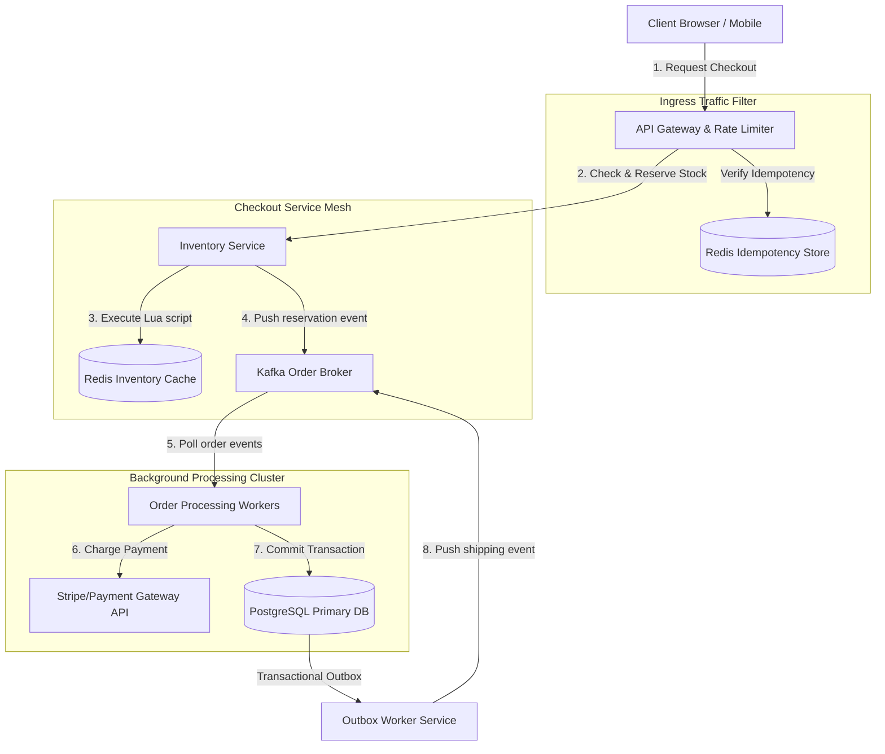

# HLD: Design E-Commerce at Scale (Flash Sale)

## 1. System Scale & Core Theory

An e-commerce platform during a flash sale experiences sudden spikes in write traffic. The system must process checkouts quickly while guaranteeing that inventory is never oversold.

### Mathematical Sizing & Scale Estimations

Consider a flash sale event for a popular electronics item:
*   **Total Items Available:** $1,000$ units.
*   **Active Users waiting:** $10\text{ Million}$ users.
*   **Peak Traffic Rate:** $100,000\text{ Requests/Second (RPS)}$ at the start of the sale.

#### 1. API Filtering & Rate Limiting Sizing
*   **Ingress Traffic:** $100,000\text{ RPS}$ hits the API Gateway.
*   **Rate Limiter Filter:** Apply rate limiting using a token bucket algorithm to filter out duplicate clicks and bot traffic. Let's assume the rate limiter rejects $90\%$ of duplicate or invalid traffic:
    $$\text{Validated Requests Passed} = 100,000 \times 0.10 = 10,000\text{ RPS}$$
*   **Database Lock Limit:** If these $10,000\text{ RPS}$ are routed directly to a SQL database to update rows:
    `UPDATE inventory SET stock = stock - 1 WHERE product_id = 42 AND stock > 0;`
    The database will attempt to acquire row-level locks. With connection pools typically capped at 100-500 connections, this creates lock contention, leading to database timeouts and system failure.

#### 2. Redis Reservation Sizing
To prevent database bottlenecks, use Redis to manage inventory reservations in memory.
*   **Throughput Capacity:** A single Redis master instance can process $\approx 100,000\text{ write operations/sec}$ using pipelined execution and Lua scripts.
*   **Memory Footprint:** Storing the inventory counter:
    `Key: inventory:prod_42` -> Value: `1000` (integer).
    Memory usage: $< 1\text{ KB}$.
*   **Processing Latency:** Lua execution of a decrement-and-check operation takes $< 2\text{ ms}$. This allows the system to filter out excess requests in memory, routing only successful reservation events to downstream databases.

### Database Transaction Strategy Matrix

| Feature | ACID SQL (Pessimistic Locking) | Optimistic Concurrency Control (OCC) | In-Memory Pre-Allocation (Redis Lua) | Saga Pattern (Distributed) |
| :--- | :--- | :--- | :--- | :--- |
| **Concurrency Level** | Low (blocks concurrent threads on locked rows) | Moderate (detects version changes; rejects collisions) | Very High (non-blocking in-memory execution) | High (asynchronous service execution) |
| **Consistency** | Strong Consistency | Strong Consistency | Eventual Consistency (cached state syncs to DB) | Eventual Consistency (resolved via compensating transactions) |
| **Latency** | High (waiting for disk I/O and locks) | Low under low contention; High under high retry rates | Very Low (sub-2ms memory execution) | High (depends on multi-service network round-trips) |
| **Best Use Case** | Low-concurrency bank transactions | Content management, low-contention checkouts | Flash sales, seat reservations, ticket sales | Microservice order pipelines (Order -> Payment -> Shipping) |

---

## 2. Visual Architecture Diagram

This diagram shows the asynchronous checkout pipeline, tracing requests from edge rate limiters to in-memory inventory reservation and background database commits.



---

## 3. Data Models & API Signatures

### PostgreSQL Transactional Schema (Orders & Outbox Ledger)

```sql
-- PostgreSQL Schema
CREATE TABLE products (
    product_id UUID PRIMARY KEY,
    name VARCHAR(255) NOT NULL,
    price NUMERIC(10, 2) NOT NULL,
    created_at TIMESTAMP WITH TIME ZONE DEFAULT CURRENT_TIMESTAMP
);

CREATE TABLE inventory (
    product_id UUID PRIMARY KEY REFERENCES products(product_id) ON DELETE CASCADE,
    stock_count INT NOT NULL CHECK (stock_count >= 0),
    reserved_count INT NOT NULL DEFAULT 0 CHECK (reserved_count >= 0)
);

CREATE TABLE orders (
    order_id UUID PRIMARY KEY,
    user_id UUID NOT NULL,
    status VARCHAR(50) NOT NULL, -- PENDING, COMPLETED, FAILED, REFUNDED
    total_amount NUMERIC(10, 2) NOT NULL,
    created_at TIMESTAMP WITH TIME ZONE DEFAULT CURRENT_TIMESTAMP
);

CREATE TABLE order_items (
    order_item_id UUID PRIMARY KEY,
    order_id UUID NOT NULL REFERENCES orders(order_id) ON DELETE CASCADE,
    product_id UUID NOT NULL REFERENCES products(product_id),
    quantity INT NOT NULL CHECK (quantity > 0),
    price NUMERIC(10, 2) NOT NULL
);

-- Transactional Outbox Pattern Table
CREATE TABLE outbox_events (
    event_id UUID PRIMARY KEY,
    aggregate_type VARCHAR(100) NOT NULL, -- "ORDER"
    aggregate_id UUID NOT NULL,
    event_type VARCHAR(100) NOT NULL,      -- "ORDER_CREATED"
    payload TEXT NOT NULL,                  -- JSON data
    created_at TIMESTAMP WITH TIME ZONE DEFAULT CURRENT_TIMESTAMP,
    processed BOOLEAN DEFAULT FALSE
);

-- Optimization Indexes
CREATE INDEX idx_outbox_unprocessed ON outbox_events(created_at) WHERE processed = FALSE;
```

### Redis Inventory Reservation Lua Script
To guarantee atomicity, execution must occur in a single script thread to prevent race conditions between checking and updating inventory.

```lua
-- KEYS[1]: inventory:prod_<id>
-- ARGV[1]: request_quantity (usually 1)

local stock = tonumber(redis.call('get', KEYS[1]))
if not stock then
    return -1 -- Product does not exist
end

local quantity = tonumber(ARGV[1])
if stock >= quantity then
    redis.call('decrby', KEYS[1], quantity)
    return 1 -- Success: Token allocated
else
    return 0 -- Fail: Out of stock
end
```

### API Signatures

#### 1. Initiate Checkout
*   **Protocol:** HTTPS POST
*   **Path:** `/api/v1/checkout`
*   **Headers:**
    *   `Authorization: Bearer <JWT_TOKEN>`
    *   `Idempotency-Key: idm_bfd60920-5c6d-4ee8-a92c`
*   **Request Payload:**
```json
{
  "user_id": "usr_893fd2bc-9d3f-422d-a2f1",
  "product_id": "prod_77821389-9b7e-4029-a1b4",
  "quantity": 1
}
```
*   **Response Payload (202 Accepted):**
```json
{
  "order_id": "ord_cfd60920-5c6d-4ee8-a92c",
  "status": "PROCESSING",
  "message": "Inventory reserved. Order is processing."
}
```

---

## 4. Operational Flows

### Flash Sale Checkout Flow (Success Path)
1.  **Ingress Filter:** The client submits a checkout request. The API Gateway verifies the `Idempotency-Key` in Redis:
    *   *If present:* Return the existing processing status.
    *   *If missing:* Store the key in Redis and route the request to the Checkout Service.
2.  **Reserve Inventory:** The Checkout Service executes the inventory reservation Lua script in the Redis cluster.
    *   *If stock is unavailable (returns 0):* Immediately return a "Sold Out" response (latency $< 5\text{ ms}$).
    *   *If stock is available (returns 1):* Proceed.
3.  **Queue Request:** The service publishes an event containing the reservation details to the `order-creation` Kafka topic. It returns an HTTP 202 status to the client, indicating the order is processing.
4.  **Charge Payment:** An Order Processing worker consumes the event from Kafka and calls the Payment Gateway API to process the transaction.
5.  **Commit Order:**
    *   Once payment is confirmed, the worker executes a SQL transaction to write the order records to the database and decrement the physical inventory count.
    *   The transaction also writes an event record to the `outbox_events` table.
6.  **Acknowledge Client:** The worker updates the order status to `COMPLETED` in the database, allowing the client to see the successful transaction.

### Compensating Flow (Payment Failure / Release Path)
If the payment gateway declines the user's card:
1.  **Mark Failed:** The Order Processing worker updates the order status to `FAILED` in the database.
2.  **Release Stock:** The worker sends a release request to the Inventory Service.
3.  **Update Redis:** The Inventory Service increments the inventory counter in Redis to make the item available again:
    `INCRBY inventory:prod_77821389 1`
4.  **Notify Client:** The worker triggers an alert to notify the user of the payment failure.

---

## 5. High Availability, Failovers & Bottlenecks

### Mitigating Inventory Discrepancies
If a Redis node crashes, reservation counts stored in memory may diverge from the physical inventory count stored in the PostgreSQL database.
*   *Mitigation:*
    *   Maintain the authoritative inventory state in the SQL database.
    *   When a Redis node recovers, rehydrate the reservation cache using the SQL database metrics:
        $$\text{Redis Stock} = \text{SQL Physical Stock} - \text{SQL Active Reservations}$$
    *   This reconciles differences and prevents overselling due to cache data loss.

### Scaling Distributed Transactions: The Saga Pattern

Checkouts in microservice architectures often involve multiple independent services (Inventory, Payment, Shipping). Running standard two-phase commit (2PC) transactions across these services can block operations and increase latency.

```
Orchestrated Saga Flow:
[ Checkout Service ] ── 1. Create Order (Pending) ──> [ Order DB ]
         │
         ├── 2. Reserve Stock ──────────────────────> [ Inventory Service ]
         │                                                (Fail: Trigger Compensation)
         │                                                │
         │<── (Rollback Order State) ─────────────────────┘
         │
         └── 3. Process Charge ─────────────────────> [ Payment Service ]
```

*   **Saga Pattern Solution:**
    *   Implement transactions as a sequence of local service operations. Each step updates a database locally and emits an event to trigger the next step.
    *   If a step fails (such as a payment failure), the system runs **Compensating Transactions** in reverse order (e.g., releasing reserved inventory, canceling the pending order) to restore consistency.

---

## 6. Comprehensive Interview Q&A

### Q1: Why are Redis Lua scripts atomic? How do they prevent race conditions during high-volume checkouts?
**Answer:**
Redis uses a single-threaded execution model for processing commands.

*   **Atomic Execution:** When a Lua script is executed, Redis blocks all other incoming commands and runs the script from start to finish on the single execution thread.
*   **Race Condition Prevention:** In a checkout flow, checking stock and decrementing inventory must occur as an indivisible operation.
    *   *Without Lua:* An application might perform a read: `GET stock` (returns 1), and then send a write: `DECR stock` (sets it to 0). If a concurrent thread reads the stock value between these two commands, it also sees 1. This can cause the system to allocate two tokens for one available item.
    *   *With Lua:* The read and write checks are executed as a single transaction block on the Redis thread. This guarantees that stock is verified and decremented before any other operations can run.

---

### Q2: Explain the Outbox Pattern. What problem does it resolve in event-driven systems?
**Answer:**
In event-driven microservices, systems must update their local database and publish events to a message queue like Kafka.

*   **The Conflict:** Updating a database and publishing to Kafka are separate systems. A failure can cause inconsistencies:
    *   If the database write succeeds but the Kafka publish fails, downstream services (like Shipping) will not receive the event.
    *   If the Kafka publish succeeds but the database write fails, downstream services process an invalid order.
*   **Outbox Pattern Solution:**
    1.  Create an `outbox_events` table in the local database.
    2.  Write both the order records and the event metadata to the database inside the same SQL transaction. This guarantees that either both writes succeed or both fail.
    3.  A separate background worker (the Outbox Service) polls the `outbox_events` table for unprocessed events, publishes them to Kafka, and marks them as processed upon delivery confirmation. This ensures reliable event delivery without requiring distributed transaction locks.

---

### Q3: How do you design an e-commerce shopping cart? Compare database-backed carts, client-side cookie carts, and Redis-backed session carts.
**Answer:**
Selecting a shopping cart storage model involves balancing persistence with access speed:

1.  **Client-Side Cookie Carts:**
    *   *Behavior:* Store cart contents as JSON data in the client's browser (using cookies or LocalStorage).
    *   *Pros:* Zero server database overhead.
    *   *Cons:* Data can be lost if users clear their browser cache. It is difficult to share cart states across different devices (e.g., mobile to desktop).
2.  **Database-Backed Carts (SQL/NoSQL):**
    *   *Behavior:* Write every cart modification to the primary database.
    *   *Pros:* Cart data is durable and consistent across all devices.
    *   *Cons:* High write volume from users adding or removing items can degrade database performance.
3.  **Redis-Backed Session Carts (Recommended):**
    *   *Behavior:* Store cart data in a Redis cluster using the user ID as the key: `cart:usr_<user_id>`.
    *   *Pros:* Low latency ($< 2\text{ ms}$) updates and high write throughput capacity.
    *   *Cons:* Redis memory is expensive.
    *   *Optimized Solution:* Store active carts in Redis with a 30-day TTL. When a user checks out, move the cart data to the SQL database. If a cart expires without checkout, discard it to free memory.

---

### Q4: Compare Orchestrated and Choreographed Saga patterns for distributed transactions.
**Answer:**
The two Saga patterns manage coordination differently:

1.  **Choreography-Based Saga:**
    *   *Mechanism:* Services exchange events without a central coordinator. Each service listens to events, performs its local action, and emits a new event.
    *   *Pros:* Decoupled architecture with no single point of failure.
    *   *Cons:* Hard to understand and debug as the number of services grows, as there is no single orchestrator tracking the transaction state.
2.  **Orchestration-Based Saga (Recommended for complex checkouts):**
    *   *Mechanism:* A central orchestrator service (e.g., the Checkout Orchestrator) coordinates all transactions. It sends commands to participant services, tracks execution states, and calls compensating actions if a step fails.
    *   *Pros:* Centralized control makes state transitions easier to track and debug.
    *   *Cons:* The orchestrator can become a single point of failure and adds execution complexity.
