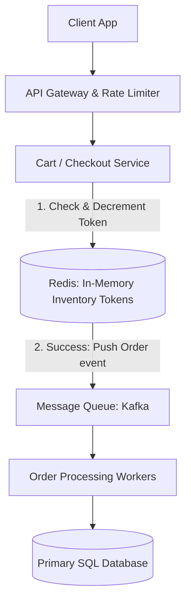

# HLD: Design E-Commerce at Scale (Flash Sale)

This design handles extremely high write concurrency, flash sale inventory lockings, checkout scaling, and asynchronous order pipelines.

---

## 1. Scale & Requirements
* **Goal:** Process 100,000 requests/second for a flash sale of an item with only 100 physical stocks.
* **Core Rule:** Never oversell inventory. Keep checkout transaction times under 1 second.

---

## 2. Flash Sale Architecture

---

## 3. Flash Sale Mechanics
* **Avoid direct SQL writes:** Directly updating database rows with locking (e.g. `UPDATE inventory SET stock = stock - 1 WHERE id = 1`) will cause connection pools to lock, causing database crashes.
* **Redis Tokens (In-Memory Reservation):** 
  - Load the inventory (e.g. 100 stock) into Redis as a key.
  - When checkout is pressed, execute an atomic Redis transaction (or Lua script): `DECR inventory_key`.
  - If the returned value is $\ge 0$, the client wins a "reservation token" and their order is pushed to Kafka.
  - If the returned value is $< 0$, reject the request immediately (out of stock) in under 2ms.
  - Workers consume Kafka events to write orders and charge payments asynchronously.

---

## Interview Q&A Corner

> [!WARNING]
> **Q: How do you handle idempotency during checkout (e.g., user clicks the "Buy" button twice)?**
> A: Use **Idempotency Keys**. When a user loads the checkout screen, the server generates a unique UUID (Idempotency Key) and attaches it to the frontend form. When the user submits, the server checks if this UUID exists in a Redis cache:
> * If new: save UUID in Redis (with TTL) and proceed.
> * If exists: reject or return the existing processing state, preventing double billing.
