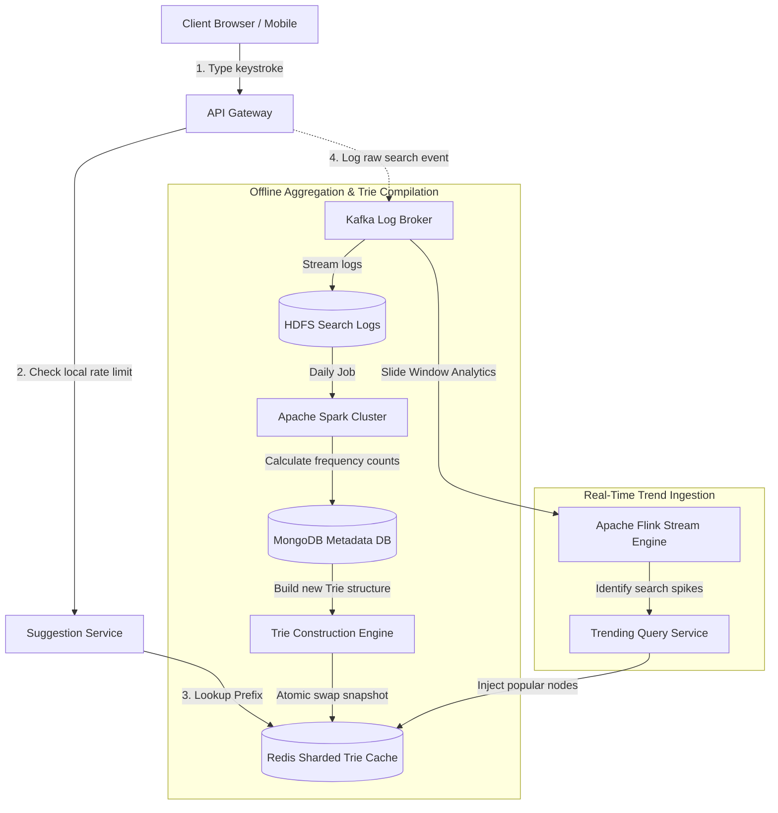

# HLD: Design Search Autocomplete (Google Suggest)

## 1. System Scale & Core Theory

A search autocomplete system generates search recommendations in real-time as users type. The system must deliver suggestions with sub-10ms latency per keystroke to avoid UI lag.

### Mathematical Sizing & Scale Estimations

Consider a global search engine processing queries:
*   **Daily Search Volume:** $5\text{ Billion searches/day}$.
*   **Average Search Term Length:** $20\text{ characters}$.
*   **Keystroke Ingestion:** A user receives suggestions for every keystroke. Assuming an average of $10\text{ keystrokes per search}$ (due to auto-selection or short queries):

#### 1. Keystroke QPS Calculations
*   **Total Daily Keystroke Requests:** $5\text{ Billion} \times 10 = 50\text{ Billion requests/day}$.
*   **Average Keystroke QPS:**
    $$\text{Average QPS} = \frac{50,000,000,000\text{ requests}}{86,400\text{ seconds}} \approx 578,700\text{ requests/sec}$$
*   **Peak Keystroke QPS (2x average):** $1.15\text{ Million QPS}$.
    This load requires edge caching and client-side optimizations to avoid saturating backend databases.

#### 2. Trie Cache Storage Sizing
*   **Unique Queries Catalog:** $100\text{ Million}$ unique search queries.
*   **Trie Memory Footprint:**
    *   To support fast lookups, each node in the prefix tree (Trie) stores the character, child pointers, and the **top 10 most popular completed queries** branching from it.
    *   Each query suggestion record: `query_string` ($30\text{ bytes}$) + `frequency_weight` ($8\text{ bytes}$) $\approx 38\text{ bytes}$.
    *   Top 10 list per node: $380\text{ bytes}$.
    *   Including node pointers and character structures: $\approx 500\text{ bytes}$ per active prefix node.
    *   Assuming $100\text{ Million}$ nodes in the pruned Trie (filtering out rare, single-character typos):
        $$\text{Total Memory Required} = 100\text{ Million nodes} \times 500\text{ bytes} \approx 50\text{ GB RAM}$$
        This database easily fits into the memory of a single host, but is replicated across a cache cluster for high availability and load balancing.

### Prefix Matching Technology Matrix

| Metric | Relational DB (SQL LIKE Queries) | Document Store (Prefix Indexes) | Elasticsearch (Edge-NGram Search) | In-Memory Trie Cache (Redis) |
| :--- | :--- | :--- | :--- | :--- |
| **Lookup Time** | $O(N)$ (requires full table scans) | $O(\log N)$ (uses index tree scans) | $O(1)$ (using pre-indexed inverted lookup) | $O(L)$ (where $L$ is prefix length; sub-millisecond execution) |
| **Memory Footprint** | Low (disk-backed tables) | Moderate (indexes kept in memory) | High (requires Lucene segment caches) | High (Trie nodes reside entirely in RAM) |
| **Write Performance** | Fast (simple row updates) | Fast | Slow (requires segments refreshes) | Slow (updates require rebuilding subtrees) |
| **Best Use Case** | Relational data lookups | User profiles, catalog filtering | Text search engine, fuzzy matching | Real-time autocomplete suggestions |

---

## 2. Visual Architecture Diagram

This diagram shows the autocomplete architecture, separating the real-time read path (keystrokes query) from the offline log aggregation and Trie compilation path.



---

## 3. Data Models & API Signatures

### Trie Node Document Structure (MongoDB Schema)
To serialize and persist the Trie structure, store prefix nodes as documents containing their top suggestions.

```json
{
  "_id": "node_c_ca_cat",
  "prefix": "cat",
  "children": ["cats", "cath", "catp"],
  "suggestions": [
    { "query": "cats and soup", "weight": 450100 },
    { "query": "cat food delivery", "weight": 389200 },
    { "query": "cats cast", "weight": 120400 },
    { "query": "caterpillar boots", "weight": 95000 }
  ],
  "updated_at": "2026-06-03T02:00:00Z"
}
```

### Relational Schema (Aggregated Query Frequencies)
This table stores aggregated query counts used by the offline MapReduce/Spark workers to build the Trie.

```sql
-- PostgreSQL Schema
CREATE TABLE query_frequencies (
    query_id SERIAL PRIMARY KEY,
    query_text VARCHAR(255) UNIQUE NOT NULL,
    search_count BIGINT DEFAULT 1,
    last_updated_at TIMESTAMP WITH TIME ZONE DEFAULT CURRENT_TIMESTAMP
);

-- Optimization Index
CREATE INDEX idx_frequencies_search_count ON query_frequencies(search_count DESC);
```

### API Signatures

#### 1. Retrieve Autocomplete Suggestions
*   **Protocol:** HTTPS GET
*   **Path:** `/api/v1/search/suggest`
*   **Query Parameters:** `q=cat&limit=5`
*   **Headers:** `Cache-Control: public, max-age=3600` (browser caching)
*   **Response Payload (200 OK):**
```json
{
  "prefix": "cat",
  "suggestions": [
    "cats and soup",
    "cat food delivery",
    "cats cast",
    "caterpillar boots",
    "catamaran rental"
  ]
}
```

---

## 4. Operational Flows

### Keystroke Retrieval Flow (Read Path)
1.  **Client Typing:** The user types a character (e.g., 'c').
2.  **Debounce Delay:** The client app waits for a short delay (e.g., $150\text{ ms}$). If the user types another character (e.g., 'a') within this window, the previous request is cancelled.
3.  **Route Request:** When typing pauses, the client sends a GET request to `/suggest?q=ca`.
4.  **Trie Lookup:** The Suggestion Service queries the Redis Trie Cache. It hashes the prefix `ca` to find the corresponding partition node.
5.  **Return Suggestions:** The Redis node retrieves the pre-computed suggestion list in $O(1)$ time and returns the payload to the client.

### Offline Trie Rehydration Flow (Write Path)
1.  **Log Queries:** The API Gateway logs search queries to a Kafka topic.
2.  **Aggregate Logs:** A background worker consumes the stream and writes the raw queries to HDFS.
3.  **Process Frequencies:** A nightly Spark job processes the HDFS logs, aggregates identical queries, and calculates their search counts.
4.  **Construct Trie:** The Trie Builder reads the frequency data, constructs the prefix tree, and writes the top 10 suggestions to each node.
5.  **Swap Cache:** The builder serialized the new Trie and updates the Redis cluster using an atomic reference swap to avoid query downtime.

---

## 5. High Availability, Failovers & Bottlenecks

### Trie Sharding & Partitioning
A 50 GB Trie fits on a single server, but handling 1.15 Million QPS requires sharding the data across multiple nodes.
*   **First-Character Sharding:** Shard the Trie based on the prefix's starting characters (e.g., partition 1 stores prefixes starting with `a-e`, partition 2 stores `f-j`, etc.).
    *   *Limitation:* This leads to unbalanced shards because some letters (like 's' or 'c') begin significantly more search terms than others (like 'x' or 'z').
*   **Consistent Hashing (Recommended):** Apply a hash function to the prefix (e.g., `Hash(prefix) % NodeCount`) to distribute nodes evenly across the Redis cache cluster.
    *   *Routing:* The application gateway computes the hash of the user's input prefix to route the request to the correct Redis node.

### Real-Time Trend Ingestion
The daily offline batch job cannot capture breaking news queries (e.g., "earthquake today") in real-time.
*   **Mitigation (Dynamic Update Path):**
    *   Route search events to a stream processing engine like Apache Flink.
    *   Flink monitors search queries using a short sliding window (e.g., 5-minute intervals) to identify sudden spikes in activity.
    *   If a search term's frequency increases rapidly, the Trending Query Service injects the term directly into the active Redis Trie nodes. It updates the nodes' top suggestion lists dynamically, bypassing the nightly batch job.

---

## 6. Comprehensive Interview Q&A

### Q1: Detail the Trie (Prefix Tree) data structure. Why is storing the pre-computed top 10 suggestions at each node superior to traversing the tree at runtime?
**Answer:**
A Trie is a tree-like data structure where each node represents a character of a string.

```
Subtree Traversal (Slow):
            [c]
           /   \
         [ca]   [co]
        /    \     \
     [cat]  [car]  [cow]
* Searching "ca" requires traversing the subtree: [cat], [car], etc., 
  and sorting results by popularity weight. This is O(V) where V is the node count.

Pre-computed suggestions (Fast):
            [c]  -> Suggestions: ["car", "cat", "cow"]
           /   \
         [ca]    -> Suggestions: ["car", "cat"]
```

*   **Subtree Traversal Cost:** Without pre-computed suggestions, a query for the prefix "ca" requires the system to:
    1.  Locate the prefix node "ca".
    2.  Traverse all child nodes in the subtree (which can contain thousands of terms like "cat", "car", "cats").
    3.  Collect all completed queries and sort them by popularity weight to return the top results.
    *   *Complexity:* $O(V)$ where $V$ is the number of nodes in the subtree. This is too slow for real-time keystroke searches.
*   **Pre-computed Nodes Cost:** Storing the top 10 suggestions directly inside each prefix node avoids subtree traversal.
    *   *Complexity:* $O(1)$ to retrieve suggestions once the prefix node is located.
    *   *Trade-off:* This increases memory usage because suggestions are duplicated across parent nodes. However, this memory overhead is acceptable to achieve sub-10ms query latencies.

---

### Q2: What client-side optimizations are required to minimize network queries during fast typing?
**Answer:**
To reduce server load and network traffic, the client browser implements two key optimizations:

1.  **Debouncing:**
    *   Do not send an API request for every keystroke. Instead, wait for a short delay (e.g., $150\text{ ms}$) after a user stops typing before sending the query.
    *   If the user presses another key within this window, cancel the timer and start a new one. This prevents sending requests for rapidly typed characters.
2.  **Client-Side Caching:**
    *   Store query suggestions in the browser's memory cache (using a local JavaScript Map or LocalStorage).
    *   If a user types "c-a-t", deletes "t", and then types "t" again, the browser retrieves the suggestions for "cat" from its local cache instead of making a duplicate network request.
3.  **HTTP Cache-Control Headers:**
    *   Set headers like `Cache-Control: public, max-age=3600` on autocomplete API responses. This allows edge CDN caches to serve suggestions, reducing requests to origin servers.

---

### Q3: How do you handle inappropriate, offensive, or copyrighted search queries in the autocomplete suggestions?
**Answer:**
To filter out unwanted suggestions, implement a **Filter Layer** at different stages of the data pipeline:

1.  **Offline Filtering (Pre-Compilation):**
    *   Maintain a blacklist of restricted terms, patterns, and regex statements.
    *   During the offline Spark aggregation job, run queries against the blacklist. If a search term matches, discard it to prevent it from being included in the Trie.
2.  **Online Filtering (API Gateway):**
    *   If a new term needs to be blocked immediately (e.g., due to legal requirements), adding it to the blacklist and waiting for the nightly batch job is too slow.
    *   Deploy a lightweight filter service at the API Gateway. This service checks autocomplete outputs against an active blacklist stored in memory (e.g., using a Bloom Filter or Radix Tree) and removes matching suggestions before they are returned to the user.

---

### Q4: If a Redis cache node fails, how does the Suggestion Service recover? How do you prevent cache stampedes?
**Answer:**
*   **Active Replication:** Deploy the Redis Trie cache in a master-replica configuration across multiple availability zones. If a master node fails, Redis Sentinel promotes a replica to master, which assumes the traffic.
*   **Fallback to Persistent Store:** If an entire partition cluster goes offline, the Suggestion Service falls back to querying the persistent Trie database (e.g., MongoDB).
*   **Cache Stampede Mitigation (Distributed Locks):**
    *   Queries to the fallback database are slower than Redis lookups. A sudden spike in requests can overload the database.
    *   *Mitigation:* Use **Single-flight execution** patterns (like the `singleflight` package in Go) on the application servers. If 1,000 requests for the prefix "ca" arrive simultaneously during a cache miss, the server executes only one database query. It shares the resulting suggestions with the other 999 waiting requests, protecting the database from query spikes.
