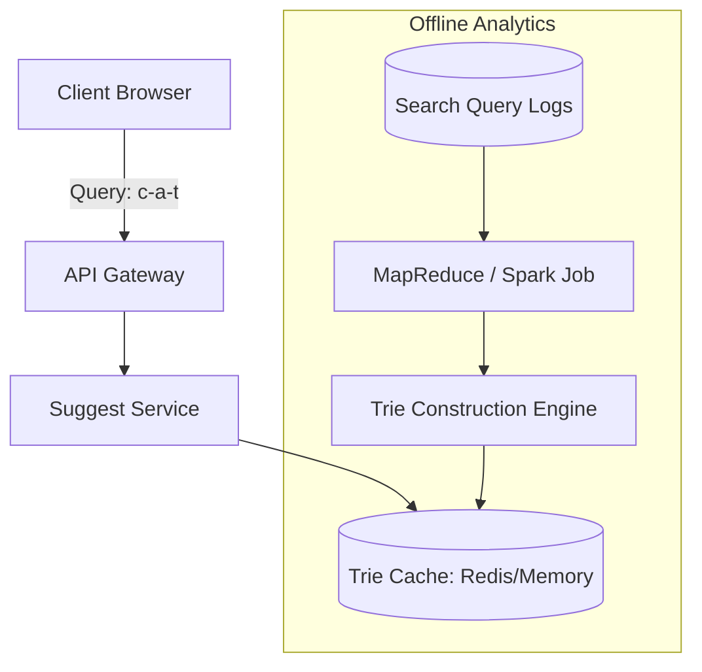

# HLD: Design Search Autocomplete (Google Suggest)

This design addresses fast prefix matching, real-time typing query recommendations, and offline data compilation.

---

## 1. Scale & Requirements
* **Volume:** 5 Billion searches/day, $\approx 10,000$ QPS.
* **Response Latency:** $<10\text{ ms}$ per keystroke to avoid UI lag.

---

## 2. Core Storage: The Trie Data Structure
A Trie (prefix tree) stores strings where nodes represent characters. To support autocompletion, each node holds a list of the **top 10 most popular queries** branching from it.

```
       [root]
       /    \
     [c]    [b]
     /        \
   [ca]      [be]
   /  \        \
[cat] [car]   [best]
```

### Dynamic Top-10 Storage
Without storing top suggestions in each node, we would have to traverse the entire subtree to find matches, which is $O(\text{Subtree Nodes}) \approx$ too slow. Storing pre-computed suggestions at each node reduces query retrieval speed to $O(1)$.

---

## 3. Data Flow Architecture



---

## Interview Q&A Corner

> [!IMPORTANT]
> **Q: How does the system update query frequencies without slowing down live search queries?**
> A: Real-time queries do not update the live Trie directly. Updates are performed **offline**:
> 1. Raw search queries are written to log files (Append-Only logs).
> 2. Daily/hourly MapReduce or Spark jobs aggregate search logs, counting query frequencies.
> 3. A background service builds a new Trie snapshot from this aggregated data and pushes it to the live cache servers, which swap references atomically.
