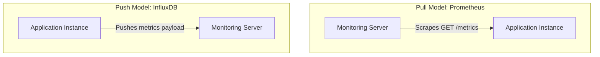

# HLD: Design a Metrics Monitoring & Alerting System

This design covers collecting metrics from distributed servers, storing high-volume data points, downsampling data, and evaluating alerting rules.

---

## 1. Scale & Requirements
* **Scale:** Monitor 10,000 servers. Millions of metrics (CPU, RAM, QPS) recorded every 10 seconds.
* **Format:** Time-Series data point: `[metric_name, timestamp, value, labels/tags]`.
  - Example: `[server.cpu_usage, 1685784000, 78.5, env=prod, region=us-east]`

---

## 2. Collection Models: Pull vs Push

### Pull Model (e.g. Prometheus)
* **Mechanism:** The monitoring server pulls (scrapes) metrics from target server endpoints (`/metrics`) periodically.
* **Pros:** Target servers are simple and lightweight. Easy to detect if a target server goes down (endpoint unreachable).
* **Cons:** Hard to scale behind load balancers / private subnets (needs service discovery).

### Push Model (e.g. InfluxDB, Datadog)
* **Mechanism:** An agent daemon installed on application servers actively pushes metric payloads to the central monitoring collector.
* **Pros:** Handles dynamic IP scales naturally; works well behind firewall layers.
* **Cons:** High risk of target servers DDOSing the monitoring collector if many push simultaneously.

---

## 3. Time-Series Database (TSDB) & Downsampling
* Standard relational databases are too slow for high-write time-series data. Use a **TSDB** (e.g. InfluxDB, TimescaleDB, OpenTSDB) optimized for sequential inserts and aggregations.
* **Downsampling:** Raw metrics are stored for 7 days. To save disk space, a background worker aggregates historical data:
  - 10-second granularity data is averaged into 1-minute blocks after 7 days.
  - 1-minute granularity data is averaged into 1-hour blocks after 30 days.

---

## Interview Q&A Corner

> [!TIP]
> **Q: How does the Alerting Engine evaluate rules without checking the entire database continually?**
> A: The Alerting Engine schedules queries against the TSDB cache using rules (e.g., alert if `avg(cpu_usage) > 90` for `5m`). To avoid database bottlenecks, the engine executes queries against cached, pre-computed downsampled metric indices. If a rule evaluates to true, the engine pushes a message to notification queues (PagerDuty, Slack, Email).
