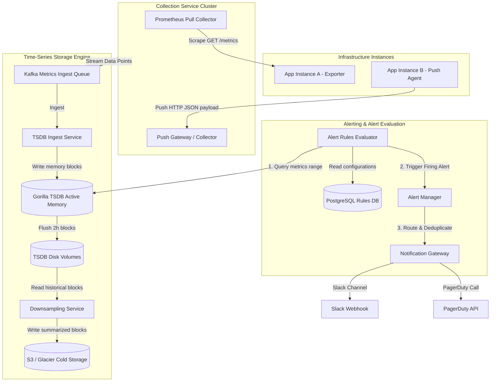

# HLD: Design a Metrics Monitoring & Alerting System

## 1. System Scale & Core Theory

A metrics monitoring and alerting system collects, stores, and analyzes time-series data (like CPU usage, memory, request rates) from thousands of servers to enable real-time dashboard visualization and incident alerting.

### Mathematical Sizing & Storage Compression Estimations

Consider a monitoring system for a high-scale infrastructure:
*   **Monitored Servers:** $10,000$ virtual machine instances.
*   **Metrics per Server:** $1,000$ unique metrics tracked (OS metrics, container metrics, app-level metrics).
*   **Collection Interval (Resolution):** Once every $10\text{ seconds}$.

#### 1. Ingestion Rate Calculations
*   **Data Points Generated per Interval:**
    $$\text{Data Points/Interval} = 10,000\text{ servers} \times 1,000\text{ metrics} = 10,000,000\text{ metrics/10s}$$
*   **Average Ingestion QPS:**
    $$\text{Average Ingestion Rate} = \frac{10,000,000\text{ data points}}{10\text{ seconds}} = 1,000,000\text{ data points/second}$$
*   **Peak Ingestion Rate (2x Average):** $2,000,000\text{ data points/second}$.

#### 2. Storage Sizing & Gorilla Compression Math
A standard uncompressed time-series data point contains: `metric_id` ($8\text{ bytes}$) + `timestamp` ($8\text{ bytes}$) + `value` (double-precision float, $8\text{ bytes}$) = $24\text{ bytes}$.
*   **Uncompressed Daily Storage:**
    $$\text{Daily Storage} = 1,000,000\text{ points/s} \times 86,400\text{ s/day} \times 24\text{ bytes} \approx 2.07\text{ TB/day}$$
*   **Gorilla Compression (Delta-of-Delta & XOR):**
    Time-Series Databases (TSDBs) use algorithms like **Facebook's Gorilla compression** to compress data. Gorilla compresses timestamps using delta-of-delta encoding and double-precision values using XOR operations, reducing the average size of a data point from $24\text{ bytes}$ to **$1.37\text{ bytes}$**.
*   **Compressed Daily Storage:**
    $$\text{Daily Storage} = 1,000,000\text{ points/s} \times 86,400\text{ s/day} \times 1.37\text{ bytes} \approx 118.3\text{ GB/day}$$
    This reduces the daily storage footprint by $94\%$.

#### 3. Downsampling Math (Cost Optimization)
Retaining raw 10-second resolution metrics for years is expensive and unnecessary for long-term trend analysis.
*   **Policy:**
    *   *Raw Data (10s resolution):* Retain for 7 days.
    *   *Rollup 1 (1m resolution - averaged):* Retain from day 8 to 30. (Reduces data volume by $6\times$).
    *   *Rollup 2 (1h resolution - averaged):* Retain from day 31 to 365. (Reduces data volume by $360\times$).
*   **Annual Storage Size with Downsampling:**
    *   7 days of Raw Data: $7 \times 118.3\text{ GB} \approx 828\text{ GB}$.
    *   23 days of Rollup 1: $23 \times \frac{118.3\text{ GB}}{6} \approx 453\text{ GB}$.
    *   335 days of Rollup 2: $335 \times \frac{118.3\text{ GB}}{360} \approx 110\text{ GB}$.
    *   **Total Year Storage:** $828\text{ GB} + 453\text{ GB} + 110\text{ GB} \approx 1.39\text{ TB/year}$ (compared to $\approx 43\text{ TB/year}$ without downsampling).

### TSDB Technology Matrix

| Metric / Feature | Relational Database (TimescaleDB) | Wide-Column Store (Cassandra) | Dedicated TSDB (Prometheus / InfluxDB) |
| :--- | :--- | :--- | :--- |
| **Storage Engine** | B-Tree / LSM-Tree hybrids | LSM-Tree (Log-Structured Merge) | Log-Structured columnar engine (Gorilla blocks) |
| **Write Throughput** | Moderate (optimized via table partitioning) | Very High (append-only sequential disk writes) | Extremely High (compressed in-memory blocks, flushed sequentially) |
| **Data Compression** | Moderate | Poor | Highly Optimized (up to 15x compression ratio) |
| **Query Semantics** | SQL with time-series extensions | CQL (limited slice and range selections) | Custom queries (PromQL, Flux) |
| **Best Use Case** | Small-to-medium metric systems, SQL integrations | High-volume raw metric logs, analytics platforms | Real-time system monitoring, Kubernetes clusters |

---

## 2. Visual Architecture Diagram

This diagram displays the metrics path, from pull-based and push-based collectors to the TSDB ingestion queue, downsampling routines, and the real-time alerting engine.



---

## 3. Data Models & API Signatures

### TSDB Data Schema (Conceptual Layout)
Time-series data points are structured as a metric name, a map of key-value tags/labels (which define the dimensions), a timestamp, and the value.

```
Metric Identifier (Series Key): 
"server.cpu_usage{env=prod, region=us-east, instance_id=vm-9982}"

Data Points List:
Timestamp: 1780400000 -> Value: 82.4
Timestamp: 1780400010 -> Value: 85.1
Timestamp: 1780400020 -> Value: 79.8
```

### SQL Database Alert Rule Configuration Schema
This table stores user-defined alert rules evaluated by the alert scheduler.

```sql
-- PostgreSQL Schema
CREATE TABLE alert_rules (
    rule_id UUID PRIMARY KEY,
    name VARCHAR(255) NOT NULL,
    metric_expression VARCHAR(512) NOT NULL, -- PromQL e.g., "avg(rate(http_requests_total[5m])) > 100"
    duration_seconds INT NOT NULL,            -- Time criteria (e.g., 300 for 5 minutes)
    severity VARCHAR(50) NOT NULL,            -- WARNING, CRITICAL, DISASTER
    notification_channels TEXT[] NOT NULL,     -- ["slack", "pagerduty"]
    is_enabled BOOLEAN DEFAULT TRUE,
    created_at TIMESTAMP WITH TIME ZONE DEFAULT CURRENT_TIMESTAMP
);

CREATE TABLE active_alerts (
    alert_id UUID PRIMARY KEY,
    rule_id UUID NOT NULL REFERENCES alert_rules(rule_id) ON DELETE CASCADE,
    instance_id VARCHAR(255) NOT NULL,
    current_state VARCHAR(50) NOT NULL, -- PENDING, FIRING, RESOLVED
    triggered_at TIMESTAMP WITH TIME ZONE DEFAULT CURRENT_TIMESTAMP,
    resolved_at TIMESTAMP WITH TIME ZONE
);
```

### API Signatures

#### 1. Ingest Metrics (Push Endpoint)
*   **Protocol:** HTTPS POST
*   **Path:** `/api/v1/metrics/push`
*   **Request Payload (Protobuf or JSON):**
```json
{
  "timestamp": 1780400000,
  "metrics": [
    {
      "name": "server.cpu_usage",
      "value": 78.52,
      "labels": {
        "env": "prod",
        "region": "us-east",
        "instance_id": "vm-9982"
      }
    },
    {
      "name": "server.memory_free_bytes",
      "value": 4294967296,
      "labels": {
        "env": "prod",
        "region": "us-east",
        "instance_id": "vm-9982"
      }
    }
  ]
}
```
*   **Response Payload (202 Accepted):**
```json
{
  "status": "ACCEPTED",
  "processed_count": 2
}
```

---

## 4. Operational Flows

### Metric Collection & Storage Flow
1.  **Ingestion Execution:**
    *   *Pull Model:* The Prometheus Scrape engine checks service discovery registries (like Consul or Kubernetes API) to identify active instances. It sends periodic HTTP GET requests to each instance's `/metrics` endpoint.
    *   *Push Model:* An agent daemon (like Telegraf) gathers system stats and sends HTTP POST requests to the Collector.
2.  **Queue Data:** The Collector publishes the data points to the `metrics-ingest` Kafka topic.
3.  **Gorilla Buffering:** The Ingest service reads events from Kafka and writes them to the Gorilla Active Memory Buffer. Data points are aggregated in 2-hour blocks in memory.
4.  **Disk Persistence:** Every 2 hours, the Gorilla buffer flushes the compressed blocks to disk partitions and clears the memory buffer.

### Alert Evaluation & Firing Flow

```
Alert Evaluator             Rules DB                TSDB Cache             Alert Manager            Notification API
      │                        │                        │                        │                        │
      │── 1. Fetch rules ─────>│                        │                        │                        │
      │<─ 2. Return rules list │                        │                        │                        │
      │                                                 │                        │                        │
      │── 3. Query Rule Expression (PromQL) ───────────>│                        │                        │
      │<─ 4. Return metric values ──────────────────────│                        │                        │
      │                                                                          │                        │
      │── 5. Evaluate Expression (Value > Threshold for duration)                │                        │
      │                                                                          │                        │
      │── 6. Trigger Active Alert (State: PENDING) ─────────────────────────────>│                        │
      │                                                                          │                        │
      │── 7. Re-evaluate (Duration criteria met: State -> FIRING) ──────────────>│                        │
      │                                                                          │── 8. Route Slack ─────>│
      │                                                                          │── 9. Trigger Phone ───>│
```

1.  **Poll Rules:** The Alert Evaluator queries the Rules database to retrieve all active alert definitions.
2.  **Query Metrics:** The evaluator queries the TSDB memory cache to retrieve metrics for the specified rule duration (e.g., retrieving `cpu_usage` values for the last 5 minutes).
3.  **Evaluate Criteria:**
    *   If the metrics exceed the defined threshold, the evaluator sets the alert state to `PENDING`.
    *   If the criteria remain violated for the duration threshold (e.g., 5 minutes), the state transitions to `FIRING`.
4.  **Dispatch Alerts:** The evaluator sends a trigger event to the Alert Manager.
5.  **Deduplicate & Route:** The Alert Manager aggregates alerts for the same event to prevent duplicate notifications (e.g., consolidating 100 individual container memory alerts into a single service alert). It routes the notification to the defined channels (such as Slack or PagerDuty).

---

## 5. High Availability, Failovers & Bottlenecks

### Mitigating the High Cardinality Explosion
The **Cardinality** of a metric is the number of unique time-series keys generated by combining a metric name with its labels.

```
Low Cardinality: 
server.cpu_usage {env=prod, instance_id=vm-12} (10,000 unique series)

High Cardinality Explosion (Adding dynamic labels):
api.request_latency {env=prod, path=/items, user_id=usr_938210382} (Billions of unique series)
* This creates a large number of unique index entries, exhausting memory on index nodes.
```

*   **Mitigations:**
    1.  **Label Restriction Policy:** Do not use high-cardinality values (such as `user_id`, `session_id`, `email`, or dynamic `UUIDs`) as metric labels. These values belong in log aggregation systems (like Elasticsearch or Loki), not metrics systems.
    2.  **Cardinality Limits:** Configure the Ingestion service to drop metrics that exceed a cardinality threshold (e.g., capping the number of active series per metric name to $100,000$).

### Prometheus Clustering: Thanos Federation
Prometheus instances store data locally on disk, which presents a single point of failure and limits storage capacity.
*   **The Thanos Solution:**
    *   Deploy a Thanos Sidecar process alongside each Prometheus server.
    *   The sidecar intercepts the 2-hour compressed blocks flushed by Prometheus and uploads them to object storage (like AWS S3).
    *   Deploy Thanos Store Gateways to query the historical blocks in S3, and Thanos Query engines to aggregate results from both local Prometheus instances and S3, providing a single query endpoint.

---

## 6. Comprehensive Interview Q&A

### Q1: Explain Facebook's Gorilla Compression algorithm. How does it compress timestamps and double-precision float values?
**Answer:**
Gorilla is an in-memory time-series database compression algorithm developed by Facebook. It uses delta-of-delta encoding for timestamps and XOR operations for float values:

1.  **Timestamp Compression (Delta-of-Delta):**
    *   Metrics are collected at regular intervals (e.g., every 10 seconds).
    *   Calculate the delta between adjacent timestamps: $D = T_i - T_{i-1}$.
    *   Calculate the delta-of-delta: $D_2 = (T_i - T_{i-1}) - (T_{i-1} - T_{i-2})$.
    *   *Encoding:*
        *   If $D_2 = 0$, store a single `0` bit.
        *   If $-63 \le D_2 \le 64$, store the bit prefix `10` followed by 7 bits of value.
        *   If $-255 \le D_2 \le 256$, store the prefix `110` followed by 9 bits.
        *   If the delta-of-delta is large, store the prefix `111` followed by the raw 32-bit timestamp. This compresses regular intervals to a single bit.
2.  **Float Value Compression (XOR Encoding):**
    *   XOR the current float value with the previous value: $X = V_i \oplus V_{i-1}$.
    *   If two values are identical, their XOR value is 0. Store a single `0` bit.
    *   If they differ, their XOR value has leading and trailing zeros. Store the bit prefix `1` followed by bits indicating the number of leading/trailing zeros, and then store the meaningful data bits. Since metrics (like CPU usage) often change slowly, subsequent values share many bits, yielding high compression ratios.

---

### Q2: Compare the Pull model (Prometheus) with the Push model (Telegraf/Datadog) for metrics collection. Under what conditions would you use each?
**Answer:**
Both metrics collection models involve different architectural trade-offs:

1.  **Pull Model (e.g., Prometheus):**
    *   *Mechanism:* The monitoring server initiates HTTP GET requests to scrape metrics from targets.
    *   *Pros:*
        *   The server manages the collection rate, protecting it from being overwhelmed by incoming traffic.
        *   Simplified target health checks: if a pull request fails, the target node is immediately flagged as offline.
    *   *Cons:*
        *   Requires service discovery to track target IP addresses dynamically.
        *   Prone to network routing issues: target instances must be reachable from the monitoring server, which can be difficult to configure across private VPCs or firewalls.
2.  **Push Model (e.g., Datadog, InfluxDB):**
    *   *Mechanism:* Agents on target servers push metrics payloads to a central collector.
    *   *Pros:*
        *   Works behind firewalls and NAT configurations because connections are outbound.
        *   Supports dynamic auto-scaling nodes naturally without requiring service discovery integration on the server.
    *   *Cons:*
        *   Risk of collector overload (thundering herd) if thousands of auto-scaled nodes push metrics simultaneously.
        *   Requires configuring buffer queues on the agent side to cache data during network drops.

---

### Q3: How do you design an alert evaluation engine to process thousands of rules per minute without overloading the Time-Series Database?
**Answer:**
To evaluate alert rules at scale without overloading the database:

1.  **Separate Alerting from Dashboards:** Do not run alert queries against the primary data volumes used for visualization dashboards.
2.  **Downsampled Data Queries:** Configure alert rules to query downsampled metrics (such as 1-minute rollup tables) rather than raw 10-second data points. This reduces the number of data points scanned per query by $6\times$.
3.  **Evaluate Rules in Parallel:** Use a scheduler to group alert rules into independent execution groups. Run these groups concurrently across a cluster of Alert Evaluator workers using distributed locks (like ZooKeeper or Redis) to prevent duplicate executions.
4.  **Cache Active States:** Store alert states (such as `PENDING` or `FIRING`) in a Redis cache. The Evaluator checks this cache to determine if an alert is already firing before sending notifications, avoiding duplicate calls to the Alert Manager.

---

### Q4: How does the Alert Manager mitigate notification fatigue? Explain Alert Deduplication, Inhibiting, and Silencing.
**Answer:**
Notification fatigue occurs when on-call engineers are flooded with alerts, which can lead to critical incidents being missed. The Alert Manager uses three key mechanisms to control alert volume:

1.  **Deduplication & Grouping:**
    *   Consolidate related alerts into a single notification.
    *   For example, if a network switch fails, 50 virtual machines on the rack may trigger individual `instance_down` alerts. The Alert Manager groups these alerts by host rack ID and sends a single notification: "Rack 4: 50 instances went down" instead of 50 individual alerts.
2.  **Inhibition:**
    *   Suppress notifications if a related master alert is already active.
    *   For example, if a cluster node is down (`node_down` alert is firing), inhibit all container alerts (such as `container_process_missing` or `endpoint_timeout`) originating from that node to avoid redundant alerts.
3.  **Silencing:**
    *   Mute notifications for specific alerts during maintenance windows or known outages.
    *   Users configure silences by matching tags (e.g., mute all alerts where `env=staging` during scheduled updates). The system continues to evaluate and log alerts but suppresses outgoing notifications.
