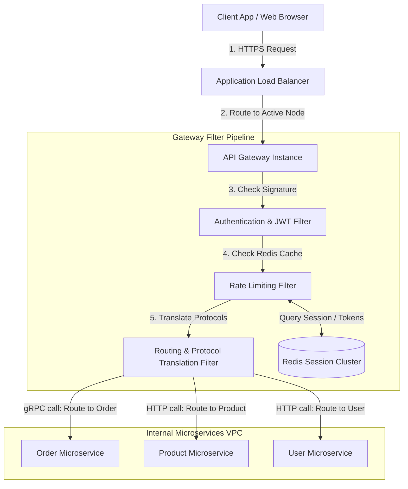

# HLD: API Gateway

An API Gateway is a reverse proxy server that sits between client applications and backend microservices. It acts as a single entry point, orchestrating requests, enforcing security policies, managing traffic, and translating protocols.

---

## 1. System Scale & Core Theory

### Mathematical Sizing & Gateway Cluster Resource Planning

Consider a global platform with the following ingress traffic profile:
*   **Peak Ingress Traffic:** $1\text{ Million Requests/Second (RPS)}$.
*   **Average Payload Size:** $2\text{ KB}$ request headers and body, $8\text{ KB}$ response headers and body.
*   **Average Request Latency (Gateway Processing):** $15\text{ ms}$ (including routing, filter executions, and network transit).

#### 1. Ingress and Egress Bandwidth Sizing
*   **Ingress Network Traffic:**
    $$\text{Ingress Traffic} = 1,000,000\text{ RPS} \times 2\text{ KB} = 2,000,000\text{ KB/s} = 2\text{ GB/s} = 16\text{ Gbps}$$
*   **Egress Network Traffic (Response to Client):**
    $$\text{Egress Traffic} = 1,000,000\text{ RPS} \times 8\text{ KB} = 8,000,000\text{ KB/s} = 8\text{ GB/s} = 64\text{ Gbps}$$
*   *Conclusion:* The gateway cluster must support a aggregate capacity of $80\text{ Gbps}$ of network bandwidth.

#### 2. CPU Sizing for TLS Termination
*   Performing TLS/SSL handshakes consumes significant CPU capacity.
*   An optimized single CPU core can handle $\approx 2,000$ asymmetric cryptographic handshakes/sec using ECDSA secp256r1 keys.
*   Assuming a connection keep-alive recycle rate of $10\%$ (meaning $10\%$ of requests establish a new TCP/TLS connection):
    $$\text{New Handshakes/Second} = 1,000,000\text{ RPS} \times 0.10 = 100,000\text{ handshakes/second}$$
    $$\text{CPU Cores Needed (Handshakes)} = \frac{100,000\text{ handshakes}}{2,000\text{ handshakes/core}} = 50\text{ Cores}$$
*   Adding standard HTTP routing and processing overhead ($\approx 10,000\text{ RPS}$ per core):
    $$\text{CPU Cores Needed (Processing)} = \frac{1,000,000\text{ RPS}}{10,000\text{ RPS/core}} = 100\text{ Cores}$$
*   *Total Capacity Required:* Minimum $150\text{ physical cores}$ (which can be distributed across 10-15 server instances).

---

### Comparative Analysis: Ingress Traffic Controllers

| Metric / Feature | Load Balancer (ALB/ELB) | API Gateway (Kong/Envoy) | Service Mesh (Istio/Linkerd) |
| :--- | :--- | :--- | :--- |
| **Primary Level** | Layer 4 (TCP) or Layer 7 (HTTP) routing | Layer 7 request inspection & orchestration | Layer 7 service-to-service communication |
| **Responsibility** | Basic traffic routing and server health checks | Security (auth, rate limiting), request transformations, routing | Internal service discovery, mTLS enforcement, tracing |
| **Deployment Location** | Edge of public network | Edge of public network, before microservices | Sidecar proxy next to every microservice container |
| **Performance Latency** | Low latency ($< 2\text{ ms}$) | Low-Medium latency ($5$ to $15\text{ ms}$) | Medium latency ($1$ to $5\text{ ms}$ overhead per hop) |

---

## 2. Visual Architecture Diagram

This diagram traces the flow of client requests through an API Gateway, showing the execution of filter stages before routing to upstream microservices.



---

## 3. Data Models & API Signatures

### Gateway Routing Configuration (JSON format)
Used by the gateway control plane to dynamically update routing paths without requiring system restarts.

```json
{
  "route_id": "route_order_creation",
  "path_pattern": "/api/v1/orders/*",
  "method": "POST",
  "upstream_service": "order-service.internal",
  "upstream_protocol": "gRPC",
  "timeout_ms": 3000,
  "retry_policy": {
    "max_attempts": 3,
    "backoff_ms": 100,
    "retry_on_status": [502, 503, 504]
  },
  "filters": [
    {
      "name": "JwtAuthenticationFilter",
      "config": {
        "required_scopes": ["write:orders"],
        "identity_provider_url": "https://auth.internal/keys"
      }
    },
    {
      "name": "TokenBucketRateLimiting",
      "config": {
        "bucket_capacity": 100,
        "refill_rate_per_sec": 10,
        "identity_key": "user_id"
      }
    }
  ]
}
```

### API Key Metadata database Schema (PostgreSQL)
Tracks keys authorized to bypass rate limits or query specific endpoints.

```sql
CREATE TABLE gateway_api_keys (
    key_id VARCHAR(64) PRIMARY KEY,
    client_name VARCHAR(100) NOT NULL,
    hashed_secret VARCHAR(256) NOT NULL,
    allowed_routes TEXT[] NOT NULL,
    rate_limit_override_qps INT DEFAULT NULL,
    status VARCHAR(20) NOT NULL DEFAULT 'ACTIVE', -- ACTIVE, REVOKED, EXPIRED
    expires_at TIMESTAMP WITH TIME ZONE
);

CREATE INDEX idx_api_keys_status ON gateway_api_keys(key_id) WHERE status = 'ACTIVE';
```

---

## 4. Operational Flows

### Request Processing and Upstream Routing Flow
1.  **Client Request Ingestion:** The client sends an HTTPS request to `/api/v1/orders/create`.
2.  **Edge Routing & SSL:** The Load Balancer terminates SSL and routes the request to an API Gateway instance.
3.  **Authentication & Scopes Check:**
    *   The gateway extracts the JWT from the `Authorization` header.
    *   It validates the signature using public keys cached in memory.
    *   If invalid, it returns `401 Unauthorized` immediately.
4.  **Rate Limiting Check:**
    *   The gateway checks the client ID against the Redis cluster using an atomic Lua script.
    *   If the token limit is exceeded, it returns `429 Too Many Requests`.
5.  **Protocol Translation & Routing:**
    *   The routing filter maps the request path to the internal upstream host name: `order-service.internal`.
    *   It translates the HTTP JSON payload into a binary gRPC message payload and sends the query to the microservice.
6.  **Response Delivery:** The gateway receives the gRPC response, converts it back to HTTP JSON, and returns it to the client.

---

## 5. High Availability, Failovers & Bottlenecks

### Mitigating Split-Brain Config Synchronization
If a network partition divides the API Gateway cluster, nodes may read different routing configurations, leading to inconsistent request routing.
*   *Mitigation:* Use a distributed, highly consistent consensus store (like Consul, ZooKeeper, or etcd) to manage gateway configurations. Gateway instances should subscribe to etcd key-value updates to synchronize routing policies atomically.

### Circuit Breaking on Slow Upstreams
If a downstream microservice runs slowly, the gateway can exhaust its connection threads waiting for responses, causing a system-wide bottleneck.

```
Upstream Delay State:
[ Client Requests ] ──> [ API Gateway ] ── (All threads waiting) ──> [ Slow Microservice ]
                                                                     (Throws DB Lock errors)

Circuit Breaker Action:
[ Client Requests ] ──> [ API Gateway ] ── (Returns HTTP 503) ──X [ Slow Microservice ]
                        (Circuit Open: Avoid queries)
```

*   **Solution:** Integrate a **Circuit Breaker** (like Resilience4j or Envoy's outlier detection).
    *   If the error rate of an upstream service exceeds a threshold (e.g., $50\%$ failures or timeouts over 10 seconds), the circuit transitions to **Open**.
    *   Subsequent requests to the service fail fast at the gateway, returning an HTTP 503 error immediately to protect thread pools.
    *   After a cooldown window (e.g., 30 seconds), the gateway enters a **Half-Open** state, permitting a small fraction of traffic to test service health before resuming normal routing.

---

## 6. Comprehensive Interview Q&A

### Q1: How do you implement dynamic protocol translation (e.g., HTTP REST to internal gRPC) inside an API Gateway?
**Answer:**
Protocol translation allows external clients to communicate using REST/JSON while internal microservices use gRPC/Protobuf to optimize network performance.

**Implementation Steps:**
1.  **Define Protobuf Schemas:** Compile protobuf service definitions to generate client stubs.
2.  **Schema Registry Storage:** Load the compiled protobuf schemas (`.descriptor` files) into the API Gateway's local config store.
3.  **JSON-to-Protobuf Parsing:** When a REST request hits the gateway:
    *   The parser maps the HTTP path to the gRPC service name and method.
    *   The gateway parses the JSON request body and translates the keys to binary Protobuf fields using the schema registry descriptor.
4.  **Execute gRPC Call:** The gateway acts as a gRPC client, opening a HTTP/2 connection to the upstream microservice and sending the binary payload.
5.  **Translate Response:** Once the service returns the binary response, the gateway converts the payload back to JSON and returns it to the client over HTTP/1.1 or HTTP/2.

---

### Q2: What is the gRPC connection pinning problem in Layer 4 load balancing, and how does Istio/Envoy solve it?
**Answer:**
*   **The Problem:**
    *   HTTP/1.1 opens and closes TCP connections frequently. A Layer 4 load balancer balances traffic by distributing new TCP connections across servers.
    *   gRPC uses HTTP/2, which multiplexes multiple queries over a **single long-lived TCP connection**.
    *   If a client establishes a gRPC connection to the load balancer, it stays open indefinitely. All subsequent requests are routed over this single connection to the same backend server.
    *   If you scale out your backend servers, the new instances will receive no traffic because the existing connection is pinned to the old server.
*   **The Solution:**
    *   L7 proxies (like Envoy or Istio Gateways) inspect the individual HTTP/2 frames rather than the raw TCP packets.
    *   Envoy decodes HTTP/2 frames, reads the headers for each stream, and balances requests across upstream servers at the **request level** rather than the connection level, ensuring even load distribution.

---

### Q3: How do you configure an API Gateway to handle Cross-Origin Resource Sharing (CORS) preflight requests?
**Answer:**
When a browser makes a cross-origin request (e.g. from `frontend.com` to `api.backend.com`), it sends an HTTP `OPTIONS` request (preflight check) to verify if the origin is authorized.

**Gateway CORS Configuration:**
1.  **Intercept OPTIONS requests:** The gateway intercepts all `OPTIONS` requests before they reach backend microservices.
2.  **Inject CORS headers:** The gateway returns an HTTP 200 response containing the authorized access headers:
```http
Access-Control-Allow-Origin: https://frontend.com
Access-Control-Allow-Methods: GET, POST, PUT, DELETE, OPTIONS
Access-Control-Allow-Headers: Authorization, Content-Type, X-Requested-With
Access-Control-Max-Age: 86400
```
3.  **Prevent Upstream Load:** Handling preflight checks at the gateway avoids routing them to backend microservices, reducing internal network load.

---

### Q4: If the database is slow, how can the API Gateway protect thread pools from depletion?
**Answer:**
If backend databases or services run slowly, the API Gateway can exhaust its connection threads waiting for responses, preventing it from processing requests for other healthy services.

**Mitigation Strategies:**
1.  **Configure Low Timeouts:** Set strict timeouts for upstream services (e.g., 2 seconds max) to release threads quickly.
2.  **Circuit Breaking:** Use circuit breakers to fail requests fast during downstream outages.
3.  **Bulkhead Pattern:** Isolate thread pools for each upstream service. If the Order service experiences an outage, it only exhausts its dedicated thread pool, leaving the Product and Billing pools unaffected.
4.  **Asynchronous Non-blocking I/O:** Use non-blocking I/O models (like Netty in Spring Cloud Gateway or Node.js event loops) to handle requests asynchronously. This allows a small pool of threads to process thousands of concurrent connections, eliminating thread-per-request bottlenecks.
