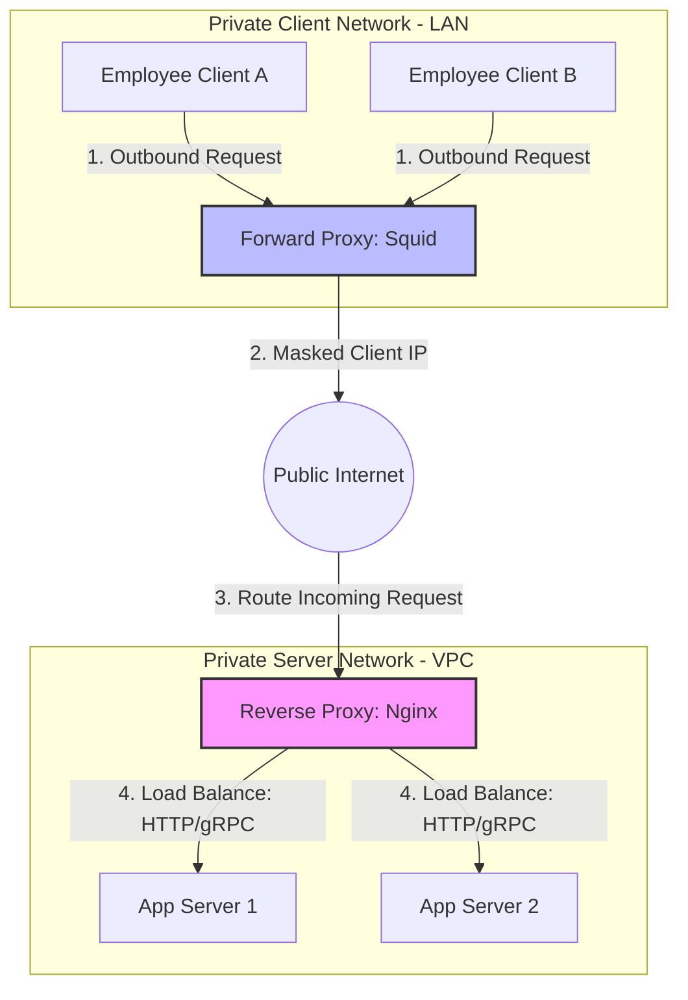

# HLD: Reverse Proxy vs. Forward Proxy

Proxies act as intermediaries that forward requests between client applications and backend servers. While both process web traffic, they serve opposite architectural purposes.

---

## 1. Core Concept & Sizing Theory

### Reverse Proxy vs. Forward Proxy

*   **Forward Proxy (Client-Side Proxy):** Sits in front of client applications. When a client requests access to the public internet, the request is intercepted by the forward proxy. It masks the client's IP address and filters outbound traffic.
*   **Reverse Proxy (Server-Side Proxy):** Sits in front of backend servers. When an external client makes a request, it is intercepted by the reverse proxy. It terminates SSL connections, caches content, balances load, and shields the backend servers.

```
Forward Proxy (Client-Side Protection):
[ Client App ] ──> [ Forward Proxy ] ── (Internet) ──> [ Public Web Server ]
(Masks Client IP, filters outgoing URLs)

Reverse Proxy (Server-Side Protection):
[ Client App ] ── (Internet) ──> [ Reverse Proxy ] ──> [ Private App Servers Pool ]
                                (Terminates SSL, balances load, masks server IPs)
```

---

### Comparative Analysis: Proxy Architectures

| Dimension | Forward Proxy | Reverse Proxy |
| :--- | :--- | :--- |
| **Primary Beneficiary** | The Client (protects client identity and restricts internet access). | The Server (protects backend networks and optimizes traffic). |
| **IP Visibility** | Masks the client's IP from the public internet. | Masks the backend servers' IPs from the public internet. |
| **Security Controls** | Access control filters (blocks social media, gambling sites), logging client traffic. | Web Application Firewall (WAF) integration, SSL/TLS termination, rate limiting. |
| **Caching Model** | Caches external web content locally to reduce WAN bandwidth. | Caches backend application responses to reduce CPU load on database instances. |
| **Common Technologies** | Squid, Blue Coat, Tinyproxy. | Nginx, HAProxy, Envoy, Apache. |

---

## 2. Visual Architecture Diagram

This diagram contrasts the packet flow paths and network boundaries of Forward and Reverse proxies.



---

## 3. Production-Grade Nginx Configuration (`nginx.conf`)

Below is a secure Nginx configuration for a **Reverse Proxy**. It features SSL termination, TLS 1.3 configuration, rate limiting, gzip compression, caching, and security headers.

```nginx
# Define worker process count based on available CPU cores
worker_processes auto;
pid /var/run/nginx.pid;

events {
    worker_connections 2048; # Maximum concurrent connections per worker
    use epoll; # Enable high-performance network I/O model on Linux
    multi_accept on;
}

http {
    include /etc/nginx/mime.types;
    default_type application/octet-stream;

    # Dynamic Logging format to capture proxy forwarding headers
    log_format main_custom '$remote_addr - $remote_user [$time_local] "$request" '
                           '$status $body_bytes_sent "$http_referer" '
                           '"$http_user_agent" "$http_x_forwarded_for" '
                           'rt=$request_time uct=$upstream_connect_time uht=$upstream_header_time urt=$upstream_response_time';

    access_log /var/log/nginx/access.log main_custom;
    error_log /var/log/nginx/error.log warn;

    # Performance optimizations
    sendfile on;
    tcp_nopush on;
    tcp_nodelay on;
    keepalive_timeout 65;
    types_hash_max_size 2048;
    server_tokens off; # Disable emitting Nginx version number in headers

    # Gzip Compression configurations
    gzip on;
    gzip_disable "msie6";
    gzip_vary on;
    gzip_proxied any;
    gzip_comp_level 5;
    gzip_types text/plain text/css application/json application/javascript text/xml application/xml;

    # Define Cache Store Directory (10MB memory zone for keys, 10GB max disk storage)
    proxy_cache_path /var/cache/nginx levels=1:2 keys_zone=my_cache:10m max_size=10g inactive=60m use_temp_path=off;

    # Configure Rate Limiting (10 requests per second per IP)
    limit_req_zone $binary_remote_addr zone=ip_limit_zone:10m rate=10r/s;

    # Define Upstream Server Cluster (Layer 7 load balancing)
    upstream backend_servers {
        server 10.0.1.15:8080 max_fails=3 fail_timeout=10s;
        server 10.0.1.16:8080 max_fails=3 fail_timeout=10s;
        server 10.0.1.17:8080 backup; # Fallback node active during cluster outages
        keepalive 32; # Active persistent idle connections per worker to upstreams
    }

    # 1. HTTP Server Block (Redirect all HTTP traffic to HTTPS)
    server {
        listen 80 default_server;
        listen [::]:80 default_server;
        server_name api.example.com;

        return 301 https://$host$request_uri;
    }

    # 2. HTTPS Server Block (SSL/TLS Termination and Proxy routing)
    server {
        listen 443 ssl http2;
        listen [::]:443 ssl http2;
        server_name api.example.com;

        # SSL Certificates
        ssl_certificate /etc/letsencrypt/live/example.com/fullchain.pem;
        ssl_certificate_key /etc/letsencrypt/live/example.com/privkey.pem;

        # TLS 1.3 only (Strict security compliance)
        ssl_protocols TLSv1.3;
        ssl_prefer_server_ciphers off;

        # SSL Session Cache optimizations (Save CPU cycles on TLS handshakes)
        ssl_session_cache shared:SSL:10m;
        ssl_session_timeout 1d;
        ssl_session_tickets off;

        # Strict Security Headers
        add_header X-Frame-Options "DENY" always;
        add_header X-Content-Type-Options "nosniff" always;
        add_header X-XSS-Protection "1; mode=block" always;
        add_header Content-Security-Policy "default-src 'self'; script-src 'self'; frame-ancestors 'none';" always;
        add_header Referrer-Policy "strict-origin-when-cross-origin" always;
        add_header Strict-Transport-Security "max-age=63072000; includeSubDomains; preload" always;

        # Root Location - Proxy traffic to upstream cluster
        location / {
            # Enforce rate limit (permit burst of up to 5 requests before rejecting with 429)
            limit_req zone=ip_limit_zone burst=5 nodelay;

            # Enable caching zone for GET/HEAD queries
            proxy_cache my_cache;
            proxy_cache_use_stale error timeout http_500 http_502 http_503 http_504;
            proxy_cache_valid 200 302 10m;
            proxy_cache_valid 404 1m;
            add_header X-Cache-Status $upstream_cache_status;

            # Configure upstream headers for backend server visibility
            proxy_pass http://backend_servers;
            proxy_redirect off;

            # HTTP/2 multiplexing socket adjustments
            proxy_http_version 1.1;
            proxy_set_header Connection "";

            # Forward client identifiers
            proxy_set_header Host $host;
            proxy_set_header X-Real-IP $remote_addr;
            proxy_set_header X-Forwarded-For $proxy_add_x_forwarded_for;
            proxy_set_header X-Forwarded-Proto $scheme;

            # Timeouts configuration
            proxy_connect_timeout 5s;
            proxy_send_timeout 10s;
            proxy_read_timeout 10s;
        }
    }
}
```

---

## 4. Operational Flows

### Request Lifecycle through Nginx Reverse Proxy
1.  **Ingress Connection:** The client browser establishes a TLS connection to Nginx on port 443. Nginx completes the TLS 1.3 handshake.
2.  **Verify Rate Limit:** Nginx checks the client IP against the rate limiting zone `ip_limit_zone`. If the limit is exceeded, Nginx returns an HTTP 429 error.
3.  **Cache Lookup:** Nginx checks the `my_cache` directory for cached content matching the request key.
    *   *Cache Hit:* Returns the cached response directly to the client, bypassing the backend server.
    *   *Cache Miss:* Continues to the routing stage.
4.  **Backend Dispatch:** Nginx resolves the upstream service `backend_servers` and selects an active node using its routing algorithm. It forwards the request using the `proxy_pass` configuration.
5.  **Response Backfill:** Nginx receives the response, writes it to the local cache directory, and returns the response to the client.

---

## 5. High Availability, Failovers & Bottlenecks

### Mitigating Single Node Upstream Failures
If an upstream server crashes, incoming requests routed to it will fail.
*   **Upstream Heartbeats:** Nginx continuously monitors upstream server availability. The configuration `max_fails=3 fail_timeout=10s` instructs Nginx to mark a server as offline for 10 seconds if it fails to respond 3 consecutive times.
*   **Fallback Servers (`backup` flag):** Configure a fallback server to handle traffic during cluster outages, preventing system downtime.

### Serving Stale Content During Downstream Outages
If the entire upstream server cluster goes offline, Nginx can continue to serve expired cached content to users.
*   **Stale Cache Config:** The directive `proxy_cache_use_stale error timeout http_500 http_502 http_503 http_504` configures Nginx to return stale cached content to the client if the backend servers return 5xx errors or experience timeouts, maintaining service availability.

---

## 6. Comprehensive Interview Q&A

### Q1: What is "Microcaching" inside Nginx, and how does it prevent database crashes on read-heavy sites?
**Answer:**
**Microcaching** is the practice of caching dynamic content for brief intervals (such as 1 to 5 seconds).

*   **Problem:** If a popular news page receives $10,000\text{ QPS}$, querying the database for every request can cause it to crash, even if the content changes frequently.
*   **Microcaching Solution:** Set a short caching duration:
    `proxy_cache_valid 200 1s;`
    With this configuration:
    *   Nginx queries the backend database once per second.
    *   The remaining 9,999 requests are served directly from the Nginx memory cache.
    *   This reduces the load on the database by $99.9\%$, while ensuring users see updated content within 1 second.

---

### Q2: Why is the `proxy_set_header X-Forwarded-For` directive necessary in a reverse proxy configuration? What is the difference between `X-Real-IP` and `X-Forwarded-For`?
**Answer:**
When Nginx proxies a request, it opens a new TCP connection to the backend server. As a result, the backend database sees Nginx's IP address as the source IP rather than the client's.

*   `X-Real-IP`: Stores the IP address of the client that established the connection to Nginx.
*   `X-Forwarded-For`: A comma-separated list that tracks the client IP and the IPs of all subsequent proxy servers the request passed through:
    `X-Forwarded-For: <Client_IP>, <Proxy1_IP>, <Proxy2_IP>`
    This allows backend applications to identify the client's original IP for logging, auditing, and geo-routing.

---

### Q3: How do you configure Nginx to mitigate Slowloris DDoS attacks?
**Answer:**
A **Slowloris** attack exhausts server threads by sending partial HTTP headers slowly, keeping connections open indefinitely.

**Nginx Mitigations:**
1.  **Configure strict timeout limits:** Limit client connection hold times:
    ```nginx
    client_body_timeout 10s;
    client_header_timeout 10s;
    keepalive_timeout 15s;
    send_timeout 10s;
    ```
2.  **Limit buffer sizes:** Restrict header and body buffer allocations:
    ```nginx
    client_body_buffer_size 16K;
    client_header_buffer_size 1k;
    large_client_header_buffers 4 8k;
    ```
    This causes Nginx to close connections that fail to complete headers within 10 seconds, freeing server resources.

---

### Q4: Explain the difference between Layer 4 Proxying (TCP load balancing) and Layer 7 Proxying (HTTP reverse proxying). What are the performance trade-offs?
**Answer:**
*   **Layer 4 Proxying (TCP/UDP level):**
    *   *Behavior:* The proxy routes traffic based on network packet headers (IP and Port numbers) without inspecting the application payload.
    *   *Performance:* Highly efficient. It routes traffic at the transport layer, consuming minimal CPU and memory.
    *   *Limitation:* Cannot route traffic based on URL paths, request headers, or cookies. It cannot perform SSL termination or cache content.
*   **Layer 7 Proxying (Application level):**
    *   *Behavior:* The proxy terminates the connection, decodes the HTTP/HTTPS request, inspects headers and payloads, and routes traffic dynamically.
    *   *Performance:* Higher CPU overhead due to packet decoding, SSL handshake computations, and routing logic.
    *   *Advantages:* Supports routing based on URL paths and cookies, enables SSL termination, content caching, and header manipulation.
*   *Trade-Off:* Use Layer 4 proxies (like LVS or AWS NLB) at the network edge to balance raw traffic, and Layer 7 proxies (like Nginx or Envoy) before application servers to manage routing policies and security.
