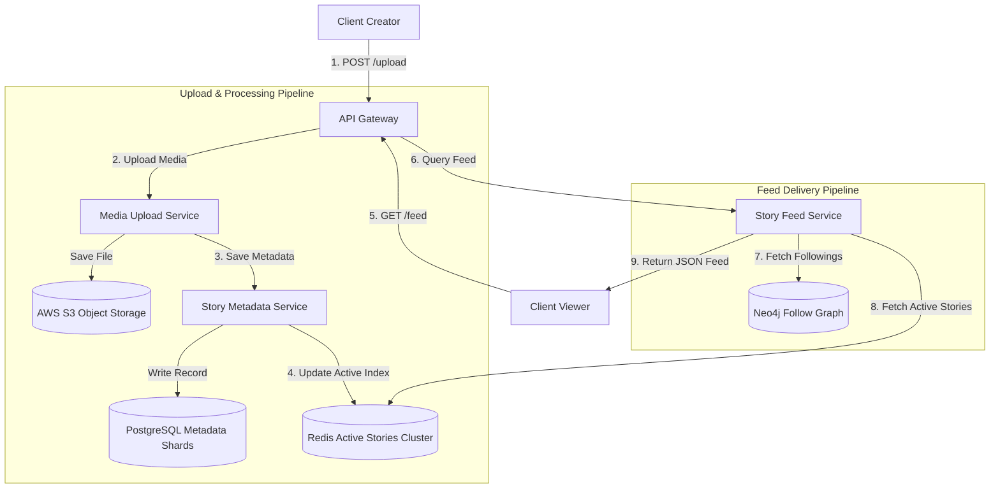

# HLD: Design Instagram Stories

An Instagram-style stories system allows users to publish photos or short videos that disappear automatically after 24 hours. The system must support high-volume media uploads and deliver real-time story feeds with low latency.

---

## 1. System Scale & Core Theory

### Mathematical Sizing & Storage Estimations

Consider a global platform with the following scale:
*   **Daily Active Users (DAU):** $500\text{ Million}$.
*   **Story Creators:** $10\%$ of DAU publish a story daily ($50\text{ Million}$ story uploads/day).
*   **Average Stories per Creator:** 2 stories/day ($100\text{ Million}$ total stories/day).
*   **Weighted Media Size:** $3\text{ MB}$ (mix of compressed photos at $1\text{ MB}$ and 15s videos at $5\text{ MB}$).

#### 1. Upload & View QPS Calculations
*   **Write QPS (Uploads):**
    $$\text{Average Write QPS} = \frac{100,000,000\text{ stories}}{86,400\text{ seconds}} \approx 1,157\text{ uploads/second}$$
    $$\text{Peak Write QPS (3x average)} \approx 3,500\text{ uploads/second}$$
*   **Read QPS (Views):**
    Assume each DAU views $20$ stories per day:
    $$\text{Total Daily Views} = 500\text{ Million users} \times 20\text{ views} = 10\text{ Billion views/day}$$
    $$\text{Average Read QPS} = \frac{10,000,000,000\text{ views}}{86,400\text{ seconds}} \approx 115,740\text{ views/second}$$
    $$\text{Peak Read QPS (2x average)} \approx 231,500\text{ views/second}$$
    *Conclusion:* The read load is $100\text{x}$ higher than the write load, making caching critical.

#### 2. Media and Metadata Storage Sizing (24-Hour Active Window)
*   **Daily Media Storage:**
    $$\text{Media Storage} = 100\text{ Million stories} \times 3\text{ MB} = 300\text{ TB/day}$$
    Media files are written to S3 or a CDN. Since stories expire after 24 hours, the active hot media storage requires a capacity of $\approx 300\text{ TB}$.
*   **Daily Metadata Storage:**
    *   Metadata record size: `story_id` ($16\text{ bytes}$) + `user_id` ($16\text{ bytes}$) + `media_url` ($100\text{ bytes}$) + `created_at` ($8\text{ bytes}$) + `expires_at` ($8\text{ bytes}$) $\approx 150\text{ bytes}$ ($\approx 250\text{ bytes}$ with database overhead).
    $$\text{Metadata Storage} = 100\text{ Million} \times 250\text{ bytes} \approx 25\text{ GB/day}$$
    This data fits in the memory of a Redis cluster.

---

### Comparative Analysis: Story Feed Ingestion Strategies

| Feature | Push Model (Fan-Out on Write) | Pull Model (Fan-Out on Read) | Hybrid Model (Recommended) |
| :--- | :--- | :--- | :--- |
| **Mechanism** | When a user posts a story, it is written to the feed queues of all their followers. | When a user loads their homepage, the system retrieves their followings list and fetches active stories. | Use a Push model for regular users and a Pull model for celebrities (hot keys). |
| **Write Latency** | High (updating millions of follower feeds for a single post creates write spikes). | Low (the story is written to the creator's index once). | Balanced (prevents write spikes from popular accounts). |
| **Read Latency** | Extremely Low (reads from the user's pre-compiled feed cache). | High (requires querying the followings list and fetching indexes at read time). | Low for all users. |
| **Memory Cost** | High (duplicate references are stored in every follower's feed). | Low (stores references in the creator's index only). | Optimized. |

---

## 2. Visual Architecture Diagram

This diagram displays the Instagram Stories architecture, highlighting the separate paths for story publishing and feed retrieval.



---

## 3. Data Models & API Signatures

### SQL Metadata Database Schema (Sharded PostgreSQL)
The metadata database is sharded by `user_id`. This groups a user's stories on a single shard, enabling fast reads.

```sql
-- PostgreSQL Schema
CREATE TABLE user_stories (
    story_id UUID PRIMARY KEY,
    user_id UUID NOT NULL,
    media_url VARCHAR(256) NOT NULL,
    media_type VARCHAR(20) NOT NULL, -- IMAGE, VIDEO
    created_at TIMESTAMP WITH TIME ZONE DEFAULT CURRENT_TIMESTAMP,
    expires_at TIMESTAMP WITH TIME ZONE NOT NULL,
    status VARCHAR(20) DEFAULT 'ACTIVE' -- ACTIVE, ARCHIVED, DELETED
);

-- Optimization Index
CREATE INDEX idx_user_active_stories ON user_stories(user_id, expires_at) WHERE status = 'ACTIVE';
```

### Redis Data Model: Active Stories Index
To support sub-10ms response times, active story metadata is cached in Redis using Sorted Sets.
*   **Key:** `stories:user:<user_id>` (type: Sorted Set).
*   **Score:** `expires_at` (Unix epoch timestamp).
*   **Member:** `story_id:media_url:media_type` (serialized string).
*   *Command to add story:*
    `ZADD stories:user:alice 1780486400 "story_94827:https://cdn.com/image.jpg:IMAGE"`
*   *Command to fetch active stories:*
    `ZREMRANGEBYSCORE stories:user:alice -inf 1780400000` (cleans up expired stories).
    `ZRANGE stories:user:alice 0 -1` (retrieves remaining active stories).

### API Signatures

#### 1. Publish Story
*   **Protocol:** HTTPS POST (Multipart Form-Data)
*   **Path:** `/api/v1/stories/upload`
*   **Request Headers:** `Authorization: Bearer <JWT_TOKEN>`
*   **Payload:** File binary (image or video).
*   **Response Payload (201 Created):**
```json
{
  "story_id": "story_bfd60920-5c6d-4ee8-a92c",
  "media_url": "https://cdn.instagram.com/stories/2026/img_98472.jpg",
  "created_at": "2026-06-03T02:47:00Z",
  "expires_at": "2026-06-04T02:47:00Z"
}
```

#### 2. Get Active Story Feed
*   **Protocol:** HTTPS GET
*   **Path:** `/api/v1/stories/feed`
*   **Response Payload (200 OK):**
```json
{
  "user_id": "usr_893fd2bc-9d3f-422d-a2f1",
  "feed": [
    {
      "creator_id": "usr_332cb2bc-9d3f-422d-a2f1",
      "creator_name": "bob_runner",
      "stories": [
        {
          "story_id": "story_cfd60920-5c6d-4ee8",
          "media_url": "https://cdn.com/stories/bob.jpg",
          "media_type": "IMAGE",
          "expires_in_seconds": 12800
        }
      ]
    }
  ]
}
```

---

## 4. Operational Flows

### Write Path Flow (Publishing a Story)
1.  **Upload Media:** The client uploads a photo or video. The Media Service writes the file to S3, which returns a public CDN URL.
2.  **Persist Metadata:** The Media Service calls the Story Service to write the metadata record (setting `expires_at = created_at + 24 hours`) to the PostgreSQL database.
3.  **Update Redis Cache:** The service adds the story details to the creator's active story index in Redis:
    `ZADD stories:user:<user_id> <expires_at> <payload>`.
4.  **Acknowledge Client:** Return the HTTP 201 response.

### Read Path Flow (Viewing the Story Feed)
1.  **Retrieve Followings:** The client requests their story feed. The Feed Service queries the graph database or cache to retrieve the list of user IDs the client follows.
2.  **Fetch Active Indexes:** The service runs a multi-key query to fetch active story indexes from Redis in parallel:
    `MGET stories:user:user_1 stories:user:user_2 ...`
3.  **Filter Expired Stories:**
    *   For each retrieved sorted set, check the scores.
    *   If a score is less than the current timestamp, prune it:
        `ZREMRANGEBYSCORE stories:user:<id> -inf <current_timestamp>`.
4.  **Assemble Feed:** Sort the users based on activity (e.g., placing users with unviewed or recent stories first) and return the list of active stories to the client.

---

## 5. High Availability, Failovers & Bottlenecks

### Story Expiration Cleanup (The 24-Hour TTL)
Using background database deletion sweeps (`DELETE FROM user_stories WHERE expires_at < NOW()`) on large datasets can cause database locking and degrade performance.
*   **Query-Time Filtering:** Avoid background database cleanup sweeps. Instead, filter out expired stories at query time using Redis scores:
    `ZREMRANGEBYSCORE stories:user:<id> -inf <current_time>`
    This keeps read paths clean and efficient.
*   **Archive Ledger (Outbox Sweep):** A background service reads the database replicas to archive expired stories to cold storage (like S3/Glacier) for user archives, keeping the primary SQL database table size small.

### Handling Hot Celebrity Feeds
If a celebrity with $100\text{ Million}$ followers posts a story, writing references to all $100\text{ Million}$ follower feeds (write fan-out) can degrade system performance.
*   **Hybrid Delivery Strategy:**
    *   **Regular Users:** Use a Push model. When they post, write references directly to their followers' feed caches in Redis.
    *   **Celebrities:** Use a Pull model. Do not push their stories to followers.
    *   **Feed Assembly (Merge-on-Read):**
        When a user requests their feed:
        1. Fetch their pre-compiled feed cache (containing stories from regular users).
        2. Query the followings list to identify any followed celebrities.
        3. Fetch active stories directly from the celebrities' active indexes and merge them into the feed, ensuring fast loading times.

---

## 6. Comprehensive Interview Q&A

### Q1: How do you design the database structure to transition expired stories to a user's private archive after 24 hours without impacting live query performance?
**Answer:**
A transaction to archive expired stories must scale without locking the primary tables.

**Implementation Strategy:**
1.  **Partition Tables by Expiry Date:** Partition the `user_stories` table by week.
2.  **Asynchronous Archive Processing:** Run a background worker to query active records close to expiration:
    `SELECT * FROM user_stories WHERE expires_at < NOW() AND status = 'ACTIVE' LIMIT 1000;`
3.  **Update Status:** The worker updates the status to `ARCHIVED`. Because the table is sharded by `user_id`, this query executes locally on single nodes.
4.  **Drop partitions:** When all stories in a weekly partition expire, drop the partition table. This frees disk space instantly without creating database locks.

---

### Q2: How do you track story view history? If a user views a story, how do you mark it as read and ensure it does not reappear on their feed?
**Answer:**
Tracking view histories for billions of views requires space-efficient storage.

**Implementation Strategy:**
1.  **Storage Layout (Cassandra View Table):**
    ```sql
    CREATE TABLE story_views (
        viewer_id uuid,
        story_owner_id uuid,
        story_id uuid,
        viewed_at timestamp,
        PRIMARY KEY (viewer_id, story_owner_id, story_id)
    );
    ```
    This indexes views by the viewer's ID, enabling fast checks.
2.  **Redis Bitmap Caching (For active tracking):**
    For active stories, cache the read state in Redis using a bitmap:
    `SetBit read:usr_<viewer_id> <story_offset_id> 1`
    When assembling the feed, the system checks the bitmap to identify unread stories, moving users with unread stories to the front of the feed.

---

### Q3: How do you optimize media delivery for mobile clients viewing stories?
**Answer:**
Vertical video and photo delivery must load instantly to prevent users from skipping ahead due to lag.

**Optimization Strategies:**
1.  **Dynamic Transcoding:** When a video is uploaded, the transcoding service generates multiple resolutions (e.g., 480p, 720p, 1080p) and formats (HLS, DASH).
2.  **Edge Cache pre-warming:** When a creator publishes a story, notify the CDN edge PoPs in their followers' geographic regions to pre-warm the cache, enabling faster media delivery.
3.  **Adaptive Bitrate Streaming:** The client player monitors network quality and dynamically switches resolutions (e.g., dropping from 1080p to 720p during connection drops) to prevent buffering.

---

### Q4: If the graph database is slow, how does it affect story feed compilation? How do you protect against this?
**Answer:**
If the graph database lags, retrieving the list of users a client follows can introduce latency, delaying feed loading.

**Protection Strategies:**
1.  **Cache followings in Redis:** Store a user's followings list in Redis using a Hash or Sorted Set:
    Key: `following:usr_<id>` -> Value: `Set of followed user IDs`.
    This maps relationships in memory, reducing queries to the graph database.
2.  **Graceful Degradation:** If both Redis and the graph database are unreachable, the feed service falls back to a default feed containing popular local public stories, keeping the service available.
