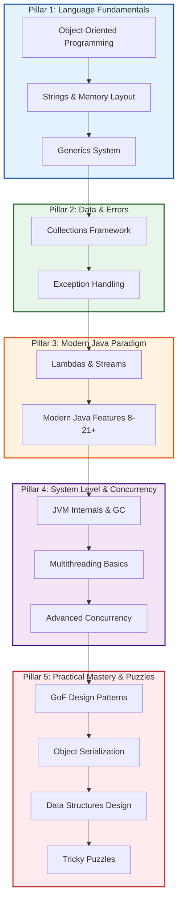

# ☕ Java Core Interview Preparation Dashboard

Welcome to the **Java Concepts and Interview Preparation Roadmap** portal! This module is structured to serve as an interactive, deep-dive learning curriculum covering core Java, modern features (Java 8 - 21+), concurrency, memory structures, and advanced data structure design patterns.

Each concept is organized into a self-contained, descriptive folder containing an in-depth **interview Q&A guide** (`README.md`) paired with **clean, executable Java examples** to bridge theoretical and practical mastery.

---

## 🗺️ Recommended Learning Roadmap

To master Java for technical coding and system-level interviews, we recommend proceeding through these five strategic pillars:



---

## 🧭 Interactive Learning Index

Explore the modules below. Clicking any topic opens its respective deep-dive interview preparation guide containing high-frequency interview questions and theoretical explanations.

| Module / Path | Concept Description | Deep-Dive Interview Guide | Core Executable Examples |
| :--- | :--- | :--- | :--- |
| **01. OOPs** | Foundations of Encapsulation, Polymorphism, Abstraction, Inheritance, and Method Hiding. | 📖 [OOPs Guide](file:///Users/yogeshwarpatel/Workspace/interview/java-concepts/src/main/java/com/interview/javaconcepts/oops/README.md) | 💻 [OOPsConcepts.java](file:///Users/yogeshwarpatel/Workspace/interview/java-concepts/src/main/java/com/interview/javaconcepts/oops/OOPsConcepts.java) |
| **02. Strings & Memory** | String immutability rationale, String Constant Pool (SCP) internals, and memory comparisons. | 📖 [Strings Guide](file:///Users/yogeshwarpatel/Workspace/interview/java-concepts/src/main/java/com/interview/javaconcepts/strings_memory/README.md) | 💻 [StringHandling.java](file:///Users/yogeshwarpatel/Workspace/interview/java-concepts/src/main/java/com/interview/javaconcepts/strings_memory/StringHandling.java) |
| **03. Collections** | Fail-Fast vs Fail-Safe iterators, `HashMap` bucket internals, and overriding equals/hashCode. | 📖 [Collections Guide](file:///Users/yogeshwarpatel/Workspace/interview/java-concepts/src/main/java/com/interview/javaconcepts/collections/README.md) | 💻 [CollectionsBasics.java](file:///Users/yogeshwarpatel/Workspace/interview/java-concepts/src/main/java/com/interview/javaconcepts/collections/CollectionsBasics.java) |
| **04. Exceptions** | Checked vs Runtime exceptions, custom exceptions, and the try-with-resources suppression model. | 📖 [Exceptions Guide](file:///Users/yogeshwarpatel/Workspace/interview/java-concepts/src/main/java/com/interview/javaconcepts/exceptions/README.md) | 💻 [ExceptionHandlingBasics.java](file:///Users/yogeshwarpatel/Workspace/interview/java-concepts/src/main/java/com/interview/javaconcepts/exceptions/ExceptionHandlingBasics.java) |
| **05. Multithreading** | Thread lifecycles, synchronization controls, JMM Happens-Before guarantees, and volatile variables. | 📖 [Multithreading Guide](file:///Users/yogeshwarpatel/Workspace/interview/java-concepts/src/main/java/com/interview/javaconcepts/multithreading/README.md) | 💻 [VirtualThreadsExample.java](file:///Users/yogeshwarpatel/Workspace/interview/java-concepts/src/main/java/com/interview/javaconcepts/multithreading/VirtualThreadsExample.java) |
| **06. Modern Java Features** | Milestones from Java 8 up to Java 21 LTS (Sealed classes, records, and pattern matching). | 📖 [Java Features Guide](file:///Users/yogeshwarpatel/Workspace/interview/java-concepts/src/main/java/com/interview/javaconcepts/java_features/README.md) | 💻 [Java21Features.java](file:///Users/yogeshwarpatel/Workspace/interview/java-concepts/src/main/java/com/interview/javaconcepts/java_features/Java21Features.java) |
| **07. Lambdas & Streams** | Functional Interfaces, stream pipeline evaluation, lazy optimization, and `map` vs `flatMap`. | 📖 [Streams Guide](file:///Users/yogeshwarpatel/Workspace/interview/java-concepts/src/main/java/com/interview/javaconcepts/lambdas_streams/README.md) | 💻 [FlatMapUsers.java](file:///Users/yogeshwarpatel/Workspace/interview/java-concepts/src/main/java/com/interview/javaconcepts/lambdas_streams/FlatMapUsers.java) |
| **08. Generics** | Compile-time safety mechanisms, Bounded Wildcards, Type Erasure, and the PECS Rule. | 📖 [Generics Guide](file:///Users/yogeshwarpatel/Workspace/interview/java-concepts/src/main/java/com/interview/javaconcepts/generics/README.md) | 💻 [GenericsBasics.java](file:///Users/yogeshwarpatel/Workspace/interview/java-concepts/src/main/java/com/interview/javaconcepts/generics/GenericsBasics.java) |
| **09. Advanced Concurrency** | Coordination synchronizers (Latch vs Barrier), Semaphores, ReentrantLocks, and ThreadLocals. | 📖 [Concurrency Guide](file:///Users/yogeshwarpatel/Workspace/interview/java-concepts/src/main/java/com/interview/javaconcepts/advanced_concurrency/README.md) | 💻 [CountDownLatchExample.java](file:///Users/yogeshwarpatel/Workspace/interview/java-concepts/src/main/java/com/interview/javaconcepts/advanced_concurrency/CountDownLatchExample.java) |
| **10. JVM Internals & GC** | Classloader phases, Heap/Stack/Metaspace structures, GC generational hypothese, and G1/ZGC. | 📖 [JVM/GC Guide](file:///Users/yogeshwarpatel/Workspace/interview/java-concepts/src/main/java/com/interview/javaconcepts/jvm_gc/README.md) | 💻 [GarbageCollectionBasics.java](file:///Users/yogeshwarpatel/Workspace/interview/java-concepts/src/main/java/com/interview/javaconcepts/jvm_gc/GarbageCollectionBasics.java) |
| **11. Data Structures** | Custom data structure engineering. High-performance $O(1)$ LRU cache design using DLL and HashMap. | 📖 [Data Structures Guide](file:///Users/yogeshwarpatel/Workspace/interview/java-concepts/src/main/java/com/interview/javaconcepts/data_structures/README.md) | 💻 [LRUCache.java](file:///Users/yogeshwarpatel/Workspace/interview/java-concepts/src/main/java/com/interview/javaconcepts/data_structures/LRUCache.java) |
| **12. Design Patterns** | GoF patterns including thread-safe Singletons, inner-class Builders, Simple/Abstract Factories. | 📖 [Design Patterns Guide](file:///Users/yogeshwarpatel/Workspace/interview/java-concepts/src/main/java/com/interview/javaconcepts/design_patterns/README.md) | 💻 [SingletonPattern.java](file:///Users/yogeshwarpatel/Workspace/interview/java-concepts/src/main/java/com/interview/javaconcepts/design_patterns/SingletonPattern.java) |
| **13. Serialization** | Deserialization cycles, `serialVersionUID` locks, `transient` fields, and Externalizable. | 📖 [Serialization Guide](file:///Users/yogeshwarpatel/Workspace/interview/java-concepts/src/main/java/com/interview/javaconcepts/serialization/README.md) | 💻 [SerializationDemo.java](file:///Users/yogeshwarpatel/Workspace/interview/java-concepts/src/main/java/com/interview/javaconcepts/serialization/SerializationDemo.java) |
| **14. Tricky Puzzles** | Edge cases: overload matching, double float arithmetic pitfalls, Integer Caching pool tricks. | 📖 [Tricky Puzzles Guide](file:///Users/yogeshwarpatel/Workspace/interview/java-concepts/src/main/java/com/interview/javaconcepts/tricky_programs/README.md) | 💻 [JavaTricky.java](file:///Users/yogeshwarpatel/Workspace/interview/java-concepts/src/main/java/com/interview/javaconcepts/tricky_programs/JavaTricky.java) |
| **15. Verification Tests** | Sandbox playground and practice assertions validating core arithmetic, loops, and behaviors. | 📖 [Testing Guide](file:///Users/yogeshwarpatel/Workspace/interview/java-concepts/src/main/java/com/interview/javaconcepts/misc_tests/README.md) | 💻 [JavaBasicsTest.java](file:///Users/yogeshwarpatel/Workspace/interview/java-concepts/src/main/java/com/interview/javaconcepts/misc_tests/JavaBasicsTest.java) |

---

## ⚙️ Compilation and Execution Instructions

The codebase is structured as a Maven module targeting **Java 21 LTS** with **enabled preview features** (supporting Virtual Threads and Unnamed Variables).

To clean compile and build the entire Java concepts library, execute the following from the workspace root or inside the `java-concepts` folder:

```bash
mvn clean compile
```

To run individual main demonstration classes, you can use the JVM runtime launcher directly (ensuring preview features are enabled):

```bash
java --enable-preview -cp target/classes com.interview.javaconcepts.design_patterns.SingletonPattern
```
