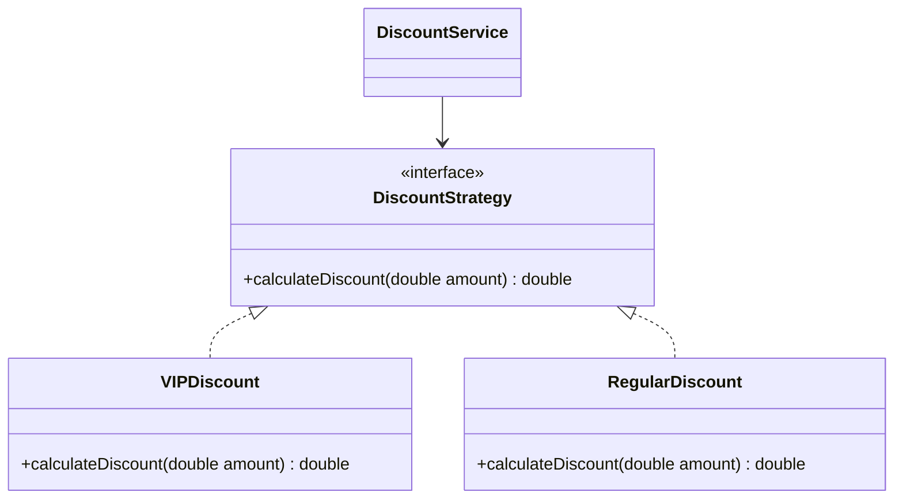
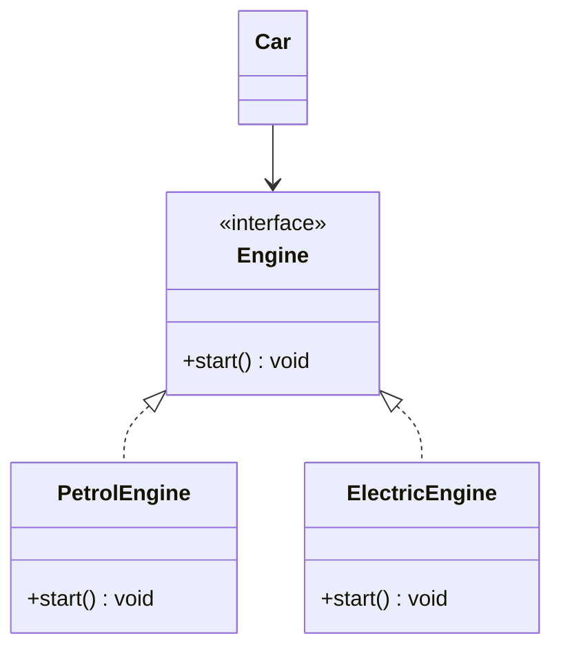

# SOLID Principles in Object-Oriented Design

SOLID is a set of five design principles to make software designs more understandable, flexible, and maintainable.

---

## 1. Single Responsibility Principle (SRP)
> **Definition:** A class should have one, and only one, reason to change.

### Bad Design (Violation)
An `Invoice` class that calculates total, prints invoice, and saves it to a database. If the saving mechanism or printing format changes, the `Invoice` class must change.
```java
class Invoice {
    public void calculateTotal() { /* ... */ }
    public void printInvoice() { /* ... */ }
    public void saveToDatabase() { /* ... */ }
}
```

### Good Design (SRP Compliant)
Separate the concerns into distinct classes.
```java
class Invoice {
    public void calculateTotal() { /* ... */ }
}
class InvoicePrinter {
    public void print(Invoice invoice) { /* ... */ }
}
class InvoiceRepository {
    public void save(Invoice invoice) { /* ... */ }
}
```

---

## 2. Open-Closed Principle (OCP)
> **Definition:** Software entities (classes, modules, functions, etc.) should be open for extension, but closed for modification.

### Bad Design (Violation)
Using conditional statements (`if-else` or `switch`) to handle new types.
```java
class DiscountService {
    public double calculateDiscount(String customerType, double amount) {
        if (customerType.equals("VIP")) return amount * 0.2;
        else if (customerType.equals("REGULAR")) return amount * 0.05;
        return 0;
    }
}
```

### Good Design (OCP Compliant)
Use polymorphism/interfaces to extend behavior without modifying existing classes.

```java
interface DiscountStrategy {
    double calculateDiscount(double amount);
}
class VIPDiscount implements DiscountStrategy {
    public double calculateDiscount(double amount) { return amount * 0.2; }
}
class RegularDiscount implements DiscountStrategy {
    public double calculateDiscount(double amount) { return amount * 0.05; }
}
class DiscountService {
    private DiscountStrategy strategy;
    public DiscountService(DiscountStrategy strategy) { this.strategy = strategy; }
    public double getDiscount(double amount) { return strategy.calculateDiscount(amount); }
}
```

---

## 3. Liskov Substitution Principle (LSP)
> **Definition:** Objects of a superclass should be replaceable with objects of its subclasses without breaking the application.

### Bad Design (Violation)
The classic Square-Rectangle problem. A `Square` inherits from `Rectangle`, but setting width changes height, breaking assumptions in test suites.
```java
class Rectangle {
    protected int width, height;
    public void setWidth(int w) { this.width = w; }
    public void setHeight(int h) { this.height = h; }
}
class Square extends Rectangle {
    public void setWidth(int w) { this.width = w; this.height = w; }
    public void setHeight(int h) { this.width = h; this.height = h; }
}
```

### Good Design (LSP Compliant)
Inheritance must represent true substitutions. If behaviors differ fundamentally, inherit from a common minimal abstraction or use composition.
```java
interface Shape {
    int getArea();
}
class Rectangle implements Shape {
    private int width, height;
    public Rectangle(int w, int h) { this.width = w; this.height = h; }
    public int getArea() { return width * height; }
}
class Square implements Shape {
    private int side;
    public Square(int s) { this.side = s; }
    public int getArea() { return side * side; }
}
```

---

## 4. Interface Segregation Principle (ISP)
> **Definition:** Clients should not be forced to depend on methods they do not use.

### Bad Design (Violation)
A single fat interface for all device operations.
```java
interface MultiFunctionDevice {
    void print();
    void scan();
    void fax();
}
class SimplePrinter implements MultiFunctionDevice {
    public void print() { /* OK */ }
    public void scan() { throw new UnsupportedOperationException(); } // Violation
    public void fax() { throw new UnsupportedOperationException(); }  // Violation
}
```

### Good Design (ISP Compliant)
Split the fat interface into smaller, focused interfaces.
```java
interface Printer { void print(); }
interface Scanner { void scan(); }
interface FaxMachine { void fax(); }

class SimplePrinter implements Printer {
    public void print() { /* print logic */ }
}
class SuperPrinter implements Printer, Scanner, FaxMachine {
    public void print() {}
    public void scan() {}
    public void fax() {}
}
```

---

## 5. Dependency Inversion Principle (DIP)
> **Definition:** High-level modules should not depend on low-level modules. Both should depend on abstractions. Abstractions should not depend on details. Details should depend on abstractions.

### Bad Design (Violation)
`Car` directly depends on a concrete `Engine` implementation.
```java
class PetrolEngine {
    public void start() {}
}
class Car {
    private PetrolEngine engine = new PetrolEngine(); // Tight coupling
    public void drive() { engine.start(); }
}
```

### Good Design (DIP Compliant)
Decouple using an interface.

```java
interface Engine { void start(); }
class PetrolEngine implements Engine { public void start() {} }
class ElectricEngine implements Engine { public void start() {} }

class Car {
    private Engine engine;
    public Car(Engine engine) { this.engine = engine; } // Dependency Injection
    public void drive() { engine.start(); }
}
```

---

## Interview Q&A Corner

> [!TIP]
> **Q: How does OCP relate to design patterns?**
> A: Patterns like **Strategy**, **Decorator**, and **State** are primarily designed to help systems adhere to OCP by allowing you to add new behaviors (strategies, states, wrappers) without modifying the base execution logic.
>
> **Q: What is the main difference between LSP and polymorphism?**
> A: Polymorphism is a language feature (how inheritance works), whereas LSP is a semantic rule for designing hierarchies. LSP dictates that subclass overrides must preserve the behavior contracts expected of the parent class (e.g. not throwing `UnsupportedOperationException`).
