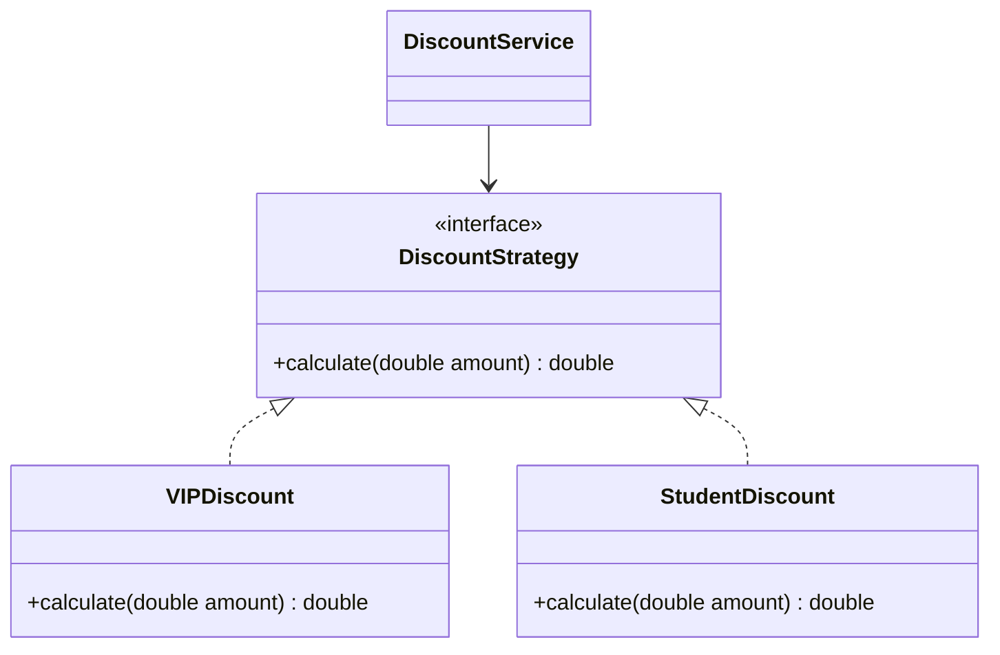
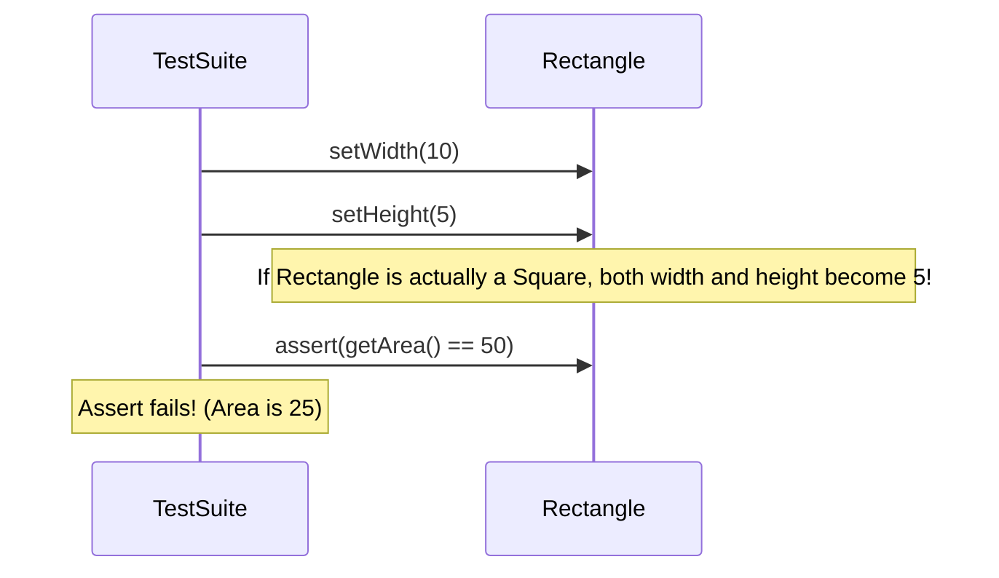
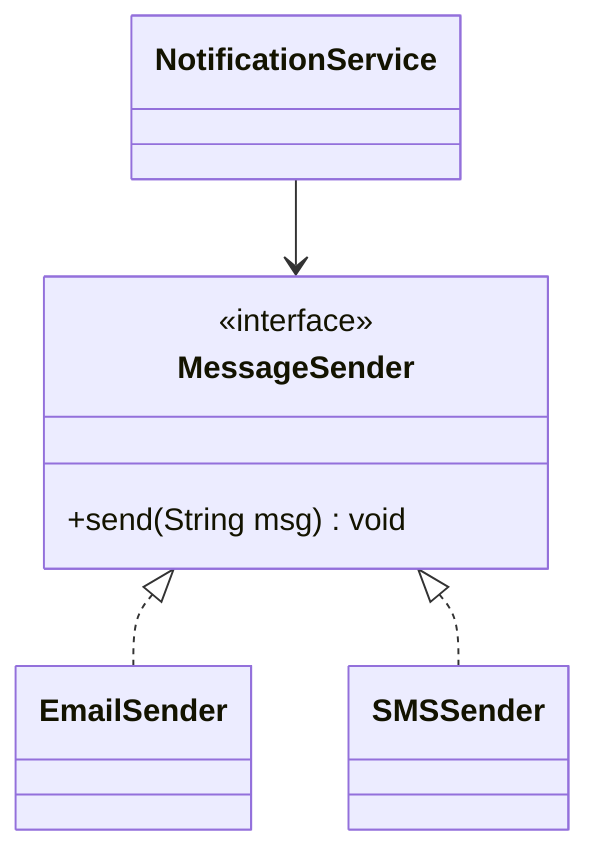

# SOLID Principles in Object-Oriented Design

SOLID is a mnemonic acronym for five design principles intended to make software designs more understandable, flexible, and maintainable. These principles form the bedrock of object-oriented design and clean architecture.

---

## 1. Single Responsibility Principle (SRP)
> **Definition:** A class should have one, and only one, reason to change. It means a class should execute a single, tightly-coupled set of actions.

### Real-World Analogy
Think of a Swiss Army Knife vs. a dedicated screwdriver. A Swiss Army knife does many things, but if you need to change the size of the scissor blade, you might have to redesign the entire handle casing. A dedicated screwdriver has a single purpose; changing its tip does not affect your scissors.

### Violating Design vs. Refactored Design
Below is a class that violates SRP by handling business calculations, reporting/printing logic, and database persistence inside a single entity.

```java
// VIOLATION: Class has three distinct reasons to change (Calculations, Printing, Saving)
class Invoice {
    private double amount;
    private double taxRate;

    public Invoice(double amount, double taxRate) {
        this.amount = amount;
        this.taxRate = taxRate;
    }

    public double calculateTotal() {
        return amount + (amount * taxRate);
    }

    public void printInvoice() {
        System.out.println("Invoice Total: $" + calculateTotal());
    }

    public void saveToDatabase() {
        System.out.println("Saving invoice to DB...");
    }
}
```

#### Why it fails:
If the database schema changes (e.g. migrating from MySQL to MongoDB), the `Invoice` class must be modified. If the printing format changes (e.g. printing HTML instead of Console text), the `Invoice` class must be modified. This couples unrelated subsystems.

#### SRP Compliant Refactoring:
```java
// 1. Domain entity handling business calculations
class Invoice {
    private final double amount;
    private final double taxRate;

    public Invoice(double amount, double taxRate) {
        this.amount = amount;
        this.taxRate = taxRate;
    }

    public double getAmount() { return amount; }
    public double getTaxRate() { return taxRate; }
    public double calculateTotal() { return amount + (amount * taxRate); }
}

// 2. Printing subsystem
class InvoicePrinter {
    public void printToConsole(Invoice invoice) {
        System.out.println("=== INVOICE DETAILS ===");
        System.out.println("Subtotal: $" + invoice.getAmount());
        System.out.println("Total Due: $" + invoice.calculateTotal());
    }
}

// 3. Persistence subsystem
class InvoiceRepository {
    public void save(Invoice invoice) {
        System.out.println("SQL: INSERT INTO invoices VALUES (" + invoice.calculateTotal() + ");");
    }
}
```

---

## 2. Open-Closed Principle (OCP)
> **Definition:** Software entities (classes, modules, functions, etc.) should be open for extension, but closed for modification.



### Code Violation & OCP Compliant Implementation
Below, we refactor a payment processing engine. The violation uses a switch-case statement, requiring code modification whenever a new payment type is added. The refactored version uses polymorphism.

```java
// OCP Compliant Design

// 1. Abstraction (Open for extension)
interface PaymentMethod {
    void process(double amount);
}

// 2. Extensions (Adding new methods requires zero modifications to the core service)
class CreditCardPayment implements PaymentMethod {
    public void process(double amount) {
        System.out.println("Charging $" + amount + " to Credit Card.");
    }
}

class PayPalPayment implements PaymentMethod {
    public void process(double amount) {
        System.out.println("Charging $" + amount + " via PayPal account.");
    }
}

// 3. Core Engine (Closed for modification)
class PaymentProcessor {
    public void executePayment(PaymentMethod method, double amount) {
        // Core engine does not care about concrete classes; it executes the abstraction
        method.process(amount);
    }
}
```

---

## 3. Liskov Substitution Principle (LSP)
> **Definition:** Objects of a superclass should be replaceable with objects of its subclasses without breaking the application or altering correctness.

### The Classic Violation: Rectangle & Square
If a `Square` inherits from `Rectangle`, it inherits the `setWidth` and `setHeight` methods. However, changing a square's width must change its height to maintain square constraints, violating rectangle behavior expectations.



### LSP Compliant Refactoring
If a subclass cannot fulfill the behavior contracts of its parent class, they must not share a direct inheritance tree. Instead, use a common minimal interface or composition.

```java
interface Shape {
    int getArea();
}

class Rectangle implements Shape {
    private int width;
    private int height;

    public Rectangle(int w, int h) { this.width = w; this.height = h; }
    public void setWidth(int w) { this.width = w; }
    public void setHeight(int h) { this.height = h; }
    public int getArea() { return width * height; }
}

class Square implements Shape {
    private int side;

    public Square(int side) { this.side = side; }
    public void setSide(int s) { this.side = s; }
    public int getArea() { return side * side; }
}
```

---

## 4. Interface Segregation Principle (ISP)
> **Definition:** Clients should not be forced to depend on methods they do not use. Split fat interfaces into smaller, cohesive ones.

### Code Violation & Refactoring
```java
// VIOLATION: Fat interface forces simple printers to implement scanner/fax methods
interface IMachine {
    void print();
    void scan();
    void fax();
}

// REFACTORING: Highly cohesive interfaces
interface Printer { void print(); }
interface Scanner { void scan(); }
interface Fax { void fax(); }

class BasicPrinter implements Printer {
    public void print() { System.out.println("Printing document..."); }
}

class AllInOneOfficePrinter implements Printer, Scanner, Fax {
    public void print() { System.out.println("Printing..."); }
    public void scan() { System.out.println("Scanning..."); }
    public void fax() { System.out.println("Faxing..."); }
}
```

---

## 5. Dependency Inversion Principle (DIP)
> **Definition:** High-level modules should not depend on low-level modules. Both should depend on abstractions. Abstractions should not depend on details. Details should depend on abstractions.



### DIP Compliant Implementation
```java
interface MessageSender {
    void send(String msg);
}

class EmailSender implements MessageSender {
    public void send(String msg) { System.out.println("Email: " + msg); }
}

class SMSSender implements MessageSender {
    public void send(String msg) { System.out.println("SMS: " + msg); }
}

// High-level module depends on abstraction (MessageSender), not concrete details (EmailSender)
class NotificationService {
    private final MessageSender sender;

    // Dependency Injection (Constructor Injection)
    public NotificationService(MessageSender sender) {
        this.sender = sender;
    }

    public void alertUser(String alarm) {
        sender.send("ALARM: " + alarm);
    }
}
```

---

## 6. Edge Cases & Architectural Pitfalls

> [!WARNING]
> * **Over-Engineering (SRP/ISP Trap):** Breaking down interfaces and classes too far leads to "class explosion," making the code hard to navigate. Apply SRP pragmatically when classes actually have multiple distinct stakeholders.
> * **Premature Generalization (OCP Trap):** Making every class open for extension using interfaces before understanding actual system requirements increases complexity without benefit. Follow the *Rule of Three*: refactor to OCP only when adding a concrete variation for the third time.

---

## 7. Detailed Interview Q&A

### Q1: What is the differences between Dependency Inversion (DIP), Dependency Injection (DI), and Inversion of Control (IoC)?
* **DIP:** A design *principle* recommending that high-level policies should not depend on low-level implementation details.
* **DI:** A design *pattern* for passing dependencies into a class (e.g., Constructor, Setter, or Field Injection) rather than letting the class instantiate them.
* **IoC:** A programming *style* where the control flow of the program is inverted. Instead of your code calling a framework library, a framework container (like Spring) controls program lifecycle and calls your code.

### Q2: How does violating LSP break polymorphic code correctness?
LSP guarantees that you can pass any subclass to a client method expecting the superclass without altering correctness. If a subclass method overrides the superclass but behaves unexpectedly (e.g. throws `UnsupportedOperationException`, relaxes precondition checks, or tightens postconditions), the client code will fail unexpectedly at runtime, rendering polymorphism unreliable.

### Q3: Why is OCP often described as the most critical SOLID principle?
OCP allows systems to grow safely. By structuring code such that new features are added by creating *new* classes (extensions) rather than modifying *existing* code, you minimize the surface area of regression bugs. Existing unit tests remain green because the code they test has not been touched.

### Q4: Can you explain the relation between SRP and high cohesion?
Cohesion measures how closely related the functions inside a class are. SRP mandates that a class should do a single logical thing, which naturally leads to highly cohesive classes. Highly cohesive, single-responsibility code is easier to unit test, reuse, and debug.

### Q5: How do we fix a legacy codebase that violates DIP?
1. Identify high-level classes that directly instantiate low-level utility classes (`new LowLevelService()`).
2. Extract an interface from the low-level utility class.
3. Modify the high-level class constructor to accept this interface as an argument.
4. Leverage a Dependency Injection container (or manually build dependencies inside a main class/factory) to wire them together.
