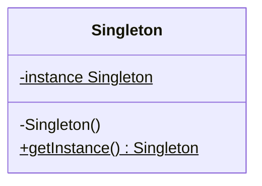
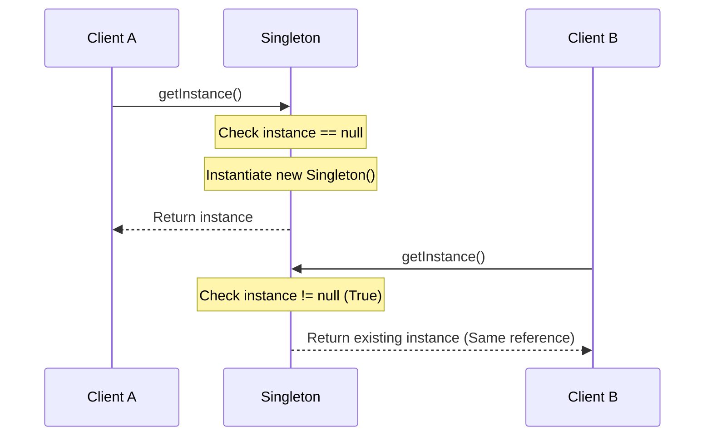

# Singleton Creational Design Pattern

Singleton ensures a class has only one instance and provides a global point of access to it. It is one of the most widely used and criticized creational design patterns.

---

## 1. Intent & Context
* **Purpose:** Coordinate access to a shared resource (such as a database connection pool, thread pool, cache, or configuration manager).
* **Pitfall:** Often acts as an anti-pattern when used excessively, introducing global mutable state that makes unit testing difficult (due to state bleed between tests).

---

## 2. Visual Representations





---

## 3. Production-Ready Java Implementations

### Implementation A: Eager Initialization (Thread-Safe)
Instantiated at class-loading time. Safe from multi-threaded concurrency, but consumes memory even if the application never requests the instance.
```java
public class EagerSingleton {
    private static final EagerSingleton INSTANCE = new EagerSingleton();
    
    private EagerSingleton() {} // Private constructor prevents new keyword
    
    public static EagerSingleton getInstance() {
        return INSTANCE;
    }
}
```

### Implementation B: Double-Checked Locking (Lazy & High Performance)
Uses `volatile` to prevent CPU instruction reordering. Synchronizes only on the first instantiation path, avoiding synchronization overhead on subsequent reads.
```java
public class DoubleCheckedSingleton {
    private static volatile DoubleCheckedSingleton instance;

    private DoubleCheckedSingleton() {
        // Guard against Reflection
        if (instance != null) {
            throw new IllegalStateException("Instance already created!");
        }
    }

    public static DoubleCheckedSingleton getInstance() {
        if (instance == null) { // Check 1 (No lock overhead)
            synchronized (DoubleCheckedSingleton.class) { // Lock
                if (instance == null) { // Check 2
                    instance = new DoubleCheckedSingleton();
                }
            }
        }
        return instance;
    }
}
```

### Implementation C: Bill Pugh Singleton (Static Inner Class) - Recommended
Uses JVM classloader behavior. The nested class `SingletonHelper` is not loaded in memory until `getInstance()` is invoked, providing thread-safety and lazy-loading natively.
```java
public class BillPughSingleton {
    private BillPughSingleton() {}

    private static class SingletonHelper {
        private static final BillPughSingleton INSTANCE = new BillPughSingleton();
    }

    public static BillPughSingleton getInstance() {
        return SingletonHelper.INSTANCE;
    }
}
```

### Implementation D: Enum Singleton (Most Secure)
Enum types are compiled into static classes with instance protections handled natively by the JVM.
```java
public enum EnumSingleton {
    INSTANCE;
    
    private int configurationValue;
    
    public int getConfigurationValue() { return configurationValue; }
    public void setConfigurationValue(int val) { this.configurationValue = val; }
}
```

---

## 4. Bypassing and Protecting Singleton

### 1. Reflection Attack
Using Java reflection, any private constructor can be set to `accessible`.
* *Mitigation:* Throw an exception in the private constructor if the static instance reference is already instantiated (see implementation B).

### 2. Serialization Attack
When a Singleton is serialized to disk and read back (deserialized), it creates a new instance.
* *Mitigation:* Implement the `readResolve` hook method:
```java
protected Object readResolve() {
    return getInstance(); // Returns the existing instance instead of creating a new one
}
```

### 3. Cloning Attack
Implementing `Cloneable` lets clients call `clone()` to create duplicates.
* *Mitigation:* Override `clone()` and throw `CloneNotSupportedException`:
```java
@Override
protected Object clone() throws CloneNotSupportedException {
    throw new CloneNotSupportedException("Singleton instances cannot be cloned.");
}
```

---

## 5. Detailed Interview Q&A

### Q1: Why is the `volatile` keyword mandatory in Double-Checked Locking?
Object creation (`instance = new DoubleCheckedSingleton()`) is compiled into three steps:
1. Allocate memory space.
2. Call constructor to initialize fields.
3. Assign the memory reference to the `instance` variable.

Without `volatile`, the compiler/CPU can reorder steps 2 and 3. If a thread accesses `getInstance()` while another thread is executing step 3 (but before step 2 has completed), it will see a non-null reference pointing to uninitialized, garbage memory, resulting in a crash when it tries to call methods on the object.

### Q2: Why is the Enum Singleton considered the most robust implementation?
Enum values are instantiated once during class loading, guaranteeing thread-safety. The JVM prohibits Reflection from calling constructors on Enums (`Constructor.newInstance()` throws an exception). Additionally, the Java serialization engine handles Enums natively, ensuring the exact same reference is returned during deserialization.

### Q3: How does the Singleton pattern affect Unit Testing?
Singletons introduce **global state** and **tight coupling**. If a singleton communicates with a database or keeps state, mock objects cannot be substituted easily because constructors are private. Furthermore, because singletons persist in memory throughout the JVM run, test cases executing sequentially can modify the singleton state, leading to unpredictable, hard-to-debug "leaky" test errors.

### Q4: When is Eager Initialization preferred over Lazy Initialization?
Use Eager Initialization when:
1. The memory cost of the instance is negligible.
2. The instance is guaranteed to be used when the application runs.
3. The instantiation logic runs quickly and does not delay application boot times.

### Q5: What is the relation between Singleton Pattern and Spring beans?
By default, Spring framework manages all configured beans as **Singletons**. However, this is distinct from the Design Pattern. A Design Pattern Singleton is single *per classloader* due to static instances. A Spring Singleton is single *per Spring Container Context*. You can instantiate multiple instances of a bean class if they are loaded under separate Spring contexts or configured with a prototype scope.
