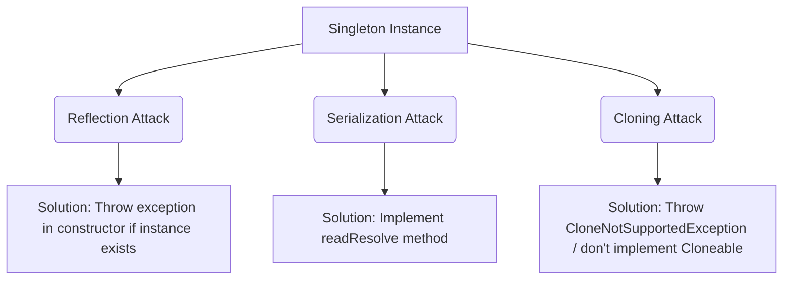

# Singleton Creational Design Pattern

Singleton ensures a class has only one instance and provides a global point of access to it.

---

## Implementations

### 1. Eager Initialization
Created when class loading occurs. Safe from multithreading, but wastes resource if instance is never used.
```java
public class EagerSingleton {
    private static final EagerSingleton INSTANCE = new EagerSingleton();
    private EagerSingleton() {}
    public static EagerSingleton getInstance() { return INSTANCE; }
}
```

### 2. Lazy Initialization (Thread-Safe with Double-Checked Locking)
Instances are created only when needed. `volatile` prevents out-of-order execution during object creation.
```java
public class DoubleCheckedLockingSingleton {
    private static volatile DoubleCheckedLockingSingleton instance;
    private DoubleCheckedLockingSingleton() {}

    public static DoubleCheckedLockingSingleton getInstance() {
        if (instance == null) { // First check
            synchronized (DoubleCheckedLockingSingleton.class) {
                if (instance == null) { // Second check
                    instance = new DoubleCheckedLockingSingleton();
                }
            }
        }
        return instance;
    }
}
```

### 3. Bill Pugh Singleton (Static Inner Class) - Recommended
Uses the ClassLoader mechanism. The inner class is loaded only when `getInstance()` is called, ensuring lazy loading and 100% thread safety without synchronization overhead.
```java
public class BillPughSingleton {
    private BillPughSingleton() {}

    private static class SingletonHelper {
        private static final BillPughSingleton INSTANCE = new BillPughSingleton();
    }

    public static BillPughSingleton getInstance() {
        return SingletonHelper.INSTANCE;
    }
}
```

### 4. Enum Singleton (Effective Java) - Most Secure
Guarantees protection against Reflection, Serialization, and Cloning attacks natively.
```java
public enum EnumSingleton {
    INSTANCE;
    public void performAction() { /* logic */ }
}
```

---

## Breaking and Protecting Singleton



### 1. Reflection Attack & Mitigation
Reflection can access private constructors.
```java
// Protection in constructor
private DoubleCheckedLockingSingleton() {
    if (instance != null) {
        throw new IllegalStateException("Instance already created!");
    }
}
```

### 2. Serialization Attack & Mitigation
De-serializing creates a new instance.
```java
// Protection in Singleton class
protected Object readResolve() {
    return getInstance(); // Returns the existing instance
}
```

### 3. Cloning Attack & Mitigation
Cloning creates copies.
```java
@Override
protected Object clone() throws CloneNotSupportedException {
    throw new CloneNotSupportedException("Singleton cannot be cloned");
}
```

---

## Interview Q&A Corner

> [!WARNING]
> **Q: Why is the `volatile` keyword crucial in Double-Checked Locking?**
> A: Object creation in Java occurs in 3 steps: (1) Allocate memory, (2) Initialize object, (3) Point reference to memory. Without `volatile`, the CPU can re-order steps (2) and (3). Another thread could read a non-null reference that points to uninitialized memory, leading to a crash.
>
> **Q: How does Enum Singleton prevent reflection?**
> A: The JVM internals block Reflection from creating instances of an Enum class (`Constructor.newInstance()` throws an exception if the class is an Enum).
