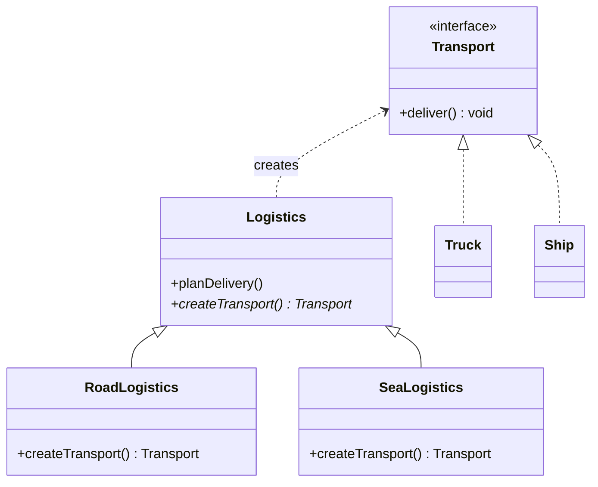
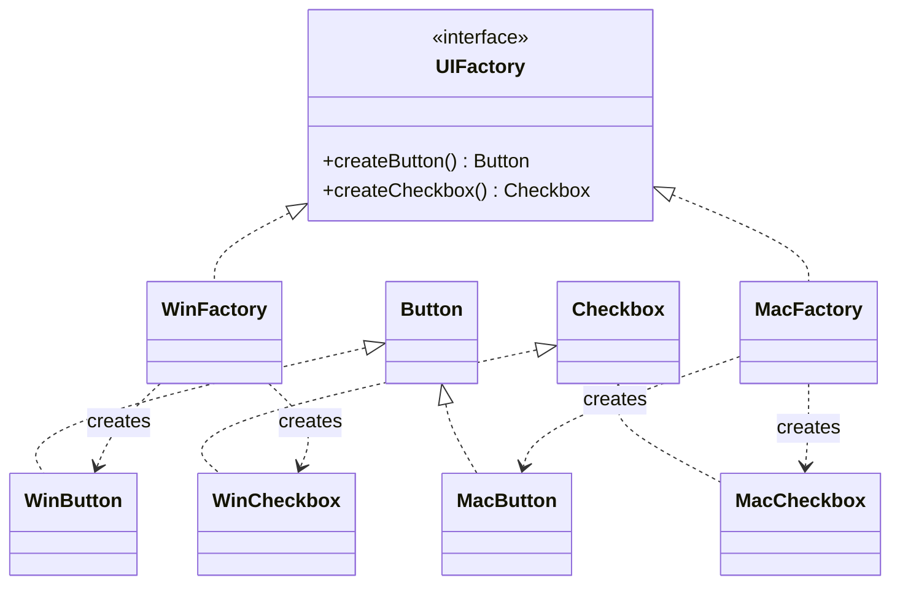

# Factory & Abstract Factory Creational Design Patterns

## 1. Factory Method Pattern
> **Definition:** Defines an interface for creating an object, but lets subclasses decide which class to instantiate.

### Class Diagram


### Java Implementation
```java
interface Transport { void deliver(); }
class Truck implements Transport { public void deliver() { System.out.println("Deliver by road"); } }
class Ship implements Transport { public void deliver() { System.out.println("Deliver by sea"); } }

abstract class Logistics {
    public void planDelivery() {
        Transport t = createTransport();
        t.deliver();
    }
    protected abstract Transport createTransport();
}
class RoadLogistics extends Logistics {
    protected Transport createTransport() { return new Truck(); }
}
class SeaLogistics extends Logistics {
    protected Transport createTransport() { return new Ship(); }
}
```

---

## 2. Abstract Factory Pattern
> **Definition:** Provides an interface for creating families of related or dependent objects without specifying their concrete classes.

### Concept Comparison
* **Factory Method:** Decouples a single product creation using inheritance (subclasses override creation method).
* **Abstract Factory:** Decouples a family of related products using composition (factory interface contains multiple creation methods).

### Abstract Factory Example
Creating UI controls matching a specific operating system theme (Windows vs Mac).



### Java Implementation
```java
// Product Families
interface Button { void paint(); }
interface Checkbox { void paint(); }

class WinButton implements Button { public void paint() { System.out.println("Windows Button"); } }
class MacButton implements Button { public void paint() { System.out.println("Mac Button"); } }
class WinCheckbox implements Checkbox { public void paint() { System.out.println("Windows Checkbox"); } }
class MacCheckbox implements Checkbox { public void paint() { System.out.println("Mac Checkbox"); } }

// Factories
interface UIFactory {
    Button createButton();
    Checkbox createCheckbox();
}
class WinFactory implements UIFactory {
    public Button createButton() { return new WinButton(); }
    public Checkbox createCheckbox() { return new WinCheckbox(); }
}
class MacFactory implements UIFactory {
    public Button createButton() { return new MacButton(); }
    public Checkbox createCheckbox() { return new MacCheckbox(); }
}
```

---

## Interview Q&A Corner

> [!TIP]
> **Q: When should I choose Factory Method vs Abstract Factory?**
> A: Use **Factory Method** when your code needs to work with different variants of a single product (e.g. only Buttons). Use **Abstract Factory** when your code needs to coordinate multiple related products forming a family (e.g. Buttons AND Checkboxes of a matching theme).
