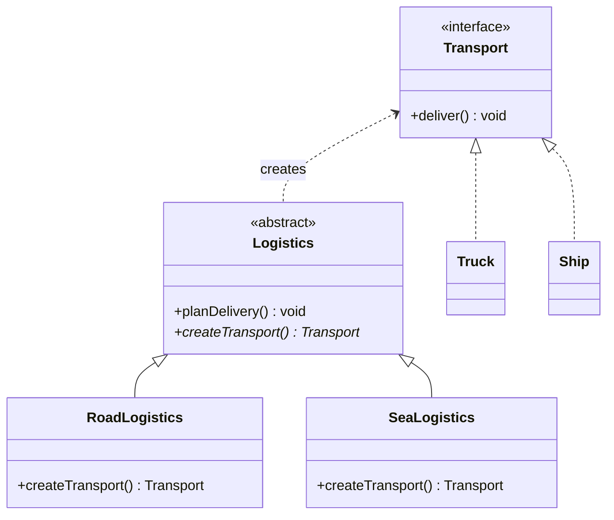
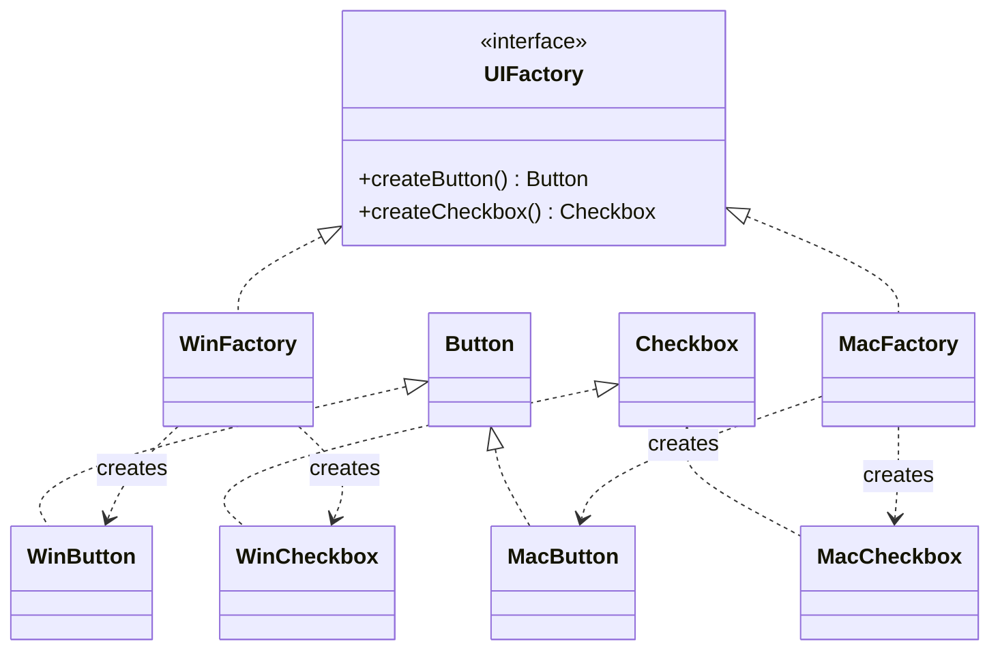

# Factory Method & Abstract Factory Creational Design Patterns

Decoupling object instantiation logic from client code is crucial for building maintainable, OCP-compliant software systems. Factory Method and Abstract Factory are the two primary design patterns used to solve this problem.

---

## 1. Factory Method Pattern
> **Definition:** Defines an interface for creating an object, but lets subclasses decide which class to instantiate. It delegates object creation from the base class to subclasses.

### When to use
* A class cannot anticipate the type of objects it needs to create.
* You want to localize and isolate the object creation subsystem.

### Class Diagram



### Production-Ready Java Implementation

```java
// 1. Product Abstraction
interface Transport {
    void deliver();
}

// 2. Concrete Products
class Truck implements Transport {
    public void deliver() {
        System.out.println("Cargo delivered by road using a semi-truck.");
    }
}

class Ship implements Transport {
    public void deliver() {
        System.out.println("Cargo delivered by sea route using a container ship.");
    }
}

// 3. Creator Abstraction (Open-Closed Principle Compliant)
abstract class Logistics {
    public void planDelivery() {
        // Business logic operates on the abstraction
        Transport transport = createTransport();
        System.out.println("Initializing logistics planning...");
        transport.deliver();
    }
    
    // Factory Method to be overridden by subclasses
    protected abstract Transport createTransport();
}

// 4. Concrete Creators
class RoadLogistics extends Logistics {
    @Override
    protected Transport createTransport() {
        return new Truck();
    }
}

class SeaLogistics extends Logistics {
    @Override
    protected Transport createTransport() {
        return new Ship();
    }
}
```

---

## 2. Abstract Factory Pattern
> **Definition:** Provides an interface for creating families of related or dependent objects without specifying their concrete classes. It utilizes composition over inheritance to produce groups of matching products.

### When to use
* The system needs to be independent of how its products are created, composed, and represented.
* The system is configured with one of multiple product families (e.g., Windows UI vs. Mac UI components).

### Class Diagram



### Production-Ready Java Implementation

```java
// 1. Abstract Products
interface Button { void paint(); }
interface Checkbox { void paint(); }

// 2. Concrete Product Family A (Windows Theme)
class WinButton implements Button {
    public void paint() { System.out.println("Rendering Windows-styled Button."); }
}
class WinCheckbox implements Checkbox {
    public void paint() { System.out.println("Rendering Windows-styled Checkbox."); }
}

// 3. Concrete Product Family B (Mac Theme)
class MacButton implements Button {
    public void paint() { System.out.println("Rendering macOS-styled Button."); }
}
class MacCheckbox implements Checkbox {
    public void paint() { System.out.println("Rendering macOS-styled Checkbox."); }
}

// 4. Abstract Factory Abstraction
interface UIFactory {
    Button createButton();
    Checkbox createCheckbox();
}

// 5. Concrete Factories
class WinFactory implements UIFactory {
    public Button createButton() { return new WinButton(); }
    public Checkbox createCheckbox() { return new WinCheckbox(); }
}

class MacFactory implements UIFactory {
    public Button createButton() { return new MacButton(); }
    public Checkbox createCheckbox() { return new MacCheckbox(); }
}
```

---

## 3. Comparison: Factory Method vs. Abstract Factory

| Feature | Factory Method | Abstract Factory |
|---------|----------------|------------------|
| **Pattern Type** | Class-level (Inheritance-based) | Object-level (Composition-based) |
| **Products Created** | Returns a single product (one creation method) | Returns a family of products (multiple creation methods) |
| **decoupling method** | Subclass overrides the base class factory method | Client is injected with a concrete factory reference |
| **Adding New Products**| Easy: subclass the creator | Hard: must modify the Factory interface and all implementors |

---

## 4. Detailed Interview Q&A

### Q1: What is a Simple Factory, and is it a standard Gang of Four (GoF) design pattern?
No, **Simple Factory** (or Static Factory) is not a formal GoF pattern. It is a coding idiom where a class has a static method containing an `if-else` or `switch` block returning concrete objects based on input arguments. It violates the Open-Closed Principle because adding a new concrete product requires modifying the switch block inside the factory class.

### Q2: How does the Factory Method pattern adhere to OCP?
Factory Method adheres to OCP by eliminating the need to modify base classes when adding new product types. If you need to support a new transport type (e.g. `AirLogistics` and `Airplane`), you write those classes as extensions. The core `Logistics` engine is never touched or recompiled.

### Q3: What is the main design trade-off when using the Abstract Factory pattern?
The main trade-off is **rigidity in product interfaces**. Abstract Factory is designed to produce a stable *family of products*. If your system needs to add a new product category (e.g., adding `TextBox` to `UIFactory`), you must modify the `UIFactory` interface, breaking all existing concrete factories (`WinFactory`, `MacFactory`) until they implement the new method.

### Q4: How does Dependency Injection complement Factory Patterns?
Dependency Injection allows you to inject the concrete Factory instance into a client dynamically. For example, in Spring, you can inject a `UIFactory` bean into your application context. The client is completely decoupled from the knowledge of *which* factory (Windows or Mac) is active.

### Q5: Can a class implement both Factory Method and Abstract Factory patterns?
Yes. It is common to implement concrete methods in an Abstract Factory subclass using the Factory Method pattern. An Abstract Factory defines the contract for multiple products, but a concrete factory subclass can override individual method creation paths internally using its own factory method hierarchies.
