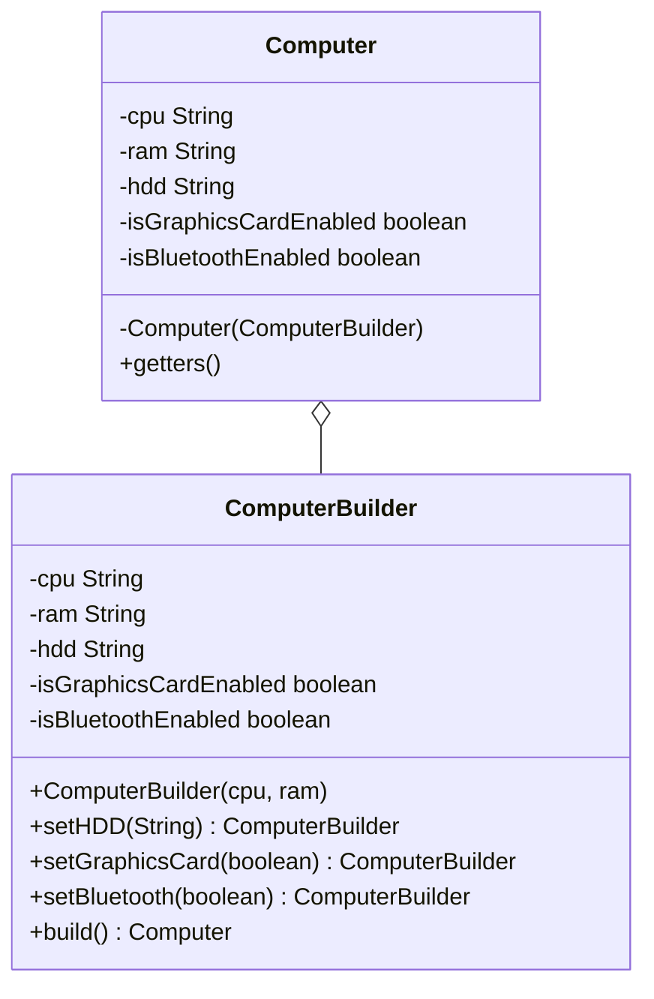
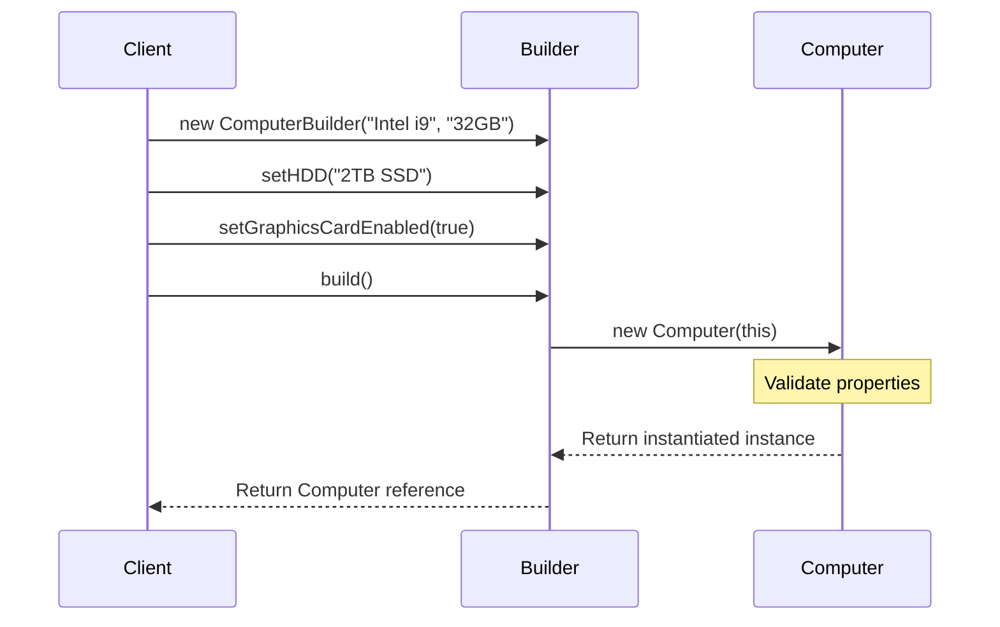

# Builder Creational Design Pattern

Builder separates the construction of a complex object from its representation, allowing the same construction process to create different representations. It is particularly useful for configuring objects with large numbers of optional parameters.

---

## 1. Intent & Context
* **Problem:** A class has 10+ properties, some mandatory and some optional. Writing overloaded constructors (telescoping constructors) makes client code unreadable, error-prone, and hard to maintain.
* **Solution:** Provide a step-by-step assembly API (Fluent Interface) that returns the fully constructed, validated, and immutable object.

---

## 2. Visual Representation





---

## 3. Production-Ready Java Implementation

Below is a thread-safe, immutable implementation featuring validation logic inside the builder stage.

```java
public class Computer {
    // 1. All fields are marked final to enforce strict immutability
    private final String CPU;
    private final String RAM;
    private final String HDD;
    private final boolean isGraphicsCardEnabled;
    private final boolean isBluetoothEnabled;

    // 2. Private constructor prevents direct instantiation
    private Computer(ComputerBuilder builder) {
        this.CPU = builder.cpu;
        this.RAM = builder.ram;
        this.HDD = builder.hdd;
        this.isGraphicsCardEnabled = builder.isGraphicsCardEnabled;
        this.isBluetoothEnabled = builder.isBluetoothEnabled;
    }

    // 3. Getters (No setters are provided)
    public String getCPU() { return CPU; }
    public String getRAM() { return RAM; }
    public String getHDD() { return HDD; }
    public boolean isGraphicsCardEnabled() { return isGraphicsCardEnabled; }
    public boolean isBluetoothEnabled() { return isBluetoothEnabled; }

    // 4. Nested Static Builder Class
    public static class ComputerBuilder {
        // Mandatory parameters
        private final String cpu;
        private final String ram;

        // Optional parameters (default values can be set here)
        private String hdd = "512GB NVMe SSD";
        private boolean isGraphicsCardEnabled = false;
        private boolean isBluetoothEnabled = false;

        public ComputerBuilder(String cpu, String ram) {
            if (cpu == null || ram == null) {
                throw new IllegalArgumentException("CPU and RAM specifications are mandatory!");
            }
            this.cpu = cpu;
            this.ram = ram;
        }

        public ComputerBuilder setHDD(String hdd) {
            this.hdd = hdd;
            return this; // Return builder instance for fluid chaining
        }

        public ComputerBuilder setGraphicsCardEnabled(boolean enabled) {
            this.isGraphicsCardEnabled = enabled;
            return this;
        }

        public ComputerBuilder setBluetoothEnabled(boolean enabled) {
            this.isBluetoothEnabled = enabled;
            return this;
        }

        // Build method validates consistency and instantiates the target object
        public Computer build() {
            validateSpecifications();
            return new Computer(this);
        }

        private void validateSpecifications() {
            if (isGraphicsCardEnabled && hdd.contains("HDD")) {
                throw new IllegalStateException("Cannot run high-performance graphics card with slow HDD!");
            }
        }
    }
}
```

### Usage Example
```java
Computer gamingRig = new Computer.ComputerBuilder("Intel Core i9", "64GB DDR5")
    .setHDD("4TB NVMe SSD")
    .setGraphicsCardEnabled(true)
    .setBluetoothEnabled(true)
    .build();
```

---

## 4. Edge Cases & Concurrency

> [!WARNING]
> * **Thread-Safety during Build:** While the created `Computer` object is immutable and thread-safe, the `ComputerBuilder` itself is mutable. Avoid sharing a single builder instance across multiple concurrent threads. Use a local builder execution stack per thread.
> * **Object State Inconsistency:** In multi-step building processes, if validation is done step-by-step rather than completely inside the final `build()` method, partial invalid states can escape during build execution. Always defer validation check logic to the final `build()` execution path.

---

## 5. Detailed Interview Q&A

### Q1: What is the difference between Builder Pattern and Abstract Factory Pattern?
* **Builder** focuses on constructing a complex object *step-by-step* (often configuring optional attributes). The construction process contains multiple method configuration calls and returns the product at the end.
* **Abstract Factory** focuses on creating families of objects *instantly* with a single method call. It does not construct step-by-step.

### Q2: Why is the Builder constructor in the target class private?
The private constructor forces client code to use the `Builder` to instantiate the class. This guarantees that all validation checks inside the `build()` method are bypassed by no one, preventing clients from creating an invalid, half-configured object.

### Q3: How do you achieve validation inside a Builder pattern?
Implement validation checks inside the `build()` method of the `Builder` class before passing the builder instance to the private constructor of the target class. If validation fails, throw an `IllegalStateException` or custom validation exceptions.

### Q4: How is Lombok's `@Builder` annotation different from manual implementation?
Lombok's `@Builder` automatically generates a static nested builder class, fields, fluid setter methods, and a build method at compilation time. However, writing a manual builder is preferred when you need complex construct-time validation logic, checking invariants across multiple attributes (e.g., checking if option A is incompatible with option B).

### Q5: How would you design a Hierarchical Builder for subclasses?
Use Java generic parameters on the builder. The abstract builder class should look like:
`public abstract class Builder<T extends Builder<T>>`
Each subclass builder extends this and overrides a self-returning method `protected abstract T self();` to ensure that method chaining works correctly across all subclasses without requiring parent class type-casting.
