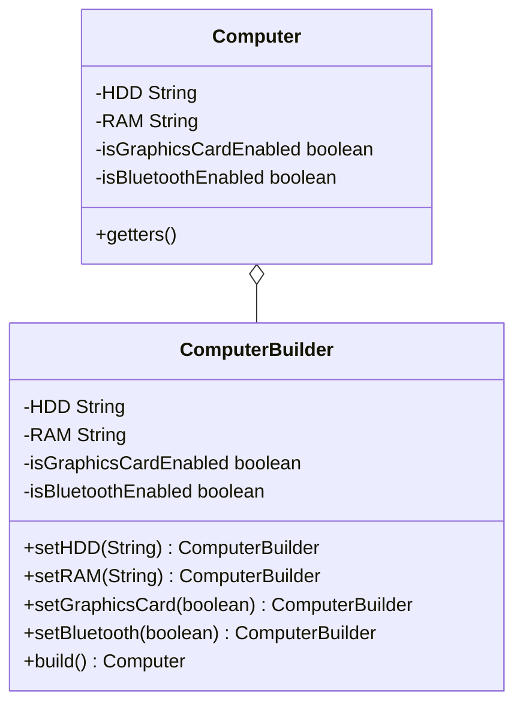

# Builder Creational Design Pattern

Builder separates the construction of a complex object from its representation, allowing the same construction process to create different representations.

---

## Why Builder?
- Avoids "telescoping constructors" (constructors with 10+ overloaded arguments).
- Prevents invalid object states during creation.
- Enables immutability (no setters needed on the target class).

---

## Implementation



### Java Implementation
```java
public class Computer {
    // All attributes are final to ensure immutability
    private final String HDD;
    private final String RAM;
    private final boolean isGraphicsCardEnabled;
    private final boolean isBluetoothEnabled;

    public String getHDD() { return HDD; }
    public String getRAM() { return RAM; }
    public boolean isGraphicsCardEnabled() { return isGraphicsCardEnabled; }
    public boolean isBluetoothEnabled() { return isBluetoothEnabled; }

    // Private constructor so only Builder can instantiate it
    private Computer(ComputerBuilder builder) {
        this.HDD = builder.HDD;
        this.RAM = builder.RAM;
        this.isGraphicsCardEnabled = builder.isGraphicsCardEnabled;
        this.isBluetoothEnabled = builder.isBluetoothEnabled;
    }

    public static class ComputerBuilder {
        private String HDD;
        private String RAM;
        private boolean isGraphicsCardEnabled;
        private boolean isBluetoothEnabled;

        public ComputerBuilder(String hdd, String ram) { // Mandatory fields
            this.HDD = hdd;
            this.RAM = ram;
        }

        public ComputerBuilder setGraphicsCardEnabled(boolean isGraphicsCardEnabled) {
            this.isGraphicsCardEnabled = isGraphicsCardEnabled;
            return this; // Method chaining
        }

        public ComputerBuilder setBluetoothEnabled(boolean isBluetoothEnabled) {
            this.isBluetoothEnabled = isBluetoothEnabled;
            return this;
        }

        public Computer build() {
            // Add custom validation checks here
            if (this.HDD == null || this.RAM == null) {
                throw new IllegalStateException("Required specifications are missing.");
            }
            return new Computer(this);
        }
    }
}
```

### Usage
```java
Computer comp = new Computer.ComputerBuilder("500 GB", "16 GB")
    .setGraphicsCardEnabled(true)
    .setBluetoothEnabled(true)
    .build();
```

---

## Interview Q&A Corner

> [!TIP]
> **Q: How do you achieve validation inside a Builder pattern?**
> A: Validate fields inside the `build()` method before calling the private constructor. This ensures that only fully validated, consistent, and immutable objects are returned to the caller.
>
> **Q: Is the Builder pattern thread-safe?**
> A: Yes. Because the target class has final fields and no setters, it is completely immutable and thread-safe once created. The `Builder` itself is not thread-safe, but it is typically used within a single local thread execution.
