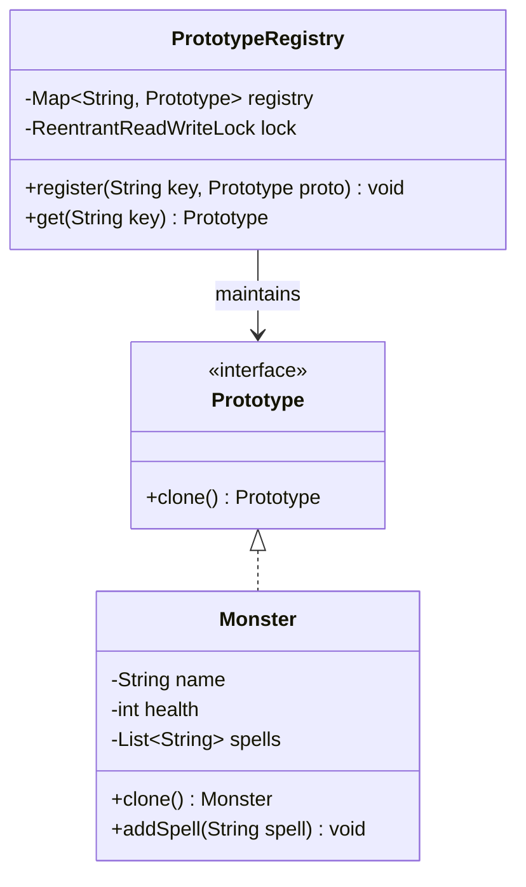

# Prototype Creational Design Pattern

## 1. Core Intent & Problem Statement
The **Prototype Pattern** is a creational design pattern that allows copying existing objects without making your code dependent on their concrete classes. Instead of instantiating a new object via the `new` operator and manually copying every field, an object that supports cloning creates a copy of itself.

### Real-World Analogy
* **Cell Division (Mitosis):** A cell doesn't construct a brand-new copy of itself from basic chemical elements. Instead, it replicates its DNA and splits into two identical cells. The existing cell acts as the prototype.
* **Document Photocopying:** If you need copies of a complex form that is already filled out, you don't take a blank form and fill it out from scratch. You photocopy the filled form and make minor adjustments if needed.

### When to Use
1. **Expensive Object Creation:** When creating an object from scratch involves costly database queries, complex computation, or heavy I/O operations (e.g., loading game assets or database schemas).
2. **Dynamic Instantiation:** When the classes to instantiate are specified at runtime (e.g., loading plugins dynamically).
3. **Avoiding Class Hierarchies:** When you want to avoid a hierarchy of factory classes that parallels the hierarchy of product classes.
4. **State-Preserving Copies:** When you need to capture the current state of an object to revert to it later (e.g., Undo/Redo checkpoints).

### Trade-offs
* **Pros:**
  - Speeds up object creation by cloning pre-configured objects.
  - Reduces boilerplate subclassing (avoids having a Factory subclass for every Concrete Product).
  - Keeps the client decoupled from the concrete classes it instantiates.
* **Cons:**
  - Deep cloning objects with complex circular references is highly non-trivial.
  - Implementations relying on Java's `Object.clone()` can violate OOP encapsulation guidelines and bypass constructor initialization rules.

---

## 2. Visual Representation (Diagrams)

### UML Class Diagram


### Sequence Diagram
```mermaid
sequenceDiagram
    autonumber
    actor Client
    participant Registry as PrototypeRegistry
    participant PrototypeInstance as Monster (Prototype)
    participant CloneInstance as Monster (Clone)

    Client->>Registry: get("SuperOrc")
    activate Registry
    Registry->>PrototypeInstance: clone()
    activate PrototypeInstance
    create participant CloneInstance
    PrototypeInstance-->CloneInstance: deep copy fields & lists
    PrototypeInstance-->>Registry: return CloneInstance
    deactivate PrototypeInstance
    Registry-->>Client: return CloneInstance
    deactivate Registry
    Client->>CloneInstance: customize (e.g., setHealth(150))
```

---

## 3. Violating Design vs. Refactored Design

### Violating Design (Without Prototype Pattern)
In this design, if the client wants to create different variants of an NPC/Monster, it has to know the exact concrete class, instantiate it, and manually copy all internal states.

```java
// Client code violating encapsulation and open-closed principles
public class GameEngine {
    public void spawnMonster(String type) {
        if (type.equals("Orc")) {
            Orc orc = new Orc("Standard Orc", 100);
            orc.addSpell("Strike");
            orc.addSpell("Block");
            // If we want a cloned one, we must copy manually:
            Orc clonedOrc = new Orc(orc.getName(), orc.getHealth());
            for (String spell : orc.getSpells()) {
                clonedOrc.addSpell(spell);
            }
            // Issues:
            // 1. Client needs to know concrete classes (Orc).
            // 2. Client is responsible for deep copying internal lists (getSpells()).
            // 3. Modifying internal representation breaks client code.
        }
    }
}
```

### Why it fails:
1. **Tight Coupling:** The client must be aware of the exact internal properties of the `Orc` class to copy it.
2. **Violation of DRY/Encapsulation:** The logic for copying resides in the client rather than the class itself. If a new list/reference is added (e.g., `Weapon`), every client copy-routine must be updated.
3. **Constructor dependency:** We are forced to expose fields via getters and setters, breaking encapsulation.

### Refactored Design (With Prototype Pattern)
The client asks the registry or the object itself to create a clone. The object handles its own cloning logic, ensuring encapsulation.

---

## 4. Production-Ready Java Implementation

Below is a complete, production-grade implementation of the Prototype Pattern representing a game monster registry. It features:
* **Deep Copying** of mutable lists to prevent shared-state side effects.
* **Thread-safe registry** using `ReentrantReadWriteLock`.
* **Copy constructor** pattern to bypass Java's flawed `Object.clone()` mechanism.

### 1. Prototype Interface
```java
package lowlevel.design.patterns.prototype;

public interface Prototype {
    Prototype clone();
}
```

### 2. Concrete Prototype (Monster)
```java
package lowlevel.design.patterns.prototype;

import java.util.ArrayList;
import java.util.List;
import java.util.Objects;

public class Monster implements Prototype {
    private final String name;
    private int health;
    private final List<String> abilities;

    public Monster(String name, int health, List<String> abilities) {
        this.name = name;
        this.health = health;
        this.abilities = new ArrayList<>(abilities); // Defensive copy
    }

    // Copy Constructor - the idiomatic way in Java to handle prototypes
    public Monster(Monster source) {
        this.name = source.name;
        this.health = source.health;
        // Deep copy of the mutable collection
        this.abilities = new ArrayList<>(source.abilities);
    }

    public void setHealth(int health) {
        this.health = health;
    }

    public void addAbility(String ability) {
        this.abilities.add(ability);
    }

    public String getName() {
        return name;
    }

    public int getHealth() {
        return health;
    }

    public List<String> getAbilities() {
        return new ArrayList<>(abilities); // Return copy to protect state
    }

    @Override
    public Monster clone() {
        return new Monster(this);
    }

    @Override
    public String toString() {
        return "Monster{name='" + name + "', health=" + health + ", abilities=" + abilities + "}";
    }
}
```

### 3. Thread-Safe Prototype Registry
```java
package lowlevel.design.patterns.prototype;

import java.util.HashMap;
import java.util.Map;
import java.util.concurrent.locks.ReentrantReadWriteLock;

public class PrototypeRegistry {
    private final Map<String, Prototype> prototypes = new HashMap<>();
    private final ReentrantReadWriteLock rwLock = new ReentrantReadWriteLock();

    public void register(String key, Prototype prototype) {
        rwLock.writeLock().lock();
        try {
            prototypes.put(key, prototype);
        } finally {
            rwLock.writeLock().unlock();
        }
    }

    public Prototype get(String key) {
        rwLock.readLock().lock();
        try {
            Prototype prototype = prototypes.get(key);
            if (prototype == null) {
                throw new IllegalArgumentException("Prototype not registered: " + key);
            }
            return prototype.clone(); // Return clone to prevent modifications to the prototype source
        } finally {
            rwLock.readLock().unlock();
        }
    }
}
```

### 4. Client Driver Code
```java
package lowlevel.design.patterns.prototype;

import java.util.List;

public class GameSimulation {
    public static void main(String[] args) {
        // Initialize Registry
        PrototypeRegistry registry = new PrototypeRegistry();

        // Create standard templates
        Monster standardOrc = new Monster("Orc Warrior", 100, List.of("Slash", "Shield Block"));
        Monster standardMage = new Monster("Elven Mage", 70, List.of("Fireball", "Teleport"));

        // Register templates
        registry.register("Orc", standardOrc);
        registry.register("Mage", standardMage);

        // Spawn custom instances
        Monster spawnedOrc1 = (Monster) registry.get("Orc");
        Monster spawnedOrc2 = (Monster) registry.get("Orc");

        // Verify deep copying
        spawnedOrc1.setHealth(120);
        spawnedOrc1.addAbility("Enrage");

        System.out.println("Template Orc: " + standardOrc);
        System.out.println("Spawned Orc 1: " + spawnedOrc1);
        System.out.println("Spawned Orc 2: " + spawnedOrc2);

        // Make sure changing spawnedOrc1 doesn't affect spawnedOrc2 or the prototype
        assert spawnedOrc1.getHealth() != spawnedOrc2.getHealth();
        assert spawnedOrc1.getAbilities().size() != spawnedOrc2.getAbilities().size();
    }
}
```

---

## 5. Edge Cases & Concurrency Handling

### Edge Cases
1. **Circular References:** If a prototype references an object `A` which references `B` which references `A`, a naive recursive deep clone will run into a `StackOverflowError`. To handle this, maintain a mapping of `IdentityHashMap<Object, Object> visited` to keep track of already cloned objects.
2. **Deep vs. Shallow Copying:** Shallow copies fail if the class has mutable object references. In the implementation above, the `abilities` list is deep-copied using `new ArrayList<>(source.abilities)` to prevent side effects.

### Concurrency
* **Registry Thread Safety:** If the registry is updated or read dynamically from multiple threads, using a plain `HashMap` will result in race conditions. We protect registry access with a `ReentrantReadWriteLock`, allowing concurrent reads but exclusive writes.
* **Clone Thread Safety:** The `clone()` operation itself does not modify the original prototype instance (it only reads its fields), making it safe to execute across multiple threads concurrently.

---

## 6. Comprehensive Interview Q&A

### Q1: Why is Java's default `Cloneable` interface and `Object.clone()` method widely considered broken?
**Answer:** 
1. **No constructor call:** `Object.clone()` allocates memory for the new object and copies the fields directly, bypassing the constructor. This means invariant checks, counters, or custom initialization logic written in constructors are completely ignored.
2. **Checked Exception:** It throws `CloneNotSupportedException`, forcing boilerplate `try-catch` blocks.
3. **Type Casting:** It returns `Object` instead of the covariant type (requires explicit downcasting).
4. **Shallow copy defaults:** It only copies references, not the actual nested objects, which leads to bugs where modifying a clone accidentally modifies the prototype.

*Best Practice:* Use a **Copy Constructor** or **Static Factory Method** (like `newInstance()`) to copy objects in Java.

---

### Q2: How can we implement a generic deep clone using Serialization, and what are its trade-offs?
**Answer:**
You can serialize an object to a byte array and deserialize it back. This creates a complete deep copy of the object graph automatically:
```java
public static <T extends Serializable> T deepClone(T object) {
    try {
        ByteArrayOutputStream bos = new ByteArrayOutputStream();
        ObjectOutputStream oos = new ObjectOutputStream(bos);
        oos.writeObject(object);
        
        ByteArrayInputStream bis = new ByteArrayInputStream(bos.toByteArray());
        ObjectInputStream ois = new ObjectInputStream(bis);
        return (T) ois.readObject();
    } catch (Exception e) {
        throw new RuntimeException("Serialization clone failed", e);
    }
}
```
**Trade-offs:**
- **Pros:** Extremely simple to implement; handles complex cyclic object graphs automatically.
- **Cons:** Performance is very slow compared to manual field copying (due to I/O streams and reflection). Additionally, all classes in the object tree must implement `Serializable`, which might not always be possible or desirable.

---

### Q3: How do you prevent cloning from breaking a Singleton class?
**Answer:**
If a Singleton class implements `Cloneable` (directly or by inheriting from a class that does), callers could bypass the singleton pattern. To prevent this, override `clone()` to throw an exception or return the singleton instance.
```java
@Override
protected Object clone() throws CloneNotSupportedException {
    // Option 1: Prevent cloning entirely
    throw new CloneNotSupportedException("Cloning of this singleton is not allowed");
    
    // Option 2: Return the same instance
    // return INSTANCE;
}
```

---

### Q4: When would you use the Prototype Pattern instead of the Builder or Abstract Factory Pattern?
**Answer:**
* Use **Abstract Factory** or **Builder** if your object creation depends on combining different parts or configurations from scratch (e.g., assembling a custom computer with selected CPU, RAM, etc.).
* Use **Prototype** when you already have pre-constructed objects (templates) whose configurations are complex, and it is significantly cheaper or faster to clone and modify them rather than rebuild them from scratch (e.g., spawning standard enemy soldiers in a game loop, where they only differ by their X/Y coordinates).
