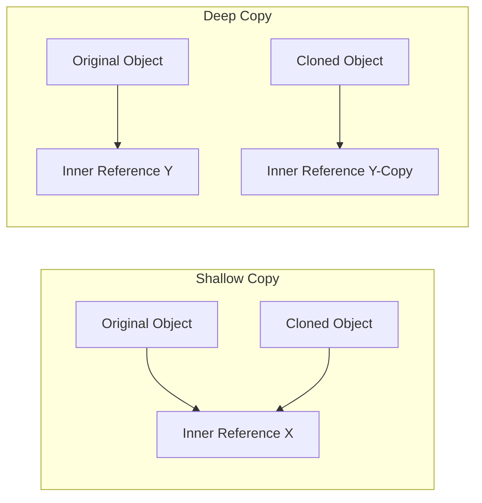

# Prototype Creational Design Pattern

Prototype allows cloning existing objects without making the code dependent on their classes.

---

## Shallow vs Deep Copy



* **Shallow Copy:** Clones the outer shell of the object. Any nested non-primitive fields are shared references. Modifying nested properties in the clone affects the original object.
* **Deep Copy:** Recursively clones all nested objects. Modifying nested fields in the clone has zero effect on the original object.

---

## Implementation

### Java Implementation (Deep Copy)
```java
import java.util.ArrayList;
import java.util.List;

public class EmployeeRecord implements Cloneable {
    private String name;
    private List<String> tasks;

    public EmployeeRecord(String name) {
        this.name = name;
        this.tasks = new ArrayList<>();
    }

    public void addTask(String task) { this.tasks.add(task); }
    public List<String> getTasks() { return tasks; }

    @Override
    public EmployeeRecord clone() {
        try {
            EmployeeRecord clone = (EmployeeRecord) super.clone(); // Shallow clone of primitive/String fields
            
            // Perform Deep Copy on reference objects (like lists, maps)
            clone.tasks = new ArrayList<>(this.tasks); 
            return clone;
        } catch (CloneNotSupportedException e) {
            throw new AssertionError(); // Should not happen since we implement Cloneable
        }
    }
}
```

---

## Interview Q&A Corner

> [!CAUTION]
> **Q: Why is Java's default `Object.clone()` considered problematic?**
> A: 
> 1. It does not call any constructor, which can bypass object initialization contracts.
> 2. It only does a shallow copy by default.
> 3. It returns an `Object` which requires explicit type casting.
> 
> *Alternative recommendation:* Use a **Copy Constructor** or **Static Factory Method** to copy objects instead of relying on `Cloneable` and `clone()`.
>
> ```java
> // Copy Constructor example
> public EmployeeRecord(EmployeeRecord other) {
>     this.name = other.name;
>     this.tasks = new ArrayList<>(other.tasks); // deep copy
> }
> ```
