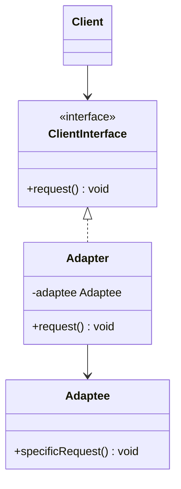

# Adapter Structural Design Pattern

Adapter allows objects with incompatible interfaces to collaborate. It acts as a translator between two different interfaces.

---

## Structure
An adapter implements the client interface and wraps the incompatible (adaptee) object.



---

## Java Implementation
Integrating a legacy XML charging system into a new JSON-only analytics framework.

```java
// Target Client Interface
interface JsonAnalytics {
    void analyzeJsonData(String json);
}

// Adaptee (Legacy System)
class XmlDataEngine {
    public void processXml(String xml) {
        System.out.println("Processing XML data: " + xml);
    }
}

// Adapter
class XmlToJsonAdapter implements JsonAnalytics {
    private final XmlDataEngine xmlEngine;

    public XmlToJsonAdapter(XmlDataEngine xmlEngine) {
        this.xmlEngine = xmlEngine;
    }

    @Override
    public void analyzeJsonData(String json) {
        // Convert JSON to XML (mock transformation)
        String xml = "<json-converted>" + json + "</json-converted>";
        xmlEngine.processXml(xml);
    }
}
```

---

## Interview Q&A Corner

> [!NOTE]
> **Q: What is the difference between Class Adapter and Object Adapter?**
> A: 
> * **Object Adapter** uses composition (holds an instance of the Adaptee). It is more flexible as it can work with any subclass of the Adaptee.
> * **Class Adapter** uses inheritance (subclasses both the Target and Adaptee). It requires multi-inheritance support (which Java doesn't support directly, except via interface implementation).
