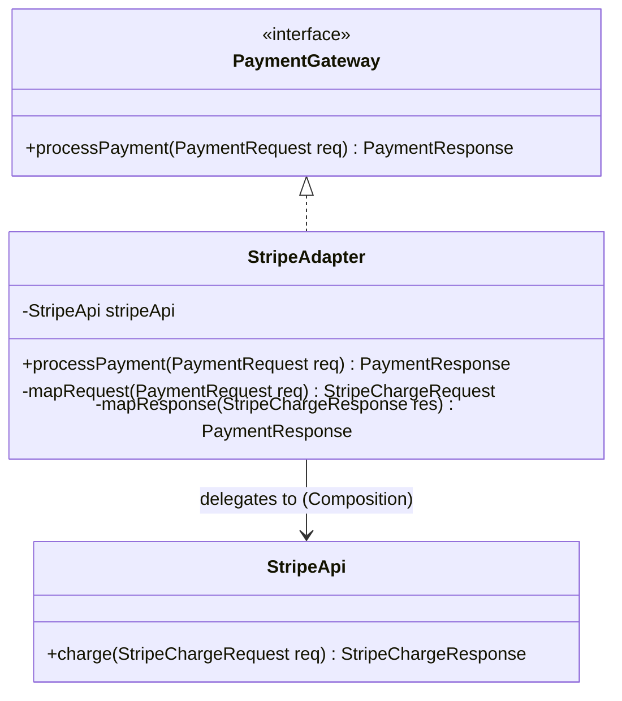
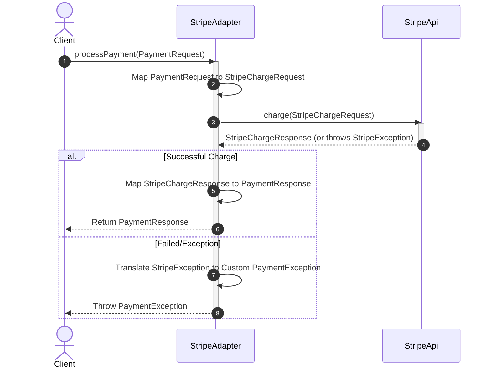

# Adapter Structural Design Pattern

## 1. Core Intent & Problem Statement
The **Adapter Pattern** is a structural design pattern that allows objects with incompatible interfaces to collaborate. It acts as a wrapper or translator, converting the interface of a class into another interface that clients expect. It allows classes to work together that couldn't otherwise because of incompatible interfaces.

### Real-World Analogy
* **Power Plugs:** If you travel from the US to Europe, your laptop charger plug (US pins) won't fit into the European wall socket (EU round pins). You use a power adapter that plugs into the wall socket and provides a US-style outlet on the other side.
* **USB-C to SD Card Reader:** Modern laptops often only have USB-C ports, but camera memory cards use SD connections. An SD card adapter translates the physical connection and communication protocol so the laptop can read the card's data.

### When to Use
1. **Third-Party Integration:** When you want to use an existing class (like a third-party library or legacy system), but its interface does not match the rest of your application code.
2. **Standardization:** When you need to create a unified interface for multiple existing subclasses that have differing interfaces, without refactoring the code of all these subclasses.
3. **Legacy Wrapping:** When migrating to a new API, you can wrap the legacy system in an adapter to keep the rest of the application functional during the transition.

### Trade-offs
* **Pros:**
  - **Single Responsibility Principle (SRP):** You can separate the interface/data conversion code from the primary business logic.
  - **Open/Closed Principle (OCP):** You can introduce new adapters into the program without breaking existing client code.
  - **Reusability:** You can reuse existing classes even if their interfaces are incompatible.
* **Cons:**
  - **Overhead:** Increases overall code complexity by introducing new interfaces and adapter classes.
  - **Chain Adapters:** Sometimes you have to chain multiple adapters together, which can degrade performance and make debugging difficult.

---

## 2. Visual Representation (Diagrams)

### UML Class Diagram (Object Adapter)


### Sequence Diagram


---

## 3. Violating Design vs. Refactored Design

### Violating Design (Without Adapter Pattern)
The client code interacts directly with concrete, third-party payment gateways, forcing it to handle different method signatures, data types, and exception classes.

```java
public class CheckoutService {
    private StripeApi stripeApi = new StripeApi();
    private PayPalApi payPalApi = new PayPalApi();

    public void checkout(double amount, String gateway) {
        if (gateway.equalsIgnoreCase("stripe")) {
            // Stripe expects amount in cents
            StripeRequest req = new StripeRequest((int)(amount * 100));
            try {
                stripeApi.executeCharge(req);
            } catch (StripeException e) {
                System.out.println("Stripe failed");
            }
        } else if (gateway.equalsIgnoreCase("paypal")) {
            // PayPal expects a String amount and a currency
            payPalApi.sendPayment(String.valueOf(amount), "USD");
        }
    }
}
```

### Why it fails:
1. **Tight Coupling:** The `CheckoutService` is tightly coupled to concrete classes `StripeApi` and `PayPalApi`.
2. **Violation of Open-Closed Principle (OCP):** Adding a new payment processor (e.g., Adyen) forces modifying `CheckoutService` with another branch of conditional code.
3. **Scattered Conversion Logic:** The client has to know details like converting dollars to cents for Stripe, or converting doubles to strings for PayPal.

---

## 4. Production-Ready Java Implementation

Below is a production-grade implementation of the **Object Adapter Pattern** for a payment system. It features:
* **Common Target Interface:** A clean, standardized abstraction for payment gateways.
* **Complex Data Transformation:** Handling data type conversions and mapping logic inside the adapter.
* **Custom Exception Translation:** Translating vendor-specific exceptions into domain-specific exceptions.
* **Thread Safety:** Ensuring the adapter is stateless and thread-safe.

### 1. Domain Request/Response and Exception classes
```java
package lowlevel.design.patterns.adapter;

public class PaymentRequest {
    private final String transactionId;
    private final double amountInUsd;

    public PaymentRequest(String transactionId, double amountInUsd) {
        this.transactionId = transactionId;
        this.amountInUsd = amountInUsd;
    }

    public String getTransactionId() { return transactionId; }
    public double getAmountInUsd() { return amountInUsd; }
}

public class PaymentResponse {
    private final boolean success;
    private final String gatewayReference;

    public PaymentResponse(boolean success, String gatewayReference) {
        this.success = success;
        this.gatewayReference = gatewayReference;
    }

    public boolean isSuccess() { return success; }
    public String getGatewayReference() { return gatewayReference; }
}

public class PaymentException extends RuntimeException {
    public PaymentException(String message, Throwable cause) {
        super(message, cause);
    }
}
```

### 2. Target Interface
```java
package lowlevel.design.patterns.adapter;

public interface PaymentGateway {
    PaymentResponse processPayment(PaymentRequest request) throws PaymentException;
}
```

### 3. Adaptee (Third-Party SDK - Incompatible)
```java
package lowlevel.design.patterns.adapter;

// Dummy classes representing Stripe SDK
class StripeChargeRequest {
    private final long amountInCents;
    private final String id;

    public StripeChargeRequest(String id, long amountInCents) {
        this.id = id;
        this.amountInCents = amountInCents;
    }

    public long getAmountInCents() { return amountInCents; }
    public String getId() { return id; }
}

class StripeChargeResponse {
    private final String chargeId;
    private final String status;

    public StripeChargeResponse(String chargeId, String status) {
        this.chargeId = chargeId;
        this.status = status;
    }

    public String getChargeId() { return chargeId; }
    public String getStatus() { return status; }
}

class StripeException extends Exception {
    public StripeException(String message) { super(message); }
}

// Incompatible external SDK
public class StripeApi {
    public StripeChargeResponse charge(StripeChargeRequest request) throws StripeException {
        if (request.getAmountInCents() <= 0) {
            throw new StripeException("Invalid Amount");
        }
        return new StripeChargeResponse("ch_" + request.getId(), "succeeded");
    }
}
```

### 4. Adapter
```java
package lowlevel.design.patterns.adapter;

import java.util.Objects;

public class StripeAdapter implements PaymentGateway {
    private final StripeApi stripeApi;

    public StripeAdapter(StripeApi stripeApi) {
        this.stripeApi = Objects.requireNonNull(stripeApi, "StripeApi cannot be null");
    }

    @Override
    public PaymentResponse processPayment(PaymentRequest request) throws PaymentException {
        try {
            // 1. Convert client representation to Adaptee representation
            long cents = Math.round(request.getAmountInUsd() * 100);
            StripeChargeRequest stripeReq = new StripeChargeRequest(request.getTransactionId(), cents);

            // 2. Delegate execution to Adaptee
            StripeChargeResponse stripeRes = stripeApi.charge(stripeReq);

            // 3. Map Adaptee response back to client format
            boolean isSuccess = "succeeded".equalsIgnoreCase(stripeRes.getStatus());
            return new PaymentResponse(isSuccess, stripeRes.getChargeId());

        } catch (StripeException e) {
            // 4. Translate exceptions to isolate vendor details from our core domain
            throw new PaymentException("Failed to process payment with Stripe", e);
        }
    }
}
```

### 5. Client Driver
```java
package lowlevel.design.patterns.adapter;

public class CheckoutSystem {
    public static void main(String[] args) {
        // Instantiate the external API (Adaptee)
        StripeApi stripeSdk = new StripeApi();

        // Wrap the SDK with the Adapter
        PaymentGateway gateway = new StripeAdapter(stripeSdk);

        // Client operates entirely through the PaymentGateway interface
        PaymentRequest request = new PaymentRequest("TX_99812", 29.99);

        try {
            PaymentResponse response = gateway.processPayment(request);
            System.out.println("Payment Success: " + response.isSuccess());
            System.out.println("Reference ID: " + response.getGatewayReference());
        } catch (PaymentException e) {
            System.err.println("Transaction Failed: " + e.getMessage() + " | Cause: " + e.getCause().getMessage());
        }
    }
}
```

---

## 5. Edge Cases & Concurrency Handling

### Edge Cases
1. **Precision & Rounding Loss:** Converting floating-point numbers (e.g., `double` or `float`) to integer subunits (cents, satoshis) can suffer from floating-point errors. Use `Math.round()` or prefer `BigDecimal` in production-grade financial applications.
2. **Missing SDK Fields:** Adaptee classes might return missing/null values for properties expected by the client interface. Ensure safety guards and set logical defaults (e.g., mapper returns `"UNKNOWN"` instead of passing `null` through).
3. **Transaction Rollbacks:** If an adapted system fails after making partial calls to an adaptee, the adapter may need to implement compensation logic (e.g., canceling a charge if a database write fails).

### Concurrency
* **Stateless Adapters:** An adapter is generally safe and thread-safe if it does not hold state variables from individual requests. In our example, `StripeAdapter` only maintains a reference to the `StripeApi` (which is assumed thread-safe) and does not store transient request-level parameters in object properties.
* **Stateful Adapters (e.g., Caching):** If the adapter caches transaction statuses, wrap the cache with thread-safe implementations like `ConcurrentHashMap` or coordinate access with synchronization primitives.

---

## 6. Comprehensive Interview Q&A

### Q1: What is the difference between an Object Adapter and a Class Adapter?
**Answer:**
* **Object Adapter:** Employs **composition**. It holds an instance of the Adaptee inside the adapter class.
  - *Pros:* Can wrap the Adaptee and any of its subclasses. Highly flexible. Works in single-inheritance languages like Java.
  - *Cons:* Requires executing delegate calls, adding a small invocation indirection layer.
* **Class Adapter:** Employs **inheritance**. It extends the Adaptee class and implements the Target interface.
  - *Pros:* You can override Adaptee behavior directly, and no delegation is required.
  - *Cons:* Can only adapt one specific class. If the Adaptee has subclasses, they cannot be adapted easily. It is also harder to use in Java, as Java does not support multi-inheritance of classes.

---

### Q2: How does the Adapter Pattern differ from Facade and Decorator Patterns?
**Answer:**
* **Adapter:** Changes the **interface** of an existing object to match a client's expectation. It focuses on translation and compatibility.
* **Facade:** Simplifies a **complex subsystem** with a unified, high-level interface. It does not map one interface to another; it creates a new, simpler interface.
* **Decorator:** Adds **responsibility/behavior** to an object without changing its interface. The decorator implements the same interface as the wrapped object.

---

### Q3: How do you handle exception propagation in an Adapter?
**Answer:**
You should **not** allow vendor-specific exceptions (e.g., `StripeException`, `SQLException`) to pass through the adapter boundary to the client code. Doing so leaks structural details and violates encapsulation. 
Instead, wrap the call in a `try-catch` block, log the failure details, and throw a customized, domain-specific exception (like `PaymentException` or `StorageException`) containing the vendor exception as its cause.

---

### Q4: What is a "Two-Way Adapter" and when is it useful?
**Answer:**
A **Two-Way Adapter** implements both the Target interface and the Adaptee interface. It can act either as a target or as an adaptee depending on the client invoking it. 
It is useful when two different client applications are using two different interfaces and need to exchange objects seamlessly, allowing the adapter to fit into both systems simultaneously.
