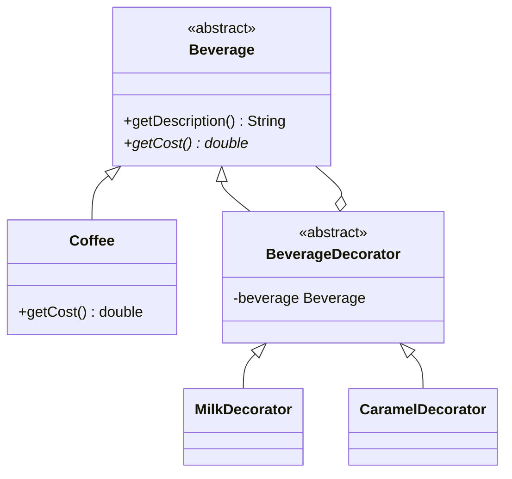

# Decorator Structural Design Pattern

Decorator attaches new behaviors to objects dynamically by placing them inside special wrapper objects that contain these behaviors.

---

## Structure



---

## Java Implementation

```java
abstract class Beverage {
    String description = "Unknown Beverage";
    public String getDescription() { return description; }
    public abstract double getCost();
}

class PlainCoffee extends Beverage {
    public PlainCoffee() { description = "Plain Coffee"; }
    public double getCost() { return 2.00; }
}

// Decorator Abstract Class
abstract class BeverageDecorator extends Beverage {
    protected Beverage beverage; // Composition
    public BeverageDecorator(Beverage beverage) { this.beverage = beverage; }
    public abstract String getDescription();
}

// Concrete Decorators
class MilkDecorator extends BeverageDecorator {
    public MilkDecorator(Beverage beverage) { super(beverage); }
    public String getDescription() { return beverage.getDescription() + ", Milk"; }
    public double getCost() { return beverage.getCost() + 0.50; }
}

class CaramelDecorator extends BeverageDecorator {
    public CaramelDecorator(Beverage beverage) { super(beverage); }
    public String getDescription() { return beverage.getDescription() + ", Caramel"; }
    public double getCost() { return beverage.getCost() + 0.75; }
}
```

### Usage
```java
Beverage myOrder = new PlainCoffee();
myOrder = new MilkDecorator(myOrder);
myOrder = new CaramelDecorator(myOrder);

System.out.println(myOrder.getDescription()); // Plain Coffee, Milk, Caramel
System.out.println(myOrder.getCost());        // 3.25
```

---

## Interview Q&A Corner

> [!TIP]
> **Q: How does the Decorator Pattern relate to Java's I/O Streams?**
> A: Java's input/output libraries rely heavily on the Decorator Pattern. For example:
> `BufferedReader reader = new BufferedReader(new FileReader("file.txt"));`
> `FileReader` is the core component, and `BufferedReader` is a decorator adding performance buffer capabilities dynamically.
