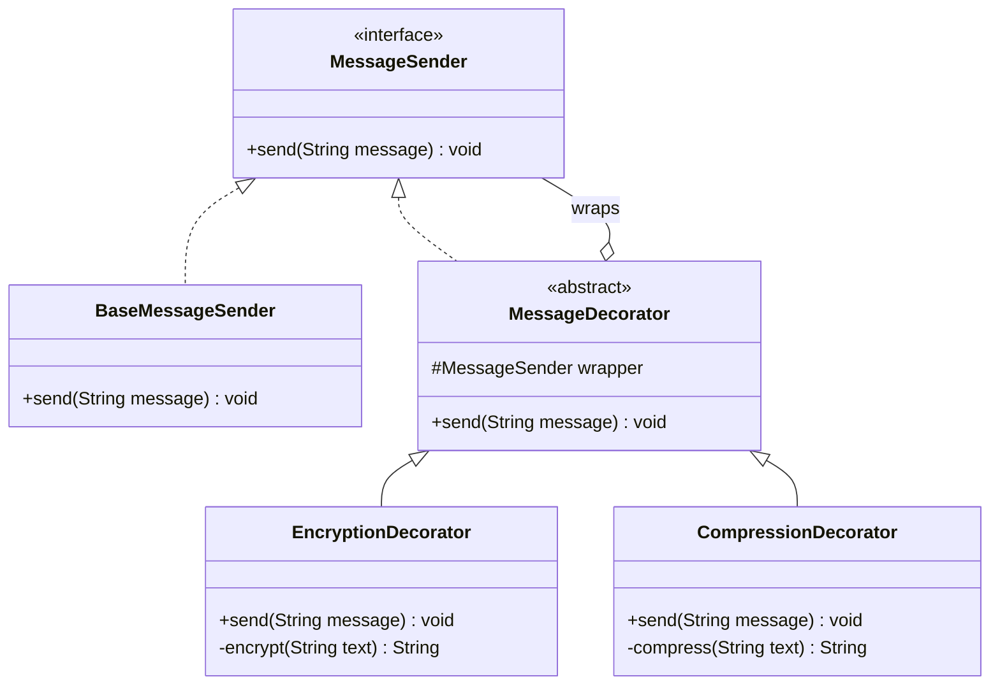
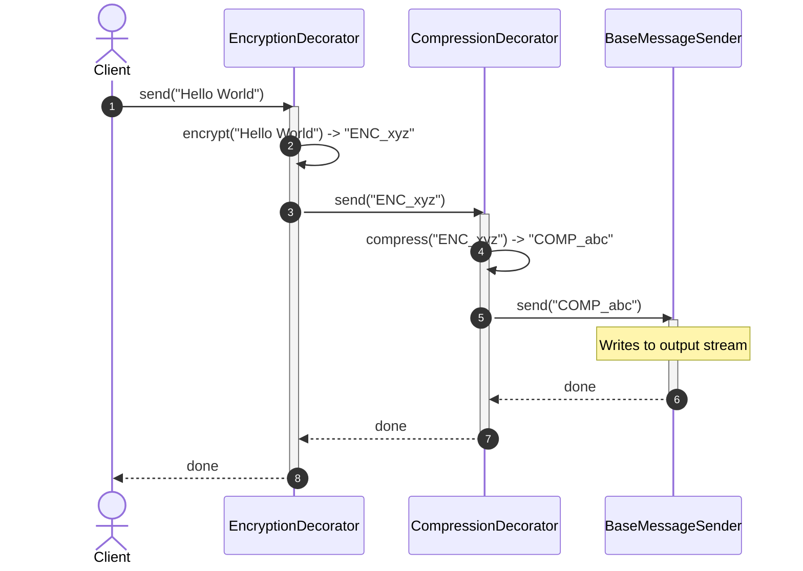

# Decorator Structural Design Pattern

## 1. Core Intent & Problem Statement
The **Decorator Pattern** is a structural design pattern that allows behavior to be added to an individual object, dynamically, without affecting the behavior of other objects from the same class. It uses composition instead of inheritance to extend functionality, providing a flexible alternative to subclassing for creating combinations of behaviors.

### Real-World Analogy
* **Dressing in Layers:** You start with your base body. When it is cold, you put on a sweater. If it is raining, you add a raincoat. Each piece of clothing "decorates" your body, extending your capability (warmth, water resistance) without changing who you are.
* **Pizza Toppings:** You start with a plain cheese pizza base. You can add mushrooms, pepperoni, or olives. Each topping is a wrapper that adds taste and changes the final price.

### When to Use
1. **Dynamic Extension:** When you need to add, remove, or modify responsibilities of individual objects at runtime.
2. **Avoiding Class Explosion:** When extending functionality by subclassing results in an exponential growth of subclasses to cover every combination of traits.
3. **Legacy Enhancement:** When you want to enhance the behavior of class instances that you cannot modify directly (e.g., third-party library classes).

### Trade-offs
* **Pros:**
  - Highly flexible compared to static inheritance.
  - Adheres to **Single Responsibility Principle (SRP)**: You can split monolithic classes with multiple behaviors into small, specialized decorator classes.
  - Multiple decorators can be nested to combine features.
* **Cons:**
  - **Complex Configuration:** Instantiating deep decorator chains (e.g., `new Encryption(new Compression(new PlainSender()))`) creates complex initialization code.
  - **Debugging Difficulty:** Stack traces contain multiple nested decorators, making it harder to pinpoint exactly where an issue occurred.
  - **Identity Issues:** The decorator does not have the same object identity as the wrapped object (`decorator != target`), which can cause issues if your system relies on object references.

---

## 2. Visual Representation (Diagrams)

### UML Class Diagram


### Sequence Diagram


---

## 3. Violating Design vs. Refactored Design

### Violating Design (Class Explosion)
If we want to support sending messages with encryption, compression, logging, and all their combinations using traditional subclassing, we quickly run into inheritance issues.

```java
// A separate subclass for every single permutation
class PlainMessageSender {}
class EncryptedMessageSender extends PlainMessageSender {}
class CompressedMessageSender extends PlainMessageSender {}
class EncryptedAndCompressedMessageSender extends PlainMessageSender {}
class EncryptedAndLoggedMessageSender extends PlainMessageSender {}
class EncryptedCompressedAndLoggedMessageSender extends PlainMessageSender {}
// This list grows exponentially!
```

### Why it fails:
1. **Class Proliferation:** Adding a single new feature (e.g., `DigitalSignature`) requires adding $2^N$ new classes to represent all combinations.
2. **Static Configuration:** Behavior is determined at compile time. You cannot change a standard sender to an encrypted sender at runtime based on network settings.
3. **Code Duplication:** The same compression logic will end up copied across different branches of the hierarchy.

### Refactored Design (With Decorator Pattern)
We represent each feature as a distinct decorator class. The client mixes and matches behaviors at runtime by nesting objects.

---

## 4. Production-Ready Java Implementation

Below is a production-grade implementation of a **Secure Messaging System**. It features:
* **Ordered Pipeline Execution:** The decorators apply operations (Encryption, Compression, Logging) in sequence.
* **Error Propagation:** Handles serialization and encryption failures safely.
* **Thread-Safe Component Pipeline:** The decorators are stateless and immutable, meaning a single pipeline configuration can be shared across multiple threads safely.

### 1. Component Interface
```java
package lowlevel.design.patterns.decorator;

public interface MessageSender {
    void send(String message);
}
```

### 2. Concrete Component
```java
package lowlevel.design.patterns.decorator;

import java.util.logging.Logger;

public class BaseMessageSender implements MessageSender {
    private static final Logger logger = Logger.getLogger(BaseMessageSender.class.getName());

    @Override
    public void send(String message) {
        // Base behavior: outputting payload to the console/stream
        logger.info("TRANSMITTING PAYLOAD: " + message);
    }
}
```

### 3. Base Decorator (Abstract Decorator)
```java
package lowlevel.design.patterns.decorator;

import java.util.Objects;

public abstract class MessageDecorator implements MessageSender {
    protected final MessageSender wrapper;

    protected MessageDecorator(MessageSender wrapper) {
        this.wrapper = Objects.requireNonNull(wrapper, "Wrapped message sender cannot be null");
    }

    @Override
    public void send(String message) {
        wrapper.send(message);
    }
}
```

### 4. Concrete Decorator A: Encryption (Base64 Mock for simplicity)
```java
package lowlevel.design.patterns.decorator;

import java.nio.charset.StandardCharsets;
import java.util.Base64;
import java.util.logging.Logger;

public class EncryptionDecorator extends MessageDecorator {
    private static final Logger logger = Logger.getLogger(EncryptionDecorator.class.getName());

    public EncryptionDecorator(MessageSender wrapper) {
        super(wrapper);
    }

    @Override
    public void send(String message) {
        String encrypted = encrypt(message);
        logger.info("Encrypting payload...");
        super.send(encrypted);
    }

    private String encrypt(String text) {
        return Base64.getEncoder().encodeToString(text.getBytes(StandardCharsets.UTF_8));
    }
}
```

### 5. Concrete Decorator B: Compression (Mock)
```java
package lowlevel.design.patterns.decorator;

import java.util.logging.Logger;

public class CompressionDecorator extends MessageDecorator {
    private static final Logger logger = Logger.getLogger(CompressionDecorator.class.getName());

    public CompressionDecorator(MessageSender wrapper) {
        super(wrapper);
    }

    @Override
    public void send(String message) {
        String compressed = compress(message);
        logger.info("Compressing payload...");
        super.send(compressed);
    }

    private String compress(String text) {
        // Simple mock representing run-length or gzip compression
        return "[COMPRESSED]" + text;
    }
}
```

### 6. Client Driver Code
```java
package lowlevel.design.patterns.decorator;

public class SecurityPipelineDemo {
    public static void main(String[] args) {
        String rawText = "Top-secret intelligence payload!";

        System.out.println("--- Scenario 1: Raw Transmission ---");
        MessageSender rawSender = new BaseMessageSender();
        rawSender.send(rawText);

        System.out.println("\n--- Scenario 2: Encryption + Transmission ---");
        MessageSender encryptedSender = new EncryptionDecorator(new BaseMessageSender());
        encryptedSender.send(rawText);

        System.out.println("\n--- Scenario 3: Encryption + Compression + Transmission ---");
        // Order: First encrypt, then compress.
        MessageSender fullPipeline = new CompressionDecorator(
                new EncryptionDecorator(
                        new BaseMessageSender()
                )
        );
        fullPipeline.send(rawText);
    }
}
```

---

## 5. Edge Cases & Concurrency Handling

### Edge Cases
1. **Pipeline Ordering Sensitivity:** Decorators are order-dependent. For instance, encrypting then compressing is highly inefficient because encrypted data has high entropy and does not compress well. The correct order is: **Compress first, then Encrypt**. Be careful when assembling decorators:
   ```java
   // Correct sequence: Encryption wraps Compression
   MessageSender correct = new EncryptionDecorator(new CompressionDecorator(new BaseMessageSender()));
   ```
2. **Deep Decorator Pipelines:** If you have 20+ decorators, you risk encountering a `StackOverflowError` if the recursion is too deep. To mitigate this, consider implementing pipeline-based handlers (e.g., Chain of Responsibility) instead of pure decorators.

### Concurrency
* **Stateless Pipelines:** If decorators are stateless (they do not write to shared mutable object fields during the `send` invocation), they are fully thread-safe. They can be safely initialized as static singletons and utilized concurrently by multiple client threads.
* **Stateful Wrappers (e.g., Counters/Buffers):** If a decorator maintains state (like counting messages sent or buffering data), access to these counters must be synchronized via `AtomicLong` or `ReentrantLock`.

---

## 6. Comprehensive Interview Q&A

### Q1: How does the Decorator Pattern relate to Java's `java.io` stream library?
**Answer:**
Java's Input/Output stream libraries are classical implementations of the Decorator Pattern:
```java
InputStream fis = new FileInputStream("data.bin");
InputStream bis = new BufferedInputStream(fis); // Adds buffering
InputStream dis = new DataInputStream(bis);      // Adds reading primitive data types
```
Here, `FileInputStream` is the concrete component, while `BufferedInputStream` and `DataInputStream` are decorators extending the basic byte reading behavior with performance buffers and typed reading methods.

---

### Q2: What is the difference between the Decorator Pattern and the Proxy Pattern?
**Answer:**
* **Decorator:** Focuses on **adding responsibilities dynamically**. It usually passes request calls through to the wrapped object, modifying inputs/outputs along the way. The client is typically in control of assembling the decorator chain.
* **Proxy:** Focuses on **controlling access** to the underlying object (e.g., lazy initialization, authentication, access restriction, logging). The proxy usually manages the lifecycle of its real object itself, and clients might not even be aware they are talking to a proxy instead of the real object.

---

### Q3: How do you simplify the creation of complex nested decorator structures for client applications?
**Answer:**
To prevent the client from dealing with nested constructors like `new EncryptionDecorator(new CompressionDecorator(new BaseMessageSender()))`, you can combine the Decorator Pattern with:
1. **Factory Pattern:** Create a factory method like `MessageSenderFactory.createSecureSender()` that returns the fully assembled decorator chain.
2. **Builder Pattern:** Create a pipeline builder:
   ```java
   MessageSender sender = new MessageSenderBuilder()
                             .withBaseSender()
                             .withCompression()
                             .withEncryption()
                             .build();
   ```

---

### Q4: Can a decorator add new methods to the interface?
**Answer:**
No. If a decorator adds new public methods that do not exist in the base interface, those methods cannot be invoked through the interface reference. The client would have to know the specific concrete decorator type to call them, which defeats the purpose of the pattern (polymorphic transparency). The decorator's public interface should ideally be identical to the component interface.
