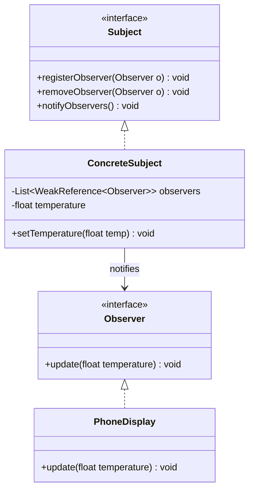
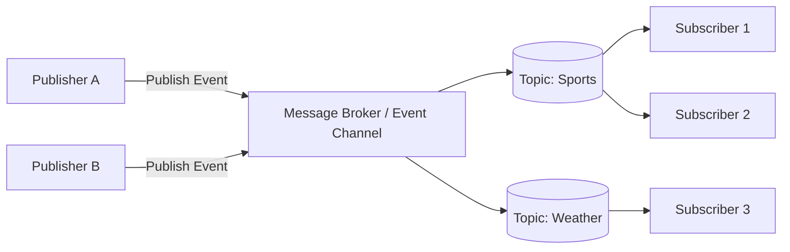

# Observer & Pub-Sub Design Patterns

## 1. Core Intent & Problem Statement
Both **Observer** and **Pub-Sub** are behavioral design patterns used to establish decoupled communication channels between objects when one object changes state.

### 1.1 Observer Pattern
The **Observer Pattern** defines a one-to-many dependency between objects. When one object (the **Subject**) changes its state, all its registered dependents (**Observers**) are notified and updated automatically.

* **Real-World Analogy:** A YouTube channel subscription. When the creator uploads a video (Subject state changes), YouTube broadcasts a notification to all subscribed users (Observers).

### 1.2 Pub-Sub (Publisher-Subscriber) Pattern
The **Pub-Sub Pattern** is a sibling pattern that introduces a third component: an **Event Channel / Message Broker**. Publishers do not maintain a list of subscribers. Instead, they publish events to topics, and the message broker routes them to interested subscribers.

* **Real-World Analogy:** A newspaper agency. Journalists publish articles (Publishers) to a printing press (Broker). The press prints and distributes different newspaper sections (Sports, Finance) to subscribers who opted into those sections. Journalists and readers never meet or know each other.

---

## 2. Observer vs. Pub-Sub Comparison

| Feature | Observer Pattern | Pub-Sub Pattern |
| :--- | :--- | :--- |
| **Coupling** | **Loose:** Subject knows of the Observer interface, maintains list of observers. | **Decoupled:** Publishers and Subscribers are completely anonymous to each other. |
| **Communication** | **Synchronous:** Subject notifies observers blocking the execution thread. | **Asynchronous:** Broker queues and distributes messages in the background. |
| **Topology** | Typically **In-Memory** within a single process. | Often **Distributed** across multiple network services (e.g., Kafka, RabbitMQ). |
| **Event Routing** | All observers get notified of all subject state changes. | Subscribers can filter by Topic or Routing Key. |

---

## 3. Visual Representation (Diagrams)

### Observer UML Class Diagram


### Pub-Sub Architecture Flow


---

## 4. Violating Design vs. Refactored Design

### Violating Design (Direct Coupling)
The subject directly holds references to concrete consumer classes, forcing it to rewrite its code whenever a new consumer is added.

```java
public class WeatherStation {
    private PhoneDisplay phoneDisplay = new PhoneDisplay();
    private WebDashboard webDashboard = new WebDashboard();
    private float temperature;

    public void setTemperature(float temperature) {
        this.temperature = temperature;
        // Direct method invocation on concrete classes:
        phoneDisplay.updatePhone(temperature);
        webDashboard.renderWeb(temperature);
    }
}
```

### Why it fails:
1. **Violation of Open/Closed Principle (OCP):** Adding a new display type (e.g., `TabletDisplay`) requires modifying `WeatherStation`.
2. **Tight Coupling:** The `WeatherStation` is responsible for checking how different UI objects render state, which is outside its core responsibility.

---

## 5. Production-Ready Java Implementations

### Implementation 1: Thread-Safe, Memory-Leak-Proof Observer Pattern
To prevent memory leaks (the **Lapsed Listener** problem), we store observers as `WeakReference` objects. We also use a thread-safe mechanism to notify observers.

#### 1. Observer Interface
```java
package lowlevel.design.patterns.observer;

public interface Observer {
    void update(float temperature);
}
```

#### 2. Subject Interface
```java
package lowlevel.design.patterns.observer;

public interface Subject {
    void registerObserver(Observer observer);
    void removeObserver(Observer observer);
    void notifyObservers();
}
```

#### 3. Concrete Subject with Weak References
```java
package lowlevel.design.patterns.observer;

import java.lang.ref.WeakReference;
import java.util.List;
import java.util.concurrent.CopyOnWriteArrayList;

public class WeatherStation implements Subject {
    // CopyOnWriteArrayList makes iteration thread-safe against concurrent additions/removals
    private final List<WeakReference<Observer>> observers = new CopyOnWriteArrayList<>();
    private float temperature;

    @Override
    public void registerObserver(Observer observer) {
        if (observer == null) return;
        // Verify observer isn't already registered
        if (findReference(observer) == null) {
            observers.add(new WeakReference<>(observer));
        }
    }

    @Override
    public void removeObserver(Observer observer) {
        if (observer == null) return;
        WeakReference<Observer> ref = findReference(observer);
        if (ref != null) {
            observers.remove(ref);
        }
    }

    private WeakReference<Observer> findReference(Observer target) {
        for (WeakReference<Observer> ref : observers) {
            Observer obs = ref.get();
            if (obs != null && obs.equals(target)) {
                return ref;
            }
        }
        return null;
    }

    public void setTemperature(float temperature) {
        this.temperature = temperature;
        notifyObservers();
    }

    @Override
    public void notifyObservers() {
        for (WeakReference<Observer> ref : observers) {
            Observer observer = ref.get();
            if (observer != null) {
                try {
                    observer.update(temperature);
                } catch (Exception e) {
                    System.err.println("Error notifying observer: " + e.getMessage());
                }
            } else {
                // Clean up gc'ed observer references
                observers.remove(ref);
            }
        }
    }
}
```

---

### Implementation 2: Thread-Safe In-Memory Pub-Sub System
Here, the publisher and subscriber are separated by a central `EventBroker`.

```java
package lowlevel.design.patterns.pubsub;

import java.util.List;
import java.util.Map;
import java.util.concurrent.ConcurrentHashMap;
import java.util.concurrent.CopyOnWriteArrayList;
import java.util.concurrent.ExecutorService;
import java.util.concurrent.Executors;

// Message/Event definition
record Event(String topic, String payload) {}

// Subscriber Interface
interface Subscriber {
    void onMessage(Event event);
}

// In-Memory Decoupled Event Broker
class EventBroker {
    private final Map<String, List<Subscriber>> topics = new ConcurrentHashMap<>();
    private final ExecutorService asyncExecutor = Executors.newFixedThreadPool(4);

    public void subscribe(String topic, Subscriber subscriber) {
        topics.computeIfAbsent(topic, k -> new CopyOnWriteArrayList<>()).add(subscriber);
    }

    public void unsubscribe(String topic, Subscriber subscriber) {
        List<Subscriber> subs = topics.get(topic);
        if (subs != null) {
            subs.remove(subscriber);
        }
    }

    // Publishes event asynchronously to avoid blocking the publisher thread
    public void publish(Event event) {
        List<Subscriber> subs = topics.get(event.topic());
        if (subs == null || subs.isEmpty()) return;

        for (Subscriber sub : subs) {
            asyncExecutor.submit(() -> {
                try {
                    sub.onMessage(event);
                } catch (Exception e) {
                    System.err.println("Subscriber error processing topic " + event.topic() + ": " + e.getMessage());
                }
            });
        }
    }

    public void shutdown() {
        asyncExecutor.shutdown();
    }
}
```

---

## 6. Edge Cases & Concurrency Handling

### Edge Cases
1. **Lapsed Listener Problem (Memory Leak):** 
   If a client registers as an observer but fails to unsubscribe, the subject retains a hard reference to it. The observer cannot be garbage-collected, resulting in a memory leak.
   * *Mitigation:* The `WeakReference` class stores observer instances in our `WeatherStation` implementation, allowing garbage collection of observers even if they forget to deregister.
2. **Unsubscribe During Notification Loop:** 
   If an observer attempts to unsubscribe itself inside its `update()` method, a standard `ArrayList` will throw a `ConcurrentModificationException`.
   * *Mitigation:* We use `CopyOnWriteArrayList`, which creates a copy of the underlying array during modifications, ensuring safe concurrent traversal.
3. **Exception Isolation:** 
   If one observer throws a runtime exception, it must not interrupt the notification flow to remaining observers. We protect the notification cycle using a `try-catch` block inside the loops.

### Concurrency
* **Synchronization:** By using `CopyOnWriteArrayList` and `ConcurrentHashMap`, we ensure that multiple threads can subscribe, unsubscribe, and publish events concurrently without synchronization bottlenecks.
* **Asynchronous Delivery:** The Pub-Sub Broker runs callbacks inside a thread pool (`ExecutorService`), freeing up the thread initiating the state update.

---

## 7. Comprehensive Interview Q&A

### Q1: What is the "Lapsed Listener" problem and how do we resolve it?
**Answer:**
The Lapsed Listener problem occurs when an observer is registered with a subject, but its lifecycle is shorter than the subject's lifecycle. If the observer is discarded but not explicitly unregistered, the subject keeps a strong reference to it. Consequently, the garbage collector cannot reclaim the observer, leading to a memory leak.
* *Resolution:* Store observers as `WeakReference<Observer>` inside the subject. When the observer has no other strong references pointing to it, the JVM reclaims it, and `ref.get()` returns `null`, enabling safe removal from the subscriber registry.

---

### Q2: Why is `CopyOnWriteArrayList` preferred over `synchronized List` for registering observers?
**Answer:**
1. **Thread-Safe Iteration:** With standard synchronized lists, iterating requires locking the entire collection. If another thread adds/removes elements during iteration, it throws a `ConcurrentModificationException`.
2. **Unsubscribe-safe:** It allows an observer to call `removeObserver()` within its own `update()` method without causing concurrency exceptions.
3. **Performance:** `CopyOnWriteArrayList` is optimized for systems where read/iteration operations significantly outnumber write (add/remove) operations, which is the exact usage profile of the Observer pattern.

---

### Q3: What is the difference between "Push" vs. "Pull" models in the Observer pattern?
**Answer:**
* **Push Model:** The subject sends all updated state information directly to the observer via parameters in the notification call (e.g., `update(float temperature)`). 
  - *Pros:* Simpler for observers; they do not need to query the subject.
  - *Cons:* Hard to extend if different observers need different information.
* **Pull Model:** The subject merely notifies the observer that something changed (e.g., `update(Subject s)`). The observer then queries the subject to extract only the specific fields it needs using getter methods.
  - *Pros:* Highly extensible; observers pull only what is relevant.
  - *Cons:* Observers need a reference to the concrete subject class, introducing coupling.

---

### Q4: When should you use a synchronous Observer pattern versus an asynchronous Pub-Sub pattern?
**Answer:**
* Use **Synchronous Observer** when updates must be transactional (must complete before the execution thread continues), when working in-memory within a single thread context, or when the subject needs quick feedback.
* Use **Asynchronous Pub-Sub** when the publishers and subscribers reside in different microservices, when processing callbacks is heavy/slow, or when system stability requires isolating publishers from subscriber failures.
