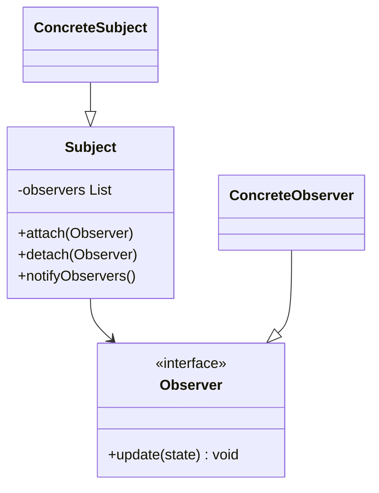
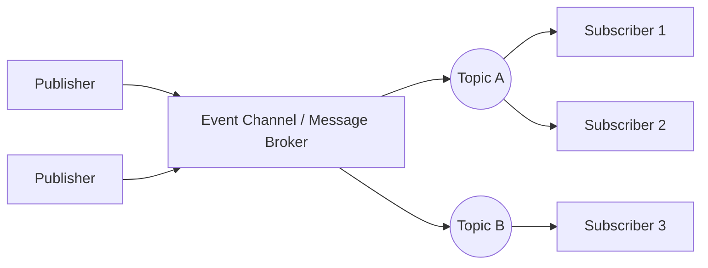

# Observer & Pub-Sub Design Patterns

## 1. Observer Pattern
Observer defines a one-to-many dependency between objects so that when one object changes state, all its dependents are notified automatically.



### Java Implementation
```java
import java.util.ArrayList;
import java.util.List;

interface Observer {
    void update(float temperature);
}

class WeatherStation {
    private final List<Observer> observers = new ArrayList<>();
    private float temperature;

    public void addObserver(Observer observer) { observers.add(observer); }
    public void removeObserver(Observer observer) { observers.remove(observer); }

    public void setTemperature(float temperature) {
        this.temperature = temperature;
        notifyObservers();
    }

    private void notifyObservers() {
        for (Observer observer : observers) {
            observer.update(temperature);
        }
    }
}

class MobileDisplay implements Observer {
    public void update(float temp) {
        System.out.println("Mobile Display updated: Temperature = " + temp + "C");
    }
}
```

---

## 2. Pub-Sub (Publisher-Subscriber) Pattern
While similar to Observer, **Pub-Sub introduces an Event Channel/Message Broker** in between. Publishers and Subscribers never know about each other.



### Differences

| Feature | Observer | Pub-Sub |
|---------|----------|---------|
| **Coupling** | Loose (Publisher keeps a direct list of Observers) | Extremely loose (Decoupled via message broker) |
| **Execution** | Synchronous (typically) | Asynchronous (typically) |
| **Topology** | Single-application memory space | Can run across separate network nodes/services |

---

## Interview Q&A Corner

> [!WARNING]
> **Q: What is the risk of memory leaks in the Observer pattern?**
> A: If a listener/observer is registered with a long-lived subject, it will not be garbage collected unless it is explicitly deregistered. This is called the **Lapsed Listener Problem**.
> *Mitigation:* Use `WeakReference` for storing observers in the subject list.
