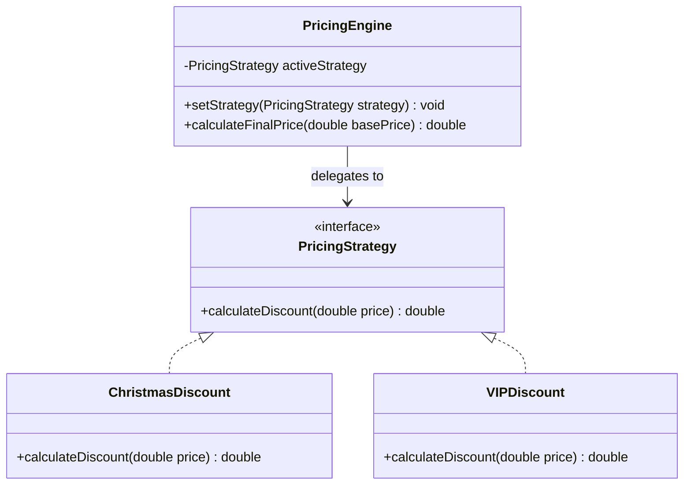
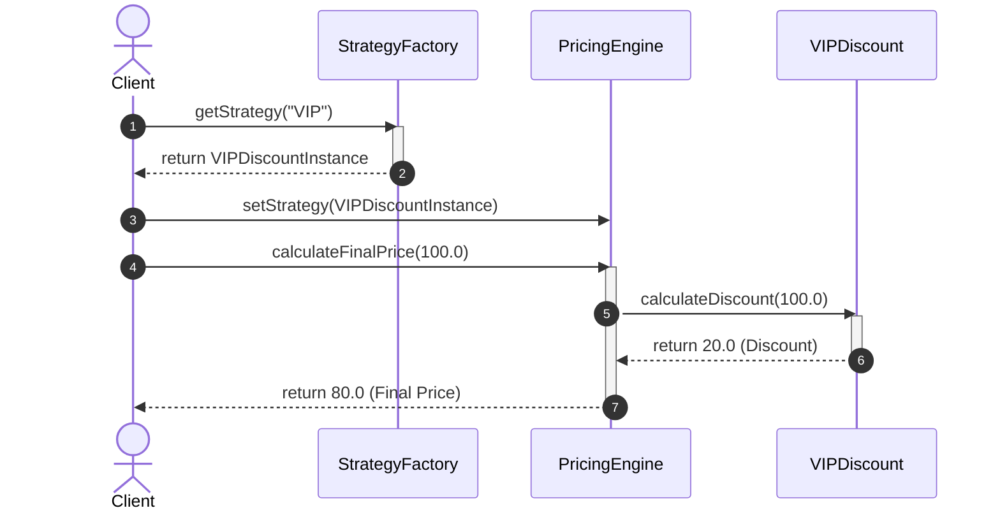

# Strategy Behavioral Design Pattern

## 1. Core Intent & Problem Statement
The **Strategy Pattern** is a behavioral design pattern that defines a family of algorithms, encapsulates each one, and makes them interchangeable. Strategy lets the algorithm vary independently from the clients that use it. It replaces conditional statements with polymorphism.

### Real-World Analogy
* **Navigation Maps:** A navigation app like Google Maps offers different routes depending on your mode of transport: walking, driving, cycling, or public transit. Each mode is a different strategy for calculating the optimal route. The app's map interface (Context) remains the same.
* **Travel to Airport:** You can get to the airport by taxi, subway, or personal car. Your choice depends on trade-offs involving cost, traffic, and time.

### When to Use
1. **Multiple Algorithms:** When you have many variations of an algorithm (e.g., sorting formats, pricing calculations, compression methods) and want to switch them at runtime.
2. **Conditional Elimination:** When a class defines multiple behaviors that appear as massive `switch-case` or `if-else` blocks in its methods.
3. **Isolating Code:** When you want to isolate business logic from the implementation details of complex algorithms.

### Trade-offs
* **Pros:**
  - **Open/Closed Principle (OCP):** You can introduce new strategies without changing the context.
  - **Encapsulation:** Isolates algorithmic logic and data from client applications.
  - **Dynamic Configuration:** Allows objects to swap behaviors dynamically at runtime.
* **Cons:**
  - **Client Awareness:** Clients must be aware of the differences between strategies to select the appropriate one.
  - **Class Proliferation:** Can lead to a high number of small classes if there are many algorithms.

---

## 2. Visual Representation (Diagrams)

### UML Class Diagram


### Sequence Diagram


---

## 3. Violating Design vs. Refactored Design

### Violating Design (Procedural Code with Conditionals)
The system calculates discounts using nested conditionals. Adding new discount rules forces us to edit the pricing class.

```java
public class OrderPricing {
    public double calculatePrice(double totalAmount, String discountType) {
        double discount = 0;
        if (discountType.equalsIgnoreCase("NEW_YEAR")) {
            discount = totalAmount * 0.15;
        } else if (discountType.equalsIgnoreCase("BLACK_FRIDAY")) {
            discount = totalAmount * 0.30;
        } else if (discountType.equalsIgnoreCase("VIP")) {
            discount = totalAmount * 0.20;
        } else {
            discount = 0;
        }
        return totalAmount - discount;
    }
}
```

### Why it fails:
1. **Violation of OCP:** Every time marketing comes up with a new coupon code or sale (e.g., Cyber Monday), the core `OrderPricing` class must be opened and modified.
2. **Hard to Unit Test:** Individual algorithms cannot be isolated and tested independently.
3. **Bloat:** The file grows larger over time and becomes prone to regression bugs.

---

## 4. Production-Ready Java Implementation

Below is a production-grade implementation of a **Pricing Engine** using the Strategy Pattern. It showcases:
* **Thread safety** via `volatile` strategy reference swapping.
* **Strategy Factory** to prevent client code from depending directly on concrete strategy types.
* **Functional strategy** capability using Java 8 lambdas.

### 1. Strategy Interface
```java
package lowlevel.design.patterns.strategy;

@FunctionalInterface
public interface PricingStrategy {
    double calculateDiscount(double originalPrice);
}
```

### 2. Concrete Strategies
```java
package lowlevel.design.patterns.strategy;

public class RegularDiscount implements PricingStrategy {
    @Override
    public double calculateDiscount(double originalPrice) {
        return 0; // No discount
    }
}

public class HolidayDiscount implements PricingStrategy {
    @Override
    public double calculateDiscount(double originalPrice) {
        return originalPrice * 0.15; // 15% off
    }
}

public class VIPDiscount implements PricingStrategy {
    @Override
    public double calculateDiscount(double originalPrice) {
        return originalPrice * 0.30; // 30% off
    }
}
```

### 3. Strategy Factory
```java
package lowlevel.design.patterns.strategy;

import java.util.Map;
import java.util.concurrent.ConcurrentHashMap;

public class StrategyFactory {
    private static final Map<String, PricingStrategy> strategies = new ConcurrentHashMap<>();

    static {
        strategies.put("REGULAR", new RegularDiscount());
        strategies.put("HOLIDAY", new HolidayDiscount());
        strategies.put("VIP", new VIPDiscount());
        
        // Strategy as functional interface (Java 8 Lambda expression)
        strategies.put("FLASH_SALE", price -> price * 0.50);
    }

    public static PricingStrategy getStrategy(String type) {
        PricingStrategy strategy = strategies.get(type.toUpperCase());
        if (strategy == null) {
            throw new IllegalArgumentException("Unknown discount type: " + type);
        }
        return strategy;
    }
}
```

### 4. Context Class (Thread-safe)
```java
package lowlevel.design.patterns.strategy;

import java.util.Objects;

public class PricingEngine {
    // volatile ensures write visibility to other threads immediately
    private volatile PricingStrategy pricingStrategy;

    public PricingEngine(PricingStrategy defaultStrategy) {
        this.pricingStrategy = Objects.requireNonNull(defaultStrategy, "Default strategy cannot be null");
    }

    public void setStrategy(PricingStrategy strategy) {
        this.pricingStrategy = Objects.requireNonNull(strategy, "Pricing strategy cannot be null");
    }

    public double calculateFinalPrice(double basePrice) {
        if (basePrice < 0) {
            throw new IllegalArgumentException("Base price cannot be negative");
        }
        // Local reference capture to prevent race conditions during volatile strategy swap
        PricingStrategy strategy = this.pricingStrategy;
        double discount = strategy.calculateDiscount(basePrice);
        return basePrice - discount;
    }
}
```

### 5. Client Driver
```java
package lowlevel.design.patterns.strategy;

public class CheckoutDemo {
    public static void main(String[] args) {
        // Initializing with Regular Pricing
        PricingEngine engine = new PricingEngine(StrategyFactory.getStrategy("REGULAR"));
        double cartTotal = 150.00;

        System.out.println("Regular Price: $" + engine.calculateFinalPrice(cartTotal));

        // Dynamically swapping to Holiday discount
        engine.setStrategy(StrategyFactory.getStrategy("HOLIDAY"));
        System.out.println("Holiday Price: $" + engine.calculateFinalPrice(cartTotal));

        // Dynamically swapping to VIP discount
        engine.setStrategy(StrategyFactory.getStrategy("VIP"));
        System.out.println("VIP Price: $" + engine.calculateFinalPrice(cartTotal));

        // Dynamically swapping to Lambda-defined Flash Sale
        engine.setStrategy(StrategyFactory.getStrategy("FLASH_SALE"));
        System.out.println("Flash Sale Price: $" + engine.calculateFinalPrice(cartTotal));
    }
}
```

---

## 5. Edge Cases & Concurrency Handling

### Edge Cases
1. **Null/Missing Strategy:** The client might fail to pass a strategy, causing `NullPointerException`. We guard against this by setting a default strategy in the Context's constructor and validating inputs using `Objects.requireNonNull()`.
2. **Strategy Validation:** In scenarios like promotions, a strategy might only be valid for a specific timeframe. You can wrap strategies in a validator or decorate them with validation checks before execution.

### Concurrency
* **Volatile Reads:** The reference `private volatile PricingStrategy pricingStrategy` is marked `volatile`. If one thread updates the strategy (e.g., switching the store-wide policy to Flash Sale), other concurrent transaction threads read this new reference immediately.
* **Local Reference Capture:** In `calculateFinalPrice()`, capturing the strategy locally `PricingStrategy strategy = this.pricingStrategy` prevents a subtle bug where another thread updates the strategy mid-calculation, ensuring transaction atomic consistency.

---

## 6. Comprehensive Interview Q&A

### Q1: What is the difference between Strategy Pattern and State Pattern?
**Answer:**
Although both patterns utilize composition and look identical in class structure, they differ in **intent**:
* **Strategy Pattern:** The client configure the context with a specific strategy once (or rarely switches it). The strategies are independent and **do not know about each other**.
* **State Pattern:** The context transitions dynamically from one state to another (state machine) in a predefined workflow. The state subclasses **actively know about other states** and trigger transitions on the context to advance the workflow.

---

### Q2: How does the Java 8 Functional Interface feature simplify the Strategy Pattern?
**Answer:**
Since Strategy interfaces typically have only a single abstract method (e.g. `calculateDiscount()`), they qualify as **Functional Interfaces**.
This allows clients to pass algorithms as inline lambda expressions without creating separate, boilerplate concrete class files:
```java
PricingEngine engine = new PricingEngine(price -> price * 0.50);
```
This reduces the "class explosion" drawback of the pattern.

---

### Q3: How do you choose between Strategy Pattern and Template Method Pattern?
**Answer:**
* **Strategy Pattern** uses **Composition** (object behavior is delegated to a separate strategy class at runtime). It is highly flexible because behaviors can be swapped completely on the fly.
* **Template Method Pattern** uses **Inheritance**. The base class defines the invariant outline (template) of an algorithm and lets subclasses override specific, customized parts of it at compile time. It is less flexible because subclass changes cannot be swapped dynamically at runtime.

---

### Q4: How do you avoid exposing concrete strategy classes to the client application?
**Answer:**
You can combine the **Strategy Pattern** with a **Factory Pattern** (or an Enum). The client passes a simple string key or configuration token to the Factory. The Factory resolves and returns the correct Strategy instance (optionally cached). This keeps the client decoupled from the concrete implementation classes of the strategies.
