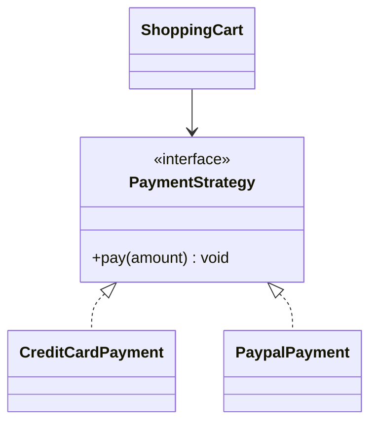

# Strategy Behavioral Design Pattern

Strategy defines a family of algorithms, encapsulates each one, and makes them interchangeable. Strategy lets the algorithm vary independently from clients that use it.

---

## Structure



---

## Java Implementation

```java
// Strategy Interface
interface PaymentStrategy {
    void pay(double amount);
}

// Concrete Strategies
class CreditCardPayment implements PaymentStrategy {
    private String cardNumber;
    public CreditCardPayment(String card) { this.cardNumber = card; }
    public void pay(double amount) {
        System.out.println("Paid $" + amount + " using Credit Card: " + cardNumber);
    }
}

class PaypalPayment implements PaymentStrategy {
    private String email;
    public PaypalPayment(String email) { this.email = email; }
    public void pay(double amount) {
        System.out.println("Paid $" + amount + " using PayPal: " + email);
    }
}

// Context Class
class ShoppingCart {
    private PaymentStrategy paymentStrategy;

    public void setPaymentStrategy(PaymentStrategy strategy) {
        this.paymentStrategy = strategy;
    }

    public void checkout(double amount) {
        if (paymentStrategy == null) {
            throw new IllegalStateException("Payment strategy not set!");
        }
        paymentStrategy.pay(amount);
    }
}
```

---

## Interview Q&A Corner

> [!NOTE]
> **Q: Strategy vs State Pattern: Aren't they identical?**
> A: While their class structures are nearly identical, their **intent** is different:
> * **Strategy** is configured once by the client (e.g., choosing a payment type at checkout). Strategies typically do not know about other strategies.
> * **State** represents a dynamic cycle of transitions (e.g., Vending Machine states transition automatically from `HasCoin` -> `Dispensing` -> `NoCoin`). States often trigger transitions to next states.
