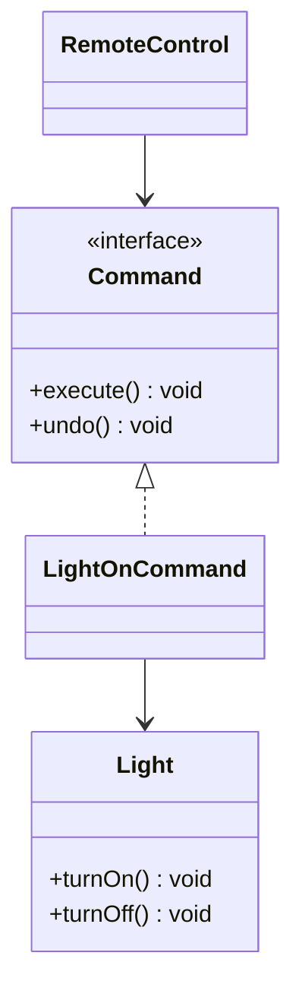

# Command Behavioral Design Pattern

Command turns a request into a stand-alone object that contains all information about the request. This transformation lets you pass requests as a method arguments, delay or queue a request's execution, and support undoable operations.

---

## Structure



---

## Java Implementation

```java
// Receiver
class Light {
    public void turnOn() { System.out.println("Light is ON"); }
    public void turnOff() { System.out.println("Light is OFF"); }
}

// Command Interface
interface Command {
    void execute();
    void undo();
}

// Concrete Command
class LightOnCommand implements Command {
    private final Light light;

    public LightOnCommand(Light light) { this.light = light; }

    public void execute() { light.turnOn(); }
    public void undo() { light.turnOff(); }
}

// Invoker (e.g. Remote Control)
class RemoteControl {
    private Command lastCommand;

    public void submitCommand(Command command) {
        this.lastCommand = command;
        command.execute();
    }

    public void pressUndo() {
        if (lastCommand != null) {
            lastCommand.undo();
        }
    }
}
```

---

## Interview Q&A Corner

> [!TIP]
> **Q: How do you build an Undo/Redo stack using the Command Pattern?**
> A: Keep two stacks of `Command` objects in the Invoker: `undoStack` and `redoStack`. 
> * On execute: push command to `undoStack`, clear `redoStack`.
> * On undo: pop from `undoStack`, call `undo()`, push to `redoStack`.
> * On redo: pop from `redoStack`, call `execute()`, push to `undoStack`.
