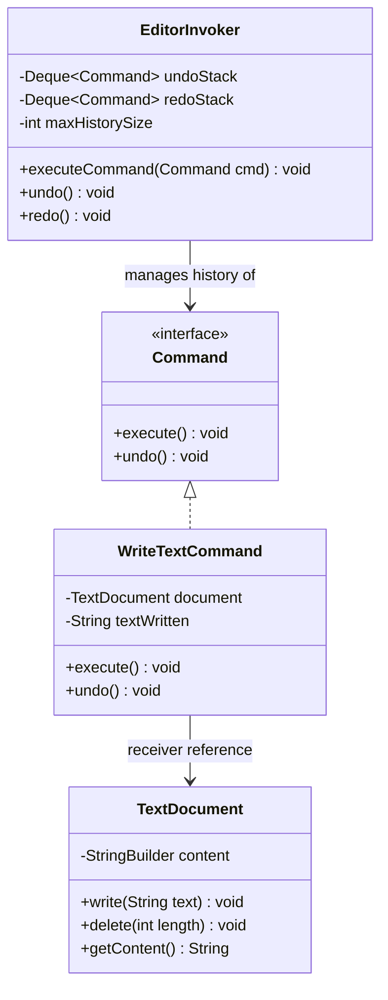
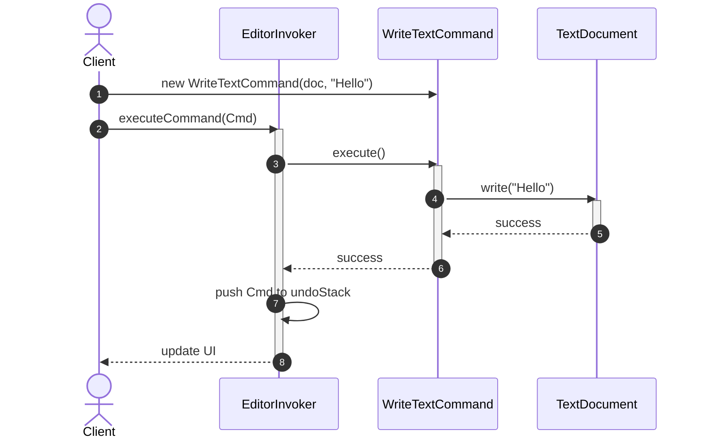

# Command Behavioral Design Pattern

## 1. Core Intent & Problem Statement
The **Command Pattern** is a behavioral design pattern that turns a request into a stand-alone object that contains all information about the request. This transformation lets you pass requests as method arguments, delay or queue a request's execution, log request history, and support undoable operations.

### Real-World Analogy
* **Restaurant Ordering:** You (Client) tell the waiter (Invoker) your order. The waiter writes it on an order slip (Command) and places it on the kitchen counter. The chef (Receiver) reads the slip and cooks the meal. The order slip decouples you from the chef, allowing orders to be queued, reassigned, or canceled.
* **Smart Home Remote:** A button on a smart remote doesn't need to know the wiring details of your living room lights. It is programmed with a command object that knows how to turn a specific light on or off.

### When to Use
1. **Parameterizing UI Objects:** When you want to configure UI components (buttons, menu items) with actions without tying them to concrete receiver classes.
2. **Queueing and Scheduling:** When you need to queue operations, schedule execution, or execute tasks asynchronously across a thread pool.
3. **Undo/Redo System:** When you need to support reversing operations to restore a prior application state.
4. **Transactional Logging:** When you want to log operations so that they can be re-run in case of a system crash.

### Trade-offs
* **Pros:**
  - **Decoupling:** Decouples the object invoking the operation from the object that knows how to perform it.
  - **Extensibility:** You can add new commands without modifying existing code (adhering to OCP).
  - **Composition:** You can combine multiple simple commands into a complex composite command (Macro Command).
* **Cons:**
  - **Boilerplate Code:** You have to write a separate class for each command, leading to an increase in the number of classes.

---

## 2. Visual Representation (Diagrams)

### UML Class Diagram


### Sequence Diagram


---

## 3. Violating Design vs. Refactored Design

### Violating Design (Direct UI/Receiver Coupling)
In this design, UI components directly execute actions on the editor document. It is impossible to undo actions generically, and UI components are tightly coupled to the document's implementation.

```java
public class EditorUI {
    private TextDocument document = new TextDocument();

    public void onSaveButtonClicked() {
        // Direct coupling: UI knows document details
        document.saveToDisk();
    }

    public void onTextTyped(String text) {
        document.writeText(text);
        // How do we undo this? There is no history tracking.
    }
}
```

### Why it fails:
1. **Lack of Undo Capability:** Reversing actions requires writing custom, ad-hoc state-saving logic inside the UI classes.
2. **Tight Coupling:** The UI depends directly on the core model API. If we want to move the "save" logic to run on a background thread pool, we must modify the UI button handler code.
3. **No Command Reusability:** If we want to trigger "save" via a keyboard shortcut, we have to duplicate the logic or create shared helper files.

---

## 4. Production-Ready Java Implementation

Below is a production-grade implementation of a **Text Editor Command History Engine**. It features:
* **Bounded Undo/Redo Stacks** using a custom history manager to prevent memory leaks.
* **Thread-Safe History Access** using synchronized block wrappers.
* **State Preservation:** Commands capture the exact state delta to execute precise undo operations.

### 1. Command Interface
```java
package lowlevel.design.patterns.command;

public interface Command {
    void execute();
    void undo();
}
```

### 2. Receiver (Text Document)
```java
package lowlevel.design.patterns.command;

public class TextDocument {
    private final StringBuilder content = new StringBuilder();

    public synchronized void write(String text) {
        content.append(text);
    }

    public synchronized void delete(int length) {
        int len = content.length();
        if (length > len) {
            content.setLength(0);
        } else {
            content.delete(len - length, len);
        }
    }

    public synchronized String getContent() {
        return content.toString();
    }
}
```

### 3. Concrete Command (Write Text)
```java
package lowlevel.design.patterns.command;

import java.util.Objects;

public class WriteTextCommand implements Command {
    private final TextDocument document;
    private final String textToAppend;

    public WriteTextCommand(TextDocument document, String textToAppend) {
        this.document = Objects.requireNonNull(document, "Document cannot be null");
        this.textToAppend = Objects.requireNonNull(textToAppend, "Text cannot be null");
    }

    @Override
    public void execute() {
        document.write(textToAppend);
    }

    @Override
    public void undo() {
        // Reverse action: delete the appended characters
        document.delete(textToAppend.length());
    }
}
```

### 4. Invoker (Editor Invoker with Bounded History)
```java
package lowlevel.design.patterns.command;

import java.util.ArrayDeque;
import java.util.Deque;

public class EditorInvoker {
    private final Deque<Command> undoStack = new ArrayDeque<>();
    private final Deque<Command> redoStack = new ArrayDeque<>();
    private final int maxHistorySize;

    public EditorInvoker(int maxHistorySize) {
        this.maxHistorySize = maxHistorySize;
    }

    public synchronized void executeCommand(Command command) {
        command.execute();
        
        // Bounded capacity management
        if (undoStack.size() >= maxHistorySize) {
            undoStack.pollFirst(); // Remove oldest command to free memory
        }
        
        undoStack.addLast(command);
        redoStack.clear(); // Executing a new command clears the redo history
    }

    public synchronized void undo() {
        if (undoStack.isEmpty()) {
            System.out.println("Nothing to Undo");
            return;
        }
        Command lastCmd = undoStack.removeLast();
        lastCmd.undo();
        redoStack.addLast(lastCmd);
    }

    public synchronized void redo() {
        if (redoStack.isEmpty()) {
            System.out.println("Nothing to Redo");
            return;
        }
        Command redoCmd = redoStack.removeLast();
        redoCmd.execute();
        undoStack.addLast(redoCmd);
    }
}
```

### 5. Client Driver Code
```java
package lowlevel.design.patterns.command;

public class TextEditorApp {
    public static void main(String[] args) {
        TextDocument document = new TextDocument();
        EditorInvoker editor = new EditorInvoker(5); // Hold up to 5 actions

        // Simulate typing
        editor.executeCommand(new WriteTextCommand(document, "Hello "));
        editor.executeCommand(new WriteTextCommand(document, "World "));
        editor.executeCommand(new WriteTextCommand(document, "from Antigravity!"));

        System.out.println("Current Content: " + document.getContent());

        // Undo last action
        System.out.println("\n--- Triggering Undo ---");
        editor.undo();
        System.out.println("Content: " + document.getContent());

        // Undo again
        System.out.println("\n--- Triggering Undo ---");
        editor.undo();
        System.out.println("Content: " + document.getContent());

        // Redo last action
        System.out.println("\n--- Triggering Redo ---");
        editor.redo();
        System.out.println("Content: " + document.getContent());
    }
}
```

---

## 5. Edge Cases & Concurrency Handling

### Edge Cases
1. **Bounded Memory Leaks:** Without bounded history limits, keeping command history lists alive for days will exhaust Java heap memory. The `EditorInvoker` prevents this by specifying a `maxHistorySize` limit, dropping the oldest commands via `undoStack.pollFirst()`.
2. **Compound/Macro Commands:** If you run a set of commands in sequence, and one fails halfway, you need transactional rollbacks. In this scenario, create a `MacroCommand` class that implements `Command` and maintains a list of sub-commands. If one sub-command fails, the macro iterates backward and calls `undo()` on the completed sub-commands.

### Concurrency
* **Thread-Safe Buffers:** Using `synchronized` methods on `EditorInvoker` and `TextDocument` guarantees atomic queueing, preventing race conditions where multiple thread requests scramble the order of undo/redo commands.
* **Task Queues:** In network applications, Command objects can be pushed to concurrent thread-safe queues (like `LinkedBlockingQueue`) and consumed asynchronously by a pool of worker threads.

---

## 6. Comprehensive Interview Q&A

### Q1: What is the difference between Command Pattern and Memento Pattern for undo functionality?
**Answer:**
* **Command Pattern:** Relies on **functional reverse operations**. The command object contains the logic to execute and undo (e.g. `undo()` of addition is subtraction).
  - *Pros:* Extremely lightweight. Only stores the change action parameters, saving memory.
  - *Cons:* If an action is destructive (e.g. overwriting a complex block of formatted text), calculating the reverse action is very difficult.
* **Memento Pattern:** Relies on **state snapshot preservation**. It saves a serialized copy of the object's internal state at a specific instant.
  - *Pros:* Extremely robust. Reverting state is as simple as restoring the snapshot; no calculations are needed.
  - *Cons:* Consumes a significant amount of memory, especially if object states are large.

---

### Q2: How do you implement a Macro (Composite) Command?
**Answer:**
A **Macro Command** is a composite object containing a list of multiple individual commands. It allows executing and undoing a batch of operations as a single step:
```java
public class MacroCommand implements Command {
    private final List<Command> commands = new ArrayList<>();

    public void add(Command cmd) { commands.add(cmd); }

    @Override
    public void execute() {
        for (Command cmd : commands) {
            cmd.execute();
        }
    }

    @Override
    public void undo() {
        // Iterate backward to undo in reverse execution order
        for (int i = commands.size() - 1; i >= 0; i--) {
            commands.get(i).undo();
        }
    }
}
```

---

### Q3: How do you design Command objects to run asynchronously on worker threads?
**Answer:**
If execution of a command involves slow actions (e.g. disk write or calling a web API), you can combine the **Command Pattern** with an **ExecutorService**:
1. Put command objects into a thread-safe Queue (e.g., `LinkedBlockingQueue`).
2. The invoker doesn't run `command.execute()` directly on the caller thread. Instead, it submits it to an executor pool:
   ```java
   public void submit(Command command) {
       executorService.submit(command::execute);
   }
   ```

---

### Q4: Can Command pattern be implemented using Java 8 Method References or Lambdas?
**Answer:**
Yes. Since `Command` is a functional interface (having a single `execute()` method), if you do not need undo capability, you can bypass creating concrete classes entirely and pass lambdas:
```java
editor.executeCommand(() -> document.write("Hello"));
```
However, if you require `undo()` functionality, you must use concrete classes or local anonymous objects because the command needs to keep track of its pre-execution state (e.g., the text that was appended) to undo itself correctly.
