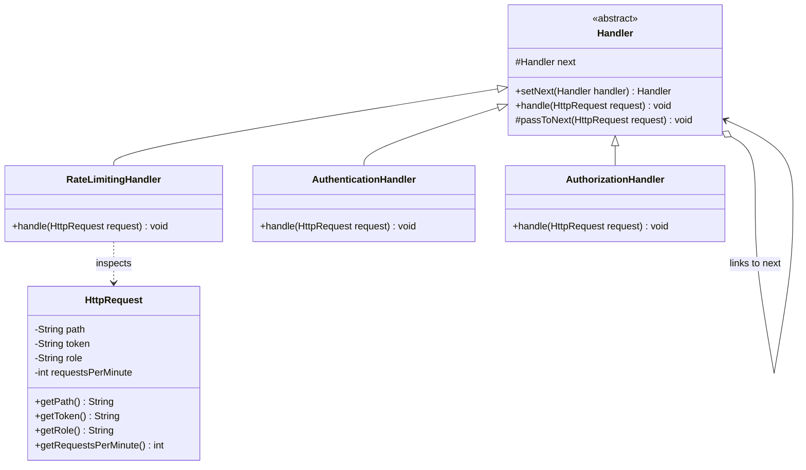
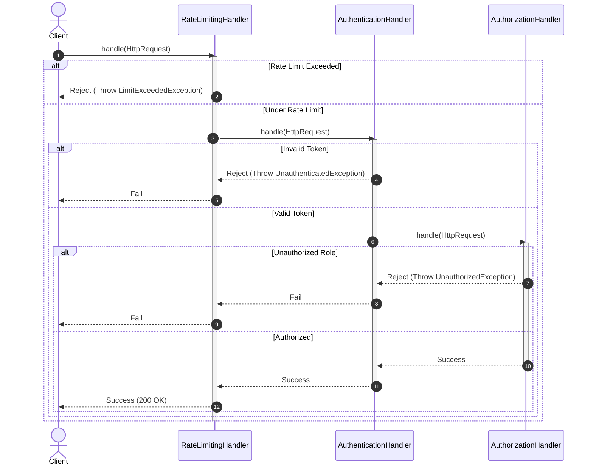

# Chain of Responsibility Design Pattern

## 1. Core Intent & Problem Statement
The **Chain of Responsibility** is a behavioral design pattern that passes requests along a chain of handlers. Upon receiving a request, each handler decides either to process the request or to pass it to the next handler in the chain. It decouples the sender of a request from its receivers.

### Real-World Analogy
* **Corporate Expense Approval:** In a company, if you submit an expense report:
  - A Team Lead can approve up to \$500. If it's more, they pass it to the Manager.
  - The Manager can approve up to \$5,000. If it's more, they pass it to the Director.
  - The Director can approve up to \$50,000. If it's more, it goes to the VP.
* **Tech Support Phone Menu:** When calling customer service, you talk to an automated bot (Level 1). If your problem is complex, it routes you to a customer service agent (Level 2). If it's a system bug, they escalate it to an engineer (Level 3).

### When to Use
1. **Multiple Processors:** When your program needs to process a request using a sequence of handlers, but the exact order or combination isn't known beforehand.
2. **Dynamic Pipelines:** When you want to link processors dynamically at runtime (e.g., adding a logging filter only in debug mode).
3. **Decoupling Receivers:** When you want to send a request to a group of objects without specifying which one handles it.

### Trade-offs
* **Pros:**
  - **Single Responsibility Principle (SRP):** You can decouple classes that invoke operations from classes that perform operations.
  - **Open/Closed Principle (OCP):** You can introduce new handlers into the chain without breaking existing client code.
  - **Flexibility:** You can reorder, add, or delete handlers dynamically.
* **Cons:**
  - **No Guarantee of Handling:** A request can fall off the end of the chain without ever being processed.
  - **Performance overhead:** Long chains can lead to performance degradation and deep call stacks.
  - **Hard to Debug:** Stepping through code requires jumping between many separate handler classes.

---

## 2. Visual Representation (Diagrams)

### UML Class Diagram


### Sequence Diagram


---

## 3. Violating Design vs. Refactored Design

### Violating Design (Monolithic Processing Pipeline)
A monolithic method performs rate-limiting, authentication, and authorization sequentially. If any step fails, it returns early.

```java
public class GatewayController {
    public void processRequest(HttpRequest req) {
        // Step 1: Rate Limiting
        if (req.getRequestsPerMinute() > 100) {
            throw new RuntimeException("Rate limit exceeded");
        }
        // Step 2: Authentication
        if (req.getToken() == null || req.getToken().isEmpty()) {
            throw new RuntimeException("Unauthenticated");
        }
        // Step 3: Authorization
        if (!req.getRole().equals("ADMIN")) {
            throw new RuntimeException("Unauthorized");
        }
        // Proceed with actual request processing
        System.out.println("Processing standard request");
    }
}
```

### Why it fails:
1. **Violates Single Responsibility Principle (SRP):** The controller class handles rate limiting, security checks, and routing logic inside a single method.
2. **Lack of Extensibility:** If we want to add data validation or request compression, we have to modify this core class, violating the Open/Closed Principle (OCP).
3. **Impossibly rigid ordering:** It is impossible to bypass authentication for public assets or customize the flow for testing purposes.

---

## 4. Production-Ready Java Implementation

Below is a production-grade implementation of a **Gateway Request Filtering Pipeline**. It features:
* **Fluent Interface** for building chains.
* **Custom Exception Propagation** for precise client error responses.
* **Stateless Handlers** to ensure thread safety when processing multiple concurrent incoming requests.

### 1. HTTP Request Class
```java
package lowlevel.design.patterns.chain;

public class HttpRequest {
    private final String path;
    private final String token;
    private final String role;
    private final int requestsPerMinute;

    public HttpRequest(String path, String token, String role, int requestsPerMinute) {
        this.path = path;
        this.token = token;
        this.role = role;
        this.requestsPerMinute = requestsPerMinute;
    }

    public String getPath() { return path; }
    public String getToken() { return token; }
    public String getRole() { return role; }
    public int getRequestsPerMinute() { return requestsPerMinute; }
}
```

### 2. Base Handler (Abstract Class)
```java
package lowlevel.design.patterns.chain;

public abstract class Handler {
    private Handler next;

    // Fluent builder method to link handlers
    public Handler setNext(Handler next) {
        this.next = next;
        return next; // Returns the linked handler to allow method chaining
    }

    public abstract void handle(HttpRequest request);

    protected void passToNext(HttpRequest request) {
        if (next != null) {
            next.handle(request);
        } else {
            // End of chain reached safely
            System.out.println("Request successfully cleared all gateway checkpoints.");
        }
    }
}
```

### 3. Concrete Handlers
```java
package lowlevel.design.patterns.chain;

class RateLimitingHandler extends Handler {
    private final int maxLimit;

    public RateLimitingHandler(int maxLimit) {
        this.maxLimit = maxLimit;
    }

    @Override
    public void handle(HttpRequest request) {
        if (request.getRequestsPerMinute() > maxLimit) {
            throw new IllegalStateException("HTTP 429: Too Many Requests");
        }
        System.out.println("Checkpoint 1 Passed: Rate limiting clear.");
        passToNext(request);
    }
}

class AuthenticationHandler extends Handler {
    @Override
    public void handle(HttpRequest request) {
        if (request.getToken() == null || !"valid-token".equals(request.getToken())) {
            throw new IllegalArgumentException("HTTP 401: Unauthorized - Token is invalid or missing");
        }
        System.out.println("Checkpoint 2 Passed: Authentication successful.");
        passToNext(request);
    }
}

class AuthorizationHandler extends Handler {
    private final String requiredRole;

    public AuthorizationHandler(String requiredRole) {
        this.requiredRole = requiredRole;
    }

    @Override
    public void handle(HttpRequest request) {
        // Skip check if resource is public (mock route verification)
        if (request.getPath().startsWith("/public")) {
            System.out.println("Checkpoint 3 Passed: Public route access.");
            passToNext(request);
            return;
        }

        if (request.getRole() == null || !request.getRole().equalsIgnoreCase(requiredRole)) {
            throw new SecurityException("HTTP 403: Forbidden - Insufficient privileges");
        }
        System.out.println("Checkpoint 3 Passed: Role authorization cleared.");
        passToNext(request);
    }
}
```

### 4. Client Driver
```java
package lowlevel.design.patterns.chain;

public class ApiGatewayDemo {
    public static void main(String[] args) {
        // Build the chain of responsibility: RateLimit -> Auth -> Authorization
        Handler securityChain = new RateLimitingHandler(100);
        securityChain
            .setNext(new AuthenticationHandler())
            .setNext(new AuthorizationHandler("ADMIN"));

        // Scenario 1: Fully Valid Request
        System.out.println("--- Executing Request 1 ---");
        HttpRequest validRequest = new HttpRequest("/secure/dashboard", "valid-token", "ADMIN", 45);
        securityChain.handle(validRequest);

        // Scenario 2: Request exceeding Rate limits
        System.out.println("\n--- Executing Request 2 ---");
        try {
            HttpRequest heavyRequest = new HttpRequest("/secure/dashboard", "valid-token", "ADMIN", 150);
            securityChain.handle(heavyRequest);
        } catch (Exception e) {
            System.err.println("Gateway blocked request: " + e.getMessage());
        }

        // Scenario 3: Request without valid token
        System.out.println("\n--- Executing Request 3 ---");
        try {
            HttpRequest badTokenRequest = new HttpRequest("/secure/dashboard", "missing-token", "ADMIN", 20);
            securityChain.handle(badTokenRequest);
        } catch (Exception e) {
            System.err.println("Gateway blocked request: " + e.getMessage());
        }
    }
}
```

---

## 5. Edge Cases & Concurrency Handling

### Edge Cases
1. **Unhandled Requests:** What happens if the request traverses the whole chain and no handler processes it?
   * *Mitigation:* Implement a "Null Object" handler or default base class logger at the tail of the chain, or ensure the final handler throws a generic error (e.g., `404 Not Found`).
2. **Infinite Loops (Cyclic Dependency):** If handler A points to B, B points to C, and C points back to A, the application will crash with `StackOverflowError` upon execution.
   * *Mitigation:* In your handler linking system, validate that no duplicate handler class exists, or check using a `Set<Handler>` during pipeline assembly to detect cycles.

### Concurrency
* **Stateless Handlers:** The handlers implemented above are thread-safe because they do not modify any shared, mutable instance fields when handling requests. Multiple thread requests can safely traverse the same pipeline concurrently.
* **Stateful Handlers (e.g., Dynamic Rate Limiting):** If `RateLimitingHandler` keeps track of request windows, it must use atomic counters (like `AtomicLong` or `ConcurrentHashMap`) to avoid race conditions and guarantee accurate throttling.

---

## 6. Comprehensive Interview Q&A

### Q1: What are the differences between the Chain of Responsibility and Decorator patterns?
**Answer:**
* **Chain of Responsibility:**
  - Handlers can **terminate the request flow** immediately (e.g., throwing authorization errors).
  - The request is processed by **exactly one or a subset** of the handlers in the chain.
  - Handlers are generally traversed in a linear forward progression.
* **Decorator:**
  - Decorators **never terminate** the request; they always enrich or modify the behavior of the wrapped object and pass execution forward.
  - **All decorators** in the chain are executed.
  - Recursion occurs in a nested bubble-up execution (pre-processing, calling the wrapper, post-processing).

---

### Q2: How can we prevent circular chain loops during pipeline configuration?
**Answer:**
You can write a validator in the pipeline assembly module:
```java
public static void validateChain(Handler root) {
    Set<Handler> visited = new HashSet<>();
    Handler current = root;
    while (current != null) {
        if (!visited.add(current)) {
            throw new IllegalStateException("Cyclic dependency detected in handler chain");
        }
        current = current.next; // If next field is private, expose a getter
    }
}
```
Running this validation during application initialization catches loop errors before requests hit production.

---

### Q3: Where is the Chain of Responsibility pattern commonly used in Java Enterprise applications?
**Answer:**
1. **Servlet Filters (`javax.servlet.Filter`):** Web servers pass HTTP request structures through a series of filters (e.g., logging, CORS, encoding, tracing) before hitting the servlet.
2. **Spring Security Filter Chain:** Spring maps security rules sequentially using a series of filter beans (`SecurityFilterChain`) verifying CORS, CSRF, JWT, and Session parameters.
3. **Logback Log Routing:** Appenders route logs based on levels (Info appender passes to Warn appender, which passes to Error appender).

---

### Q4: Can we implement Chain of Responsibility using functional lambdas instead of abstract classes?
**Answer:**
Yes. In Java, functional interfaces like `Consumer<Request>` or `Function<Request, Response>` can be composed using `.andThen()` to build functional chains.
```java
Consumer<HttpRequest> rateLimiter = req -> { if (req.getRequestsPerMinute() > 100) throw new RuntimeException(); };
Consumer<HttpRequest> authenticator = req -> { if (req.getToken() == null) throw new RuntimeException(); };

Consumer<HttpRequest> pipeline = rateLimiter.andThen(authenticator);
pipeline.accept(myRequest);
```
However, using abstract classes is still preferred for complex production systems because it allows individual handlers to easily manage lifecycle hooks, hold runtime configurations, and provide clearer stack traces for debugging.
