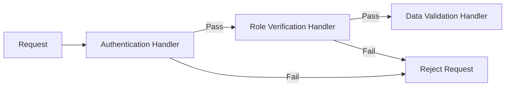

# Chain of Responsibility Design Pattern

Chain of Responsibility passes requests along a chain of handlers. Upon receiving a request, each handler decides either to process the request or to pass it to the next handler in the chain.

---

## Structure



---

## Java Implementation
An HTTP Request pipeline with Authentication and Validation middlewares.

```java
abstract class Handler {
    protected Handler nextHandler;

    public void setNext(Handler next) { this.nextHandler = next; }

    public void handle(String request) {
        if (nextHandler != null) {
            nextHandler.handle(request);
        }
    }
}

// Concrete Handler 1
class AuthHandler extends Handler {
    public void handle(String request) {
        if (!request.contains("token")) {
            System.out.println("Auth Failed! Aborting Request.");
            return; // Terminate chain
        }
        System.out.println("Auth Passed.");
        super.handle(request); // Pass to next handler
    }
}

// Concrete Handler 2
class ValidationHandler extends Handler {
    public void handle(String request) {
        if (request.contains("malicious_payload")) {
            System.out.println("Validation Failed! Blocked.");
            return; // Terminate chain
        }
        System.out.println("Validation Passed.");
        super.handle(request);
    }
}
```

---

## Interview Q&A Corner

> [!NOTE]
> **Q: Where is Chain of Responsibility used in real-world frameworks?**
> A: 
> * **Java Web Servlet Filters:** Chains filtering logic before matching standard controllers.
> * **Spring Security Filters:** Verifies authentication headers, CORS configuration, CSRF tokens sequentially.
> * **Logback / Log4j Appenders:** Logging frameworks route logs based on levels (Info -> Warn -> Error) sequentially.
