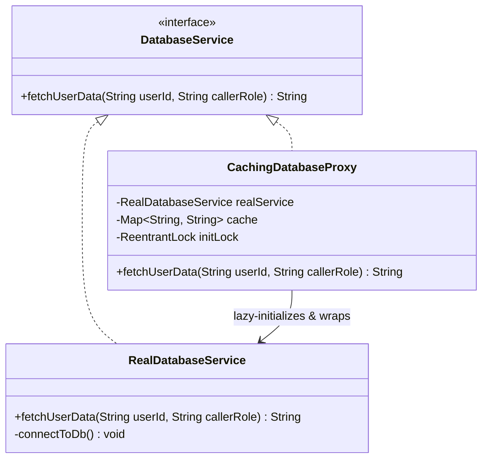

# Proxy Structural Design Pattern

## 1. Core Intent & Problem Statement
The **Proxy Pattern** is a structural design pattern that provides a surrogate or placeholder for another object to control access to it. It intercepts operations on the target object, enabling lazy loading, caching, security checks, logging, or remote communication.

### Real-World Analogy
* **Credit Card:** A credit card is a proxy for your bank account. Instead of carrying large bags of physical cash (Real Subject), you present the card (Proxy). The card validates your PIN (Protection) and interacts with the bank ledger on your behalf.
* **Company Bodyguard:** A celebrity (Real Subject) does not interact directly with everyone in public. The bodyguard (Proxy) controls who can talk to them, blocking security threats (Protection) and shielding the celebrity.

### When to Use
1. **Virtual Proxy (Lazy Loading):** When you have a heavy, memory-intensive object (like a high-res image or database connection) that you want to instantiate only when it is actually used.
2. **Protection Proxy (Access Control):** When you want to restrict access to resource-sensitive methods based on client credentials or roles.
3. **Caching Proxy (Performance Optimization):** When you want to store results of expensive or slow operations (like third-party API calls) to serve identical requests instantly.
4. **Remote Proxy (Local Representation):** When the real object resides on a different machine or JVM (e.g., gRPC, RMI), and the proxy presents a local interface to the client.

### Trade-offs
* **Pros:**
  - **Lifecycle Control:** You can manage the lifecycle of the real service object without the client knowing.
  - **Security & Validation:** Adds authorization rules transparently.
  - **Optimization:** Reduces server load by caching responses or postponing object creation.
* **Cons:**
  - **Latency:** Intercepting requests introduces a minor processing indirection layer.
  - **Complexity:** Introduces new interfaces and proxy classes, which can complicate reading code.

---

## 2. Visual Representation (Diagrams)

### UML Class Diagram


### Sequence Diagram (Virtual + Caching + Protection)
```mermaid
sequenceDiagram
    autonumber
    actor Client
    participant Proxy as CachingDatabaseProxy
    participant Real as RealDatabaseService

    Client->>Proxy: fetchUserData("user_12", "USER")
    activate Proxy
    Proxy->>Proxy: Check permissions (OK)
    Proxy->>Proxy: Check cache for "user_12"
    alt Cache Hit
        Proxy-->>Client: Return cached data "Alice"
    else Cache Miss
        alt RealService is Null
            Proxy->>Proxy: Acquire initialization lock
            create participant Real
            Proxy->>Real: Instantiate (Lazy Load)
            Proxy->>Real: connectToDb()
            Proxy->>Proxy: Release initialization lock
        end
        Proxy->>Real: fetchUserData("user_12", "USER")
        activate Real
        Real-->>Proxy: Return "Alice"
        deactivate Real
        Proxy->>Proxy: Store "user_12" -> "Alice" in cache
        Proxy-->>Client: Return "Alice"
    end
    deactivate Proxy
```

---

## 3. Violating Design vs. Refactored Design

### Violating Design (No Separation of Concerns)
The client instantiates a database connection, implements cache searches, and runs queries. The business code is mixed up with infrastructure concerns.

```java
public class ProfilePage {
    private RealDatabaseService db = new RealDatabaseService(); // Instant heavy initialization
    private Map<String, String> cache = new HashMap<>();

    public void displayProfile(String userId, String role) {
        if (!role.equals("ADMIN") && !role.equals("USER")) {
            throw new SecurityException("Unauthorized access");
        }
        
        String data = cache.get(userId);
        if (data == null) {
            data = db.fetchFromDatabase(userId); // Slow disk read
            cache.put(userId, data);
        }
        System.out.println("Displaying: " + data);
    }
}
```

### Why it fails:
1. **Inefficient Startup:** The `RealDatabaseService` is initialized immediately inside the field definition, consuming memory even if the user never visits the profile page.
2. **Duplicated Caching & Security Logic:** Caching and security logic must be re-written inside every display/page class that needs database access.
3. **Difficult Testing:** You cannot mock the database or test the security layer in isolation since they are hardcoded together.

---

## 4. Production-Ready Java Implementation

Below is a production-grade implementation of a **Database Proxy** combining **Virtual Loading**, **Access Control (Protection)**, and **Caching**. It features:
* **Double-Checked Locking** inside the Virtual Proxy initialization block to prevent race conditions.
* **Thread-safe local cache** using `ConcurrentHashMap`.
* **Clean error routing** wrapping internal exceptions.

### 1. Subject Interface
```java
package lowlevel.design.patterns.proxy;

public interface DatabaseService {
    String fetchUserData(String userId, String callerRole) throws SecurityException;
}
```

### 2. Real Subject (Heavy Database Implementation)
```java
package lowlevel.design.patterns.proxy;

public class RealDatabaseService implements DatabaseService {

    public RealDatabaseService() {
        connectToDb();
    }

    private void connectToDb() {
        System.out.println("Initializing heavy database connection pool...");
        try {
            Thread.sleep(1500); // Simulate connection overhead
        } catch (InterruptedException e) {
            Thread.currentThread().interrupt();
        }
        System.out.println("Database connection established.");
    }

    @Override
    public String fetchUserData(String userId, String callerRole) {
        System.out.println("Executing SQL select query for user: " + userId);
        return "UserData[Id=" + userId + ", Name=John Doe, Balance=$5000.00]";
    }
}
```

### 3. Proxy Class (Virtual, Protection, & Caching)
```java
package lowlevel.design.patterns.proxy;

import java.util.Map;
import java.util.concurrent.ConcurrentHashMap;
import java.util.concurrent.locks.ReentrantLock;

public class CachingDatabaseProxy implements DatabaseService {
    // Volatile to ensure visibility across threads during double-checked locking initialization
    private volatile RealDatabaseService realService;
    private final Map<String, String> cache = new ConcurrentHashMap<>();
    private final ReentrantLock initLock = new ReentrantLock();

    @Override
    public String fetchUserData(String userId, String callerRole) throws SecurityException {
        // 1. Protection Proxy: Security role enforcement
        if (callerRole == null || (!callerRole.equalsIgnoreCase("ADMIN") && !callerRole.equalsIgnoreCase("USER"))) {
            throw new SecurityException("Access Denied: Role " + callerRole + " is unauthorized.");
        }

        // 2. Caching Proxy: Read from cache if present
        String cachedVal = cache.get(userId);
        if (cachedVal != null) {
            System.out.println("[Cache Hit] Serving request for " + userId + " instantly.");
            return cachedVal;
        }

        // 3. Virtual Proxy: Lazy loading the heavy service using double-checked locking
        if (realService == null) {
            initLock.lock();
            try {
                if (realService == null) {
                    realService = new RealDatabaseService();
                }
            } finally {
                initLock.unlock();
            }
        }

        // 4. Delegate invocation and update cache
        String result = realService.fetchUserData(userId, callerRole);
        cache.put(userId, result);
        return result;
    }
}
```

### 4. Client Driver
```java
package lowlevel.design.patterns.proxy;

public class DatabaseAccessApp {
    public static void main(String[] args) {
        DatabaseService dbProxy = new CachingDatabaseProxy();

        // 1st request (Cache Miss, triggers Lazy loading database connection)
        System.out.println("--- Fetching User 1 (First call) ---");
        long start = System.currentTimeMillis();
        System.out.println(dbProxy.fetchUserData("101", "USER"));
        System.out.println("Time taken: " + (System.currentTimeMillis() - start) + "ms\n");

        // 2nd request (Cache Hit, runs instantly)
        System.out.println("--- Fetching User 1 (Second call) ---");
        start = System.currentTimeMillis();
        System.out.println(dbProxy.fetchUserData("101", "USER"));
        System.out.println("Time taken: " + (System.currentTimeMillis() - start) + "ms\n");

        // Security rejection test
        System.out.println("--- Unauthorized Fetch Request ---");
        try {
            dbProxy.fetchUserData("101", "GUEST");
        } catch (SecurityException e) {
            System.err.println("Rejected: " + e.getMessage());
        }
    }
}
```

---

## 5. Edge Cases & Concurrency Handling

### Edge Cases
1. **Cache Staleness:** If database rows are updated, the cached value in the proxy becomes out-of-sync. 
   * *Mitigation:* Implement TTL (Time-To-Live) evictions or hook the proxy to an event bus (Observer pattern) that clears keys when updates are processed.
2. **Null Values Cache:** If a queried user does not exist, the proxy should cache a sentinel value (e.g. `"NOT_FOUND"`) to avoid constant database queries (database hammering) for missing keys.

### Concurrency
* **Lazy Initialization Races:** If two threads call the proxy for the first time, both see `realService == null` and try to instantiate it. We prevent this using `ReentrantLock` combined with a second verification check (`if (realService == null)`), which ensures only a single thread configures the heavy object database pool.
* **Volatile Declaration:** Declaring `private volatile RealDatabaseService realService` is critical in Java. Without `volatile`, thread memory local caches might read a partially initialized instance, leading to crashes.

---

## 6. Comprehensive Interview Q&A

### Q1: Compare the Proxy Pattern with the Decorator and Adapter Patterns.
**Answer:**
* **Proxy:** Controls **access** to an object. The proxy manages the lifecycle of the real object itself. The client is typically unaware that it is speaking to a proxy.
* **Decorator:** **Enriches or adds responsibilities** to an object. The decorated object is passed into the decorator's constructor from the outside. The client manages the composition chain.
* **Adapter:** **Translates interfaces**. It wraps an incompatible object to match a interface that a client expects.

---

### Q2: What is the difference between a static proxy and a dynamic proxy?
**Answer:**
* **Static Proxy:** The proxy class is written manually at compile time. You must create a new proxy class for every interface, leading to duplicate forwarding code.
* **Dynamic Proxy:** The proxy class is created dynamically at runtime by the JVM (e.g., using `java.lang.reflect.Proxy`). A single handler (`InvocationHandler`) can intercept method calls across any target interfaces, reducing boilerplate code.

---

### Q3: How does Spring Framework utilize Dynamic Proxies for Transaction Management and AOP?
**Answer:**
When you annotate a method with `@Transactional` or use Spring AOP aspect logging:
1. Spring generates a dynamic proxy (either JDK Dynamic Proxy or CGLIB class proxy) wrapping your bean.
2. When callers call your method, they call the proxy instead.
3. The proxy starts a database transaction (`connection.setAutoCommit(false)`), runs your code, and then commits/rolls back.
4. If your bean class calls its own internal methods directly (self-invocation), it bypasses the proxy, and features like `@Transactional` or security aspects fail to trigger.

---

### Q4: Why is it important to use `volatile` with Double-Checked Locking in Virtual Proxies?
**Answer:**
Without `volatile`, the instruction compilation process can cause **out-of-order execution**. 
The JVM might allocate memory and set the reference `realService` to point to that memory block **before** running the constructor. A concurrent thread would read `realService != null`, try to use the object while it is still partially configured, and crash with undefined state errors or null references.
`volatile` establishes a "happens-before" relationship, preventing instruction reordering.
