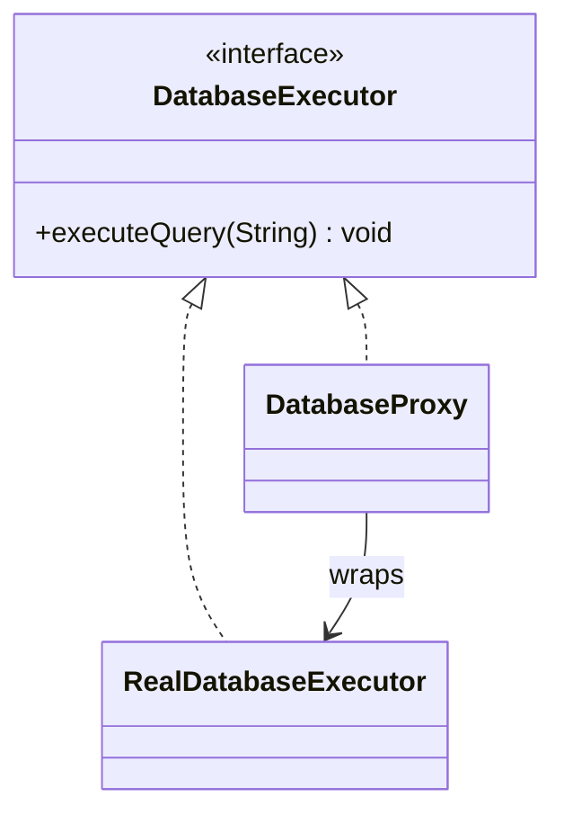

# Proxy Structural Design Pattern

Proxy provides a surrogate or placeholder for another object to control access to it.

---

## Types of Proxies
1. **Virtual Proxy:** Delays creation of memory-expensive objects until they are actually needed (Lazy Loading).
2. **Protection Proxy:** Verifies access permissions before calling the target object.
3. **Caching Proxy:** Intercepts requests to heavy operations and checks if results exist in cache.

---

## Java Implementation (Caching & Protection Proxy)



```java
interface DatabaseExecutor {
    void executeQuery(String query) throws Exception;
}

class RealDatabaseExecutor implements DatabaseExecutor {
    public void executeQuery(String query) {
        System.out.println("Running query directly in DB: " + query);
    }
}

class DatabaseProxy implements DatabaseExecutor {
    private final RealDatabaseExecutor executor = new RealDatabaseExecutor();
    private final String userRole;

    public DatabaseProxy(String userRole) {
        this.userRole = userRole;
    }

    @Override
    public void executeQuery(String query) throws Exception {
        if (query.toUpperCase().contains("DELETE") && !userRole.equals("ADMIN")) {
            throw new IllegalAccessException("DELETE queries only allowed for ADMIN users!");
        }
        executor.executeQuery(query);
    }
}
```

---

## Interview Q&A Corner

> [!WARNING]
> **Q: What is the difference between Proxy and Decorator?**
> A: 
> * **Proxy** manages the lifecycle of the underlying object (often creates it internally, or restricts access). The client is typically unaware that it is talking to a proxy.
> * **Decorator** is passed the component object from the outside (via constructor injection). Decorators are chained together to build composite features, and the client manages the composition.
