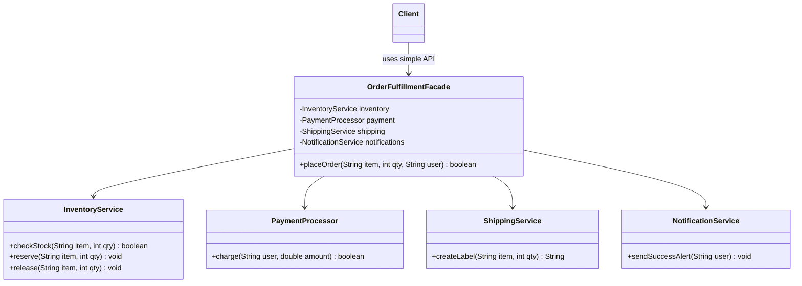
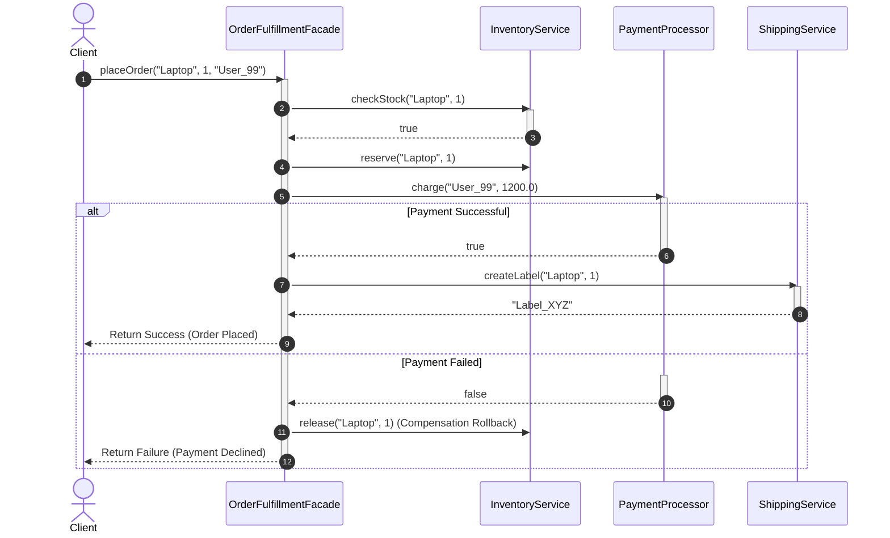

# Facade Structural Design Pattern

## 1. Core Intent & Problem Statement
The **Facade Pattern** is a structural design pattern that provides a simplified, unified interface to a complex subsystem of classes, library framework, or API. It hides the underlying structural complexities and coordination details, allowing clients to interact with a simple high-level API.

### Real-World Analogy
* **E-Commerce Checkout:** When you buy a product online, you click a single "Place Order" button. You do not manually contact the warehouse to check stock, call the bank to clear your credit card, message FedEx to print a shipping label, or write an email to yourself verifying purchase. The checkout portal acts as a Facade.
* **Starting a Car:** You turn the key or press the start button. Behind the scenes, the computer initiates the fuel pump, starts the alternator, engages spark plugs, and regulates exhaust systems. The ignition switch is the Facade.

### When to Use
1. **Simplifying Complex Subsystems:** When you want to provide a simple, default entry point to a sophisticated subsystem with dozens of moving parts.
2. **Decoupling Subsystems:** When you want to layer your subsystems, decoupling clients from sub-modules so that changing internal libraries doesn't impact client programs.
3. **Legacy API Wrapping:** When wrapping an older, confusing API with a modern, cleaner interface.

### Trade-offs
* **Pros:**
  - Decouples clients from subsystem components, protecting clients from API changes.
  - Promotes ease of use and readability.
  - Minimizes compilation and build dependencies in large codebases.
* **Cons:**
  - **God Object Risk:** A facade can easily morph into a "god object" that knows about and directs every single class in the application.
  - **Indirect Limitations:** Clients needing fine-grained, customized control over internal subsystems might find the facade too restrictive.

---

## 2. Visual Representation (Diagrams)

### UML Class Diagram


### Sequence Diagram


---

## 3. Violating Design vs. Refactored Design

### Violating Design (Direct Subsystem Coordination)
The client application interacts with all subsystems directly, forcing the client to write custom error handling, inventory checks, and rollbacks.

```java
public class CheckoutController {
    public void processOrder() {
        InventoryService inventory = new InventoryService();
        PaymentProcessor payment = new PaymentProcessor();
        ShippingService shipping = new ShippingService();

        // Client must coordinate multiple steps manually
        if (inventory.isAvailable("MacBook")) {
            inventory.deductStock("MacBook");
            try {
                payment.processDebit(1500.0);
                shipping.shipItem("MacBook");
            } catch (Exception e) {
                // Client has to handle recovery manual tasks:
                inventory.restoreStock("MacBook");
                System.out.println("Payment failed. Stock rolled back.");
            }
        }
    }
}
```

### Why it fails:
1. **Tight Coupling:** If the `PaymentProcessor` signature changes (e.g., requires credit card tokens), every client checkout controller in the codebase must be updated.
2. **Duplicated Workflow Logic:** If we add mobile checkout or automated testing, we must copy-paste this coordination logic, violating DRY.
3. **Complexity Leakage:** The client is bogged down handling infrastructure details (like rollback logic) instead of focusing on user experience.

---

## 4. Production-Ready Java Implementation

Below is a production-grade implementation of an **Order Fulfillment System** using the Facade Pattern. It features:
* **Coordination of Subsystems** into a single transaction-like workflow.
* **Compensation/Rollback Logic** (Saga style) to clean up inventory reserves if payments fail.
* **Independent Subsystem APIs** which remain public and accessible if advanced clients need them.

### 1. Subsystem Classes
```java
package lowlevel.design.patterns.facade;

class InventoryService {
    public boolean checkStock(String itemId, int qty) {
        System.out.println("[Inventory] Verified stock availability for: " + itemId);
        return true; 
    }

    public void reserveStock(String itemId, int qty) {
        System.out.println("[Inventory] Reserved " + qty + " units of " + itemId);
    }

    public void releaseStock(String itemId, int qty) {
        System.out.println("[Inventory] Rolled back reserve. Released " + qty + " units of " + itemId);
    }
}

class PaymentProcessor {
    public boolean processPayment(String userId, double amount) {
        if (amount <= 0) {
            System.err.println("[Payment] Failed: Invalid amount $" + amount);
            return false;
        }
        System.out.println("[Payment] Charged $" + amount + " to user: " + userId);
        return true; 
    }
}

class ShippingService {
    public String generateShippingLabel(String itemId, int qty) {
        System.out.println("[Shipping] Prepared package and printed label for " + itemId);
        return "LABEL_FEDEX_" + System.currentTimeMillis();
    }
}

class NotificationService {
    public void sendNotification(String userId, String message) {
        System.out.println("[Notification] Alert sent to " + userId + ": " + message);
    }
}
```

### 2. Facade
```java
package lowlevel.design.patterns.facade;

public class OrderFulfillmentFacade {
    private final InventoryService inventory = new InventoryService();
    private final PaymentProcessor payment = new PaymentProcessor();
    private final ShippingService shipping = new ShippingService();
    private final NotificationService notification = new NotificationService();

    public boolean placeOrder(String itemId, int qty, String userId, double price) {
        System.out.println("[Facade] Received order placement request for: " + itemId);

        // Step 1: Check availability
        if (!inventory.checkStock(itemId, qty)) {
            notification.sendNotification(userId, "Order failed: Item is out of stock.");
            return false;
        }

        // Step 2: Temporarily reserve stock
        inventory.reserveStock(itemId, qty);

        // Step 3: Process financial transaction
        double totalCost = price * qty;
        boolean paymentSuccess = payment.processPayment(userId, totalCost);

        if (!paymentSuccess) {
            System.err.println("[Facade] Payment failed. Initiating rollback...");
            // Compensation step: release stock
            inventory.releaseStock(itemId, qty);
            notification.sendNotification(userId, "Order failed: Payment was declined.");
            return false;
        }

        // Step 4: Dispatch shipping
        String trackingId = shipping.generateShippingLabel(itemId, qty);

        // Step 5: Send notification
        notification.sendNotification(userId, "Order placed successfully! Tracking ID: " + trackingId);
        System.out.println("[Facade] Order processing completed successfully.\n");
        return true;
    }
}
```

### 3. Client Driver Code
```java
package lowlevel.design.patterns.facade;

public class StoreCheckoutDemo {
    public static void main(String[] args) {
        OrderFulfillmentFacade storeFacade = new OrderFulfillmentFacade();

        // Scenario A: Successful checkout
        System.out.println("=== Starting Scenario A ===");
        boolean success = storeFacade.placeOrder("MacBook Pro", 1, "user_alice", 1999.99);
        System.out.println("Result: " + (success ? "ORDER OK" : "ORDER FAILED"));

        System.out.println("\n=== Starting Scenario B (Payment Failure) ===");
        // Charge $0.00 to trigger validation error
        boolean failed = storeFacade.placeOrder("MacBook Pro", 1, "user_bob", 0.00);
        System.out.println("Result: " + (failed ? "ORDER OK" : "ORDER FAILED"));
    }
}
```

---

## 5. Edge Cases & Concurrency Handling

### Edge Cases
1. **Compensation Failures:** If the transaction fails and the rollback/compensation action itself fails (e.g. `inventory.releaseStock()` throws database timeout exception), the system enters an inconsistent state.
   * *Mitigation:* Catch errors in the rollback block, queue them in a Dead Letter Queue (DLQ), or log them with critical severity tags for human intervention.
2. **Subsystem Direct Interfacing:** Using a Facade should **not** block power-users from directly working with subsystems. Subsystem classes must remain public so that if shipping needs to print custom packaging labels outside of standard checkout, it can do so directly.

### Concurrency
* **Stateless Facades:** If the Facade itself holds no mutable state (e.g. it does not store order variables in fields, but uses local stack variables), it is fully thread-safe. Multiple threads can call `placeOrder()` concurrently.
* **Distributed Operations:** In modern cloud systems, these steps might cross microservices. A local Facade might delegate to an orchestration engine using the Saga pattern.

---

## 6. Comprehensive Interview Q&A

### Q1: Does a Facade prevent client applications from using the underlying subsystems directly?
**Answer:**
No. A Facade is designed to provide a **simplified alternative** for the common 90% use case. It does not encapsulate or hide the subsystems in a way that blocks direct access. 
If a client needs advanced configuration control or customized workflows, they can bypass the Facade and construct/call the subsystem classes directly.

---

### Q2: What is the difference between the Facade Pattern and the Mediator Pattern?
**Answer:**
* **Facade:** Hides complexity and provides a **one-way unidirectional abstraction** from the client to a subsystem. The subsystem classes are completely unaware of the Facade's existence.
* **Mediator:** Coordinates **multidirectional communication** between equal peers (Colleagues) (e.g. a Chat Room coordinator or Airport Tower). The peer objects communicate *only* through the mediator, removing direct references between themselves.

---

### Q3: What is the difference between the Facade Pattern and the Adapter Pattern?
**Answer:**
* **Facade:** Simplifies a subsystem by providing a **new, clean interface**. It focuses on ease of use.
* **Adapter:** Matches an **existing, incompatible interface** to a target client interface. It focuses on translation and compatibility.

---

### Q4: How do you handle transaction management across multiple services inside a Facade?
**Answer:**
1. **Local Transaction:** If all subsystems use the same database, you can pass a single `Connection` or run the facade within a spring `@Transactional` context to rollback database writes automatically.
2. **Distributed Transaction (Saga Pattern):** If subsystems run in separate network services, standard transactions fail. The Facade must implement **compensation logic**: if step 3 (Payment) fails, it must explicitly call the inverse clean-up method (`inventory.releaseStock()`) for step 2 to guarantee eventual consistency.
