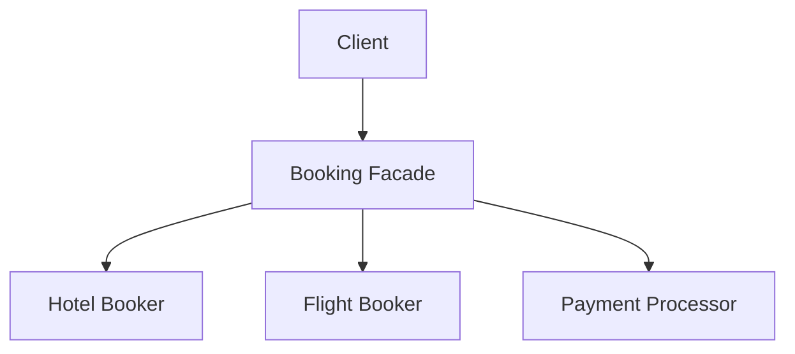

# Facade Structural Design Pattern

Facade provides a unified interface to a set of interfaces in a subsystem. Facade defines a higher-level interface that makes the subsystem easier to use.

---

## Why Facade?
To prevent clients from directly interacting with 10+ sub-libraries, causing tight coupling. It decouples the client and the subsystem.



---

## Java Implementation

```java
// Subsystems
class FlightBookingSystem {
    public void bookFlight(String from, String to) { System.out.println("Flight booked."); }
}
class HotelBookingSystem {
    public void bookHotel(String city) { System.out.println("Hotel booked."); }
}
class PaymentProcessor {
    public void processPayment() { System.out.println("Payment processed successfully."); }
}

// Facade
class TravelBookingFacade {
    private final FlightBookingSystem flightSystem = new FlightBookingSystem();
    private final HotelBookingSystem hotelSystem = new HotelBookingSystem();
    private final PaymentProcessor paymentProcessor = new PaymentProcessor();

    public void bookCompleteTrip(String from, String to) {
        flightSystem.bookFlight(from, to);
        hotelSystem.bookHotel(to);
        paymentProcessor.processPayment();
        System.out.println("Trip booked successfully!");
    }
}
```

---

## Interview Q&A Corner

> [!NOTE]
> **Q: Can you have multiple Facades in one system?**
> A: Yes. If a single Facade becomes too bloated and starts violating the Single Responsibility Principle, you can break it down into several domain-specific facades (e.g. `UserManagementFacade`, `OrderProcessingFacade`).
