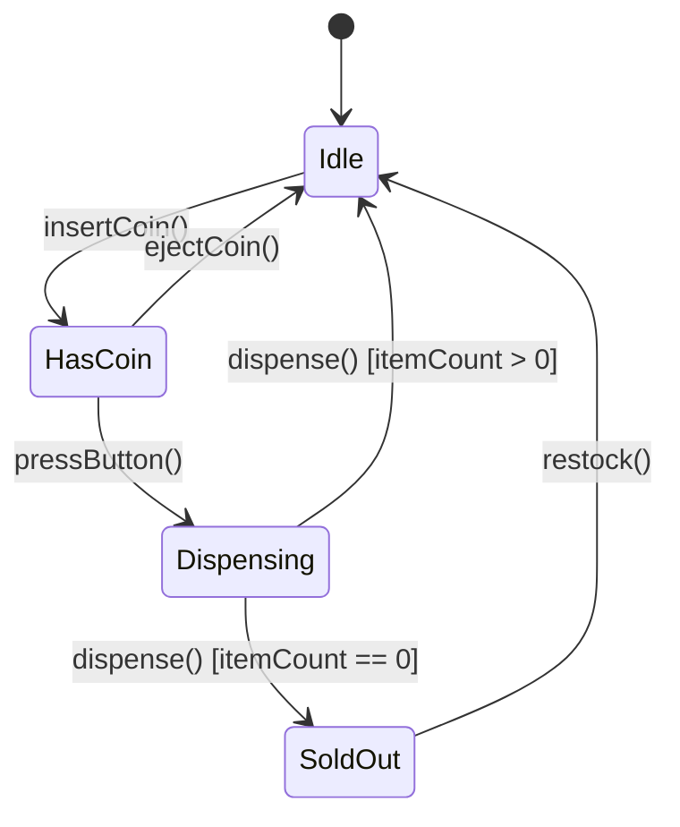
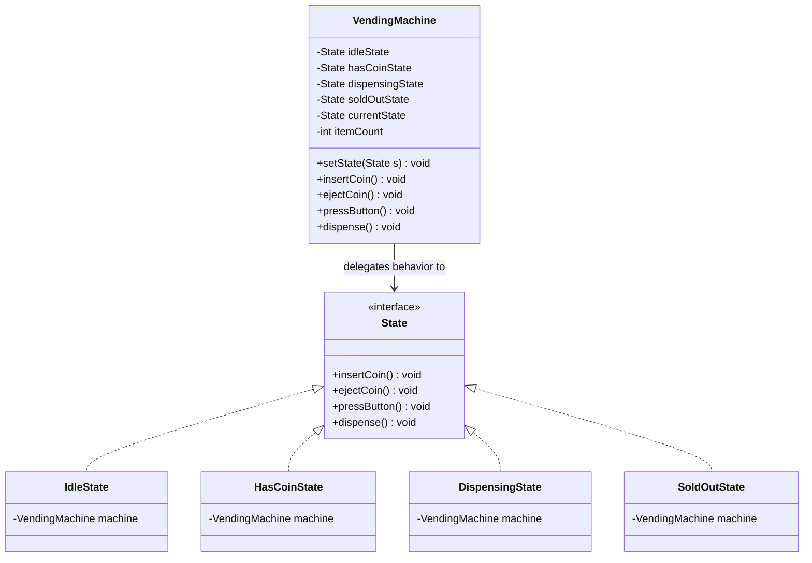

# State Behavioral Design Pattern

## 1. Core Intent & Problem Statement
The **State Pattern** is a behavioral design pattern that allows an object to alter its behavior when its internal state changes. The object will appear to change its class because it delegates all state-dependent behavior to an active state object.

### Real-World Analogy
* **Document Approval Workflow:** A document in an enterprise system begins as a **Draft**. 
  - If a author edits the draft, it works. If they try to publish it directly, it is blocked.
  - Once submitted, it enters **Moderation**. Now, edits are blocked, but moderators can approve it.
  - Once approved, it becomes **Published**. Now, it is visible to everyone, and moderators can no longer reject it. The document behaves differently to identical method calls (edit, approve, publish) depending on its current state.
* **Traffic Light:** A traffic light cycles through green, yellow, and red. The action "wait 30 seconds" triggers a transition to different lights depending on which light is active.

### When to Use
1. **Dynamic Behavior:** When an object's behavior depends on its state, and it must change its behavior at runtime based on that state.
2. **Eliminating Conditional Flags:** When you find your methods containing huge `switch` or `if-else` blocks that check class member variables (e.g., `if (state == DRAFT) ... else if (state == MODERATION) ...`).
3. **Formal State Machines:** When you are implementing a structured state machine with defined states and strict transitions (e.g., payment gateways, ATM networks).

### Trade-offs
* **Pros:**
  - **Single Responsibility Principle (SRP):** Organizes code related to particular states into separate, independent classes.
  - **Open/Closed Principle (OCP):** You can introduce new states and transitions without modifying existing state classes or context code.
  - **Clean Context Code:** Simplifies the context class by removing massive conditional branches.
* **Cons:**
  - **Class Proliferation:** Can be overkill for small state machines with only 2 or 3 states, adding unnecessary class files.
  - **Coupling:** Concrete states are often tightly coupled to each other because they need to know which state to transition to next.

---

## 2. Visual Representation (Diagrams)

### State Transition Diagram


### UML Class Diagram


---

## 3. Violating Design vs. Refactored Design

### Violating Design (Large Enum Conditional Block)
Methods use conditional checks based on an internal enum value. Adding a new state (e.g. `Out Of Order`) forces changes to every method.

```java
public class VendingMachine {
    enum State { IDLE, HAS_COIN, DISPENSING, SOLD_OUT }
    private State state = State.IDLE;
    private int items = 10;

    public void insertCoin() {
        if (state == State.IDLE) {
            state = State.HAS_COIN;
            System.out.println("Coin accepted.");
        } else if (state == State.HAS_COIN) {
            System.out.println("Coin already inserted.");
        } else if (state == State.DISPENSING) {
            System.out.println("Please wait, dispensing in progress.");
        } else if (state == State.SOLD_OUT) {
            System.out.println("Machine is sold out.");
        }
    }
    // Repeat similar large if-else blocks for ejectCoin(), pressButton(), and dispense()...
}
```

### Why it fails:
1. **Violation of OCP:** Adding a new state (e.g., `OUT_OF_ORDER`) requires going into every single action method (`insertCoin`, `ejectCoin`, `pressButton`, `dispense`) and adding another conditional branch.
2. **Difficult to Maintain:** It is extremely easy to forget to update one of the methods, introducing state-corruption bugs.
3. **Poor Readability:** The execution logic of a single state is scattered across four different switch blocks, making it hard to read.

---

## 4. Production-Ready Java Implementation

Below is a production-grade implementation of a **Vending Machine State Machine**. It features:
* **Interface-Driven Transitions** where behavior changes dynamically.
* **Thread-Safe Access** using synchronized context blocks.
* **Explicit Inventory Validation** during state transitions.

### 1. State Interface
```java
package lowlevel.design.patterns.state;

public interface State {
    void insertCoin();
    void ejectCoin();
    void pressButton();
    void dispense();
}
```

### 2. Context Class (Vending Machine)
```java
package lowlevel.design.patterns.state;

public class VendingMachine {
    // Hold instances of all states to prevent recreation overhead
    private final State idleState = new IdleState(this);
    private final State hasCoinState = new HasCoinState(this);
    private final State dispensingState = new DispensingState(this);
    private final State soldOutState = new SoldOutState(this);

    private State currentState;
    private int itemCount = 0;

    public VendingMachine(int initialItems) {
        this.itemCount = initialItems;
        if (initialItems > 0) {
            this.currentState = idleState;
        } else {
            this.currentState = soldOutState;
        }
    }

    public synchronized void setState(State state) {
        this.currentState = state;
    }

    public synchronized void decreaseCount() {
        if (itemCount > 0) itemCount--;
    }

    public synchronized void restock(int count) {
        if (count <= 0) return;
        this.itemCount += count;
        System.out.println("Restocked: " + count + " items. Total: " + this.itemCount);
        if (currentState == soldOutState) {
            setState(idleState);
        }
    }

    // Delegate calls to the active state object
    public synchronized void insertCoin() { currentState.insertCoin(); }
    public synchronized void ejectCoin() { currentState.ejectCoin(); }
    public synchronized void pressButton() {
        currentState.pressButton();
        // Automatically trigger dispense after button press
        currentState.dispense();
    }

    // Getters for states
    public State getIdleState() { return idleState; }
    public State getHasCoinState() { return hasCoinState; }
    public State getDispensingState() { return dispensingState; }
    public State getSoldOutState() { return soldOutState; }
    public int getItemCount() { return itemCount; }
}
```

### 3. Concrete States
```java
package lowlevel.design.patterns.state;

class IdleState implements State {
    private final VendingMachine machine;

    public IdleState(VendingMachine machine) { this.machine = machine; }

    @Override
    public void insertCoin() {
        System.out.println("Coin accepted.");
        machine.setState(machine.getHasCoinState());
    }

    @Override
    public void ejectCoin() {
        System.out.println("No coin to eject.");
    }

    @Override
    public void pressButton() {
        System.out.println("Button pressed but no coin inserted.");
    }

    @Override
    public void dispense() {
        System.out.println("Pay first.");
    }
}

class HasCoinState implements State {
    private final VendingMachine machine;

    public HasCoinState(VendingMachine machine) { this.machine = machine; }

    @Override
    public void insertCoin() {
        System.out.println("Coin already inserted.");
    }

    @Override
    public void ejectCoin() {
        System.out.println("Coin returned.");
        machine.setState(machine.getIdleState());
    }

    @Override
    public void pressButton() {
        System.out.println("Button pressed... transaction verified.");
        machine.setState(machine.getDispensingState());
    }

    @Override
    public void dispense() {
        System.out.println("Press button first.");
    }
}

class DispensingState implements State {
    private final VendingMachine machine;

    public DispensingState(VendingMachine machine) { this.machine = machine; }

    @Override
    public void insertCoin() { System.out.println("Please wait, dispensing item."); }
    @Override
    public void ejectCoin() { System.out.println("Cannot return coin. Item already processing."); }
    @Override
    public void pressButton() { System.out.println("Already processing order."); }

    @Override
    public void dispense() {
        machine.decreaseCount();
        System.out.println("Item dispensed successfully!");
        
        if (machine.getItemCount() > 0) {
            machine.setState(machine.getIdleState());
        } else {
            System.out.println("Out of stock!");
            machine.setState(machine.getSoldOutState());
        }
    }
}

class SoldOutState implements State {
    private final VendingMachine machine;

    public SoldOutState(VendingMachine machine) { this.machine = machine; }

    @Override
    public void insertCoin() { System.out.println("Cannot insert coin: Out of Stock."); }
    @Override
    public void ejectCoin() { System.out.println("Cannot eject coin: No coin inserted."); }
    @Override
    public void pressButton() { System.out.println("Invalid action: Out of Stock."); }
    @Override
    public void dispense() { System.out.println("Cannot dispense: Out of Stock."); }
}
```

### 4. Client Driver Code
```java
package lowlevel.design.patterns.state;

public class VendingMachineApp {
    public static void main(String[] args) {
        // Initialize machine with 2 items
        VendingMachine machine = new VendingMachine(2);

        System.out.println("--- Purchase 1 ---");
        machine.insertCoin();
        machine.pressButton(); // Triggers pressButton + dispense

        System.out.println("\n--- Purchase 2 ---");
        machine.insertCoin();
        machine.pressButton(); // Triggers pressButton + dispense. Machine is now sold out.

        System.out.println("\n--- Purchase 3 (Fail: Sold Out) ---");
        machine.insertCoin();

        System.out.println("\n--- Restocking ---");
        machine.restock(5);

        System.out.println("\n--- Purchase 4 ---");
        machine.insertCoin();
        machine.pressButton();
    }
}
```

---

## 5. Edge Cases & Concurrency Handling

### Edge Cases
1. **Invalid State Transitions:** In complex flows, a state might receive an unexpected action. We handle this by printing error feedback or throwing an `IllegalStateException` to prevent state corruption.
2. **Initialization Safety:** Make sure a default starting state is always configured in the Context constructor. In our implementation, we check if `initialItems > 0` to set `IdleState` vs. `SoldOutState` dynamically.

### Concurrency
* **Context Synchronization:** In multi-threaded systems (e.g. web server processing user orders), multiple threads can call `insertCoin()` or `pressButton()` concurrently. We protect the context's variables (`currentState`, `itemCount`) and methods by using the `synchronized` keyword, guaranteeing atomic state transitions.
* **Shared State Instantiation:** Instead of creating new state objects inside methods (`new IdleState()`), the states are created once inside the context class constructor and recycled. This reduces GC overhead and memory allocations.

---

## 6. Comprehensive Interview Q&A

### Q1: What is the primary difference between the State Pattern and the Strategy Pattern?
**Answer:**
Although both patterns utilize composition and look identical in class structure, they differ in **intent** and **knowledge**:
* **State Pattern:** Concrete states **know about each other** and actively change the state of the Context class to guide a transition process. The client is generally unaware of the transitions.
* **Strategy Pattern:** Strategies **are unaware of other strategies**. The client chooses a strategy and injects it into the Context once. The strategy calculates results but does not transition the Context into other strategies.

---

### Q2: Who should define state transitions: the Context class or the concrete State classes?
**Answer:**
Both designs have trade-offs:
1. **Transitions in State Classes (Implemented above):** 
   - *Pros:* Keeps the Context class extremely simple and clean. The states define the workflow sequence, making it natural to add new states into the middle of the workflow.
   - *Cons:* State classes must know about other states (e.g., `IdleState` has to refer to `HasCoinState`), introducing compile-time coupling between subclasses.
2. **Transitions in the Context Class:**
   - *Pros:* State classes are completely isolated and reusable in other systems because they do not know about other state classes.
   - *Cons:* The Context class has to house state-transition logic, making it more complex and harder to scale as new states are added.

---

### Q3: How do you handle State pattern implementations if states are stateless and need to be shared?
**Answer:**
If state classes do not need to store client-specific fields (meaning they only execute methods using variables passed to them as parameters), they are **stateless**. 
In this scenario, you can optimize the system by utilizing the **Flyweight Pattern**: define each state as a static singleton instance (e.g. `IdleState.INSTANCE`). This prevents instantiating state objects across thousands of context instances (e.g., having 10,000 active vending machine beans sharing 4 static state objects).

---

### Q4: How does the State pattern promote the Open-Closed Principle (OCP)?
**Answer:**
Without the State pattern, adding a new state requires editing the switch-case conditions in every single action method of the main class. 
With the State pattern, you create a new class implementing the `State` interface (e.g. `OutofOrderState`) and update the transition hook in the adjacent state class. The context class (`VendingMachine`) and the other state classes remain unchanged, adhering to OCP.
