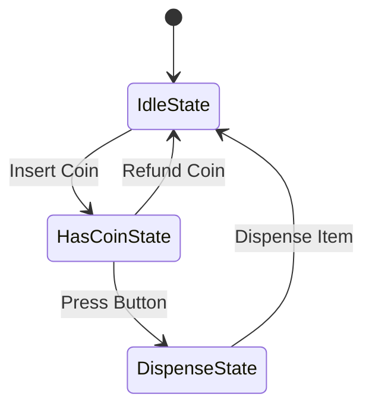

# State Behavioral Design Pattern

State allows an object to alter its behavior when its internal state changes. The object will appear to change its class.

---

## State Transition Diagram (Simple Vending Machine)



---

## Java Implementation

```java
// State Interface
interface State {
    void insertCoin();
    void pressButton();
    void dispense();
}

// Context Class
class VendingMachine {
    private final State idleState = new IdleState(this);
    private final State hasCoinState = new HasCoinState(this);
    private State currentState = idleState;

    public void setState(State state) { this.currentState = state; }
    public State getIdleState() { return idleState; }
    public State getHasCoinState() { return hasCoinState; }

    public void insertCoin() { currentState.insertCoin(); }
    public void pressButton() { currentState.pressButton(); }
    public void dispense() { currentState.dispense(); }
}

// Concrete States
class IdleState implements State {
    private final VendingMachine machine;
    public IdleState(VendingMachine machine) { this.machine = machine; }

    public void insertCoin() {
        System.out.println("Coin inserted.");
        machine.setState(machine.getHasCoinState());
    }
    public void pressButton() { System.out.println("Insert coin first."); }
    public void dispense() { System.out.println("Payment required."); }
}

class HasCoinState implements State {
    private final VendingMachine machine;
    public HasCoinState(VendingMachine machine) { this.machine = machine; }

    public void insertCoin() { System.out.println("Coin already inserted."); }
    public void pressButton() {
        System.out.println("Button pressed. Dispensing...");
        machine.setState(machine.getIdleState());
    }
    public void dispense() { System.out.println("Must press button first."); }
}
```

---

## Interview Q&A Corner

> [!TIP]
> **Q: What is the primary benefit of the State pattern?**
> A: It removes massive, nested `if-else` or `switch` structures inside a class that acts differently based on its state. It adheres to the **Open-Closed Principle**, allowing developers to add new states and transition logics simply by implementing a new State subclass, with zero edits to the VendingMachine context class.
