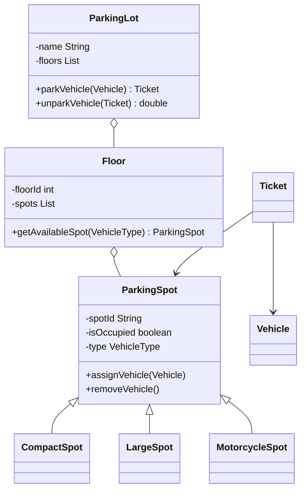

# LLD: Design a Parking Lot

A highly classic LLD question testing object modeling, encapsulation, polymorphism, and scale boundaries.

---

## Requirements
1. **Multi-Floor Support:** The parking lot has multiple floors.
2. **Vehicle Diversity:** Supports different vehicle types: Cars, Trucks, Motorcycles.
3. **Spot Diversity:** Supports spots matching vehicles (Compact, Large, Motorcycle).
4. **Spot Allocation:** Allocates spots based on nearest distance or first-available.
5. **Ticketing & Payment:** Issues a ticket on entry, tracks time, and charges a fee at exit.

---

## Class Diagram



---

## Java Implementation

```java
import java.time.Instant;
import java.util.ArrayList;
import java.util.List;

enum VehicleType { MOTORCYCLE, COMPACT, LARGE }

abstract class Vehicle {
    private final String licensePlate;
    private final VehicleType type;
    public Vehicle(String lp, VehicleType t) { this.licensePlate = lp; this.type = t; }
    public VehicleType getType() { return type; }
}
class Car extends Vehicle { public Car(String lp) { super(lp, VehicleType.COMPACT); } }
class Truck extends Vehicle { public Truck(String lp) { super(lp, VehicleType.LARGE); } }

abstract class ParkingSpot {
    private final String id;
    private final VehicleType supportedType;
    private boolean isFree = true;
    private Vehicle currentVehicle;

    public ParkingSpot(String id, VehicleType type) { this.id = id; this.supportedType = type; }
    public boolean canFit(Vehicle v) { return isFree && v.getType() == supportedType; }
    public void park(Vehicle v) { this.currentVehicle = v; this.isFree = false; }
    public void unpark() { this.currentVehicle = null; this.isFree = true; }
    public boolean isFree() { return isFree; }
}
class CompactSpot extends ParkingSpot { public CompactSpot(String id) { super(id, VehicleType.COMPACT); } }

class ParkingFloor {
    private final int floorNumber;
    private final List<ParkingSpot> spots = new ArrayList<>();

    public ParkingFloor(int floorNum) { this.floorNumber = floorNum; }
    public void addSpot(ParkingSpot spot) { spots.add(spot); }

    public ParkingSpot getAvailableSpot(Vehicle vehicle) {
        for (ParkingSpot spot : spots) {
            if (spot.canFit(vehicle)) return spot;
        }
        return null;
    }
}

class Ticket {
    private final String id;
    private final ParkingSpot spot;
    private final Instant entryTime;

    public Ticket(String id, ParkingSpot spot) {
        this.id = id;
        this.spot = spot;
        this.entryTime = Instant.now();
    }
    public ParkingSpot getSpot() { return spot; }
    public Instant getEntryTime() { return entryTime; }
}

class ParkingLot {
    private static ParkingLot instance = null;
    private final List<ParkingFloor> floors = new ArrayList<>();

    private ParkingLot() {}
    public static synchronized ParkingLot getInstance() {
        if (instance == null) instance = new ParkingLot();
        return instance;
    }

    public Ticket park(Vehicle vehicle) {
        for (ParkingFloor floor : floors) {
            ParkingSpot spot = floor.getAvailableSpot(vehicle);
            if (spot != null) {
                spot.park(vehicle);
                return new Ticket(System.currentTimeMillis() + "", spot);
            }
        }
        throw new RuntimeException("Parking Lot is Full!");
    }

    public double unpark(Ticket ticket) {
        ParkingSpot spot = ticket.getSpot();
        spot.unpark();
        // Calculate fee (mock $5 per hour)
        long durationHours = (Instant.now().getEpochSecond() - ticket.getEntryTime().getEpochSecond()) / 3600;
        return Math.max(5.0, durationHours * 5.0);
    }
}
```

---

## Interview Q&A Corner

> [!IMPORTANT]
> **Q: How would you handle thread safety / concurrency when two ticketers allocate the same spot simultaneously?**
> A: Use standard Java synchronization techniques. 
> 1. Make the `getAvailableSpot` and `park` methods synchronized, OR
> 2. Implement concurrent lock structures at the `ParkingFloor` level (`ReentrantLock`) to ensure that multiple floors can be searched concurrently, but a single floor's spot list can only be modified by one thread at a time.
